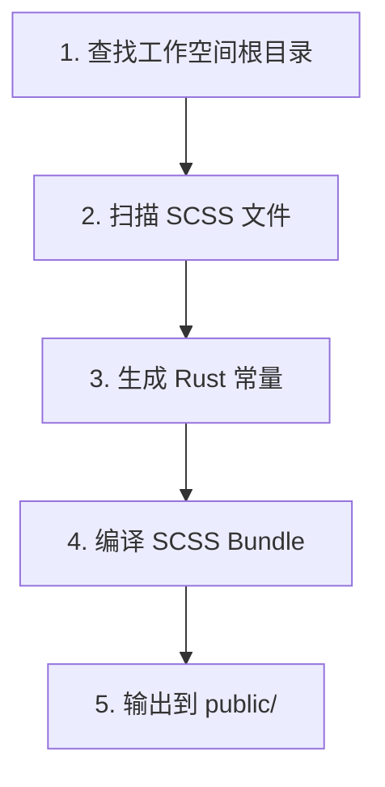
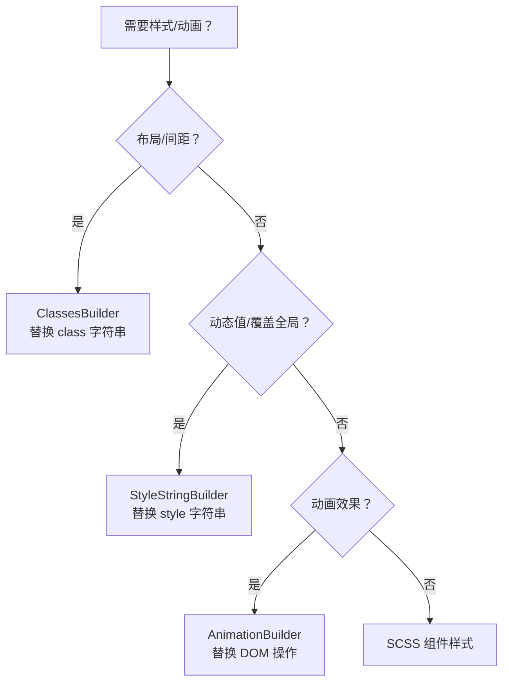
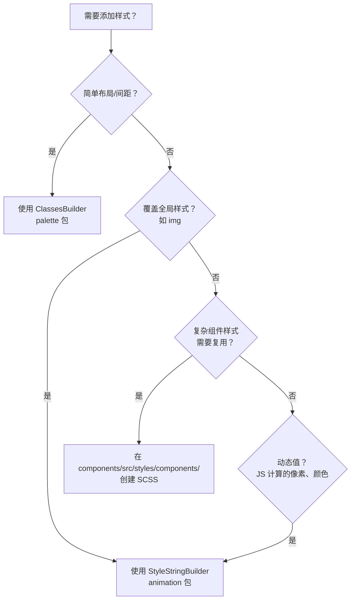

# Hikari 项目文档 (Claude 指南)

> Hikari - 基于 Dioxus + Grass + Axum 的 Rust UI 框架
>
> **设计风格**: Arknights 平面设计 + FUI 科幻感 + 中国传统色
>
> **名称来源**: "Hikari" (光) 来自音乐游戏 Arcaea

---

## 项目概述

### 技术栈

```
Frontend (WASM):  Dioxus 0.7
Styling:         Grass (SCSS 编译器)
Build System:    Justfile
Palette:         中国传统色 (500+ 色)
Server (SSR):    Axum (可选)
Tooling:         Python 3.11+ 用于预构建脚本
```

### 核心理念

**简约、科技、文化自信**

---

## 核心系统架构

### 1. 调色板系统 (hikari-palette)

**职责**: 中国传统色彩管理和工具类系统

**核心功能**:

- 500+ 中国传统颜色定义
- 主题色板系统（Hikari, Tairitsu）
- 类型安全的工具类系统
- 透明度和颜色混合工具

**关键 API**:

```rust
use hikari_palette::{朱砂, 石青, opacity};
use hikari_palette::classes::{ClassesBuilder, Display, Flex, Gap};

// 颜色使用
let red = 朱砂;
let blue = 石青;

// 工具类使用
let classes = ClassesBuilder::new()
    .add(Display::Flex)
    .add(Flex::FlexCol)
    .add(Gap::Gap4)
    .build();
```

**注意事项**:

- ✅ 优先使用主题色板 - `Hikari::palette()` 或 `Tairitsu::palette()`
- ❌ 不要创建新的颜色常量 - 使用现有的 500+ 颜色
- ✅ 枚举必须与 SCSS 类一一对应

---

### 2. 主题系统 (hikari-theme)

**职责**: 主题上下文和样式注入

**核心功能**:

- ThemeProvider 组件
- ThemeContext 和 hooks
- CSS 变量系统
- 主题切换支持

**关键 API**:

```rust
use hikari_theme::ThemeProvider;

// 基础使用
rsx! {
    ThemeProvider { palette: "hikari" }
        // 应用内容
    }
}

// 访问主题
let theme = use_theme()?;
let color = theme.palette.primary;
```

**支持的主题**:

- `"hikari"` - 浅色主题（光）
- `"tairitsu"` - 深色主题（tairitsu）

**CSS 变量**:

```css
[data-theme="hikari"] {
    --hi-color-primary: #00A0E9;
    --hi-color-secondary: #E94B35;
    --hi-color-accent: #F8B62D;
    /* ... */
}
```

**注意事项**:

- ✅ ThemeProvider 应该在应用根部
- ✅ 支持嵌套主题进行局部覆盖

---

### 3. 动画系统 (hikari-animation)

**职责**: 声明式动画和动态值

**核心模块**:

- **builder** - AnimationBuilder（主要 API）
- **context** - AnimationContext（运行时状态）
- **style** - StyleStringBuilder（类型安全的 CSS）
- **easing** - 30+ 缓动函数
- **tween** - 插值系统
- **timeline** - 时间线控制
- **presets** - 预设动画
- **spotlight** - 聚光灯效果

**关键 API**:

```rust
use hikari_animation::{AnimationBuilder, AnimationContext};
use hikari_animation::style::{CssProperty, StyleStringBuilder};

// 静态动画
AnimationBuilder::new(&elements)
    .add_style("button", CssProperty::Opacity, "0.8")
    .apply_with_transition("300ms", "ease-in-out");

// 动态动画（鼠标跟随）
AnimationBuilder::new(&elements)
    .add_style_dynamic("button", CssProperty::Transform, |ctx| {
        let x = ctx.mouse_x();
        let y = ctx.mouse_y();
        format!("translate({}px, {}px)", x, y)
    })
    .apply_with_transition("150ms", "ease-out");
```

**性能优化**:

- ✅ 使用防抖动画 - 处理频繁更新（如滚动）
- ✅ 优先使用 CSS 过渡 - 简单状态改变
- ✅ 使用 requestAnimationFrame - 帧级动画

**注意事项**:

- ⚠️ 仅支持 WASM 目标 (`#[cfg(target_arch = "wasm32")]`)

---

### 4. 图标系统 (hikari-icons)

**职责**: 图标枚举和 SVG 内容

**核心功能**:

- Lucide Icons 枚举（1000+ 图标）
- SVG 内容生成
- Icon 组件

**关键 API**:

```rust
use hikari_icons::{Icon, LucideIcon};

rsx! {
    Icon {
        icon: LucideIcon::Search,
        size: 24,
        color: "var(--hi-color-primary)"
    }
}
```

**注意事项**:

- ✅ 使用 LucideIcon 枚举 - 类型安全
- ❌ 不要手动创建 SVG 字符串 - 使用 Icon 组件

---

### 5. 组件库 (hikari-components)

**职责**: UI 组件和样式系统

**组件分类**:

| 分类 | Feature | 组件 |
|------|---------|------|
| 基础组件 | basic | Button, Input, Card, Badge |
| 反馈组件 | feedback | Alert, Toast, Tooltip, Spotlight |
| 导航组件 | navigation | Menu, Tabs, Breadcrumb |
| 布局组件 | always | Layout, Header, Aside, Content, Footer |
| 数据组件 | data | Table, Tree, Pagination |

**模块化设计示例**:

表格组件（8 个模块）:

```
data/table/
 ├── table.rs         # 核心逻辑
 ├── column.rs        # 列定义
 ├── cell.rs          # 单元格渲染
 ├── header.rs        # 表头
 ├── pagination.rs    # 分页
 ├── sort.rs          # 排序
 ├── filter.rs        # 筛选
 └── selection.rs     # 选择
```

树形控件（5 个模块）:

```
data/tree/
 ├── tree.rs          # 核心逻辑
 ├── node.rs          # 节点定义
 ├── virtual.rs       # 虚拟滚动
 ├── collapse.rs      # 折叠/展开
 └── drag.rs          # 拖拽
```

**关键 API**:

```rust
use hikari_components::{
    ThemeProvider, Button, Input, Card,
    Alert, Toast, Tooltip,
    Menu, Tabs, Breadcrumb,
    Layout, Header, Aside, Content,
    Table, Tree,
};
```

**样式注册**:

```rust
let mut registry = StyleRegistry::default();
registry.register_all();
```

**注意事项**:

- ✅ 使用 feature flags - 按需启用组件组
- ✅ 遵循模块化设计 - 复杂组件拆分为多个模块
- ❌ 不要在组件中使用全局样式 - 使用 StyledComponent trait

---

### 6. 高级组件库 (hikari-extra-components)

**职责**: 高级 UI 组件，提供复杂交互场景的专用功能

**核心组件**:

| 组件 | 功能 |
|------|------|
| Collapsible | 可折叠面板（左右滑入/滑出动画） |
| DragLayer | 拖拽层（边界约束、拖拽事件） |
| ZoomControls | 缩放控制（键盘快捷键、可配置范围） |

**关键 API**:

```rust
use hikari_extra_components::{Collapsible, DragLayer, ZoomControls};

// 可折叠面板
Collapsible {
    title: "设置".to_string(),
    expanded: true,
    position: CollapsiblePosition::Right,
    div { "内容" }
}

// 拖拽层
DragLayer {
    initial_x: 100.0,
    initial_y: 100.0,
    constraints: DragConstraints {
        min_x: Some(0.0),
        max_x: Some(500.0),
        ..Default::default()
    },
    div { "拖动我" }
}

// 缩放控制
ZoomControls {
    zoom: 1.0,
    on_zoom_change: move |z| println!("Zoom: {}", z)
}
```

**注意事项**:

- ✅ 依赖 `hikari-components` 和 `hikari-theme`
- ✅ 支持动画集成

---

### 7. 构建系统 (hikari-builder)

**职责**: 编译时代码生成和 SCSS 编译

**核心功能**:

- SCSS 编译（使用 Grass）
- 组件发现和代码生成
- 资源打包

**构建流程**:



**使用方式**:

```rust
// build.rs
fn main() {
    hikari_builder::build().expect("Build failed");
}
```

**关键配置**:

```rust
BuildConfig {
    components: vec!["button".to_string(), "card".to_string()],
    output_dir: "public".into(),
    minify_css: false,
    scss_entry: "packages/components/src/styles/index.scss".into(),
    ..BuildConfig::default()
}
```

**注意事项**:

- ✅ 自动运行 - 在 `cargo build` 时自动执行
- ❌ 不要编辑 generated/*.rs - 自动生成的文件
- ✅ 使用 Grass - 纯 Rust，无需 Ruby Sass
- ✅ 增量编译 - SCSS 未改变时不重新编译

---

### 8. 渲染服务 (hikari-render-service)

**职责**: SSR 和静态资源服务

**核心模块**:

- **html** - HtmlService（HTML 模板）
- **registry** - StyleRegistry（样式管理）
- **router** - 路由构建器
- **static_files** - 静态文件服务
- **styles_service** - 样式注入
- **plugin** - HikariRenderServicePlugin（主要 API）

**关键 API**:

```rust
use hikari_render_service::HikariRenderServicePlugin;
use axum::routing::get;

let app = HikariRenderServicePlugin::new()
    // 样式管理
    .component_style_registry(registry)
    .register_style("custom", ".custom { color: red; }")

    // 路由
    .add_route("/api/health", get(health_check))

    // 静态资源
    .static_assets("./dist", "/static")
    .icon_assets("./icons", "/static/icons")

    // 状态
    .state("api_key", "secret")

    // 构建
    .build()?;
```

**静态资源挂载**:

```rust
// 单个目录
plugin.static_assets("./dist", "/static");

// 多个目录
plugin
    .static_assets("./dist", "/static")
    .icon_assets("./icons", "/static/icons")
    .static_assets("./styles", "/styles");

// 自定义配置
use hikari_render_service::{StaticMountConfig, StaticFileConfig};

let mount_config = StaticMountConfig::new("./dist", "/static")
    .config(StaticFileConfig::default().no_cache());

plugin.mount_static(mount_config);
```

**注意事项**:

- ✅ 集成 Axum - 与 Dioxus SSR 无缝集成
- ✅ 静态资源缓存 - 可配置 Cache-Control
- ❌ 不要直接使用 HtmlService - 通过 Plugin 使用

---

## 包架构

### 依赖关系图

```
hikari-ssr (independent)
    │
    │
hikari-palette (foundation)
    │
    ├─────────────┐
    │             │
hikari-theme   hikari-components
    │             │
    └──────┬──────┘
           │
    hikari-extra-components
```

### 包职责

| 包 | 职责 | 依赖 |
|---|------|------|
| hikari-palette | 颜色系统和工具类 | 无 |
| hikari-theme | 主题管理和 CSS 变量 | hikari-palette |
| hikari-components | 基础 UI 组件 | hikari-palette, hikari-theme |
| hikari-extra-components | 高级组件 | hikari-components, hikari-theme |
| hikari-ssr | 服务端渲染 | 无 |
| hikari-render-service | 静态资源服务和路由 | hikari-components |
| hikari-builder | SCSS 编译和代码生成 | grass |
| hikari-animation | 动画系统 | 无 |
| hikari-icons | 图标系统 | 无 |

---

## 开发指南

### 核心工具：三个 Builder

Hikari 提供三个核心 Builder，**完全替换原生开发方式**：

#### 1. ClassesBuilder - 替换原生 `class` 字符串

**❌ 不要这样做**:

```rust
// ❌ 直接拼接字符串，容易出错
div { class: "flex flex-col gap-4 p-4" }
```

**✅ 使用 ClassesBuilder**:

```rust
use hikari_palette::classes::{ClassesBuilder, Display, Flex, Gap, Padding};

let classes = ClassesBuilder::new()
    .add(Display::Flex)
    .add(Flex::FlexCol)
    .add(Gap::Gap4)
    .add(Padding::P4)
    .build();
// 输出: "hi-flex hi-flex-col hi-gap-4 hi-p-4"

div { class: "{classes}" }
```

**作用**:

- **替换** 原生 `class` 字符串拼接
- **提供** 类型安全的工具类枚举
- **保证** 类名拼写正确（编译时检查）

**使用场景**:

- ✅ 所有布局样式（display、flex、grid、spacing）
- ❌ 不要使用字符串拼接类名

---

#### 2. StyleStringBuilder - 替换原生 `style` 字符串

**❌ 不要这样做**:

```rust
// ❌ 直接拼接 style 字符串，容易出错
div { style: "height: 36px; max-width: 140px; width: auto;" }
```

**✅ 使用 StyleStringBuilder**:

```rust
use hikari_animation::style::{StyleStringBuilder, CssProperty};

let style = StyleStringBuilder::new()
    .add_px(CssProperty::Height, 36)
    .add_px(CssProperty::MaxWidth, 140)
    .add(CssProperty::Width, "auto")
    .add(CssProperty::ObjectFit, "contain")
    .build_clean();
// 输出: "height:36px;max-width:140px;width:auto;object-fit:contain"

div { style: "{style}" }
```

**作用**:

- **替换** 原生 `style` 字符串拼接
- **提供** 类型安全的 CSS 属性枚举
- **保证** 属性名拼写正确（编译时检查）

**使用场景**:

- ✅ 覆盖全局样式（如 `img { height: auto; }`）
- ✅ 动态计算的样式值（像素、颜色）
- ❌ 不要使用字符串拼接 style

---

#### 3. AnimationBuilder - 替换原生 animation/transform 操作

**❌ 不要这样做**:

```rust
// ❌ 直接操作 DOM 或使用 CSS 字符串
element.set_attribute("style", "transition: all 0.3s ease;");
```

**✅ 使用 AnimationBuilder**:

```rust
use hikari_animation::{AnimationBuilder, AnimationContext};
use hikari_animation::style::CssProperty;

// 静态动画
AnimationBuilder::new(&elements)
    .add_style("button", CssProperty::Opacity, "0.8")
    .apply_with_transition("300ms", "ease-in-out");

// 动态动画（鼠标跟随）
AnimationBuilder::new(&elements)
    .add_style_dynamic("button", CssProperty::Transform, |ctx| {
        let x = ctx.mouse_x();
        let y = ctx.mouse_y();
        format!("translate({}px, {}px)", x, y)
    })
    .apply_with_transition("150ms", "ease-out");
```

**作用**:

- **替换** 原生 DOM 操作和 CSS animation/transform
- **提供** 声明式动画 API
- **支持** 静态值和动态值（闭包）
- **集成** requestAnimationFrame 优化

**使用场景**:

- ✅ 所有动画效果（淡入、滑动、缩放、旋转）
- ✅ 鼠标跟随、悬停效果
- ❌ 不要直接操作 DOM 或拼接 CSS 动画字符串

---

### 样式选择决策树



### SCSS 组件样式

用于定义可复用的组件样式：

```scss
// packages/components/src/styles/components/my-component.scss
.hi-my-component {
  display: flex;
  align-items: center;
  gap: 1rem;
}
```

**使用场景**:

- ✅ 复杂的组件样式（如 card、button）
- ✅ 需要组合多个工具类的样式
- ✅ 有伪类/嵌套关系的样式

### 样式选择决策树



### 扩展开发

#### 添加新的工具类（ClassesBuilder）

1. 在 `packages/palette/src/classes/sizing.rs` 添加枚举变体
2. 在 SCSS 中添加对应的 `.hi-*` 类
3. 使用 ClassesBuilder 添加新枚举

#### 添加新的 CSS 属性（StyleStringBuilder）

1. 在 `packages/animation/src/style.rs` 的 `CssProperty` 枚举添加变体
2. 在 `as_str()` 方法中添加属性名映射
3. 使用 StyleStringBuilder 添加新属性

#### 添加新组件

1. 创建组件文件（如 `packages/components/src/basic/my_component.rs`）
2. 实现 `StyledComponent` trait
3. 创建对应的 SCSS 文件
4. 在 mod.rs 中导出
5. 添加 feature flag（可选）

---

## 依赖管理规范

### 依赖分组和排序

在 `[dependencies]` 中，依赖按功能/语义分组，组间用空行分隔，组内按字母顺序排序：

1. **Workspace dependencies**: 内部库（`_utils`, `_client`, `_server` 等）- 以下划线开头的包
2. **Basic language and tools**: 错误处理和 trait 基础设施（`anyhow`, `thiserror`, `async-trait`, `clap` 等）
3. **Data and serialization**: 数据结构、序列化、ID、时间（`serde`, `serde_json`, `uuid`, `chrono`, `regex` 等）
4. **Logging and tracing**: 日志和分布式追踪（`tracing`, `tracing-subscriber` 等）
5. **Async / concurrency runtime**: 运行时和异步工具（`tokio` 及相关包）
6. **File system and paths**: 路径、目录遍历、临时文件（`dirs`, `walkdir`, `tempfile` 等）
7. **MCP / network and protocols**: MCP 协议栈和网络相关库（`jsonrpc-core`, `axum`, `gloo-net`, `wasm-bindgen-futures`, `dioxus` 等）

### 版本号编写规则

所有依赖版本统一使用 caret (`^`) 语义化版本：

1. **当主版本 ≥ 1**
   - 只保留主版本，写为 `^<major>`
   - 示例：`4.1.3` → `^4`, `2.0.0` → `^2`

2. **当主版本为 0 且次版本 ≥ 1**
   - 保持 `0.<minor>`，写为 `^0.<minor>`
   - 示例：`0.12.4` → `^0.12`, `0.3.0` → `^0.3`

3. **当版本还在 0.0.x 阶段**
   - 使用精确版本号
   - 示例：`0.0.7` → `0.0.7`

4. **带 features 的依赖**
   - 遵循以上版本规则，添加 `features` 字段

```toml
anyhow = { version = "^1", features = ["backtrace"] }
serde = { version = "^1", features = ["derive"] }
uuid = { version = "^1", features = ["v4", "serde"] }
```

---

## Git 提交规范

**重要**：每次迭代完成后必须进行一次 git 提交，严格遵守以下规范：

- **格式**: `emoji 一句话英语描述`
- **示例**:
  - `🏗️ Initialize workspace structure`
  - `🎨 Add hikari-palette with Chinese colors`
  - `📦 Add justfile build system`
  - `🔧 Configure Python tooling scripts`
  - `📝 Add comprehensive documentation`
  - `✨ Implement animation system with easing functions`
  - `🐛 Fix theme provider context issue`
  - `♻️ Refactor SCSS variables for better organization`
  - `⚡ Performance optimization for virtual scrolling`
  - `🔖 Bump version to 0.2.0`

**注意**:

- 使用单个 emoji
- 只有一句话的英语描述（不使用中文）
- **不要 push 到云端**（除非明确要求）

---

## 设计风格

### Arknights 平面设计

- 干净的线条、清晰的信息层级
- 高对比度，避免模糊
- 简约而不失精致

### FUI 科幻感

- 微妙的发光效果（`box-shadow`, `text-shadow`）
- 动态指示（呼吸灯、脉冲动画）
- 精细的边框（1px 半透明）
- 几何图案（六边形、网格）

### 中国传统色应用

- **主色**: 石青（蓝）、朱砂（红）、藤黄（黄）、靛蓝（深蓝）
- **中性色**: 月白（淡白）、墨色（深黑）、缟色（浅灰）
- **功能色**: 葱倩（成功）、鹅黄（警告）、朱砂（危险）

---

## Agent 指南

### 开始新任务前

- ✅ 先阅读此文档
- ✅ 检查现有的系统架构
- ❌ 不要创建新的轮子

### 使用现有系统

- ✅ **class**: 使用 ClassesBuilder（palette 包），不要拼接字符串
- ✅ **style**: 使用 StyleStringBuilder（animation 包），不要拼接字符串
- ✅ **动画**: 使用 AnimationBuilder（animation 包），不要直接操作 DOM
- ✅ **色彩**: 使用 `hikari-palette`，不要创建新颜色
- ✅ **主题**: 使用 `ThemeProvider`，不要修改现有主题
- ✅ **图标**: 使用 `LucideIcon` 枚举，不要手动创建 SVG

### 添加新功能时

- ✅ 遵循模块化设计
- ✅ 实现 StyledComponent trait
- ✅ 添加完整的文档注释
- ✅ 编写单元测试
- ✅ 遵循 Git 提交规范
- ✅ 遵循依赖管理规范（分组、排序、版本号）

### 性能优化

- ✅ 使用虚拟滚动（大数据列表）
- ✅ 使用防抖动画（频繁更新）
- ✅ 优先使用 CSS 过渡
- ❌ 避免频繁的 DOM 操作

### 文档规范

- ✅ 所有公共 API 必须有文档注释
- ✅ 包含使用示例
- ✅ 说明性能考虑
- ✅ 标注平台支持（WASM/SSR）
- ✅ **流程图使用 mermaid 格式** - 不要用制表符或 ASCII 艺术图

### 避免的常见错误

1. ❌ **拼接 class 字符串** - 使用 ClassesBuilder（palette 包）
2. ❌ **拼接 style 字符串** - 使用 StyleStringBuilder（animation 包）
3. ❌ **直接操作 DOM/动画** - 使用 AnimationBuilder（animation 包）
4. ❌ **创建新的颜色常量** - 使用现有的 500+ 颜色
5. ❌ **修改现有主题** - 创建新的主题结构体
6. ❌ **创建全局样式** - 使用 StyledComponent trait
7. ❌ **忽略模块化设计** - 复杂组件应该拆分
8. ❌ **使用中文提交信息** - 使用 emoji + 英语
9. ❌ **跳过文档** - 公共 API 必须有文档
10. ❌ **用制表符画流程图** - 使用 mermaid 格式
11. ❌ **依赖分组混乱** - 遵循分组和排序规范

---

## 相关资源

- **文档**: `docs/` 目录（多语言）
- **示例**: `examples/` 目录
- **API 文档**: <https://docs.rs/hikari-components>
- **设计规范**: `docs/zh-CN/system/`
- **贡献指南**: `CONTRIBUTING.md`
- **许可证**: `LICENSE`

---

**最后更新**: 2026-01-11
**维护者**: Hikari Contributors
**许可**: MIT OR Apache-2.0
