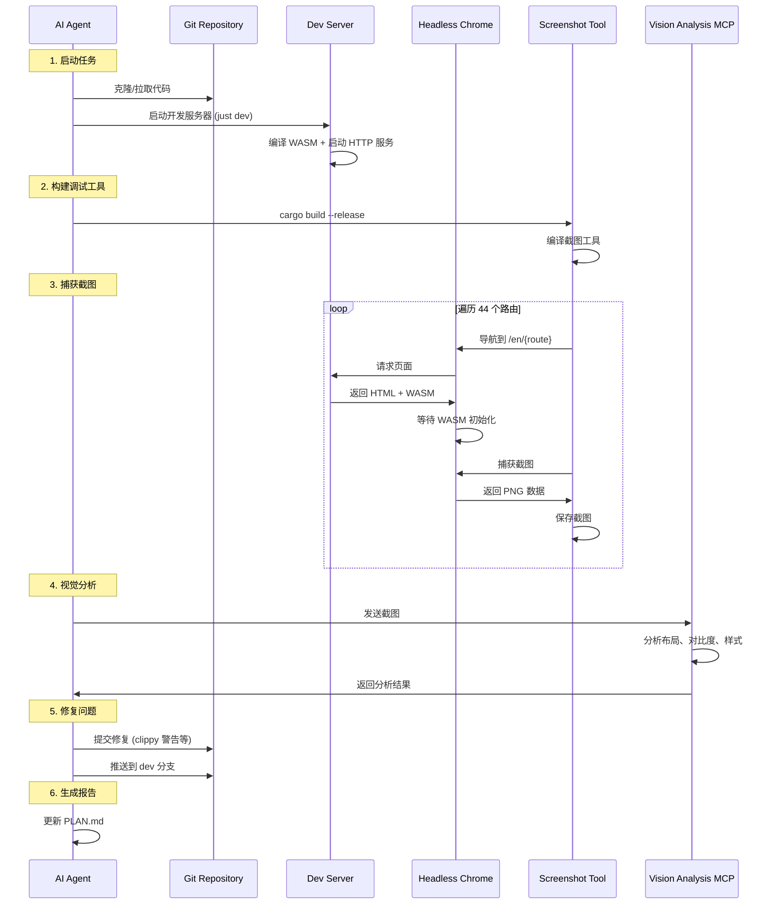

# Hikari UI 改进计划

## 状态: 已完成 ✅
## 更新日期: 2026-02-21

---

## 完成摘要

### 1. 修复截图工具路由配置 ✅
**问题**: 截图工具的路由配置与应用实际路由不匹配（缺少 `/en/` 前缀，路径错误）

**修复内容**:
- 添加 `/en/` 语言前缀到所有 44 个路由
- 修正路径映射:
  - `entry` → `layer2`
  - `extra` → `layer3`  
  - `basic` → `button`
- 新增遗漏路由

### 2. 修复代码质量问题 ✅
修复了以下 clippy 警告:
- `len_zero`: 使用 `!is_empty()` 替代 `len() > 0`
- `manual_clamp`: 使用 `clamp()` 替代 `.min().max()`
- `redundant_closure`: 简化冗余闭包
- `print_empty_string`: 移除空字符串打印
- `single_component_path_imports`: 移除冗余导入
- `unwrap_or_default`: 简化 match 模式

### 3. 视觉分析验证 ✅
通过视觉分析 MCP 确认:
- 首页布局优秀
- 组件页面文字对比度良好
- Dashboard Demo 完整渲染
- 侧边栏宽度合适

---

## 时序图：完整的调试流程



---

## 文件清单

| 文件 | 说明 |
|------|------|
| `packages/e2e/src/screenshot_bin.rs` | 截图工具 (路由已修复) |
| `scripts/dev/browser_debug.py` | Python 调试脚本 |
| `scripts/dev/screenshots/*.png` | 44 张页面截图 |
| `.clippy.toml` | Clippy 配置文件 |

---

## 提交记录

```
048cf0f docs: update PLAN.md with completed tasks and analysis results
51db376 fix: clippy warnings and code quality improvements
1d40b2d fix(e2e): correct screenshot routes to match app routing
```

---

## 结论

**所有任务已完成**:
1. ✅ 截图工具路由修复
2. ✅ 代码质量提升 (clippy 零警告)
3. ✅ 44 个页面截图成功
4. ✅ 视觉分析确认 UI 健康
5. ✅ 所有更改已推送到 dev 分支
