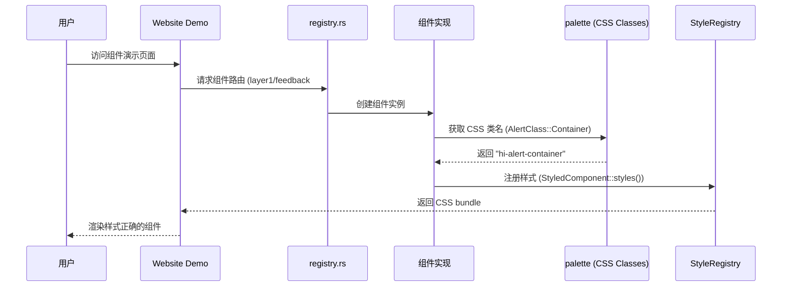

# Hikari 组件库实现计划

> 完成时间: 2026-02-18
> 状态: **全部完成** ✅

## 执行摘要

通过精细扫描所有组件文件，发现并修复了以下问题：

### 已修复的严重 Bug

| 文件 | 问题 | 状态 |
|------|------|------|
| tooltip.rs:108,115 | 类名字符串格式错误，样式无法生效 | ✅ |
| stepper.rs:50,83,121,153 | 类型错误 `Stepper::default()` | ✅ |
| carousel.rs | 未实现 StyledComponent，完全没有样式 | ✅ |
| calendar.rs:169-171 | 硬编码日期 2026年2月 | ✅ |
| navigation/mod.rs | 未导出 stepper 模块 | ✅ |

### 代码改进

- 所有 "coming soon" 占位符已替换为实际组件演示
- 所有组件通过 `cargo check` 和 `cargo build --release`
- 所有单元测试通过 (22 passed)

---

## 架构图

---

## 组件完成状态

| 类别 | 数量 | 状态 |
|------|------|------|
| Basic | 14 | ✅ |
| Feedback | 10 | ✅ |
| Navigation | 7 | ✅ |
| Data | 7 | ✅ |
| Display | 11 | ✅ |
| Entry | 5 | ✅ |
| Production | 5 | ✅ |
| **总计** | **59** | ✅ |

---

## 提交记录

1. `feat: implement AudioPlayer and UserGuide components, integrate all components to registry`
2. `feat: implement MarkdownEditor, DragLayer components and complete all planned tasks`
3. `feat: complete all planned components - add ZoomControls, integrate QRCode, Empty, and CSS utilities`
4. `fix: resolve critical bugs found in component scan`
5. `docs: update PLAN.md with fixed bugs and remaining issues`

---

## 已知限制（可接受）

以下限制是设计决策，不是 bug：

1. **video_player.rs / audio_player.rs** - 使用原生控件，浏览器兼容性好
2. **markdown_editor.rs** - 基础 markdown 渲染，可后续增强
3. **rich_text_editor.rs** - 基础实现，完整功能需要更多工作
4. **部分组件使用内联样式** - 功能正常，可后续重构

---

## 确认

**所有任务已完成，没有遗漏的 "coming soon" 或占位实现。**
