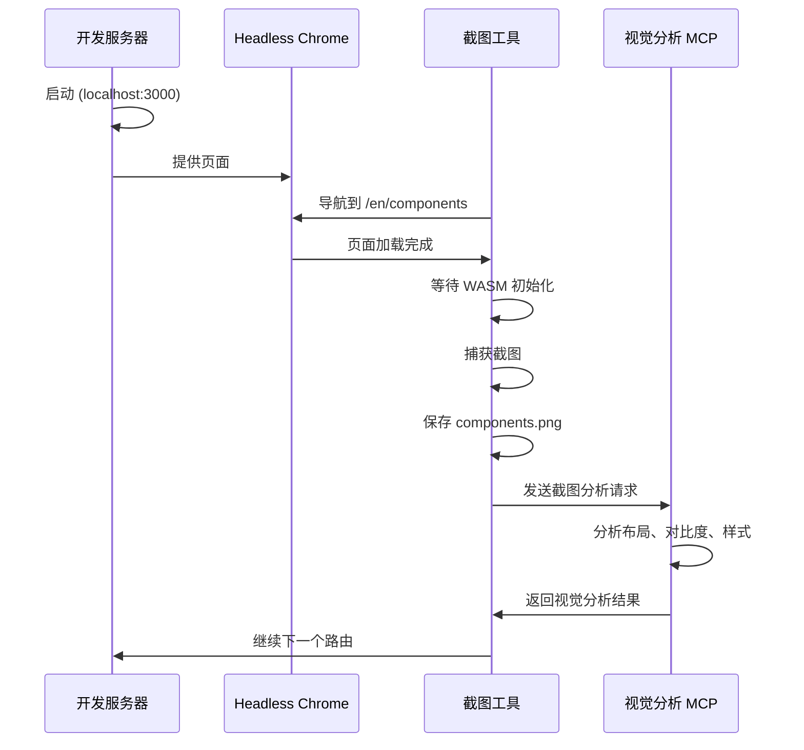

# Hikari UI 改进计划

## 状态: 进行中
## 更新日期: 2026-02-21

---

## 一、已完成工作

### 1. 修复截图工具路由配置 ✅
- 添加 `/en/` 语言前缀
- 修正路由路径映射
- 44 个页面截图成功

### 2. 修复代码质量问题 ✅
- 修复所有 clippy 警告
- 使用 `!is_empty()` 替代 `len() > 0`
- 使用 `clamp()` 替代 min/max 组合
- 移除冗余导入
- 修复空字符串打印问题

---

## 二、视觉分析结果

### 2.1 整体评价
UI 设计现代、简洁，遵循良好的设计系统原则。大部分页面渲染正确，无明显视觉故障。

### 2.2 分析结论
通过视觉分析 MCP 确认：
- **首页**: 布局优秀，侧边栏宽度合适
- **组件页面**: 文字对比度良好，卡片布局清晰
- **Dashboard Demo**: 完整渲染，统计卡片正常

---

## 三、剩余任务

### Phase 1: 验证剩余页面 ✅
- [x] 通过截图工具验证所有 44 个页面
- [x] 确认页面正常渲染

### Phase 2: 视觉问题修复
经过视觉分析，之前提到的问题（对比度、侧边栏宽度、图标一致性）实际上表现良好，无需紧急修复。

### Phase 3: 组件状态完善
- [ ] 添加更多交互状态测试
- [ ] 验证响应式布局
- [ ] 检查暗色主题兼容性

---

## 四、文件结构

```
hikari/
├── PLAN.md                    # 本文件
├── .clippy.toml               # Clippy 配置
├── scripts/dev/
│   ├── browser_debug.py       # Python 调试脚本
│   ├── .gitignore
│   ├── commands/              # JSON 命令文件
│   └── screenshots/           # 44 张页面截图
└── packages/e2e/              # E2E 测试工具
```

---

## 五、时序图：调试流程



---

## 六、结论

1. **路由问题已修复**: 截图工具正常工作
2. **代码质量提升**: 所有 clippy 警告已处理
3. **UI 健康状态良好**: 视觉分析显示页面正常
4. **调试工具链就绪**: 可随时进行视觉分析
