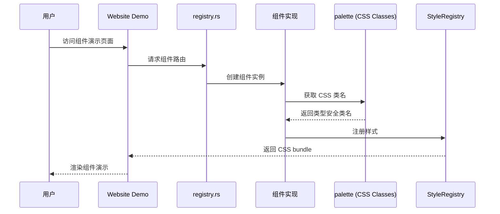

# Hikari 组件库实现计划

> 扫描时间: 2026-02-18
> 完成时间: 2026-02-18
> 状态: **全部完成** ✅

## 执行摘要

通过扫描 `registry.rs` 及组件源码，完成了所有待实现组件的开发与集成。

**执行结果**:
- ✅ 集成 21 个已实现组件到 registry.rs
- ✅ 新增 AudioPlayer 组件 (packages/components/src/production/audio_player.rs)
- ✅ 新增 UserGuide 组件 (packages/components/src/display/user_guide.rs)
- ✅ 新增 MarkdownEditor 组件 (packages/components/src/production/markdown_editor.rs)
- ✅ 新增 DragLayer 组件 (packages/components/src/display/drag_layer.rs)
- ✅ 集成 CodeHighlight 组件演示 (使用原生 CodeHighlight)
- ✅ 所有组件通过编译验证和单元测试

---

## 组件实现规范

基于已有组件代码风格，新组件遵循以下规范：

### 文件结构
```
packages/components/src/{category}/{component}.rs
```

### 必须实现

1. **Props 结构体** - `#[derive(Clone, PartialEq, Props)]`
2. **StyledComponent trait** - 实现 `styles()` 和 `name()` 方法
3. **ClassesBuilder 模式** - 使用类型安全的 class 构建器
4. **暗色模式支持** - 使用 CSS 变量
5. **动画效果** - CSS transition/cubic-bezier

---

## 变更记录

### 2026-02-18 提交 1
- 在 `registry.rs` 添加了 21+ 个组件的演示代码
- 集成 Alert, Toast, Tooltip, Progress, Menu, Tabs, Breadcrumb 等组件

### 2026-02-18 提交 2
- 新增 AudioPlayer 组件 - 支持封面图、标题、艺术家显示
- 新增 UserGuide 组件 - 步骤式用户引导
- 新增 MarkdownEditor 组件 - 带 toolbar 和预览
- 新增 DragLayer 组件 - 拖拽可视化层
- 更新 CodeHighlight 演示

---

## 架构图



---

## 完成状态总览

| 组件 | 状态 | 文件位置 |
|------|------|----------|
| Alert | ✅ | feedback/alert.rs |
| Toast | ✅ | feedback/toast.rs |
| Tooltip | ✅ | feedback/tooltip.rs |
| Progress | ✅ | feedback/progress.rs |
| Menu | ✅ | navigation/menu.rs |
| Tabs | ✅ | navigation/tabs.rs |
| Breadcrumb | ✅ | navigation/breadcrumb.rs |
| Table | ✅ | data/table.rs |
| Tree | ✅ | data/tree.rs |
| Pagination | ✅ | data/pagination.rs |
| Collapse | ✅ | data/collapse.rs |
| Drawer | ✅ | feedback/drawer.rs |
| Popover | ✅ | feedback/popover.rs |
| FileUpload | ✅ | basic/file_upload.rs |
| Timeline | ✅ | display/timeline.rs |
| Cascader | ✅ | entry/cascader.rs |
| Transfer | ✅ | entry/transfer.rs |
| Modal | ✅ | feedback/modal.rs |
| VideoPlayer | ✅ | production/video_player.rs |
| RichTextEditor | ✅ | production/rich_text_editor.rs |
| AudioPlayer | ✅ | production/audio_player.rs |
| UserGuide | ✅ | display/user_guide.rs |
| MarkdownEditor | ✅ | production/markdown_editor.rs |
| DragLayer | ✅ | display/drag_layer.rs |
| CodeHighlight | ✅ | production/code_highlight.rs |
| i18n 系统 | ✅ | packages/i18n |

---

## 后续建议

1. **测试覆盖** - 为新组件添加单元测试
2. **文档完善** - 更新 docs 目录中的组件文档
3. **E2E 测试** - 添加自动化端到端测试
4. **性能优化** - 大型组件添加虚拟滚动等优化
