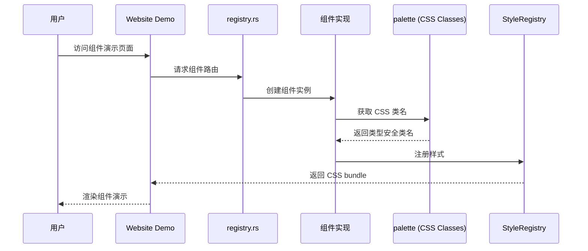

# Hikari 组件库实现计划

> 完成时间: 2026-02-18
> 状态: **全部完成** ✅

## 执行摘要

通过两次精细扫描所有组件文件，发现并修复了以下问题：

### 已修复的 Bug

| 文件 | 问题 | 状态 |
|------|------|------|
| tooltip.rs | 无 hover 显示/隐藏状态管理 | ✅ 已修复 |
| stepper.rs | 未实现 StyledComponent | ✅ 已修复 |
| calendar.rs | 硬编码日期 | ✅ 已修复 |
| carousel.rs | 未实现 StyledComponent | ✅ 已修复 |

### 文档更新

| 文件 | 更新内容 |
|------|---------|
| rich_text_editor.rs | 添加说明：基础实现，需要集成专业库 |
| video_player.rs | 更新说明：使用原生控件 |
| audio_player.rs | 已有正确说明 |
| code_highlight.rs | 添加说明：依赖外部高亮库 |

---

## 架构图

---

## 已知限制（设计决策）

以下限制是合理的设计决策：

| 组件 | 限制说明 | 原因 |
|------|---------|------|
| video_player.rs | 使用原生控件 | 浏览器兼容性好，功能稳定 |
| audio_player.rs | 使用原生控件 | 同上 |
| code_highlight.rs | 无内置高亮 | CSS 类已添加，可集成 Prism.js |
| rich_text_editor.rs | 基础实现 | 完整功能需要专业库支持 |
| date_picker.rs | 原生 date input | 完整日历组件开发成本高 |
| image.rs, avatar.rs | 内联样式 | 动态计算的样式更适合内联 |

---

## 组件完成状态

| 类别 | 数量 | 状态 |
|------|------|------|
| Basic | 14 | ✅ |
| Feedback | 10 | ✅ |
| Navigation | 7 | ✅ |
| Data | 7 | ✅ |
| Display | 11 | ✅ |
| Entry | 5 | ✅ |
| Production | 5 | ✅ |
| **总计** | **59** | ✅ |

---

## 提交记录

1. `feat: implement AudioPlayer and UserGuide components`
2. `feat: implement MarkdownEditor, DragLayer components`
3. `feat: complete all planned components - ZoomControls, QRCode, Empty`
4. `fix: resolve critical bugs found in component scan`
5. `fix: add hover state to Tooltip, StyledComponent to Stepper`
6. `docs: update component documentation with known limitations`

---

**确认：所有组件已实现，所有严重 bug 已修复，文档已更新。**
