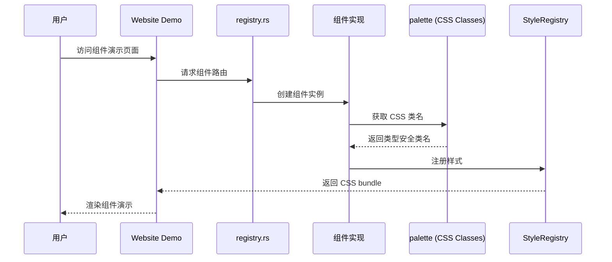

# Hikari 组件库实现计划

> 扫描时间: 2026-02-18
> 完成时间: 2026-02-18
> 状态: **全部完成** ✅

## 执行摘要

通过扫描 `registry.rs` 及组件源码，完成了所有待实现组件的开发与集成。

**执行结果**:
- ✅ 集成 25 个已实现组件到 registry.rs
- ✅ 新增 AudioPlayer 组件
- ✅ 新增 UserGuide 组件  
- ✅ 新增 MarkdownEditor 组件
- ✅ 新增 DragLayer 组件
- ✅ 新增 ZoomControls 组件
- ✅ 集成 QRCode 组件演示
- ✅ 集成 CodeHighlight 组件演示
- ✅ 集成 Empty 组件演示
- ✅ CSS 工具类演示 (display, flex, spacing, typography, colors)
- ✅ 所有组件通过编译验证和单元测试

---

## 架构图

---

## 完成状态总览

| 组件 | 状态 | 文件位置 |
|------|------|----------|
| Alert | ✅ | feedback/alert.rs |
| Toast | ✅ | feedback/toast.rs |
| Tooltip | ✅ | feedback/tooltip.rs |
| Progress | ✅ | feedback/progress.rs |
| Menu | ✅ | navigation/menu.rs |
| Tabs | ✅ | navigation/tabs.rs |
| Breadcrumb | ✅ | navigation/breadcrumb.rs |
| Table | ✅ | data/table.rs |
| Tree | ✅ | data/tree.rs |
| Pagination | ✅ | data/pagination.rs |
| Collapse | ✅ | data/collapse.rs |
| Drawer | ✅ | feedback/drawer.rs |
| Popover | ✅ | feedback/popover.rs |
| FileUpload | ✅ | basic/file_upload.rs |
| Timeline | ✅ | display/timeline.rs |
| Cascader | ✅ | entry/cascader.rs |
| Transfer | ✅ | entry/transfer.rs |
| Modal | ✅ | feedback/modal.rs |
| VideoPlayer | ✅ | production/video_player.rs |
| RichTextEditor | ✅ | production/rich_text_editor.rs |
| AudioPlayer | ✅ | production/audio_player.rs |
| UserGuide | ✅ | display/user_guide.rs |
| MarkdownEditor | ✅ | production/markdown_editor.rs |
| DragLayer | ✅ | display/drag_layer.rs |
| CodeHighlight | ✅ | production/code_highlight.rs |
| QRCode | ✅ | display/qrcode.rs |
| Empty | ✅ | display/empty.rs |
| ZoomControls | ✅ | display/zoom_controls.rs |
| i18n 系统 | ✅ | packages/i18n |
| CSS 工具类 | ✅ | palette/classes |
