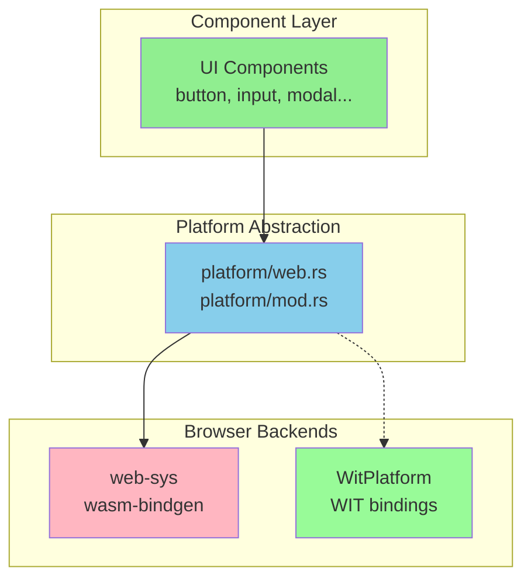

# Hikari 迁移计划：web-sys/wasm-bindgen 清理

## 概述

本文档记录 Hikari 从 wasm-bindgen/web-sys 到 Tairitsu WIT component model 的迁移状态，
以及剩余的 web-sys/wasm-bindgen 使用分析和清理计划。

**当前编译状态：✅ 通过**

```bash
cargo build -p hikari-components --target wasm32-unknown-unknown
```

---

## 架构原则


```mermaid
graph TB
    subgraph "Component Layer"
        C[UI Components<br/>button, input, modal...]
    end
    
    subgraph "Platform Abstraction"
        P[platform/web.rs<br/>platform/mod.rs]
    end
    
    subgraph "Browser Backends"
        W[web-sys<br/>wasm-bindgen]
        T[WitPlatform<br/>WIT bindings]
    end
    
    C --> P
    P --> W
    P -.-> T
    
    style C fill:#90EE90
    style P fill:#87CEEB
    style W fill:#FFB6C1
    style T fill:#98FB98
```

**原则：**
1. **组件层** → 使用 Platform API，不直接使用 web-sys
2. **Platform 抽象层** → 可以使用 web-sys（作为实现细节）
3. **未来** → Platform 抽象层可切换到 WIT bindings

---

## 依赖状态分析

### hikari-components/Cargo.toml

| 依赖 | 状态 | 说明 |
|------|------|------|
| `wasm-bindgen` | 保留 | Platform 抽象层实现需要 |
| `web-sys` | 保留 | Platform 抽象层实现需要 |
| `js-sys` | 保留 | Date.now() 等基础功能 |

**保留原因：** Platform 抽象层 (`platform/web.rs`) 必须使用 web-sys 实现 DOM 操作。

### hikari-animation/Cargo.toml

| Feature | 依赖 | 状态 |
|---------|------|------|
| `wasm` (默认) | wasm-bindgen, web-sys, js-sys | 保留 |

**保留原因：** 动画系统需要直接操作 DOM 元素样式。

### hikari-icons/Cargo.toml

| Feature | 依赖 | 状态 |
|---------|------|------|
| `dynamic-fetch` | web-sys (console) | 保留 |

**保留原因：** 仅在动态获取图标时需要控制台日志。

### hikari-extra-components/Cargo.toml

| 依赖 | 状态 |
|------|------|
| 无 web-sys/wasm-bindgen | ✅ 清洁 |

---

## 源码 web-sys 使用分析

### 分类 A：Platform 抽象层（保留）

这些文件是 Platform 抽象层的实现，**必须**使用 web-sys：

| 文件 | 用途 | 操作 |
|------|------|------|
| `platform/web.rs` | Platform API 实现 | **保留** |

### 分类 B：动画实现层（保留）

这些文件实现动画效果，需要直接操作 DOM：

| 文件 | 用途 | 操作 |
|------|------|------|
| `portal/animation/dropdown_animation.rs` | Dropdown 动画状态机 | **保留** |
| `basic/background.rs` | 渐变背景动画 | **保留** |

### 分类 C：纯 WASM 脚本（保留）

这些是独立的 WASM 脚本，不参与 VDOM 渲染：

| 文件 | 用途 | 操作 |
|------|------|------|
| `scripts/scrollbar_container.rs` | 自定义滚动条脚本 | **保留** |

### 分类 D：可迁移到 Platform API（待评估）

这些文件使用 web-sys 但可以通过 Platform API 重构：

| 文件 | 当前用法 | 迁移方案 |
|------|----------|----------|
| `theme/provider.rs:199-213` | `set_timeout` + Closure | → `platform::set_timeout` |
| `navigation/anchor.rs:76,128` | `window()` + `scroll_to` | → `platform::scroll_to_with_options` |
| `portal/render.rs:13` | `Closure` for Portal | 需评估 |
| `production/code_highlight.rs:16` | `wasm_bindgen::prelude` | 需评估 |
| `display/qrcode.rs:92` | `JsCast` for canvas | → `platform::draw_qrcode_on_canvas` |

---

## 迁移检查清单

### Phase 1：已完成的迁移 ✅

- [x] TimerId 路径修复 (`scrollbar_container.rs`)
- [x] ChangeEvent.data → value (`file_upload.rs`)
- [x] MouseEvent downcast → Platform API (`select.rs`)
- [x] onmounted → use_effect + query_selector_all (`qrcode.rs`, `search.rs`)
- [x] use_reactive → use_effect (`portal/render.rs`)
- [x] Signal 嵌套闭包克隆 (`hooks.rs`, `anchor.rs`)
- [x] DragEvent 可变引用 (`drag.rs`)

### Phase 2：待处理的迁移

#### 2.1 theme/provider.rs

**当前代码：**
```rust
use wasm_bindgen::JsCast;
let closure = wasm_bindgen::closure::Closure::once(Box::new(|| {
    init_global_animation_manager();
    init_scrollbars();
}) as Box<dyn FnOnce()>);
window.set_timeout_with_callback_and_timeout_and_arguments_0(...);
```

**迁移到：**
```rust
use crate::platform;
platform::set_timeout(|| {
    init_global_animation_manager();
    init_scrollbars();
}, 50);
```

#### 2.2 navigation/anchor.rs

**当前代码：**
```rust
use web_sys::window;
use wasm_bindgen::closure::Closure;
window().unwrap().scroll_to_with_scroll_to_options(&options);
```

**迁移到：**
```rust
use crate::platform;
platform::scroll_to_with_options(top, behavior);
```

#### 2.3 display/qrcode.rs

**当前代码：**
```rust
use wasm_bindgen::JsCast;
canvas.dyn_ref::<HtmlCanvasElement>()...
```

**迁移到：**
```rust
use crate::platform;
platform::draw_qrcode_on_canvas(canvas, matrix, modules, color, background);
```

### Phase 3：保持现状的文件

以下文件使用 web-sys 是合理的架构设计，**不需要迁移**：

| 文件 | 原因 |
|------|------|
| `platform/web.rs` | Platform 抽象层实现 |
| `portal/animation/*.rs` | 动画底层实现 |
| `scripts/scrollbar_container.rs` | 纯 WASM 脚本 |
| `basic/background.rs` | 底层动画实现 |
| `animation/src/*.rs` | 动画核心库 |

---

## tairitsu 项目状态

### tairitsu-web

| 模块 | 状态 |
|------|------|
| `platform.rs` | WebPlatform (web-sys 后端) |
| `wit_platform.rs` | WitPlatform (WIT bindings 后端) |
| `portal.rs` | Portal 渲染器 |

### tairitsu-vdom

| 模块 | 状态 |
|------|------|
| `platform/trait.rs` | Platform trait 定义 ✅ |
| `events.rs` | 事件类型定义 ✅ |

**tairitsu 无需清理 web-sys**，因为它提供两种后端：
- `WebPlatform` - 使用 web-sys（兼容现有代码）
- `WitPlatform` - 使用 WIT bindings（component model）

---

## 验证命令

```bash
# 构建 hikari-components
cargo build -p hikari-components --target wasm32-unknown-unknown

# 搜索剩余的 web-sys 直接使用
grep -rn "use web_sys" packages/components/src/ --include="*.rs"
grep -rn "use wasm_bindgen" packages/components/src/ --include="*.rs"

# 搜索 animation 包
grep -rn "use web_sys" packages/animation/src/ --include="*.rs"
```

---

## 执行顺序

1. **Phase 2.1** - 迁移 `theme/provider.rs`
2. **Phase 2.2** - 迁移 `navigation/anchor.rs`
3. **Phase 2.3** - 迁移 `display/qrcode.rs`
4. **验证** - 运行构建和测试

每个 Phase 完成后：
1. 运行 `cargo build` 验证编译
2. 提交到 dev 分支
3. 更新此文档

---

## 总结

| 项目 | 状态 | 说明 |
|------|------|------|
| hikari-components | ✅ 可编译 | 部分 web-sys 使用合理 |
| hikari-animation | ✅ 可编译 | 动画系统需要 web-sys |
| hikari-icons | ✅ 可编译 | 仅 dynamic-fetch 需要 |
| hikari-extra-components | ✅ 清洁 | 无 web-sys 依赖 |
| tairitsu-* | ✅ 正常 | 双后端架构 |

**核心结论：** 当前 web-sys/wasm-bindgen 使用大部分是合理的架构设计。
只有少数组件层的直接 web-sys 使用可以迁移到 Platform API。
