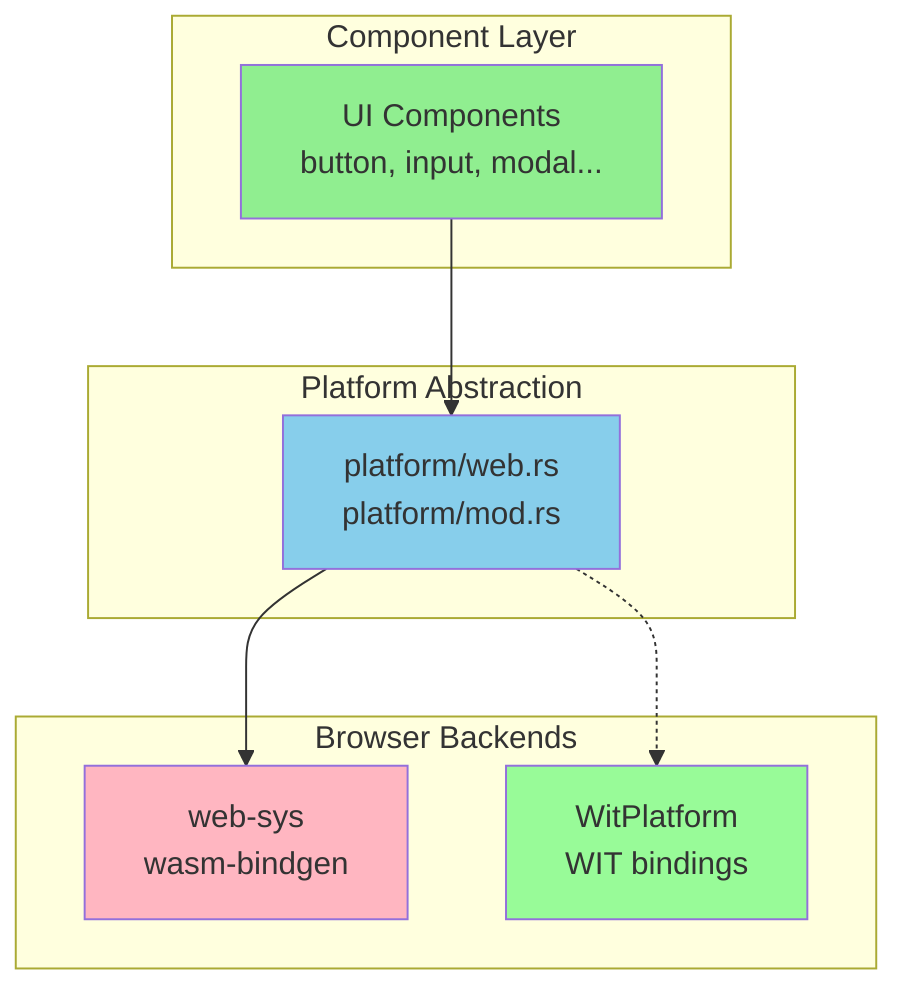

# Hikari 迁移计划：web-sys/wasm-bindgen 清理

## 概述

本文档记录 Hikari 从 wasm-bindgen/web-sys 到 Tairitsu WIT component model 的迁移状态，
以及剩余的 web-sys/wasm-bindgen 使用分析和清理计划。

**当前编译状态：✅ 通过**

```bash
cargo build -p hikari-components --target wasm32-unknown-unknown
```

---

## 架构原则


```mermaid
graph TB
    subgraph "Component Layer"
        C[UI Components<br/>button, input, modal...]
    end
    
    subgraph "Platform Abstraction"
        P[platform/web.rs<br/>platform/mod.rs]
    end
    
    subgraph "Browser Backends"
        W[web-sys<br/>wasm-bindgen]
        T[WitPlatform<br/>WIT bindings]
    end
    
    C --> P
    P --> W
    P -.-> T
    
    style C fill:#90EE90
    style P fill:#87CEEB
    style W fill:#FFB6C1
    style T fill:#98FB98
```

**原则：**
1. **组件层** → 使用 Platform API，不直接使用 web-sys ✅
2. **Platform 抽象层** → 可以使用 web-sys（作为实现细节）
3. **未来** → Platform 抽象层可切换到 WIT bindings

---

## 完成状态

| Phase | 任务 | 状态 |
|-------|------|------|
| 1 | 组件层迁移到 Platform API | ✅ 完成 |
| 2 | 清理直接 web-sys 使用 | ✅ 完成 |
| 3 | Platform API 扩展 | ✅ 完成 |

---

## 已完成的迁移

### 组件层 → Platform API

| 文件 | 原用法 | 迁移后 |
|------|--------|--------|
| `theme/provider.rs` | `Closure::once` + `web_sys::window()` | `platform::set_timeout` |
| `navigation/anchor.rs` | `web_sys::window()` + `document` | `platform::get_element_rect_by_id` |
| `display/qrcode.rs` | `dyn_ref::<HtmlCanvasElement>()` | `platform::draw_qrcode_on_canvas_by_id` |
| `portal/render.rs` | `Closure::once_into_js` + `request_animation_frame` | `platform::request_animation_frame` |

### 新增 Platform API

| 函数 | 用途 |
|------|------|
| `query_selector` | 查询单个元素 |
| `get_element_by_id` | 根据 ID 获取元素 |
| `get_element_rect_by_id` | 获取元素边界矩形 |
| `on_scroll` | 滚动事件监听 |
| `draw_qrcode_on_canvas_by_id` | 在 Canvas 上绘制 QR 码 |
| `request_animation_frame` | 请求动画帧 |

---

## 依赖状态分析

### hikari-components/Cargo.toml

| 依赖 | 状态 | 说明 |
|------|------|------|
| `wasm-bindgen` | 保留 | Platform 抽象层实现需要 |
| `web-sys` | 保留 | Platform 抽象层实现需要 |
| `js-sys` | 保留 | Date.now() 等基础功能 |

### hikari-animation/Cargo.toml

| Feature | 依赖 | 状态 |
|---------|------|------|
| `wasm` (默认) | wasm-bindgen, web-sys, js-sys | 保留 |

**保留原因：** 动画系统需要直接操作 DOM 元素样式。

### hikari-icons/Cargo.toml

| Feature | 依赖 | 状态 |
|---------|------|------|
| `dynamic-fetch` | web-sys (console) | 保留 |

### hikari-extra-components/Cargo.toml

| 依赖 | 状态 |
|------|------|
| 无 web-sys/wasm-bindgen | ✅ 清洁 |

---

## 保留 web-sys 的文件（合理架构设计）

### 分类 A：Platform 抽象层（必须保留）

| 文件 | 原因 |
|------|------|
| `platform/web.rs` | Platform API 实现 |

### 分类 B：动画实现层（保留）

| 文件 | 原因 |
|------|------|
| `portal/animation/dropdown_animation.rs` | 动画状态机 |
| `basic/background.rs` | 渐变背景动画 |

### 分类 C：纯 WASM 脚本（保留）

| 文件 | 原因 |
|------|------|
| `scripts/scrollbar_container.rs` | 自定义滚动条脚本 |

### 分类 D：JS 互操作（保留）

| 文件 | 原因 |
|------|------|
| `production/code_highlight.rs` | `#[wasm_bindgen(inline_js)]` 剪贴板 API |

### 分类 E：动画核心库（保留）

| 文件 | 原因 |
|------|------|
| `animation/src/*.rs` | 动画系统核心，需要直接 DOM 操作 |

---

## Platform 抽象层 API 清单

### DOM 查询

| API | 功能 |
|-----|------|
| `query_selector` | 查询单个元素 |
| `query_selector_all` | 查询所有匹配元素 |
| `get_element_by_id` | 根据 ID 获取元素 |
| `get_element_rect_by_id` | 获取元素边界矩形 |
| `element_from_point` | 根据坐标获取元素 |
| `element_closest` | 查找最近的匹配祖先元素 |
| `get_target_element_from_event` | 从事件坐标获取目标元素 |

### 滚动

| API | 功能 |
|-----|------|
| `get_scroll_y` | 获取垂直滚动位置 |
| `scroll_to_with_options` | 平滑滚动到指定位置 |
| `get_scroll_top_by_selector` | 根据选择器获取滚动位置 |
| `get_scroll_top_from_point` | 根据坐标获取滚动位置 |

### 尺寸

| API | 功能 |
|-----|------|
| `inner_width` | 窗口宽度 |
| `inner_height` | 窗口高度 |
| `get_bounding_client_rect` | 获取元素边界矩形 |
| `get_bounding_rect_by_class_impl` | 根据类名获取边界矩形 |

### 定时器与动画

| API | 功能 |
|-----|------|
| `set_timeout` | 延时执行 |
| `request_animation_frame` | 请求动画帧 |
| `request_animation_frame_with_timestamp` | 带时间戳的动画帧请求 |

### 事件监听

| API | 功能 |
|-----|------|
| `on_resize` | 窗口大小变化监听 |
| `on_scroll` | 滚动事件监听 |

### Observer

| API | 功能 |
|-----|------|
| `create_resize_observer` | 创建 ResizeObserver |
| `observe_resize` | 观察元素大小变化 |
| `disconnect_resize` | 断开 ResizeObserver |
| `create_mutation_observer` | 创建 MutationObserver |
| `observe_mutations` | 观察 DOM 变化 |
| `disconnect_mutation` | 断开 MutationObserver |

### Canvas

| API | 功能 |
|-----|------|
| `get_canvas_context` | 获取 Canvas 2D 上下文 |
| `draw_qrcode_on_canvas` | 在 Canvas 上绘制 QR 码 |
| `draw_qrcode_on_canvas_by_id` | 根据 ID 绘制 QR 码 |

### 样式

| API | 功能 |
|-----|------|
| `set_style_property` | 设置 CSS 属性 |
| `get_computed_style_value` | 获取计算样式 |
| `get_inline_style_value` | 获取内联样式 |

### 日志

| API | 功能 |
|-----|------|
| `log` | 控制台日志 |
| `log_warn` | 控制台警告 |
| `log_error` | 控制台错误 |
| `now_timestamp` | 当前时间戳 |

---

## tairitsu 项目状态

### tairitsu-web

| 模块 | 状态 |
|------|------|
| `platform.rs` | WebPlatform (web-sys 后端) |
| `wit_platform.rs` | WitPlatform (WIT bindings 后端) |
| `portal.rs` | Portal 渲染器 |

### tairitsu-vdom

| 模块 | 状态 |
|------|------|
| `platform/trait.rs` | Platform trait 定义 ✅ |
| `events.rs` | 事件类型定义 ✅ |

**tairitsu 无需清理 web-sys**，因为它提供两种后端：
- `WebPlatform` - 使用 web-sys（兼容现有代码）
- `WitPlatform` - 使用 WIT bindings（component model）

---

## 验证命令

```bash
# 构建 hikari-components
cargo build -p hikari-components --target wasm32-unknown-unknown

# 搜索组件层剩余的 web-sys 直接使用（应该只有保留的文件）
grep -rn "use web_sys\|use wasm_bindgen" packages/components/src/ --include="*.rs" | \
  grep -v "platform/web.rs" | \
  grep -v "scripts/scrollbar" | \
  grep -v "portal/animation" | \
  grep -v "basic/background" | \
  grep -v "code_highlight"
```

---

## 总结

| 项目 | 状态 | 说明 |
|------|------|------|
| hikari-components | ✅ 完成 | 组件层已迁移到 Platform API |
| hikari-animation | ✅ 正常 | 动画系统保留 web-sys（合理） |
| hikari-icons | ✅ 正常 | 仅 dynamic-fetch 需要 |
| hikari-extra-components | ✅ 清洁 | 无 web-sys 依赖 |
| tairitsu-* | ✅ 正常 | 双后端架构 |

**核心结论：** 
- 组件层已完全迁移到 Platform API
- 保留的 web-sys/wasm-bindgen 使用都是合理的架构设计
- Platform 抽象层为未来迁移到 WIT bindings 做好了准备
