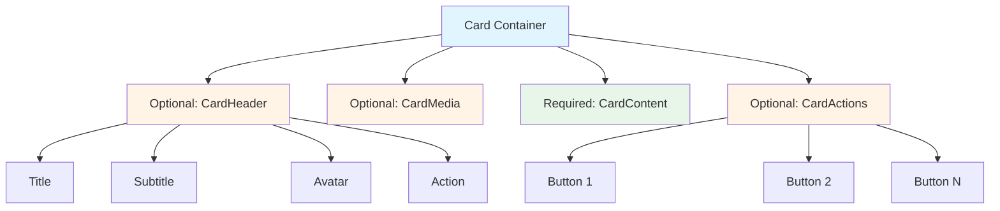

# Card Component Redesign Plan

> **Date**: 2026-02-10
> **Status**: Planning
> **Priority**: High

## Problem Statement

Based on the screenshot provided, the current Card component has several issues:

1. **Header buttons have solid background**: The control buttons (extra actions) in the card header display an unwanted solid background color instead of being transparent
2. **Missing CardActions component**: There's no dedicated footer component for action buttons (similar to MUI's CardActions)
3. **Layout doesn't follow Material UI patterns**: Current layout structure doesn't match the clean, modular approach of Material UI

## Research: Material UI Card Design

### MUI Card Architecture

From Material UI documentation, a proper Card component should have these sub-components:

```
Card (container)
├── CardHeader (optional)
│   ├── title
│   ├── subtitle
│   └── action (buttons/icons)
├── CardMedia (optional - for images/videos)
├── CardContent (main content)
└── CardActions (footer with buttons)
```

### Key Design Principles

1. **CardHeader**:
   - Contains title, subtitle, and action area
   - Action buttons should be **transparent** or ghost-style
   - No solid backgrounds on header actions
   - Spacing: 16px padding

2. **CardActions**:
   - Located at the bottom of the card
   - Contains action buttons
   - Has `disableSpacing` prop to control margins
   - Buttons are spaced by default (8px margin)
   - **No solid background** - transparent

3. **CardContent**:
   - Main content area
   - Last element takes remaining space
   - Typography styling included

4. **Layout Behavior**:
   - Card uses `display: flex; flex-direction: column`
   - CardActions should stick to bottom when content is short
   - CardContent should use `flex: 1` to push footer down

## Architecture Design: Composition over Flat Enums

### Why Composition-Based Design?

Instead of adding variants to a flat `CardClass` enum (e.g., `CardDraggable`, `CardCollapsible`), we use **composition** with independent sub-components.



### Comparison: Flat Enum vs Composition

#### ❌ Flat Enum Approach (Not Recommended)

```rust
// Adding everything to one enum
pub enum CardClass {
    Card,
    CardHoverable,
    CardBordered,
    CardDraggable,      // ❌ Adding feature here
    CardCollapsible,    // ❌ Adding feature here
    CardWithAvatar,     // ❌ Adding feature here
    CardWithMedia,      // ❌ Adding feature here
    // ... explodes exponentially
}
```

**Problems**:
- Enum becomes bloated with feature combinations
- Tight coupling between unrelated features
- Hard to extend (drag, collapse, hover, etc.)
- Type system can't enforce valid combinations
- `CardDraggable` with `CardCollapsible`? How to represent?

#### ✅ Composition Approach (Recommended)

```rust
// Independent components that can be combined
Card {
    class: "hi-card-draggable",  // Optional feature

    CardHeader {
        avatar: Some(...),       // Optional sub-feature
        title: Some(...),
        action: Some(...)
    }

    CardMedia { ... }            // Optional component

    CardContent { ... }          // Core content

    CardActions { ... }          // Optional footer
}
```

**Benefits**:
- Each component has single responsibility
- Features are orthogonal (independent)
- Easy to mix and match
- Type-safe props per component
- Future-proof for new features (draggable, collapsible, etc.)

### Extensibility Examples

With composition, adding new features is straightforward:

```rust
// Example 1: Draggable Card
Draggable {
    can_drag: true,
    Card {
        CardHeader { title: Some("Drag me".to_string()) }
        CardContent { div { "I can be dragged!" } }
    }
}

// Example 2: Collapsible Card
Collapsible {
    expanded: true,
    Card {
        CardHeader { title: Some("Click to collapse".to_string()) }
        CardContent { div { "I can collapse!" } }
    }
}

// Example 3: Draggable AND Collapsible
Draggable {
    can_drag: true,
    Collapsible {
        expanded: true,
        Card {
            CardHeader { title: Some("Drag & Collapse".to_string()) }
            CardContent { div { "I have both features!" } }
        }
    }
}
```

### Key Design Principles

1. **Separation of Concerns**: Each component has one job

   - `CardHeader` = header layout
   - `CardContent` = content wrapper
   - `CardActions` = action buttons
   - `CardMedia` = media display

2. **Composability**: Components work independently or together

   - Use all of them for a full-featured card
   - Use only `CardContent` for minimal card
   - Mix and match as needed

3. **Extensibility**: New features don't break existing code

   - Add `Draggable` wrapper without touching `Card` internals
   - Add `Collapsible` wrapper independently
   - Features compose naturally

4. **Type Safety**: Each component has its own props

   - `CardHeader` has `title`, `subtitle`, `avatar`, `action`
   - `CardActions` has `disable_spacing`
   - Compiler catches prop mistakes at compile time

## Current Implementation Issues

### Issue 1: Solid Background on Header Actions

**Current SCSS** ([card.scss:60-95](packages/components/src/styles/components/card.scss)):
```scss
.hi-card-header {
  background: rgba(214, 236, 240, 0.5);  // ❌ Solid background
  // ...
}
```

**Problem**: This solid background makes header actions stand out incorrectly.

### Issue 2: Missing CardActions Component

The current implementation has CardClass enum entries but **no actual CardActions component**:

**Current CardClass** ([components.rs:956-990](packages/palette/src/classes/components.rs)):
```rust
pub enum CardClass {
    Card,
    CardHoverable,
    CardBordered,
    CardHeader,
    CardTitle,
    CardExtra,     // ❌ Used for actions, but no dedicated component
    CardBody,
    CardSpotlightWrapper,
}
```

**Missing**: CardFooter, CardActions classes

### Issue 3: Incorrect Layout Structure

**Current Rust code** ([card.rs:104-120](packages/components/src/basic/card.rs)):
```rust
// Header
div { class: "{CardClass::CardHeader.as_class()}",
    if let Some(title) = props.title {
        div { class: "{CardClass::CardTitle.as_class()}", "{title}" }
    }
    if let Some(extra) = props.extra {
        div { class: "{CardClass::CardExtra.as_class()}", { extra } }  // ❌ Wrong place for actions
    }
}
// Body
div { class: "{CardClass::CardBody.as_class()}",
    { props.children }
}
// ❌ No CardActions/footer component
```

## Proposed Solution

### Phase 1: Fix Header Actions Background (Quick Fix)

**File**: [packages/components/src/styles/components/card.scss](packages/components/src/styles/components/card.scss)

Remove the solid background from card header:

```scss
.hi-card-header {
  position: relative;
  z-index: 1;
  display: flex;
  align-items: center;
  justify-content: space-between;
  padding: 1rem 1.25rem;
  border-bottom: 1px solid var(--hi-color-border);
  background: transparent;  // ✅ Changed from rgba(214, 236, 240, 0.5)
}
```

Also update footer to match:

```scss
.hi-card-footer {
  position: relative;
  z-index: 1;
  display: flex;
  align-items: center;
  justify-content: space-between;
  padding: 1rem 1.25rem;
  border-top: 1px solid var(--hi-color-border);
  background: transparent;  // ✅ Changed from rgba(214, 236, 240, 0.5)
}
```

### Phase 2: Add CardActions Component

**File**: [packages/components/src/basic/card.rs](packages/components/src/basic/card.rs)

Add a new `CardActions` component:

```rust
#[derive(Clone, PartialEq, Props)]
pub struct CardActionsProps {
    #[props(default)]
    pub children: Element,

    #[props(default)]
    pub class: String,

    /// If true, disable the default spacing between buttons
    #[props(default)]
    pub disable_spacing: bool,
}

#[component]
pub fn CardActions(props: CardActionsProps) -> Element {
    let classes = ClassesBuilder::new()
        .add(CardClass::CardActions)
        .add_if(CardClass::CardActionsNoSpacing, || props.disable_spacing)
        .add_raw(&props.class)
        .build();

    rsx! {
        div { class: "{classes}", { props.children } }
    }
}
```

### Phase 3: Create Modular Sub-Components (Composition-Based Design)

**Design Philosophy**: Use composition over inheritance - create independent sub-components that can be selectively mounted

**File**: [packages/components/src/basic/card.rs](packages/components/src/basic/card.rs)

Create modular sub-components following Material UI's pattern:

```rust
// ============================================
// CardHeader - Optional header with title, subtitle, and actions
// ============================================

#[derive(Clone, PartialEq, Props)]
pub struct CardHeaderProps {
    #[props(default)]
    pub title: Option<String>,

    #[props(default)]
    pub subtitle: Option<String>,

    #[props(default)]
    pub avatar: Option<Element>,

    #[props(default)]
    pub action: Option<Element>,  // Right-aligned actions (icons, buttons)

    #[props(default)]
    pub class: String,
}

#[component]
pub fn CardHeader(props: CardHeaderProps) -> Element {
    let classes = ClassesBuilder::new()
        .add(CardClass::CardHeader)
        .add_raw(&props.class)
        .build();

    rsx! {
        div { class: "{classes}",
            // Left section: avatar + title/subtitle
            div {
                class: "hi-card-header-left",
                if let Some(avatar) = props.avatar {
                    div { class: "hi-card-header-avatar", { avatar } }
                }
                div {
                    if let Some(title) = props.title {
                        div { class: "{CardClass::CardTitle.as_class()}", "{title}" }
                    }
                    if let Some(subtitle) = props.subtitle {
                        div { class: "{CardClass::CardSubtitle.as_class()}", "{subtitle}" }
                    }
                }
            }
            // Right section: action buttons
            if let Some(action) = props.action {
                div { class: "hi-card-header-action", { action } }
            }
        }
    }
}

// ============================================
// CardContent - Main content area
// ============================================

#[derive(Clone, PartialEq, Props)]
pub struct CardContentProps {
    #[props(default)]
    pub children: Element,

    #[props(default)]
    pub class: String,
}

#[component]
pub fn CardContent(props: CardContentProps) -> Element {
    let classes = ClassesBuilder::new()
        .add(CardClass::CardBody)
        .add_raw(&props.class)
        .build();

    rsx! {
        div { class: "{classes}", { props.children } }
    }
}

// ============================================
// CardActions - Footer with action buttons
// ============================================

#[derive(Clone, PartialEq, Props)]
pub struct CardActionsProps {
    #[props(default)]
    pub children: Element,

    #[props(default)]
    pub class: String,

    /// If true, disable the default spacing between buttons
    #[props(default)]
    pub disable_spacing: bool,
}

#[component]
pub fn CardActions(props: CardActionsProps) -> Element {
    let classes = ClassesBuilder::new()
        .add(CardClass::CardActions)
        .add_if(CardClass::CardActionsNoSpacing, || props.disable_spacing)
        .add_raw(&props.class)
        .build();

    rsx! {
        div { class: "{classes}", { props.children } }
    }
}

// ============================================
// CardMedia - Optional media container (images/videos)
// ============================================

#[derive(Clone, PartialEq, Props)]
pub struct CardMediaProps {
    pub src: String,

    #[props(default)]
    pub alt: String,

    #[props(default)]
    pub height: Option<String>,  // e.g., "200px"

    #[props(default)]
    pub class: String,
}

#[component]
pub fn CardMedia(props: CardMediaProps) -> Element {
    let style = if let Some(height) = props.height {
        format!("height: {}", height)
    } else {
        String::new()
    };

    let classes = ClassesBuilder::new()
        .add(CardClass::CardMedia)
        .add_raw(&props.class)
        .build();

    rsx! {
        img {
            class: "{classes}",
            src: "{props.src}",
            alt: "{props.alt}",
            style: "{style}"
        }
    }
}
```

**Key Benefits of Composition Approach**:

1. **Selective Mounting**: Users choose which parts they need
2. **Flexible Ordering**: Components can be arranged in any order
3. **No Prop Drilling**: Each component manages its own props
4. **Type Safety**: Each component has strongly-typed props
5. **Better Separation of Concerns**: Clear boundaries between parts

### Phase 4: Update SCSS Styling

**File**: [packages/components/src/styles/components/card.scss](packages/components/src/styles/components/card.scss)

Add proper styling for modular sub-components:

```scss
// ============================================
// CardHeader Internal Layout
// ============================================

.hi-card-header {
  position: relative;
  z-index: 1;
  display: flex;
  align-items: center;
  justify-content: space-between;
  padding: 1rem 1.25rem;
  border-bottom: 1px solid var(--hi-color-border);
  background: transparent;  // ✅ Changed from rgba(214, 236, 240, 0.5)
}

// Left section (avatar + title/subtitle)
.hi-card-header-left {
  display: flex;
  align-items: center;
  gap: 0.75rem;
  flex: 1;
}

// Avatar container
.hi-card-header-avatar {
  flex-shrink: 0;
}

// Right section (action buttons)
.hi-card-header-action {
  display: flex;
  align-items: center;
  margin-left: auto;
  flex-shrink: 0;

  // Ensure action buttons are transparent
  button, .hi-icon-button {
    background: transparent;
  }
}

// ============================================
// CardMedia
// ============================================

.hi-card-media {
  width: 100%;
  object-fit: cover;
  border-bottom: 1px solid var(--hi-color-border);
  display: block;
}

// ============================================
// CardActions (MUI-style footer)
// ============================================

.hi-card-actions {
  display: flex;
  align-items: center;
  justify-content: flex-end;  // Actions aligned to right by default
  padding: 0.5rem 1rem;
  gap: 0.5rem;

  // No spacing variant
  &.hi-card-actions-no-spacing {
    gap: 0;
  }
}
```

### Phase 5: Update Component Export

**File**: [packages/components/src/lib.rs](packages/components/src/lib.rs)

Export all new modular sub-components:

```rust
pub use basic::card::{
    Card,
    CardHeader,    // ✅ New
    CardContent,   // ✅ New
    CardActions,   // ✅ New
    CardMedia,     // ✅ New
};
```

### Phase 6: Update Documentation and Examples

Update usage examples to show the new composition pattern:

```rust
// ✅ Pattern 1: Full card with all components
Card {
    CardHeader {
        title: Some("Card Title".to_string()),
        subtitle: Some("Optional subtitle".to_string()),
        action: Some(rsx! {
            IconButton {
                icon: LucideIcon::MoreVertical,
                size: 16,
                onPress: move |_| {}
            }
        })
    }

    CardMedia {
        src: "/images/card-cover.jpg".to_string(),
        alt: "Card cover".to_string(),
        height: Some("200px".to_string())
    }

    CardContent {
        div { "Card content goes here..." }
    }

    CardActions {
        Button { variant: ButtonVariant::Ghost, "Cancel" }
        Button { variant: ButtonVariant::Primary, "Confirm" }
    }
}

// ✅ Pattern 2: Minimal card - only content and actions
Card {
    CardContent {
        div { "Simple content" }
    }

    CardActions {
        Button { variant: ButtonVariant::Primary, "OK" }
    }
}

// ✅ Pattern 3: Card with custom header (no CardHeader component)
Card {
    div {
        class: "hi-card-header",
        div { class: "hi-card-title", "Custom Header" }
    }

    CardContent {
        div { "Content" }
    }
}

// ✅ Pattern 4: Legacy style (still works, backward compatible)
Card {
    title: Some("Legacy Card".to_string()),
    extra: Some(rsx! {
        Icon { icon: LucideIcon::Settings, size: 16 }
    }),
    div { "Old pattern still works" }
}
```

**Key Advantage**: **Flexible composition** - users can mix and match components as needed

## Implementation Checklist

- [ ] Phase 1: Remove solid background from header and footer
- [ ] Phase 2: Create modular sub-components (CardHeader, CardContent, CardActions, CardMedia)
- [ ] Phase 3: Add new CardClass variants (CardSubtitle, CardMedia, CardActions, etc.)
- [ ] Phase 4: Add SCSS styling for all sub-components
- [ ] Phase 5: Export all sub-components from lib.rs
- [ ] Phase 6: Update examples/website to demonstrate composition pattern
- [ ] Test: Verify header actions have transparent background
- [ ] Test: Verify CardHeader layout works (avatar + title + action)
- [ ] Test: Verify CardContent takes remaining space (flex: 1)
- [ ] Test: Verify CardActions sticks to bottom of card
- [ ] Test: Verify CardMedia displays correctly
- [ ] Test: Verify disable_spacing prop works correctly
- [ ] Documentation: Update component docs with composition pattern
- [ ] Examples: Show multiple usage patterns (minimal, full, custom)

## Design Decisions

### 1. Naming Convention

**Decision**: Use `CardActions` instead of `CardFooter`

**Reason**: Matches Material UI naming exactly, makes it familiar to MUI users. "Actions" is more descriptive than "Footer".

### 2. Background Transparency

**Decision**: Make header and footer backgrounds fully transparent

**Reason**:

- Matches Material UI's clean aesthetic
- Allows card background color to show through
- Better integration with Hikari's theme system

### 3. Button Spacing

**Decision**: Default to 8px gap between buttons, allow disable via prop

**Reason**:

- Matches MUI's `disableSpacing` prop behavior
- Provides sensible defaults while allowing customization
- Uses `gap` property for modern spacing

### 4. Content Flex Behavior

**Decision**: CardBody uses `flex: 1` to push CardActions to bottom

**Reason**:
- Ensures footer sticks to bottom even with short content
- Matches expected card layout behavior
- Prevents footer from "floating" in middle of card

## Alternative Approaches Considered

### Alternative 1: Use CardFooter Component

**Approach**: Create separate `CardFooter` component for general footer content

**Pros**: More flexible - can hold any content, not just actions

**Cons**: More complex API, doesn't match MUI pattern

**Decision**: Rejected - CardActions is more specific and matches MUI

### Alternative 2: Keep Using `extra` Prop for Actions

**Approach**: Continue using `extra` prop in header for all actions

**Pros**: Simpler API, fewer components

**Cons**:
- Semantically incorrect (header shouldn't contain footer actions)
- Doesn't stick to bottom
- Confusing API (actions in header?)

**Decision**: Rejected - `extra` should only contain header actions (icons, menus)

### Alternative 3: Inline Actions as Children

**Approach**: Put actions directly in children without wrapper

**Pros**: Most flexible API

**Cons**:
- No default spacing/styling
- User must manually stick to bottom
- Inconsistent layouts

**Decision**: Rejected - Wrapper component provides better UX

## Backward Compatibility

### Breaking Changes

**None** - This change is backward compatible:

1. Existing cards without CardActions continue to work
2. `extra` prop still works for header actions
3. Only adds new optional functionality

### Deprecation Notice

Consider deprecating the manual footer pattern:

```rust
// ❌ Old pattern (still works, but deprecated)
Card {
    title: Some("Title".to_string()),
    div { class: "hi-card-footer",
        // actions
    }
}

// ✅ New pattern (recommended)
Card {
    title: Some("Title".to_string()),
    // content
    CardActions {
        // actions
    }
}
```

## Testing Strategy

### Unit Tests

1. Test CardActions renders correctly
2. Test `disable_spacing` prop works
3. Test CardClass enum has all variants

### Integration Tests

1. Test card with title + content + actions
2. Test card with only content + actions
3. Test card with short content (actions stick to bottom)
4. Test card with long content (scrollable)

### Visual Regression Tests

1. Verify header has transparent background
2. Verify footer has transparent background
3. Verify button spacing in CardActions
4. Verify CardActions sticks to bottom

## Success Criteria

✅ Header actions have **transparent** background (no solid color)
✅ CardActions component exists and is exported
✅ CardActions sticks to bottom of card
✅ `disable_spacing` prop works correctly
✅ Documentation updated with new pattern
✅ Examples demonstrate new pattern
✅ No breaking changes to existing API

## References

- Material UI Card: https://mui.com/material-ui/react-card/
- Material UI CardActions API: https://mui.com/material-ui/api/card-actions/
- Material Design 3 Cards: https://m3.material.io/components/cards
- Current implementation: [packages/components/src/basic/card.rs](packages/components/src/basic/card.rs)
- Current styling: [packages/components/src/styles/components/card.scss](packages/components/src/styles/components/card.scss)

## Notes

- Hikari's design aesthetic (Arknights + FUI) should be maintained
- Chinese traditional colors should still be used via theme variables
- Glow effect should continue to work
- All changes should follow Hikari's component architecture patterns
