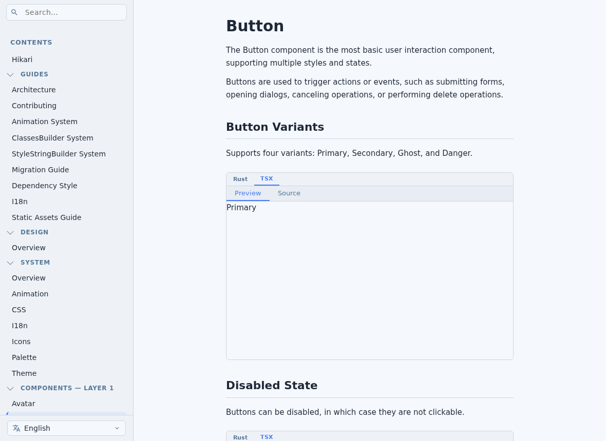
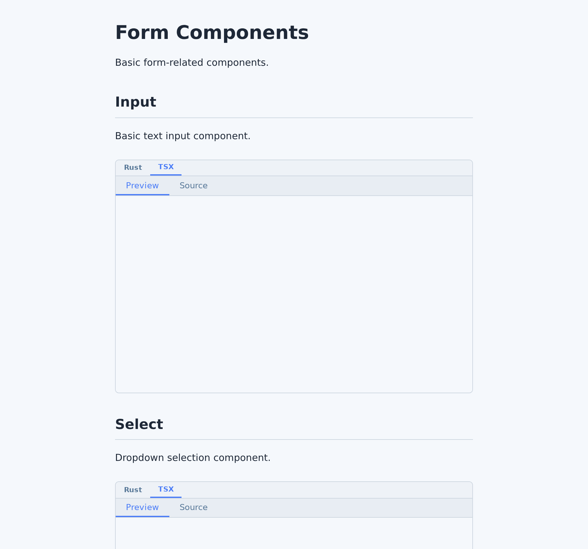

<div align="center"></div>
<h1 align="center">Hikari</h1>
<div align="center">
  <strong>
    The Frontend of Everything
  </strong>
</div>

<br />

<div align="center">
  <!-- CI status -->
  <a href="https://github.com/celestia-island/hikari/actions">
    
  </a>
  <!-- Built with tairitsu -->
  <a href="https://github.com/celestia-island/tairitsu">
    
  </a>
  <!-- License -->
  <a href="LICENSE">
    
  </a>
  <!-- Rust -->
  <a href="https://www.rust-lang.org/">
    
  </a>
  <!-- crates.io -->
  <a href="https://crates.io/crates/hikari-components">
    
  </a>
  <!-- docs.rs -->
  <a href="https://docs.rs/hikari-components">
    
  </a>
</div>

<div align="center">
  <h3>
    <a href="https://celestia.world">
      Website
    </a>
    <span> | </span>
    <a href="#quick-start">
      Quick Start
    </a>
    <span> | </span>
    <a href="docs/en/">
      Documentation
    </a>
    <span> | </span>
    <a href="docs/en/guides/ARCHITECTURE.md">
      Architecture
    </a>
  </h3>
</div>

<br/>

> A modern UI component library blending traditional Chinese aesthetics with futuristic sci-fi design

**Hikari** (光 - "Light") is a component library built on the [tairitsu](https://github.com/celestia-island/tairitsu) framework (`tairitsu-vdom`, `tairitsu-hooks`, `tairitsu-macros`, `tairitsu-style` ^0.5.18), sharing SCSS styles across a Rust/WASM implementation and a Vue 3 port. The design system draws from Arknights' clean aesthetics, FUI (Futuristic User Interface) elements, and a rich palette of traditional Chinese colors. The name "Hikari" comes from the rhythm game [Arcaea](https://arcaea.lowiro.com/).

## Vision

Hikari embodies three core design philosophies:

- **Arknights Flat Design** - Clean lines, clear information hierarchy, high contrast, and refined simplicity
- **FUI Sci-Fi Aesthetics** - Subtle glow effects, dynamic indicators, precise borders, and geometric patterns
- **Chinese Traditional Colors** - 500+ authentic historical colors for cultural depth and visual richness

The result is a UI framework that feels both ancient and futuristic, professional yet approachable, with a distinctive visual identity that stands out from conventional component libraries.

## Packages

| Package | Description |
| --- | --- |
| `hikari-palette` | 500+ traditional Chinese colors with rich metadata and type-safe constants |
| `hikari-theme` | Theme context/provider, CSS variables, built-in themes, SCSS mixins |
| `hikari-animation` | Animation engine (Tween, Motion, States) used by components |
| `hikari-components` | Core UI components: layout, buttons, inputs, table, tree, feedback, navigation |
| `hikari-extra-components` | Advanced components: node graph, collapsible, drag layer, zoom controls |
| `hikari-icons` | Icon set with compile-time discovery (auto-discovers used icons) |
| `hikari-builder` | Build-time ClassesBuilder system |
| `hikari-i18n` | Locale resources |
| `@celestia-island/hikari` | Vue 3 port (`packages/vue`), sharing the same SCSS design system |

The Rust crates are published to [crates.io](https://crates.io/search?q=hikari) (current 0.3.x) with docs on [docs.rs](https://docs.rs/hikari-components).

## Tech Stack

- **Framework**: [tairitsu](https://github.com/celestia-island/tairitsu) — tairitsu-vdom/hooks/macros/style ^0.5.18 (compiles to `wasm32` / WASI)
- **Styling**: SCSS compiled via `grass` + `scss!` compile-time stylesheets
- **Server**: Axum 0.8 (optional SSR support)
- **Language**: Rust 1.85 (edition 2024)
- **Web port**: Vue 3 (TypeScript, `packages/vue`, npm package `@celestia-island/hikari`)
- **Build System**: Justfile

## Quick Start

### Rust (tairitsu)

Add the crates to your `Cargo.toml`:

```toml
[dependencies]
tairitsu-vdom = "^0.5.18"
tairitsu-hooks = "^0.5.18"
tairitsu-macros = "^0.5.18"
hikari-palette = "^0.3"
hikari-theme = "^0.3"
hikari-animation = "^0.3"
hikari-icons = "^0.3"
hikari-i18n = "^0.3"
hikari-components = { version = "^0.3", features = ["basic", "feedback", "navigation", "layout", "data"] }
```

or with `cargo add`:

```bash
cargo add tairitsu-vdom@^0.5.18 tairitsu-hooks@^0.5.18 tairitsu-macros@^0.5.18
cargo add hikari-palette@^0.3 hikari-theme@^0.3 hikari-animation@^0.3 hikari-icons@^0.3 hikari-i18n@^0.3
cargo add hikari-components@^0.3
```

Component features are organized in groups — `basic`, `feedback`, `navigation`, `layout`, `data`, `display`, `entry`, `production` — each enabling a set of individual component features (e.g. `button`, `table`, `tree`, `toast`). The default feature set covers all groups.

Basic usage:

```rust
use tairitsu_macros::{component, rsx};
use tairitsu_vdom::VNode;
use hikari_theme::ThemeProvider;
use hikari_components::*;

#[component]
fn App() -> VNode {
    rsx! {
        ThemeProvider { initial_palette: "hikari".to_string(),
            div { class: "container",
                Button { variant: ButtonVariant::Primary, "Get Started" }
            }
        }
    }
}
```

> Note: `hikari-components` and the tairitsu crates are published on crates.io. Local development can point the tairitsu crates at working copies via `[patch.crates-io]` in `~/.cargo/config.toml`.

### Vue 3

The Vue port ships as `@celestia-island/hikari` (0.4.x, `packages/vue`). It is not yet published to the npm registry; consumers wire it up via a local link — this is what arona and shittim-chest use:

```json
// package.json
{
  "dependencies": {
    "@celestia-island/hikari": "link:../hikari/packages/vue"
  }
}
```

or, with pnpm workspaces, list the local package in `pnpm-workspace.yaml` and depend on it with `workspace:*`:

```yaml
packages:
  - 'packages/*'
  - '../hikari/packages/vue'
```

Once published to npm, installation will simply be `pnpm add @celestia-island/hikari`. Import the styles once in your app entry point, then use the `Hk*` components (HkButton, HkCard, HkInput, HkModal, ...) in your templates:

```ts
import "@celestia-island/hikari/styles";
```

### Theme initialization

Components consume the theme through CSS variables (`--color-*`, `--hi-*`). Call `initTheme()` once at app startup to inject the active preset (synthwave84 by default) with light/dark mode and custom-theme support:

```ts
import { initTheme } from "@celestia-island/hikari";

initTheme();
```

Components render correctly even without `initTheme()` — `packages/vue/src/tokens.scss` ships a static default light theme, and `initTheme()` overrides it at runtime via inline styles. For runtime theme/mode switching (e.g. a `HkThemeToggle`), use `useTheme()`:

```ts
import { useTheme } from "@celestia-island/hikari";

const { currentTheme, currentMode, setTheme, setMode, toggleMode } = useTheme();
```

## Documentation

The full documentation lives under `docs/` in 9 languages:

- [English](docs/en/) · [简体中文](docs/zh-Hans/) · [繁體中文](docs/zh-Hant/) · [日本語](docs/ja/) · [한국어](docs/ko/)
- [Español](docs/es/) · [Français](docs/fr/) · [Русский](docs/ru/) · [العربية](docs/ar/)

Live component pages from the docs (rendered by the hikari components
themselves):

<p align="center">
  
  
</p>

Key pages:

- [Architecture Overview](docs/en/guides/ARCHITECTURE.md)
- [Contributing Guidelines](docs/en/guides/CONTRIBUTING.md)
- [Design Overview](docs/en/design/overview.md)
- [System Overview](docs/en/system/overview.md)

Package-level docs:

- [hikari-palette](packages/palette/README.md)
- [hikari-theme](packages/theme/README.md)
- [hikari-animation](packages/animation/README.md)
- [hikari-components](packages/components/README.md)
- [hikari-extra-components](packages/extra-components/README.md)
- [hikari-icons](packages/icons/README.md)
- [hikari-vue (@celestia-island/hikari)](packages/vue/README.md)

## Development

### Prerequisites

- Rust 1.85+ (edition 2024)
- `just` (command runner) — `cargo install just`
- Node.js + pnpm (for the Vue port)

### Build Commands

```bash
# Build all packages (release)
just build

# Build for development
just build-dev

# Run tests
just test

# Format code
just fmt

# Run clippy lints
just clippy

# Start the development server
just dev
```

## Contributing

We welcome contributions! Please see the [Contributing guide](docs/en/guides/CONTRIBUTING.md) for guidelines.

## License

Hikari is licensed under the [Synthetic Source License (SySL), Version 1.0](./LICENSE).

## Acknowledgments

Inspired by and built upon:

- [Tairitsu](https://github.com/celestia-island/tairitsu) - The full-stack framework Hikari is built on
- [Arknights](https://www.arknights.global/) - Design language inspiration
- [ChineseColors](https://github.com/zhaoolee/ChineseColors) - Traditional color palette
- [akasha](https://github.com/TairitsuMC/akasha) - Node graph system reference

## Name

"Hikari" (光) means "light" in Japanese, representing:

- Illumination through knowledge and culture
- The fusion of tradition (ancient wisdom) and technology (future innovation)
- Bringing clarity and beauty to user interfaces

Let Hikari illuminate your applications with the perfect blend of tradition and technology.
