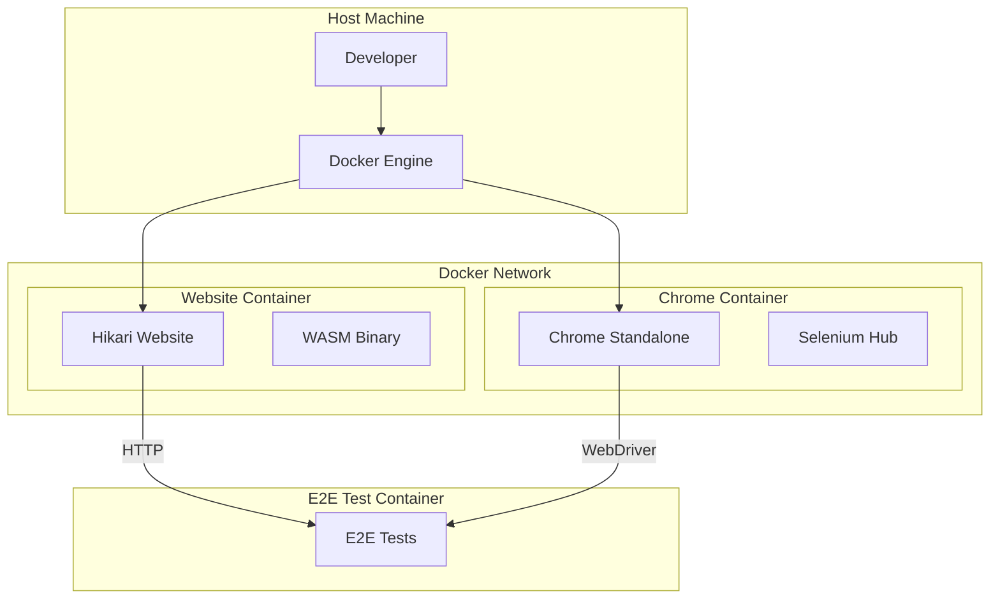

# Docker Setup for Hikari E2E Testing

This directory contains Docker configurations for running Hikari E2E tests with Chrome browser.

## Prerequisites

- Docker (version 20.10 or later)
- Docker Compose (version 2.0 or later)

## Quick Start

### Start Testing Environment

```bash
cd /mnt/sdb1/hikari

# Build and start all services
docker-compose up --build

# Or build and start in detached mode
docker-compose up --build -d

# View logs
docker-compose logs -f
```

### Run E2E Tests

```bash
# In a new terminal, run E2E tests
cd /mnt/sdb1/hikari/packages/e2e

# Set Chrome remote address
export CHROME_REMOTE_ADDRESS=chrome:4444

# Run E2E tests
cargo run --bin e2e
```

### Stop Services

```bash
# Stop all services
docker-compose down

# Stop and remove volumes
docker-compose down -v
```

## Services

### Website (hikari-website)
- **Port**: 3000
- **Purpose**: Runs the Hikari website example with SSR server
- **Build**: Built from `docker/website.Dockerfile`
- **Access**: http://localhost:3000

### Chrome (hikari-chrome)
- **Ports**: 4444, 5900
- **Purpose**: Selenium Chrome standalone server for E2E testing
- **Image**: `selenium/standalone-chrome:latest`
- **Selenium Hub**: http://localhost:4444/wd/hub
- **VNC** (for debugging): http://localhost:5900 (password: secret)

## Troubleshooting

### Chrome fails to start
```bash
# Increase shared memory
docker-compose down
docker-compose up --build
```

### Website not accessible
```bash
# Check if service is running
docker-compose ps

# View website logs
docker-compose logs website
```

### E2E tests cannot connect to Chrome
```bash
# Check Chrome logs
docker-compose logs chrome

# Verify Chrome is accessible
curl http://localhost:4444/wd/hub/status
```

### Port 3000 already in use
```bash
# Stop existing service
lsof -ti:3000 | xargs kill -9

# Or change port in docker-compose.yml
ports:
  - "3001:3000"
```

## Development

### Rebuild specific service
```bash
docker-compose up --build website
```

### Access container shell
```bash
docker-compose exec website bash
docker-compose exec chrome bash
```

### View container processes
```bash
docker-compose top
```

### Inspect container resources
```bash
docker stats
```

## Architecture



## Performance Tips

1. **Build once, run many times**:
   ```bash
   docker-compose build
   docker-compose up -d
   docker-compose down
   docker-compose up -d
   ```

2. **Use cache for builds**:
   - Add `CACHEBUST=$(date +%s)` environment variable
   - Mount `~/.cargo/registry` as volume

3. **Parallel builds**:
   ```bash
   docker-compose build --parallel
   ```

## Security Notes

- Chrome container runs as root (selenium image default)
- Website runs as root (rust image default)
- No persistent volumes mounted
- Network isolation via bridge network

For production, consider:
- Using non-root users
- Mounting persistent volumes
- Using secrets management
- Network policies
