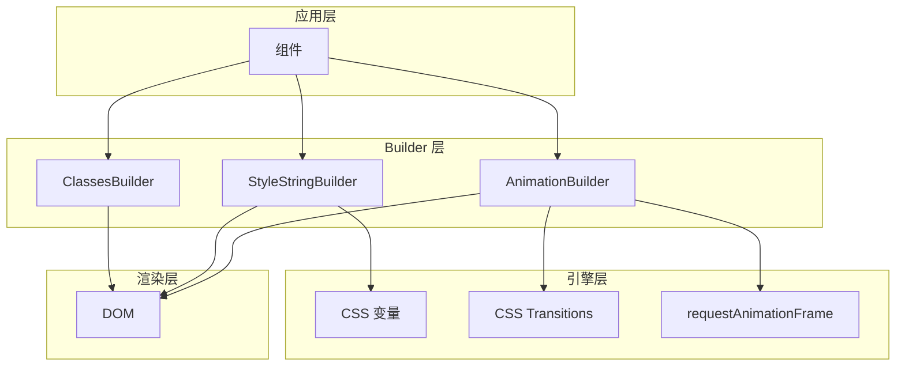
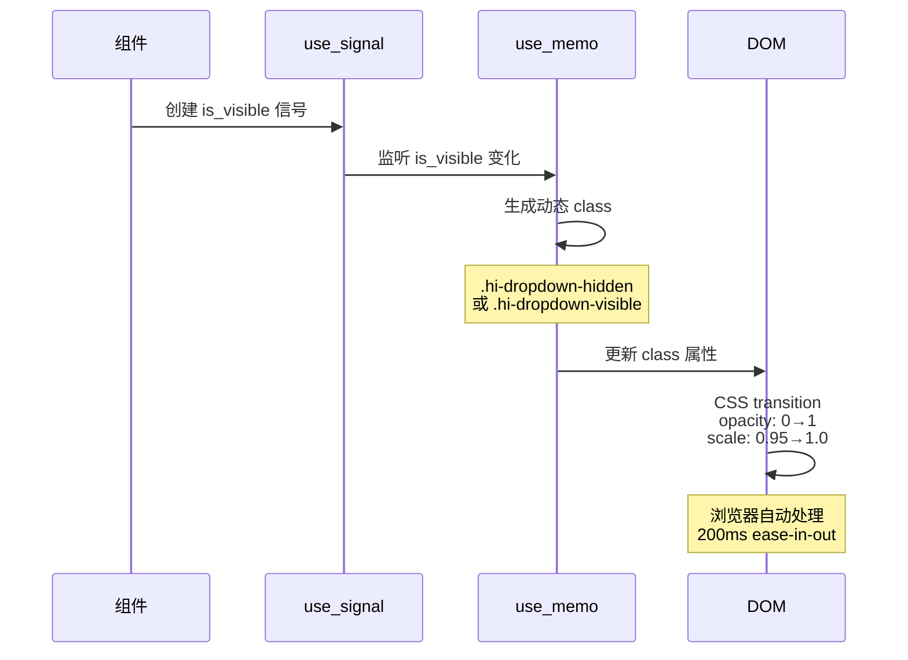
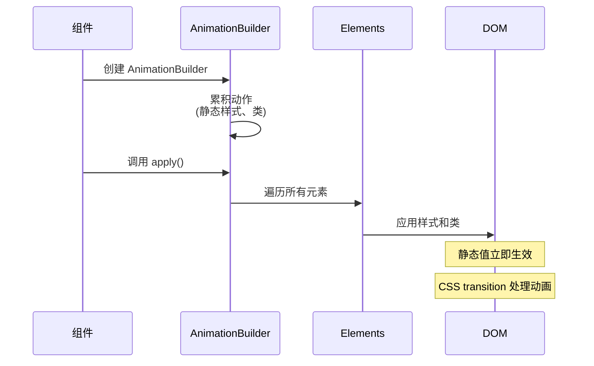
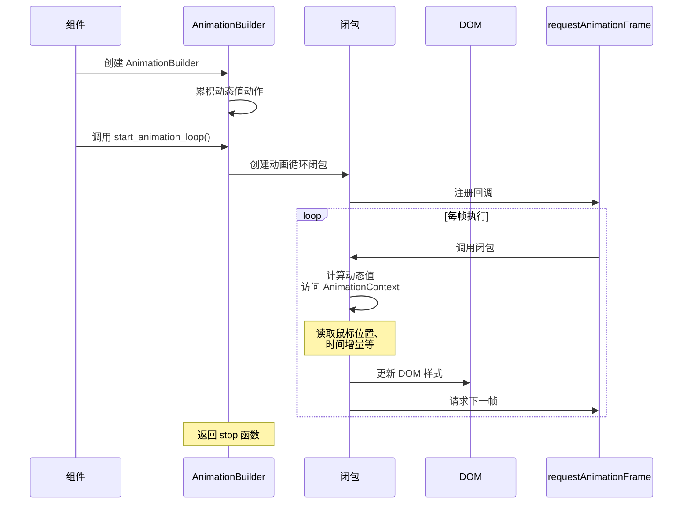
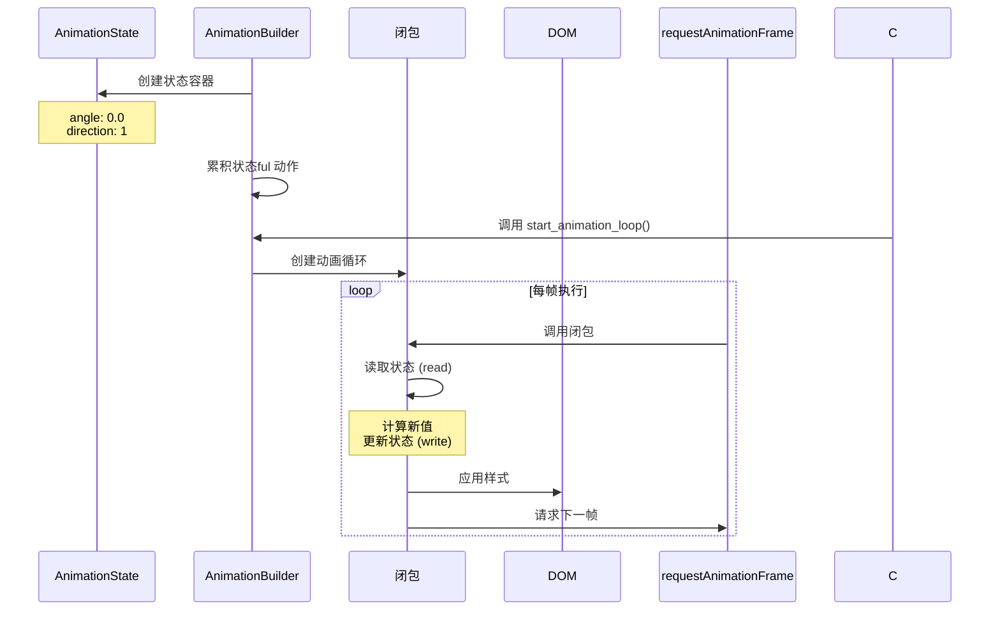
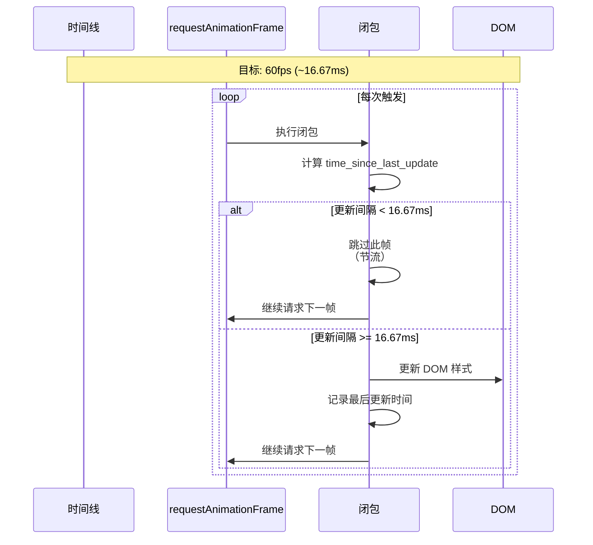
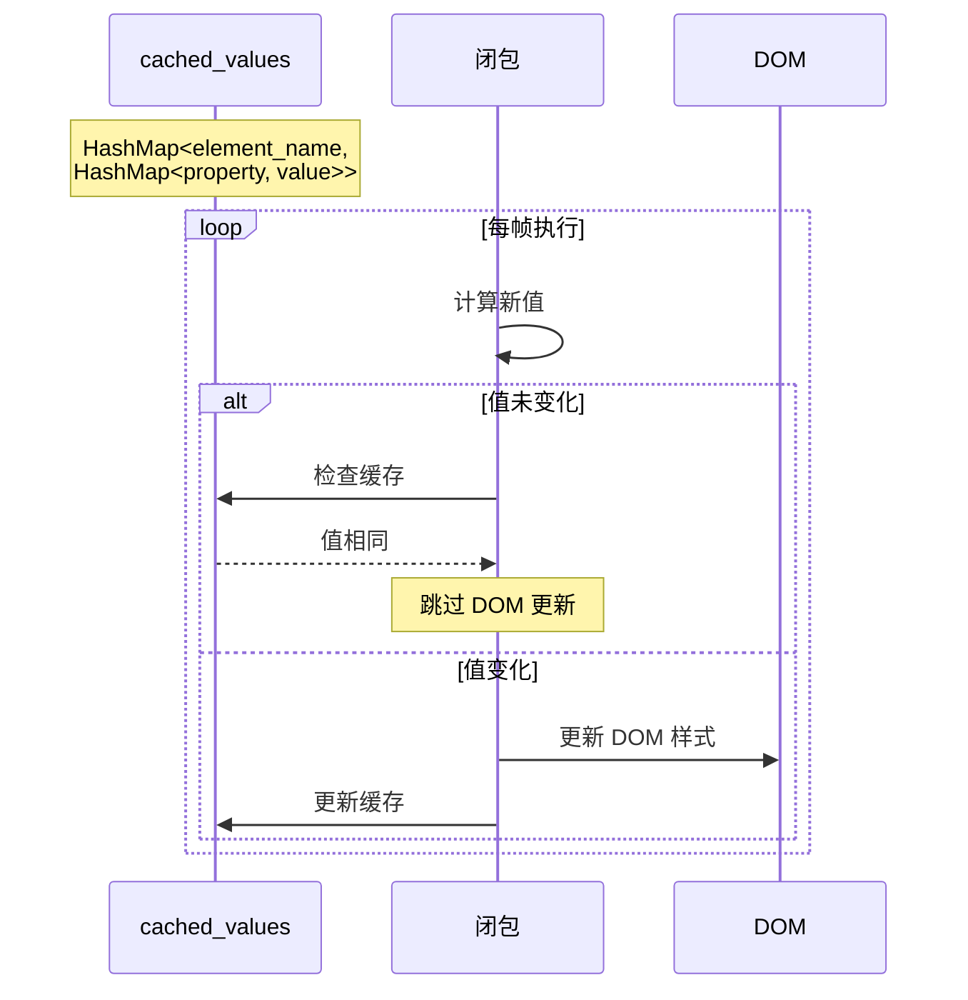
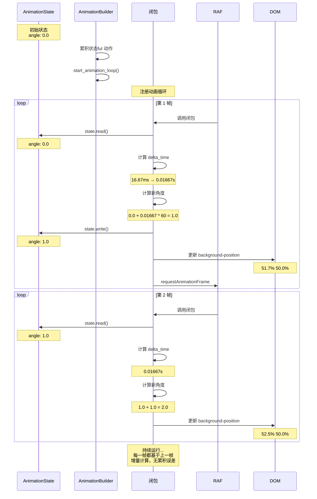

# 01-动画系统架构：三大 Builder 联动机制

## 目录

- [概述](#概述)
- [设计理念](#设计理念)
- [核心组件](#核心组件)
- [联动工作机制](#联动工作机制)
- [完整工作流程](#完整工作流程)
- [性能优化](#性能优化)
- [使用示例](#使用示例)

## 概述

Hikari 动画系统采用了**三大 Builder 联动架构**，实现了类似 GSAP 的精细动画控制能力。这个架构将动画的三个维度分离：

1. **ClassesBuilder** - 布局和间距的工具类
2. **StyleStringBuilder** - 动态样式的内联样式
3. **AnimationBuilder** - 时间轴和状态机的高级控制

这三个组件各司其职，通过精心设计的接口协同工作，实现了从简单过渡到复杂状态机的全覆盖。

## 设计理念

### 三层分离架构



### 职责分离

| Builder | 主要职责 | 输出 | 使用场景 |
|---------|-----------|------|----------|
| **ClassesBuilder** | 静态工具类 | 类名字符串 | 布局、间距、显示控制 |
| **StyleStringBuilder** | 动态 CSS 样式 | 内联样式字符串 | 覆盖全局样式、动态计算的值 |
| **AnimationBuilder** | 时间轴和状态机 | 动画闭包/状态更新 | 淡入淡出、缩放、鼠标跟随 |

## 核心组件

### 1. ClassesBuilder - 工具类生成器

**作用**：生成类型安全的工具类名称（如 `hi-flex`, `hi-p-4`）

**特点**：
- 编译时类型检查
- 枚举驱动防止拼写错误
- SCSS 预定义类映射

**API**：
```rust
use hikari_palette::classes::{ClassesBuilder, Display, Flex, Gap};

let classes = ClassesBuilder::new()
    .add(Display::Flex)           // .hi-flex
    .add(Flex::FlexCol)          // .hi-flex-col
    .add(Gap::Gap4)             // .hi-gap-4
    .build();

// 输出: "hi-flex hi-flex-col hi-gap-4"
```

### 2. StyleStringBuilder - 动态样式构建器

**作用**：生成类型安全的内联样式（支持 CSS 变量）

**特点**：
- 类型安全的 CSS 属性（`CssProperty` 枚举）
- 像素值自动转换（`add_px`）
- CSS 变量支持
- 紧凑输出（`build_clean`）

**API**：
```rust
use hikari_animation::style::{StyleStringBuilder, CssProperty};

let style = StyleStringBuilder::new()
    .add(CssProperty::Opacity, "var(--hi-dropdown-opacity)")
    .add(CssProperty::Transform, "scale(var(--hi-dropdown-scale))")
    .add(CssProperty::TransformOrigin, "top center")
    .build_clean();

// 输出: "opacity:var(--hi-dropdown-opacity);transform:scale(var(--hi-dropdown-scale));transform-origin:top center"
```

### 3. AnimationBuilder - 高级动画构建器

**作用**：声明式动画构建，支持动态值、状态机、时间轴

**特点**：
- 多元素同时控制
- 动态值运行时计算
- 状态机模式
- requestAnimationFrame 循环
- 防抖和节流优化

**API**：
```rust
use hikari_animation::{AnimationBuilder, AnimationContext};
use hikari_animation::style::CssProperty;

// 静态样式
AnimationBuilder::new(&elements)
    .add_style("button", CssProperty::Opacity, "0.8")
    .apply_with_transition("300ms", "ease-in-out");

// 动态值（鼠标跟随）
AnimationBuilder::new(&elements)
    .add_style_dynamic("button", CssProperty::Transform, |ctx| {
        let x = ctx.mouse_x();
        let y = ctx.mouse_y();
        format!("translate({}px, {}px)", x, y)
    })
    .start_animation_loop();
```

## 联动工作机制

### 机制一：CSS 变量驱动动画

**原理**：通过切换 class 改变 CSS 变量值，CSS transition 自动处理过渡



**实现示例**：

```scss
// dropdown.scss
.hi-dropdown-hidden {
  --hi-dropdown-opacity: 0;
  --hi-dropdown-scale: 0.95;
}

.hi-dropdown-visible {
  --hi-dropdown-opacity: 1;
  --hi-dropdown-scale: 1.0;
}
```

```rust
// mod.rs
let dropdown_classes = use_memo(move || {
    let base = ClassesBuilder::new()
        .add(DropdownClass::Dropdown)
        .build();

    if *is_visible.read() {
        format!("{} hi-dropdown-visible", base)
    } else {
        format!("{} hi-dropdown-hidden", base)
    }
});

let content_style = StyleStringBuilder::new()
    .add(CssProperty::Opacity, "var(--hi-dropdown-opacity)")
    .add(CssProperty::Transform, "scale(var(--hi-dropdown-scale))")
    .build_clean();
```

### 机制二：AnimationBuilder 的三种模式

#### 模式 A：静态动画（一次性）



**代码示例**：
```rust
AnimationBuilder::new(&elements)
    .add_style("overlay", CssProperty::Opacity, "0.5")
    .add_style("content", CssProperty::Opacity, "0")
    .add_style("content", CssProperty::Transform, "scale(0.95)")
    .add_class("overlay", "hi-overlay-dimmed")
    .apply_with_transition("200ms", "ease-in-out");
```

#### 模式 B：动态值（每帧计算）



**代码示例**：
```rust
AnimationBuilder::new(&elements)
    .add_style_dynamic("button", CssProperty::Transform, |ctx| {
        let x = ctx.mouse_x();
        let y = ctx.mouse_y();
        format!("translate({}px, {}px)", x, y)
    })
    .add_style_dynamic("glow", CssProperty::BoxShadow, |ctx| {
        let time = ctx.elapsed_ms() / 1000.0;
        let hue = (time * 60.0) % 360.0;
        format!("0 0 12px hsla({}, 70%, 50%, 0.5)", hue)
    })
    .start_animation_loop();
```

#### 模式 C：状态机（带状态变量）



**代码示例**：
```rust
let mut state = AnimationState::new();
state.set_f64("angle", 0.0);
state.set_i32("direction", 1);

AnimationBuilder::new_with_state(&elements, state)
    .add_stateful_style("background", CssProperty::BackgroundPosition, |ctx, state| {
        // 更新角度
        let delta = ctx.delta_seconds() * 60.0;
        state.add_f64("angle", delta);

        // 读取角度并计算位置
        let angle = state.get_f64("angle", 0.0);
        let x = 50.0 + 10.0 * angle.cos();
        let y = 50.0 + 10.0 * angle.sin();

        format!("{:.1}% {:.1}%", x, y)
    })
    .start_animation_loop();
```

### 机制三：防抖和节流优化



**性能优化实现**：
```rust
const THROTTLE_MS: f64 = 16.67; // ~60fps

let animation_closure = Closure::wrap(Box::new(move || {
    let current_time = window.performance().map(|p| p.now()).unwrap_or(0.0);
    let time_since_last_update = current_time - previous_time;

    // 节流：只在足够时间过去后才更新
    if time_since_last_update < THROTTLE_MS {
        // 跳过此帧
        return;
    }

    // 更新 DOM
    update_dom_styles();

    // 记录时间
    previous_time = current_time;
}));

window.request_animation_frame(&animation_closure)?;
```

### 机制四：值缓存避免不必要的 DOM 更新



**实现示例**：
```rust
let cached_values: Rc<RefCell<HashMap<String, HashMap<CssProperty, String>>>> =
    Rc::new(RefCell::new(HashMap::new()));

// 在动画循环中
let new_value = compute_value(&ctx, &mut state);
let element_cache = cached_values.borrow();
let cached = element_cache.get(element_name)?.get(property);

if cached.as_ref() != Some(&new_value) {
    // 值确实变化了，才更新 DOM
    element.style().set_property(property.as_str(), &new_value);
    element_cache.borrow_mut()
        .entry(element_name.to_string())
        .or_insert_with(HashMap::new)
        .insert(property, new_value);
}
```

## 完整工作流程

### 场景：Dropdown 淡入动画

```mermaid
sequenceDiagram
    participant U as 用户
    participant C as 组件
    participant S as 信号系统
    participant M as use_memo
    participant D as DOM
    participant B as CSS 引擎

    U->>C: 触发 Dropdown 打开
    C->>S: is_visible.set(false)
    Note over S: 初始状态

    C->>D: 渲染元素
    Note over D: class="hi-dropdown hi-dropdown-hidden"<br/>style="opacity:var(--hi-dropdown-opacity);..."

    D->>B: 应用 CSS 规则
    Note over B: .hi-dropdown-hidden {<br/>  --hi-dropdown-opacity: 0;<br/>  --hi-dropdown-scale: 0.95;<br/>}

    C->>C: use_effect 执行
    C->>C: requestAnimationFrame 注册

    Note over D: 第 1 帧
    D->>S: 回调触发
    S->>S: is_visible.set(true)
    Note over S: 状态更新

    S->>M: 通知 use_memo
    M->>M: 重新计算 class
    Note over M: is_visible=true<br/>→ .hi-dropdown-visible

    M->>D: 更新 class 属性
    D->>D: class="hi-dropdown hi-dropdown-visible"

    D->>B: CSS 变量值变化
    Note over B: .hi-dropdown-visible {<br/>  --hi-dropdown-opacity: 1;<br/>  --hi-dropdown-scale: 1.0;<br/>}

    B->>B: CSS transition 处理
    Note over B: opacity: 0 → 1<br/>scale: 0.95 → 1.0<br/>duration: 200ms<br/>easing: ease-in-out

    Note over D: 第 2-N 帧
    B-->>U: 动画完成
```

### 场景：复杂状态机动画（旋转背景）



## 性能优化

### 1. 节流（Throttling）

**原理**：限制更新频率，避免不必要的 DOM 操作

```
目标帧率：60fps
最小间隔：16.67ms
实际更新：只有当 time_since_last_update >= 16.67ms 时才更新
```

**效果**：
- 减少重绘（reflows）
- 降低 CPU 使用率
- 保持流畅视觉体验

### 2. 值缓存（Value Caching）

**原理**：比较新旧值，只在值变化时更新 DOM

```
每帧计算 → 检查缓存 → 值不同？ → 更新 DOM → 更新缓存
                               ↓ 值相同
                               跳过
```

**效果**：
- 避免冗余 DOM 操作
- 减少浏览器重排
- 提升动画性能

### 3. CSS 变量（CSS Variables）

**原理**：通过切换 class 改变 CSS 变量，利用浏览器 CSS 引擎

```
.hi-dropdown-hidden → --hi-dropdown-opacity: 0
.hi-dropdown-visible → --hi-dropdown-opacity: 1
```

**效果**：
- CSS transition 由 GPU 加速
- 无需 JavaScript 动画循环
- 极小的性能开销

## 使用示例

### 示例 1：淡入淡出（CSS 变量模式）

```rust
let is_visible = use_signal(|| false);

use_effect(move || {
    if *is_visible.read() {
        let _ = web_sys::window()
            .unwrap()
            .request_animation_frame(Closure::once_into_js(move || {
                // 下一帧开始动画
            }));
    }
});

let classes = use_memo(move || {
    format!("hi-dropdown {}", if *is_visible.read() {
        "hi-dropdown-visible"
    } else {
        "hi-dropdown-hidden"
    }
});

let style = StyleStringBuilder::new()
    .add(CssProperty::Opacity, "var(--hi-dropdown-opacity)")
    .add(CssProperty::Transform, "scale(var(--hi-dropdown-scale))")
    .build_clean();
```

```scss
.hi-dropdown-hidden {
  --hi-dropdown-opacity: 0;
  --hi-dropdown-scale: 0.95;
}

.hi-dropdown-visible {
  --hi-dropdown-opacity: 1;
  --hi-dropdown-scale: 1.0;
}
```

### 示例 2：鼠标跟随（动态值模式）

```rust
let mut elements = HashMap::new();
elements.insert("button", button_element);

AnimationBuilder::new(&elements)
    .add_style_dynamic("button", CssProperty::Transform, |ctx| {
        let x = ctx.mouse_x();
        let y = ctx.mouse_y();
        format!("translate({}px, {}px)", x, y)
    })
    .start_animation_loop();
```

### 示例 3：旋转渐变（状态机模式）

```rust
let mut state = AnimationState::new();
state.set_f64("angle", 0.0);

AnimationBuilder::new_with_state(&elements, state)
    .add_stateful_style("background", CssProperty::BackgroundPosition, |ctx, state| {
        let delta = ctx.delta_seconds() * 60.0; // 每秒 60 度
        state.add_f64("angle", delta);

        let angle = state.get_f64("angle", 0.0);
        let x = 50.0 + 10.0 * angle.cos();
        let y = 50.0 + 10.0 * angle.sin();

        format!("{:.1}% {:.1}%", x, y)
    })
    .start_animation_loop();
```

### 示例 4：组合使用

```rust
// 1. ClassesBuilder 生成基础布局
let base_classes = ClassesBuilder::new()
    .add(Display::Flex)
    .add(Flex::FlexCol)
    .add(Gap::Gap4)
    .build();

// 2. StyleStringBuilder 添加动态样式
let style = StyleStringBuilder::new()
    .add(CssProperty::Opacity, "var(--hi-dropdown-opacity)")
    .add(CssProperty::Transform, "scale(var(--hi-dropdown-scale))")
    .build_clean();

// 3. use_memo 动态切换 class
let full_classes = use_memo(move || {
    format!("{} {}", base_classes, if *is_visible.read() {
        "hi-dropdown-visible"
    } else {
        "hi-dropdown-hidden"
    })
});

// 4. 渲染
rsx! {
    div {
        class: "{full_classes}",
        style: "{style}",
        "内容"
    }
}
```

## 总结

Hikari 动画系统的三大 Builder 联动机制实现了：

1. **职责分离**：每个 Builder 负责特定领域
2. **类型安全**：编译时检查，运行时零开销
3. **性能优化**：节流、缓存、CSS 变量
4. **灵活性**：从简单过渡到复杂状态机全覆盖

这套架构既保持了代码的简洁性，又提供了 GSAP 级别的精细控制能力，是现代前端动画的优雅解决方案。
