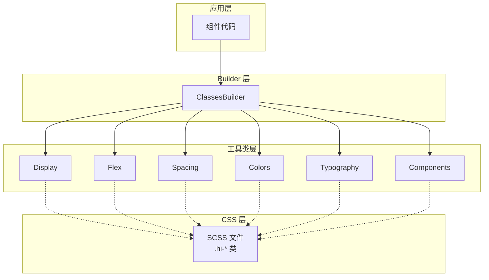
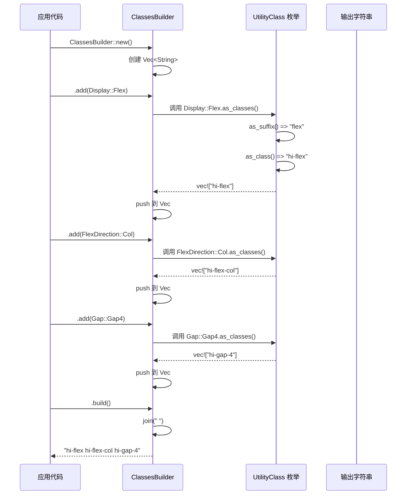

# 02-ClassesBuilder：类型安全的工具类系统

## 目录

- [概述](#概述)
- [设计理念](#设计理念)
- [核心架构](#核心架构)
- [工作机制](#工作机制)
- [扩展机制](#扩展机制)
- [性能优化](#性能优化)
- [使用示例](#使用示例)

## 概述

ClassesBuilder 是 Hikari 的工具类生成器，提供了类型安全的 CSS 类名构建方式。它通过枚举驱动的工具类系统，完全替换了传统的字符串拼接方式，实现了编译时类型检查和运行时零开销。

## 设计理念

### 核心原则

1. **类型安全** - 编译时检查类名拼写
2. **零运行时开销** - 纯编译时生成
3. **IDE 友好** - 自动补全和跳转
4. **可扩展性** - 模块化组织

### 架构层次



## 核心架构

### 1. UtilityClass Trait

**定义位置**：`packages/palette/src/classes/mod.rs`

```rust
pub trait UtilityClass {
    /// 获取 CSS 类名后缀（不含 hi- 前缀）
    fn as_suffix(&self) -> &'static str;

    /// 获取完整 CSS 类名（含 hi- 前缀）
    fn as_class(&self) -> String {
        format!("hi-{}", self.as_suffix())
    }

    /// 获取多个类名（用于复合工具类）
    fn as_classes(&self) -> Vec<String> {
        vec![self.as_class()]
    }
}
```

**职责**：
- 定义所有工具类的统一接口
- 自动添加 `hi-` 前缀
- 支持复合类名（返回多个类）

### 2. ClassesBuilder 结构

```rust
pub struct ClassesBuilder {
    classes: Vec<String>,
}
```

**核心方法**：

| 方法 | 职责 | 返回值 |
|------|------|--------|
| `new()` | 创建 builder | `ClassesBuilder` |
| `add(class)` | 添加单个工具类 | `ClassesBuilder` |
| `add_all(classes)` | 批量添加工具类 | `ClassesBuilder` |
| `add_raw(class)` | 添加原始类名（无 hi- 前缀） | `ClassesBuilder` |
| `add_if(class, condition)` | 条件添加 | `ClassesBuilder` |
| `build()` | 构建最终类名字符串 | `String` |
| `as_slice()` | 获取类名数组 | `&[String]` |

### 3. 工具类分类

#### 布局工具类（Display）

```rust
pub enum Display {
    Block,
    Inline,
    InlineBlock,
    Flex,
    InlineFlex,
    Grid,
    InlineGrid,
    None,
    Hidden,
}

// 输出示例：
// Display::Flex => "hi-flex"
// Display::None => "hi-none"
```

#### 弹性布局工具类（Flex）

```rust
pub enum FlexDirection {
    Row,
    RowReverse,
    Col,
    ColReverse,
}

pub enum FlexWrap {
    NoWrap,
    Wrap,
    WrapReverse,
}

pub enum AlignItems {
    Start,
    End,
    Center,
    Stretch,
    Baseline,
}

// 输出示例：
// FlexDirection::Col => "hi-flex-col"
// AlignItems::Center => "hi-items-center"
```

#### 间距工具类（Spacing）

```rust
pub enum Padding {
    P0,
    P1,
    P2,
    P4,
    P6,
    P8,
}

pub enum Margin {
    M0,
    M1,
    M2,
    M4,
    M6,
    M8,
}

// 输出示例：
// Padding::P4 => "hi-p-4"
// Margin::M2 => "hi-m-2"
```

#### 尺寸工具类（Sizing）

```rust
pub enum Width {
    Full,
    Half,
    Auto,
    Screen,
}

pub enum Height {
    Full,
    Half,
    Auto,
    Screen,
}

// 输出示例：
// Width::Full => "hi-w-full"
// Height::Auto => "hi-h-auto"
```

#### 组件工具类（Components）

```rust
pub enum Button {
    Button,
    ButtonPrimary,
    ButtonSecondary,
    ButtonDanger,
}

pub enum Card {
    Card,
    CardHoverable,
}

// 输出示例：
// Button::ButtonPrimary => "hi-button-primary"
// Card::Card => "hi-card"
```

## 工作机制

### 构建流程



### 类型检查机制

**编译时检查**：

```rust
// ❌ 编译错误：拼写错误
let classes = ClassesBuilder::new()
    .add(Display::Flx)  // Display 没有 Flx 变体
    .build();

// ✅ 编译通过：IDE 自动补全
let classes = ClassesBuilder::new()
    .add(Display::Flex)  // IDE 会提示 Flex 变体
    .build();
```

### 条件添加机制

```rust
let is_active = true;
let is_disabled = false;

let classes = ClassesBuilder::new()
    .add(Display::Flex)
    .add_if(FlexDirection::Row, || is_active)
    .add_if(Button::ButtonDisabled, || is_disabled)
    .add(Button::Button)
    .build();

// 输出: "hi-flex hi-flex-row hi-button"
// (跳过 hi-flex-row 如果 is_active=false)
// (跳过 hi-button-disabled 如果 is_disabled=false)
```

## 扩展机制

### 添加新工具类

#### 步骤 1：创建枚举

在 `packages/palette/src/classes/` 对应模块中添加：

```rust
// packages/palette/src/classes/layout.rs
pub enum Overflow {
    Auto,
    Hidden,
    Visible,
    Scroll,
}

impl UtilityClass for Overflow {
    fn as_suffix(&self) -> &'static str {
        match self {
            Overflow::Auto => "overflow-auto",
            Overflow::Hidden => "overflow-hidden",
            Overflow::Visible => "overflow-visible",
            Overflow::Scroll => "overflow-scroll",
        }
    }
}
```

#### 步骤 2：添加到 mod.rs

```rust
// packages/palette/src/classes/mod.rs
pub mod layout;

pub use layout::{Overflow, /* ... */};
```

#### 步骤 3：添加 SCSS 类

```scss
// packages/components/src/styles/utilities/overflow.scss
.hi-overflow-auto {
  overflow: auto;
}

.hi-overflow-hidden {
  overflow: hidden;
}

.hi-overflow-visible {
  overflow: visible;
}

.hi-overflow-scroll {
  overflow: scroll;
}
```

#### 步骤 4：使用新工具类

```rust
use hikari_palette::classes::{ClassesBuilder, Overflow};

let classes = ClassesBuilder::new()
    .add(Overflow::Hidden)
    .build();
// 输出: "hi-overflow-hidden"
```

### 复合工具类

某些工具类需要生成多个 CSS 类：

```rust
pub enum Responsive {
    Sm,  // Small screens
    Md,  // Medium screens
    Lg,  // Large screens
}

impl UtilityClass for Responsive {
    fn as_suffix(&self) -> &'static str {
        // as_suffix 不使用，返回默认值
        "responsive"
    }

    fn as_classes(&self) -> Vec<String> {
        match self {
            Responsive::Sm => vec![
                "hi-responsive-sm".to_string(),
                "hi-sm-hidden".to_string(),
            ],
            Responsive::Md => vec![
                "hi-responsive-md".to_string(),
                "hi-md-block".to_string(),
            ],
            Responsive::Lg => vec![
                "hi-responsive-lg".to_string(),
                "hi-lg-block".to_string(),
            ],
        }
    }
}

// 使用：
// ClassesBuilder::new().add(Responsive::Md).build()
// 输出: "hi-responsive-md hi-md-block"
```

## 性能优化

### 1. 编译时优化

- **零运行时开销**：所有类名在编译时确定
- **字符串预分配**：`Vec::with_capacity()` 预估大小
- **避免克隆**：大部分操作使用引用和移动语义

### 2. 内存优化

```rust
impl ClassesBuilder {
    pub fn build(self) -> String {
        // 直接 join，避免中间分配
        self.classes.join(" ")
    }
}
```

### 3. 批量添加优化

```rust
pub fn add_all(mut self, classes: &[impl UtilityClass]) -> Self {
    for class in classes {
        for class_str in class.as_classes() {
            self.classes.push(class_str);
        }
    }
    self
}

// ✅ 推荐：批量添加
let classes = ClassesBuilder::new()
    .add_all(&[Display::Flex, FlexDirection::Row, Gap::Gap4])
    .build();

// ❌ 避免：多次调用 add
let classes = ClassesBuilder::new()
    .add(Display::Flex)
    .add(FlexDirection::Row)
    .add(Gap::Gap4)
    .build();
```

## 使用示例

### 示例 1：基础布局

```rust
use hikari_palette::classes::{ClassesBuilder, Display, FlexDirection, Gap, Padding};

let classes = ClassesBuilder::new()
    .add(Display::Flex)
    .add(FlexDirection::Row)
    .add(Gap::Gap4)
    .add(Padding::P4)
    .build();

// 输出: "hi-flex hi-flex-row hi-gap-4 hi-p-4"

// 在 rsx 中使用：
rsx! {
    div { class: "{classes}",
        "内容"
    }
}
```

### 示例 2：条件类名

```rust
let is_active = use_signal(|| false);
let is_disabled = use_signal(|| false);

let button_classes = use_memo(move || {
    ClassesBuilder::new()
        .add(Button::Button)
        .add_if(Button::ButtonPrimary, || *is_active.read())
        .add_if(Button::ButtonDisabled, || *is_disabled.read())
        .build()
});

// is_active=true, is_disabled=false
// 输出: "hi-button hi-button-primary"

// is_active=false, is_disabled=true
// 输出: "hi-button hi-button-disabled"
```

### 示例 3：组合多个组件类

```rust
use hikari_palette::classes::{ClassesBuilder, Display, Gap, Padding};
use hikari_palette::classes::components::{Card, Button, Input};

let card_classes = ClassesBuilder::new()
    .add(Card::Card)
    .add(Padding::P4)
    .build();

let input_classes = ClassesBuilder::new()
    .add(Input::Input)
    .add(Padding::P2)
    .build();

let button_classes = ClassesBuilder::new()
    .add(Button::Button)
    .add(Button::ButtonPrimary)
    .build();

rsx! {
    div { class: "{card_classes}",
        div { class: "{input_classes}", "输入框" }
        div { class: "{button_classes}", "按钮" }
    }
}
```

### 示例 4：自定义类名

```rust
let classes = ClassesBuilder::new()
    .add(Display::Flex)
    .add_raw("my-custom-class")  // 不添加 hi- 前缀
    .add(Gap::Gap4)
    .build();

// 输出: "hi-flex my-custom-class hi-gap-4"
```

## 总结

ClassesBuilder 通过类型安全的工具类系统，实现了：

1. **编译时安全** - 防止类名拼写错误
2. **零运行时开销** - 纯编译时生成
3. **IDE 友好** - 自动补全和类型提示
4. **可扩展性** - 模块化组织，易于添加新工具类
5. **与 SCSS 对应** - 枚举与 `.hi-*` 类一一对应

这套系统完全替换了传统的字符串拼接方式，是 Hikari 样式体系的基础组件。
