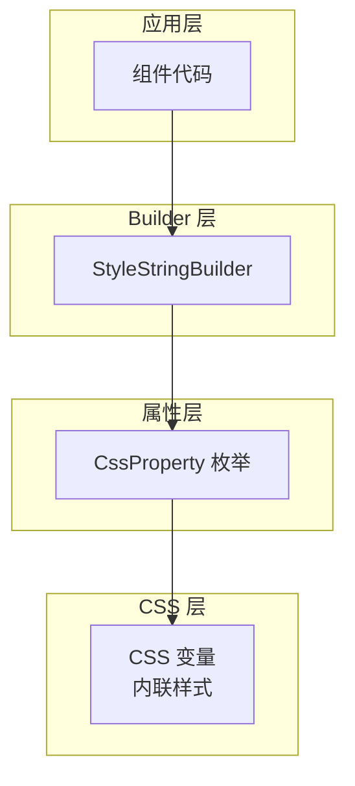

# 03-StyleStringBuilder：类型安全的样式构建系统

## 目录

- [概述](#概述)
- [设计理念](#设计理念)
- [核心架构](#核心架构)
- [工作机制](#工作机制)
- [CSS 属性枚举](#css-属性枚举)
- [性能优化](#性能优化)
- [使用示例](#使用示例)

## 概述

StyleStringBuilder 是 Hikari 的内联样式构建器，提供了类型安全的 CSS 属性设置方式。它通过 `CssProperty` 枚举和便捷方法，完全替换了传统的 `style` 字符串拼接，实现了编译时属性名检查和运行时零开销。

## 设计理念

### 核心原则

1. **类型安全** - 编译时检查 CSS 属性名
2. **像素值优化** - 自动 `px` 单位转换
3. **紧凑输出** - 去除冗余空格
4. **CSS 变量支持** - 完美集成主题系统

### 与 ClassesBuilder 的区别

| 特性 | ClassesBuilder | StyleStringBuilder |
|------|---------------|-------------------|
| 输出 | class 属性 | style 属性 |
| 使用场景 | 静态布局工具类 | 动态计算值、覆盖全局样式 |
| 类型安全 | 工具类枚举 | CSS 属性枚举 |
| 运行时开销 | 零（编译时） | 零（字符串连接） |
| 示例 | `hi-p-4` | `padding:16px` |

### 架构层次



## 核心架构

### 1. StyleStringBuilder 结构

**定义位置**：`packages/animation/src/style.rs`

```rust
pub struct StyleStringBuilder {
    styles: Vec<(CssProperty, String)>,
}
```

**核心方法**：

| 方法 | 职责 | 返回值 |
|------|------|--------|
| `new()` | 创建 builder | `StyleStringBuilder` |
| `add(property, value)` | 添加 CSS 属性 | `StyleStringBuilder` |
| `add_px(property, pixels)` | 添加像素值（自动加 px） | `StyleStringBuilder` |
| `build()` | 构建样式字符串（带空格） | `String` |
| `build_clean()` | 构建紧凑样式字符串（无空格） | `String` |

### 2. CssProperty 枚举

**定义位置**：`packages/animation/src/style.rs`

```rust
pub enum CssProperty {
    // Layout
    Display,
    Position,
    Top,
    Right,
    Bottom,
    Left,
    ZIndex,

    // Box Model
    Width,
    MinWidth,
    MaxWidth,
    Height,
    MinHeight,
    MaxHeight,
    Padding,
    Margin,
    Border,
    BorderRadius,

    // Flexbox
    Flex,
    FlexDirection,
    AlignItems,
    JustifyContent,
    Gap,

    // Typography
    FontFamily,
    FontSize,
    FontWeight,
    LineHeight,
    Color,

    // Visual
    Opacity,
    Background,
    BackgroundColor,
    BoxShadow,
    Transform,
    TransformOrigin,

    // ... 更多属性
}
```

**属性映射**：

```rust
impl CssProperty {
    pub fn as_str(&self) -> &'static str {
        match self {
            CssProperty::Display => "display",
            CssProperty::Opacity => "opacity",
            CssProperty::Transform => "transform",
            // ... 自动转换为 kebab-case
        }
    }
}
```

### 3. 像素值自动转换

```rust
impl StyleStringBuilder {
    /// 添加像素值（自动添加 px 单位）
    ///
    /// # Example
    ///
    /// ```rust
    /// let style = StyleStringBuilder::new()
    ///     .add_px(CssProperty::Width, 100)  // => "width:100px"
    ///     .add_px(CssProperty::Height, 200) // => "height:200px"
    ///     .build_clean();
    /// ```
    pub fn add_px(mut self, property: CssProperty, pixels: i32) -> Self {
        let value = format!("{}px", pixels);
        self.styles.push((property, value));
        self
    }
}
```

## 工作机制

### 构建流程

```mermaid
sequenceDiagram
    participant A as 应用代码
    participant B as StyleStringBuilder
    participant C as CssProperty
    participant D as 输出字符串

    A->>B: StyleStringBuilder::new()
    B->>B: 创建 Vec<(CssProperty, String)>

    A->>B: .add_px(CssProperty::Width, 100)
    B->>B: 添加 (Width, "100px")

    A->>B: .add_px(CssProperty::Height, 200)
    B->>B: 添加 (Height, "200px")

    A->>B: .add(CssProperty::Opacity, "0.5")
    B->>B: 添加 (Opacity, "0.5")

    A->>B: .build_clean()
    B->>B: 遍历 Vec<br/>格式化为 "property:value;..."
    B-->>A: "width:100px;height:200px;opacity:0.5"
```

### 紧凑输出机制

```rust
impl StyleStringBuilder {
    /// 构建紧凑样式字符串（无空格）
    ///
    /// 输出: "property:value;property:value"
    pub fn build_clean(self) -> String {
        self.styles
            .into_iter()
            .map(|(property, value)| {
                format!("{}:{}", property.as_str(), value)
            })
            .collect::<Vec<_>>()
            .join(";")
    }

    /// 构建标准样式字符串（带空格）
    ///
    /// 输出: "property: value; property: value"
    pub fn build(self) -> String {
        self.styles
            .into_iter()
            .map(|(property, value)| {
                format!("{}: {}", property.as_str(), value)
            })
            .collect::<Vec<_>>()
            .join("; ")
    }
}
```

### 类型检查机制

```rust
// ❌ 编译错误：属性名拼写错误
let style = StyleStringBuilder::new()
    .add(CssProperty::Widht, "100px")  // 没有这个变体
    .build();

// ❌ 编译错误：参数类型错误
let style = StyleStringBuilder::new()
    .add_px(CssProperty::Width, "100px")  // 应该是 i32
    .build();

// ✅ 编译通过：IDE 自动补全
let style = StyleStringBuilder::new()
    .add(CssProperty::Width, "100px")  // IDE 提示 Width 变体
    .build();
```

## CSS 属性枚举

### 完整属性列表

#### 布局属性

| 枚举变体 | CSS 属性 | 示例值 |
|---------|---------|--------|
| `Display` | display | `flex`, `block`, `none` |
| `Position` | position | `relative`, `absolute`, `fixed` |
| `Top` | top | `10px`, `50%` |
| `Right` | right | `10px`, `50%` |
| `Bottom` | bottom | `10px`, `50%` |
| `Left` | left | `10px`, `50%` |
| `ZIndex` | z-index | `10`, `100` |

#### 盒模型属性

| 枚举变体 | CSS 属性 | 示例值 |
|---------|---------|--------|
| `Width` | width | `100px`, `50%`, `auto` |
| `Height` | height | `100px`, `50%`, `auto` |
| `MinWidth` | min-width | `100px` |
| `MaxWidth` | max-width | `1000px` |
| `Padding` | padding | `16px`, `1rem` |
| `Margin` | margin | `16px`, `1rem` |
| `BorderRadius` | border-radius | `8px`, `50%` |

#### 弹性布局属性

| 枚举变体 | CSS 属性 | 示例值 |
|---------|---------|--------|
| `FlexDirection` | flex-direction | `row`, `column` |
| `AlignItems` | align-items | `center`, `flex-start` |
| `JustifyContent` | justify-content | `center`, `space-between` |
| `Gap` | gap | `16px`, `1rem` |
| `FlexGrow` | flex-grow | `1`, `0` |

#### 视觉属性

| 枚举变体 | CSS 属性 | 示例值 |
|---------|---------|--------|
| `Opacity` | opacity | `0.5`, `1` |
| `Transform` | transform | `scale(1.1)`, `translate(10px)` |
| `TransformOrigin` | transform-origin | `center`, `top` |
| `BoxShadow` | box-shadow | `0 2px 4px rgba(0,0,0,0.1)` |
| `Background` | background | `red`, `url(...)` |

#### 字体属性

| 枚举变体 | CSS 属性 | 示例值 |
|---------|---------|--------|
| `FontSize` | font-size | `16px`, `1rem` |
| `FontWeight` | font-weight | `400`, `bold` |
| `LineHeight` | line-height | `1.5`, `2` |
| `Color` | color | `red`, `#ff0000` |

## 性能优化

### 1. 零运行时开销

**编译时确定**：所有属性名在编译时确定

```rust
// 编译后等同于：
let style = "width:100px;height:200px;opacity:0.5";

// 不需要运行时拼接属性名
```

### 2. 紧凑输出

```rust
// ✅ 推荐：紧凑输出（减少字节）
let style = StyleStringBuilder::new()
    .add_px(CssProperty::Width, 100)
    .build_clean();
// 输出: "width:100px"

// ❌ 避免：标准输出（带空格）
let style = StyleStringBuilder::new()
    .add_px(CssProperty::Width, 100)
    .build();
// 输出: "width: 100px"
```

### 3. 避免 clone

```rust
impl StyleStringBuilder {
    pub fn add(mut self, property: CssProperty, value: impl Into<String>) -> Self {
        // Into<String> 避免不必要的 clone
        let value = value.into();
        self.styles.push((property, value));
        self
    }
}

// ✅ 推荐：使用 &str（零成本转换）
let style = StyleStringBuilder::new()
    .add(CssProperty::Width, "100px")
    .build();

// ✅ 也支持：使用 String（会移动所有权）
let width = "100px".to_string();
let style = StyleStringBuilder::new()
    .add(CssProperty::Width, width)
    .build();
```

## 使用示例

### 示例 1：基础样式

```rust
use hikari_animation::style::{StyleStringBuilder, CssProperty};

let style = StyleStringBuilder::new()
    .add_px(CssProperty::Width, 100)
    .add_px(CssProperty::Height, 50)
    .add(CssProperty::BackgroundColor, "red")
    .build_clean();

// 输出: "width:100px;height:50px;background-color:red"

rsx! {
    div { style: "{style}",
        "内容"
    }
}
```

### 示例 2：CSS 变量

```rust
let style = StyleStringBuilder::new()
    .add(CssProperty::Opacity, "var(--hi-dropdown-opacity)")
    .add(CssProperty::Transform, "scale(var(--hi-dropdown-scale))")
    .add(CssProperty::TransformOrigin, "top center")
    .build_clean();

// 输出: "opacity:var(--hi-dropdown-opacity);transform:scale(var(--hi-dropdown-scale));transform-origin:top center"
```

### 示例 3：覆盖全局样式

```rust
// 覆盖 img { height: auto; } 全局样式
let img_style = StyleStringBuilder::new()
    .add_px(CssProperty::Height, 36)
    .add_px(CssProperty::MaxWidth, 140)
    .add(CssProperty::Width, "auto")
    .add(CssProperty::ObjectFit, "contain")
    .build_clean();

rsx! {
    img { style: "{img_style}", src: "..." }
}
```

### 示例 4：动态计算值

```rust
let width = use_memo(move || {
    let window_width = window().inner_width().unwrap();
    (window_width.as_f64().unwrap() * 0.8) as i32
});

let style = use_memo(move || {
    StyleStringBuilder::new()
        .add_px(CssProperty::Width, *width.read())
        .build()
});

// 动态计算宽度
rsx! {
    div { style: "{style}",
        "自适应宽度"
    }
}
```

### 示例 5：组合使用 ClassesBuilder 和 StyleStringBuilder

```rust
use hikari_palette::classes::{ClassesBuilder, Display, FlexDirection, Gap};
use hikari_animation::style::{StyleStringBuilder, CssProperty};

// ClassesBuilder 处理布局
let classes = ClassesBuilder::new()
    .add(Display::Flex)
    .add(FlexDirection::Row)
    .add(Gap::Gap4)
    .build();

// StyleStringBuilder 处理动态值
let style = StyleStringBuilder::new()
    .add_px(CssProperty::Width, computed_width)
    .add(CssProperty::Opacity, "0.8")
    .build_clean();

rsx! {
    div { class: "{classes}", style: "{style}",
        "内容"
    }
}
```

## 总结

StyleStringBuilder 通过类型安全的样式构建系统，实现了：

1. **编译时安全** - 防止 CSS 属性名拼写错误
2. **像素值优化** - 自动 `px` 单位转换
3. **紧凑输出** - 减少字节传输
4. **CSS 变量支持** - 完美集成主题系统
5. **零运行时开销** - 纯字符串连接

这套系统完全替换了传统的 `style` 字符串拼接，是 Hikari 动态样式体系的核心组件。
