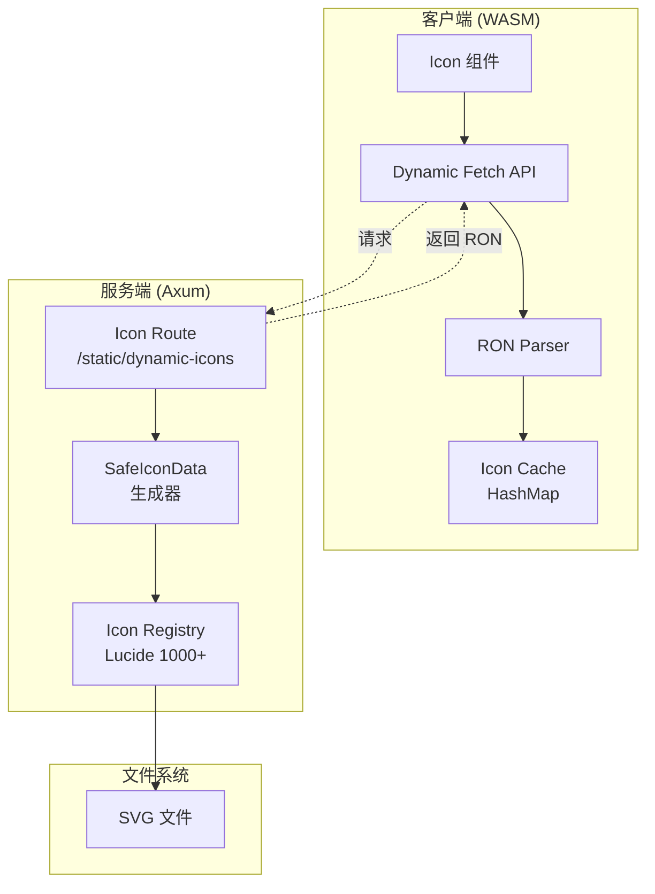
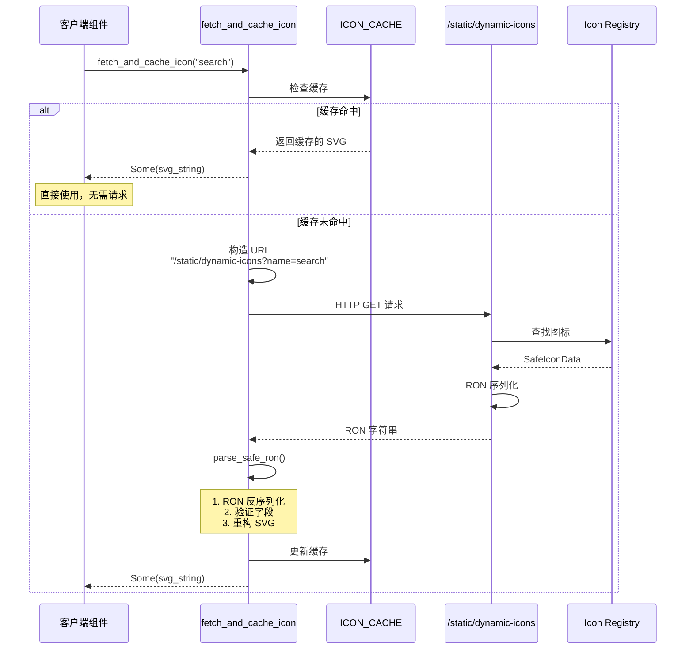
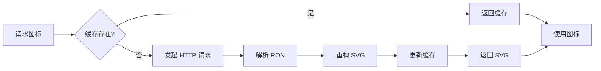

# 04-动态图标请求机制：安全的图标加载系统

## 目录

- [概述](#概述)
- [设计理念](#设计理念)
- [核心架构](#核心架构)
- [工作机制](#工作机制)
- [安全机制](#安全机制)
- [缓存策略](#缓存策略)
- [使用示例](#使用示例)

## 概述

Hikari 的动态图标请求机制提供了一个安全的客户端图标加载系统。它通过 RON 序列化格式传输图标数据，使用多层安全验证防止注入攻击，并实现了高效的内存缓存策略。

## 设计理念

### 核心原则

1. **安全性优先** - RON 反序列化 + 字段验证
2. **高效缓存** - 内存缓存避免重复请求
3. **按需加载** - 只加载需要的图标
4. **类型安全** - 编译时检查图标名称

### 架构层次



## 核心架构

### 1. 客户端 API

**定义位置**：`packages/icons/src/dynamic_fetch.rs`

```rust
/// 动态获取并缓存图标 SVG（RON 格式）
#[cfg(all(feature = "dynamic-fetch", target_arch = "wasm32"))]
pub async fn fetch_and_cache_icon(icon_name: &str) -> Option<String>
```

**关键特性**：
- 仅在 WASM 环境启用（`target_arch = "wasm32"`）
- 需要启用 `dynamic-fetch` feature
- 返回 SVG 字符串（Rust `String`）

### 2. 图标缓存

```rust
/// 图标缓存，防止重复请求
static ICON_CACHE: OnceLock<Arc<RwLock<HashMap<String, String>>>> = OnceLock::new();
```

**缓存策略**：
- `OnceLock` - 单例模式，全局唯一
- `Arc<RwLock>` - 多线程安全读写
- `HashMap<String, String>` - 图标名 → SVG 内容

### 3. 安全数据结构

```rust
/// 安全的图标数据结构（无原始 SVG 字符串）
#[derive(serde::Deserialize, Debug)]
struct SafeIconData {
    view_box: Option<String>,
    width: Option<String>,
    height: Option<String>,
    fill: Option<String>,
    stroke: Option<String>,
    paths: Vec<SafePathData>,
}

/// 安全的路径数据结构
#[derive(serde::Deserialize, Debug)]
struct SafePathData {
    d: Option<String>,
    fill: Option<String>,
    stroke: Option<String>,
    stroke_width: Option<String>,
}
```

**安全设计**：
- ✅ 使用结构化数据（非原始字符串）
- ✅ 每个字段独立验证
- ✅ 防止 XSS 注入

### 4. 服务端路由

**定义位置**：`packages/render-service/src/icon_route.rs`

```rust
/// 动态图标路由端点
/// 端点: /static/dynamic-icons?name=icon-name
pub async fn dynamic_icon_handler(
    axum::extract::Query(params): axum::extract::Query<IconQuery>,
) -> impl IntoResponse
```

## 工作机制

### 完整请求流程



### 请求细节

#### 客户端发起请求

```rust
// 1. 检查缓存
let cache = ICON_CACHE.get_or_init(|| Arc::new(RwLock::new(HashMap::new())));
{
    let cache = cache.read().unwrap();
    if let Some(cached) = cache.get(icon_name) {
        return Some(cached.clone()); // 缓存命中
    }
}

// 2. 构造请求 URL
let url = format!("{}?name={}", ICON_ROUTE, icon_name);
// ICON_ROUTE 默认: "/static/dynamic-icons"

// 3. 发起 HTTP 请求
match reqwest::get(&url).await {
    Ok(response) if response.status().is_success() => {
        let ron_data = response.text().await?;
        // 解析 RON 并重构 SVG
        parse_safe_ron(&ron_data)
    }
    _ => None
}
```

#### 服务端处理请求

```rust
pub async fn dynamic_icon_handler(
    Query(IconQuery { name }): Query<IconQuery>,
) -> impl IntoResponse {
    // 1. 从注册表查找图标
    let icon = match LUCIDE_ICONS.get(&name) {
        Some(icon) => icon,
        None => return (
            StatusCode::NOT_FOUND,
            "Icon not found".to_string()
        ).into_response()
    };

    // 2. 转换为 SafeIconData
    let safe_data = SafeIconData {
        view_box: Some("0 0 24 24".to_string()),
        width: Some("24".to_string()),
        height: Some("24".to_string()),
        fill: icon.fill.map(|v| v.to_string()),
        stroke: icon.stroke.map(|v| v.to_string()),
        paths: icon.paths.iter().map(|path| SafePathData {
            d: path.d.clone(),
            fill: path.fill.as_ref().map(|v| v.to_string()),
            stroke: path.stroke.as_ref().map(|v| v.to_string()),
            stroke_width: path.stroke_width.as_ref().map(|v| v.to_string()),
        }).collect()
    };

    // 3. RON 序列化
    let ron_str = ron::to_string(&safe_data).unwrap();

    // 4. 返回 RON 字符串
    (StatusCode::OK, ron_str).into_response()
}
```

### RON 解析和验证

```rust
fn parse_safe_ron(ron_data: &str) -> Result<String, String> {
    // 1. RON 反序列化
    let icon_data: SafeIconData =
        ron::de::from_str(ron_data)
            .map_err(|e| format!("RON parse error: {}", e))?;

    // 2. 验证所有字段
    validate_icon_data(&icon_data)?;

    // 3. 重构 SVG（安全地）
    reconstruct_svg(&icon_data)
}
```

## 安全机制

### 1. RON 反序列化安全

**为什么使用 RON？**

| 特性 | RON | JSON | 原始 SVG |
|------|-----|------|----------|
| 体积 | 小 | 中 | 大 |
| 解析速度 | 快 | 中 | N/A |
| 结构化 | ✅ | ✅ | ❌ |
| Rust 原生 | ✅ | ❌ | ❌ |

**示例**：

```rust
// RON 格式（传输）
(view_box: Some("0 0 24 24"), width: Some("24"), height: Some("24"),
 paths: [
  (d: Some("M21 21l-6-6m2-5a7 7 0 11-14 0 7 7 0 0114 0z"), stroke: Some("currentColor")),
 ])
```

```rust
// 反序列化后
SafeIconData {
    view_box: Some("0 0 24 24"),
    width: Some("24"),
    height: Some("24"),
    paths: vec![SafePathData {
        d: Some("M21 21l-6-6m2-5a7 7 0 11-14 0 7 7 0 0114 0z"),
        stroke: Some("currentColor"),
        // ...
    }]
}
```

### 2. 字段验证

#### ViewBox 验证

```rust
fn validate_icon_data(data: &SafeIconData) -> Result<(), String> {
    // 验证 view_box (格式: "0 0 24 24")
    if let Some(ref vb) = data.view_box {
        let parts: Vec<&str> = vb.split_whitespace().collect();
        if parts.len() != 4 {
            return Err("Invalid viewBox: must have 4 numbers".to_string());
        }
        for part in &parts {
            part.parse::<f32>()
                .map_err(|_| "Invalid viewBox number".to_string())?;
        }
    }

    // 验证至少有一个路径
    if data.paths.is_empty() {
        return Err("Icon must have at least one path".to_string());
    }

    // 验证每个路径
    for path in &data.paths {
        validate_path_data(path)?;
    }

    Ok(())
}
```

#### 路径数据验证

```rust
fn validate_path_data(path: &SafePathData) -> Result<(), String> {
    // 1. 验证 d 属性（SVG 路径命令）
    if let Some(ref d) = path.d {
        // 只允许合法的 SVG 路径命令
        let allowed_commands = [
            'M', 'm', 'L', 'l', 'H', 'h', 'V', 'v',
            'C', 'c', 'S', 's', 'Q', 'q', 'T', 't',
            'A', 'a', 'Z', 'z'
        ];

        for (i, c) in d.chars().enumerate() {
            if i > 1000 {
                return Err("Path too long".to_string());
            }
            if c.is_ascii_alphabetic() {
                if !allowed_commands.contains(&c) {
                    return Err(format!("Invalid path command: '{}'", c));
                }
            }
        }
    }

    // 2. 验证颜色
    if let Some(ref fill) = path.fill {
        if !is_safe_color(fill) {
            return Err(format!("Invalid fill color: {}", fill));
        }
    }

    // 3. 验证 stroke_width (数字)
    if let Some(ref sw) = path.stroke_width {
        sw.parse::<f32>()
            .map_err(|_| "Invalid stroke_width".to_string())?;
    }

    Ok(())
}
```

### 3. 颜色验证

```rust
fn is_safe_color(color: &str) -> bool {
    match color {
        "none" | "currentColor" => true,
        c if c.starts_with("#") && c.len() == 4 => {
            c[1..].chars().all(|c| c.is_ascii_hexdigit())
        }
        c if c.starts_with("#") && c.len() == 7 => {
            c[1..].chars().all(|c| c.is_ascii_hexdigit())
        }
        c if c.starts_with("rgb(") && c.ends_with(')') => {
            c[4..c.len() - 1].split(',').count() == 3
        }
        c if c.starts_with("rgba(") && c.ends_with(')') => {
            c[5..c.len() - 1].split(',').count() == 4
        }
        _ => false
    }
}
```

### 4. SVG 重构

```rust
fn reconstruct_svg(data: &SafeIconData) -> Result<String, String> {
    let mut svg = String::from(r#"<svg xmlns="http://www.w3.org/2000/svg""#);

    // 安全地添加属性
    if let Some(ref vb) = data.view_box {
        svg.push_str(&format!(r#" viewBox="{}""#, vb));
    }
    if let Some(ref w) = data.width {
        svg.push_str(&format!(r#" width="{}""#, w));
    }
    if let Some(ref h) = data.height {
        svg.push_str(&format!(r#" height="{}""#, h));
    }
    if let Some(ref fill) = data.fill {
        svg.push_str(&format!(r#" fill="{}""#, fill));
    }
    if let Some(ref stroke) = data.stroke {
        svg.push_str(&format!(r#" stroke="{}""#, stroke));
    }

    svg.push_str(">");

    // 添加路径
    for path in &data.paths {
        svg.push_str(r#"<path"#);

        if let Some(ref d) = path.d {
            svg.push_str(&format!(r#" d="{}""#, d));
        }
        if let Some(ref fill) = path.fill {
            svg.push_str(&format!(r#" fill="{}""#, fill));
        }
        if let Some(ref stroke) = path.stroke {
            svg.push_str(&format!(r#" stroke="{}""#, stroke));
        }
        if let Some(ref sw) = path.stroke_width {
            svg.push_str(&format!(r#" stroke-width="{}""#, sw));
        }

        svg.push_str("/>");
    }

    svg.push_str("</svg>");
    Ok(svg)
}
```

**重构后的 SVG**：

```html
<svg xmlns="http://www.w3.org/2000/svg" viewBox="0 0 24 24" width="24" height="24" stroke="currentColor">
  <path d="M21 21l-6-6m2-5a7 7 0 11-14 0 7 7 0 0114 0z" stroke="currentColor"></path>
</svg>
```

## 缓存策略

### 1. 内存缓存

```rust
// 单例模式，全局唯一
static ICON_CACHE: OnceLock<Arc<RwLock<HashMap<String, String>>>> = OnceLock::new();

// 获取或创建缓存
let cache = ICON_CACHE.get_or_init(|| Arc::new(RwLock::new(HashMap::new())));
```

**缓存流程**：



### 2. 缓存优势

| 特性 | 有缓存 | 无缓存 |
|------|--------|--------|
| 首次加载 | HTTP 请求 | HTTP 请求 |
| 再次加载 | 内存读取（<1ms） | HTTP 请求（~100ms） |
| 网络流量 | 1 次 | N 次 |
| 用户体验 | 即时显示 | 每次加载 |

### 3. 缓存管理

**读取缓存**：

```rust
{
    let cache = cache.read().unwrap();
    if let Some(cached) = cache.get(icon_name) {
        return Some(cached.clone()); // 命中缓存
    }
}
```

**写入缓存**：

```rust
{
    let mut cache = cache.write().unwrap();
    cache.insert(icon_name.to_string(), svg.clone());
}
```

## 使用示例

### 示例 1：基础使用

```rust
use hikari_icons::{Icon, LucideIcon};

rsx! {
    Icon {
        icon: LucideIcon::Search,
        size: 24,
        color: "var(--hi-color-primary)"
    }
}
```

### 示例 2：动态获取图标

```rust
use hikari_icons::dynamic_fetch::fetch_and_cache_icon;

let icon_svg = fetch_and_cache_icon("search").await;
if let Some(svg) = icon_svg {
    rsx! {
        div { dangerous_inner_html: "{svg}" }
    }
}
```

### 示例 3：自定义 Icon 组件（动态）

```rust
#[component]
fn DynamicIcon(
    name: String,
    size: u32,
    color: String,
) -> Element {
    let svg_content = use_resource(move || {
        let name = name.clone();
        async move { fetch_and_cache_icon(&name).await }
    });

    rsx! {
        div {
            style: "width:{size}px;height:{size}px;color:{color}",
            match &*svg_content.read() {
                Some(Some(svg)) => {
                    rsx! {
                        div { dangerous_inner_html: "{svg}" }
                    }
                }
                Some(None) => {
                    rsx! {
                        div { class: "hi-icon-error", "Icon not found" }
                    }
                }
                None => {
                    rsx! {
                        div { class: "hi-icon-loading", "..." }
                    }
                }
            }
        }
    }
}
```

### 示例 4：批量预加载图标

```rust
use hikari_icons::dynamic_fetch::fetch_and_cache_icon;

let preload_icons = use_future(move || async move {
    let icon_names = vec!["search", "menu", "close", "settings"];

    for name in icon_names {
        let _ = fetch_and_cache_icon(name).await;
    }
});

// 渲染时直接使用，无需等待
rsx! {
    Icon { icon: LucideIcon::Search }
    Icon { icon: LucideIcon::Menu }
    Icon { icon: LucideIcon::Close }
    Icon { icon: LucideIcon::Settings }
}
```

## 总结

动态图标请求机制通过多层安全设计，实现了：

1. **安全传输** - RON 序列化 + 字段验证
2. **高效缓存** - 内存缓存避免重复请求
3. **按需加载** - 只加载需要的图标
4. **类型安全** - 编译时检查图标名称
5. **防注入** - SVG 路径命令白名单验证

这套系统提供了生产级的图标加载能力，是 Hikari 图标体系的重要组成部分。
