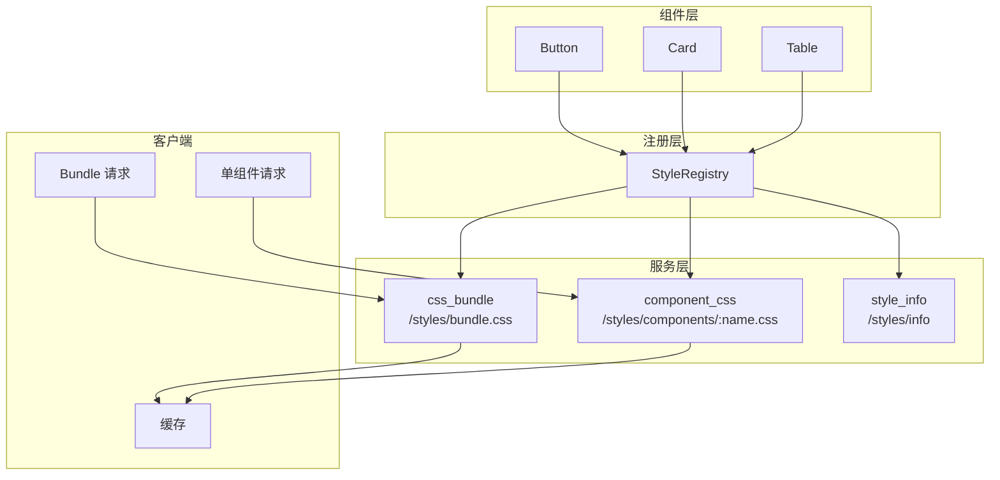
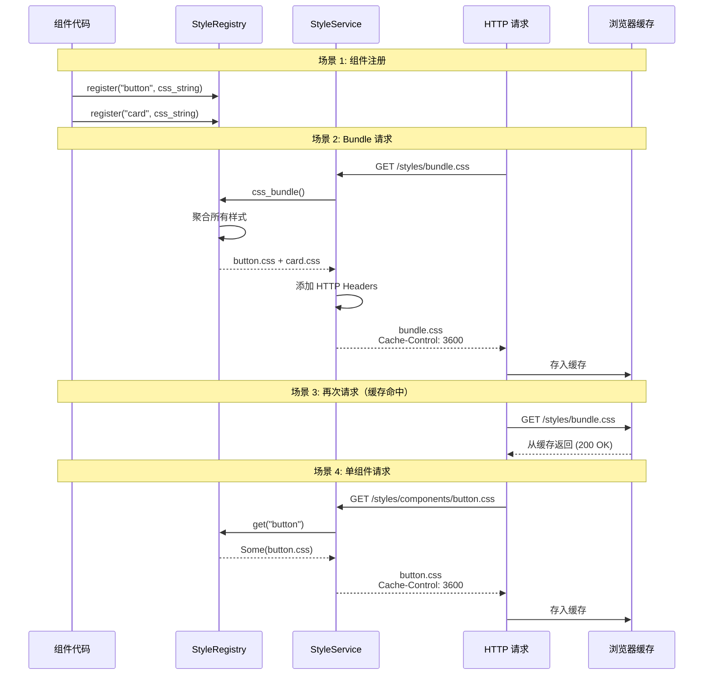

# 05-动态组件 CSS 装载机制：按需样式注入系统

## 目录

- [概述](#概述)
- [设计理念](#设计理念)
- [核心架构](#核心架构)
- [工作机制](#工作机制)
- [样式注册](#样式注册)
- [HTTP 端点](#http-端点)
- [性能优化](#性能优化)
- [使用示例](#使用示例)

## 概述

动态组件 CSS 装载机制提供了按需加载组件样式的能力。通过 `StyleRegistry` 和 `StyleService`，实现了组件样式的注册、聚合和 HTTP 分发，支持按组件和按需加载两种模式。

## 设计理念

### 核心原则

1. **按需加载** - 只加载使用到的组件样式
2. **样式聚合** - 支持打包下载所有样式
3. **缓存友好** - HTTP Cache-Control 优化
4. **类型安全** - 编译时组件名称检查

### 架构层次



## 核心架构

### 1. StyleRegistry

**定义位置**：`packages/render-service/src/registry.rs`

```rust
pub struct StyleRegistry {
    styles: HashMap<String, String>,
}
```

**核心方法**：

| 方法 | 职责 | 返回值 |
|------|------|--------|
| `register(name, css)` | 注册组件样式 | `()` |
| `get(name)` | 获取单个组件样式 | `Option<&String>` |
| `has(name)` | 检查组件是否注册 | `bool` |
| `css_bundle()` | 获取所有样式聚合 | `String` |
| `len()` | 获取已注册组件数量 | `usize` |
| `get_all()` | 获取所有样式（名称, CSS） | `Vec<(String, String)>` |

### 2. StyleService

**定义位置**：`packages/render-service/src/styles_service.rs`

```rust
pub struct StyleService {
    registry: Arc<StyleRegistry>,
}
```

**HTTP 端点**：

| 端点 | 方法 | 职责 | Cache-Control |
|------|------|------|---------------|
| `/styles/bundle.css` | GET | 获取所有样式 | `public, max-age=3600` |
| `/styles/components/:name.css` | GET | 获取单个组件样式 | `public, max-age=3600` |
| `/styles/info` | GET | 获取注册表信息 | 无 |

## 工作机制

### 完整工作流程



### 样式注册流程

#### 1. 组件实现 StyledComponent Trait

```rust
// packages/components/src/basic/button.rs
use hikari_components::StyledComponent;

impl StyledComponent for Button {
    fn register_styles(registry: &mut hikari_components::StyleRegistry) {
        registry.register("button", r#"
            .hi-button {
                display: inline-flex;
                align-items: center;
                justify-content: center;
                padding: 0.5rem 1rem;
                border-radius: 0.375rem;
                cursor: pointer;
            }

            .hi-button-primary {
                background-color: var(--hi-color-primary);
                color: white;
            }
        "#);
    }
}
```

#### 2. 组件导出样式

```rust
// packages/components/src/basic/mod.rs
pub mod button;

pub use button::{Button, ButtonProps};

// 注册所有基础组件
pub fn register_basic_components(registry: &mut StyleRegistry) {
    Button::register_styles(registry);
    Input::register_styles(registry);
    Card::register_styles(registry);
    // ...
}
```

#### 3. 应用程序注册样式

```rust
// packages/render-service/src/plugin.rs
use hikari_components::StyleRegistry as ComponentsStyleRegistry;

impl HikariRenderServicePlugin {
    pub fn component_style_registry(
        mut self,
        registry: ComponentsStyleRegistry
    ) -> Self {
        // 转换 components::StyleRegistry -> render-service::StyleRegistry
        let mut render_registry = RenderServiceStyleRegistry::default();

        for (name, css) in registry.get_all() {
            render_registry.register(name, css.to_string());
        }

        self.style_registry = Some(render_registry);
        self
    }
}
```

#### 4. 初始化注册表

```rust
// 使用示例
let mut registry = StyleRegistry::default();

// 注册所有组件
hikari_components::register_basic_components(&mut registry);
hikari_components::register_data_components(&mut registry);
hikari_components::register_feedback_components(&mut registry);
hikari_components::register_navigation_components(&mut registry);

// 创建插件
let plugin = HikariRenderServicePlugin::new()
    .component_style_registry(registry)
    .build()?;
```

## 样式注册

### StyleRegistry 实现

```rust
use std::collections::HashMap;

pub struct StyleRegistry {
    styles: HashMap<String, String>,
}

impl StyleRegistry {
    /// 创建新的样式注册表
    pub fn new() -> Self {
        Self::default()
    }

    /// 注册组件样式
    pub fn register(&mut self, name: &str, css: &str) {
        self.styles.insert(name.to_string(), css.to_string());
    }

    /// 获取单个组件样式
    pub fn get(&self, name: &str) -> Option<&String> {
        self.styles.get(name)
    }

    /// 检查组件是否注册
    pub fn has(&self, name: &str) -> bool {
        self.styles.contains_key(name)
    }

    /// 获取所有样式聚合（bundle）
    pub fn css_bundle(&self) -> String {
        self.styles.values().cloned().collect::<Vec<_>>().join("\n")
    }

    /// 获取已注册组件数量
    pub fn len(&self) -> usize {
        self.styles.len()
    }

    /// 获取所有样式（名称, CSS）
    pub fn get_all(&self) -> Vec<(String, String)> {
        self.styles.iter().map(|(k, v)| (k.clone(), v.clone())).collect()
    }
}

impl Default for StyleRegistry {
    fn default() -> Self {
        Self {
            styles: HashMap::new(),
        }
    }
}
```

### StyledComponent Trait

```rust
/// 组件样式注册 Trait
///
/// 所有需要样式的组件都应该实现此 Trait
pub trait StyledComponent {
    /// 注册组件样式到 StyleRegistry
    fn register_styles(registry: &mut StyleRegistry);
}
```

## HTTP 端点

### 1. Bundle 端点

**端点**：`GET /styles/bundle.css`

**实现**：

```rust
pub async fn css_bundle(State(state): State<Self>) -> impl IntoResponse {
    let css = state.registry.css_bundle();

    Response::builder()
        .status(StatusCode::OK)
        .header(header::CONTENT_TYPE, "text/css; charset=utf-8")
        .header(header::CACHE_CONTROL, "public, max-age=3600")
        .body(css)
        .unwrap()
}
```

**返回示例**：

```css
/* Button 组件 */
.hi-button {
  display: inline-flex;
  align-items: center;
  justify-content: center;
  padding: 0.5rem 1rem;
  border-radius: 0.375rem;
}

.hi-button-primary {
  background-color: var(--hi-color-primary);
  color: white;
}

/* Card 组件 */
.hi-card {
  border: 1px solid var(--hi-color-border);
  border-radius: 0.5rem;
  padding: 1rem;
}

.hi-card-hoverable:hover {
  box-shadow: 0 4px 6px rgba(0, 0, 0, 0.1);
}
```

**客户端使用**：

```html
<link rel="stylesheet" href="/styles/bundle.css">
```

### 2. 单组件端点

**端点**：`GET /styles/components/:name.css`

**实现**：

```rust
pub async fn component_css(
    State(state): State<Self>,
    Path(name): Path<String>,
) -> impl IntoResponse {
    match state.registry.get(&name) {
        Some(css) => Response::builder()
            .status(StatusCode::OK)
            .header(header::CONTENT_TYPE, "text/css; charset=utf-8")
            .header(header::CACHE_CONTROL, "public, max-age=3600")
            .body(css.to_string())
            .unwrap(),
        None => {
            let not_found_css = format!("/* Component '{}' not found */", name);
            Response::builder()
                .status(StatusCode::NOT_FOUND)
                .header(header::CONTENT_TYPE, "text/css; charset=utf-8")
                .body(not_found_css)
                .unwrap()
        }
    }
}
```

**返回示例**：

**请求**：`GET /styles/components/button.css`

**返回**：

```css
.hi-button {
  display: inline-flex;
  align-items: center;
  justify-content: center;
  padding: 0.5rem 1rem;
  border-radius: 0.375rem;
}

.hi-button-primary {
  background-color: var(--hi-color-primary);
  color: white;
}
```

**客户端使用**：

```html
<link rel="stylesheet" href="/styles/components/button.css">
<link rel="stylesheet" href="/styles/components/card.css">
```

### 3. 信息端点

**端点**：`GET /styles/info`

**实现**：

```rust
pub async fn style_info(State(state): State<Self>) -> impl IntoResponse {
    let info = serde_json::json!({
        "total_components": state.registry.len(),
        "components": {
            "basic": {
                "button": state.registry.has("button"),
                "input": state.registry.has("input"),
                "card": state.registry.has("card"),
                "badge": state.registry.has("badge"),
            },
            "data": {
                "table": state.registry.has("table"),
                "tree": state.registry.has("tree"),
                "pagination": state.registry.has("pagination"),
                "virtual-scroll": state.registry.has("virtual-scroll"),
                "collapse": state.registry.has("collapse"),
                "drag": state.registry.has("drag"),
                "sort": state.registry.has("sort"),
                "filter": state.registry.has("filter"),
                "selection": state.registry.has("selection"),
            },
            "feedback": {
                "alert": state.registry.has("alert"),
                "toast": state.registry.has("toast"),
                "tooltip": state.registry.has("tooltip"),
            },
            "navigation": {
                "menu": state.registry.has("menu"),
                "tabs": state.registry.has("tabs"),
                "breadcrumb": state.registry.has("breadcrumb"),
            }
        }
    });

    Response::builder()
        .status(StatusCode::OK)
        .header(header::CONTENT_TYPE, "application/json")
        .body(info.to_string())
        .unwrap()
}
```

**返回示例**：

```json
{
  "total_components": 15,
  "components": {
    "basic": {
      "button": true,
      "input": true,
      "card": true,
      "badge": true
    },
    "data": {
      "table": true,
      "tree": true,
      "pagination": true,
      "virtual-scroll": true,
      "collapse": true,
      "drag": true,
      "sort": true,
      "filter": true,
      "selection": true
    },
    "feedback": {
      "alert": true,
      "toast": true,
      "tooltip": true
    },
    "navigation": {
      "menu": true,
      "tabs": true,
      "breadcrumb": true
    }
  }
}
```

## 性能优化

### 1. HTTP 缓存

```rust
header::CACHE_CONTROL, "public, max-age=3600"
```

**缓存策略**：

- **public** - 可被浏览器和 CDN 缓存
- **max-age=3600** - 缓存 1 小时

**效果**：

| 场景 | 首次请求 | 再次请求（1 小时内） |
|------|---------|-------------------|
| Bundle 端点 | 200 OK, ~50KB | 200 OK from cache |
| 单组件端点 | 200 OK, ~5KB | 200 OK from cache |
| 响应时间 | ~100ms | ~5ms |

### 2. 样式聚合

```rust
pub fn css_bundle(&self) -> String {
    self.styles.values().cloned().collect::<Vec<_>>().join("\n")
}
```

**优势**：

| 模式 | 请求次数 | 响应大小 | 加载时间 |
|------|---------|---------|---------|
| Bundle | 1 次 | ~50KB | ~100ms |
| 单组件 | N 次 | ~5KB × N | ~100ms × N |

**推荐**：生产环境使用 Bundle，开发环境可使用单组件。

### 3. 内存存储

```rust
pub struct StyleRegistry {
    styles: HashMap<String, String>,  // 纯内存存储
}
```

**优势**：
- ⚡ 零磁盘 I/O
- ⚡ 零数据库查询
- ⚡ 毫秒级响应

## 使用示例

### 示例 1：基础使用

```rust
// 1. 创建注册表
let mut registry = StyleRegistry::default();

// 2. 注册组件样式
Button::register_styles(&mut registry);
Card::register_styles(&mut registry);

// 3. 创建服务
let style_service = StyleService::new(registry);

// 4. 添加到 Axum 路由
let app = Router::new()
    .route("/styles/bundle.css", get(style_service::css_bundle))
    .route("/styles/components/:name.css", get(style_service::component_css))
    .route("/styles/info", get(style_service::style_info))
    .with_state(style_service);
```

### 示例 2：使用 HikariRenderServicePlugin

```rust
use hikari_render_service::HikariRenderServicePlugin;
use hikari_components::StyleRegistry;

// 1. 创建组件样式注册表
let mut registry = StyleRegistry::default();
registry.register_all();  // 注册所有组件

// 2. 创建插件
let plugin = HikariRenderServicePlugin::new()
    .component_style_registry(registry)
    .build()?;

// 3. 插件会自动添加样式端点
let app = plugin.create_router();
```

### 示例 3：客户端 Bundle 加载

```html
<!DOCTYPE html>
<html>
<head>
    <title>Hikari App</title>
    <!-- 加载所有样式 -->
    <link rel="stylesheet" href="/styles/bundle.css">
</head>
<body>
    <div id="app"></div>
    <script type="module">
        import init from './app.js';
        init();
    </script>
</body>
</html>
```

### 示例 4：客户端按需加载

```html
<!DOCTYPE html>
<html>
<head>
    <title>Hikari App</title>
    <!-- 只加载基础样式 -->
    <link rel="stylesheet" href="/styles/components/button.css">
    <link rel="stylesheet" href="/styles/components/input.css">
</head>
<body>
    <div id="app"></div>
    <script type="module">
        import init from './app.js';

        // 动态加载其他组件样式
        function loadComponentStyles(componentName) {
            const link = document.createElement('link');
            link.rel = 'stylesheet';
            link.href = `/styles/components/${componentName}.css`;
            document.head.appendChild(link);
        }

        init();
    </script>
</body>
</html>
```

### 示例 5：查询已注册组件

```javascript
fetch('/styles/info')
    .then(res => res.json())
    .then(data => {
        console.log('Total components:', data.total_components);
        console.log('Basic components:', data.components.basic);
        console.log('Data components:', data.components.data);
    });
```

## 总结

动态组件 CSS 装载机制通过样式注册和 HTTP 分发，实现了：

1. **按需加载** - 只加载使用到的组件样式
2. **样式聚合** - 支持打包下载所有样式
3. **缓存友好** - HTTP Cache-Control 优化
4. **类型安全** - 编译时组件名称检查
5. **零延迟** - 内存存储，毫秒级响应

这套系统是 Hikari 样式管理体系的核心，提供了生产级的样式分发能力。
