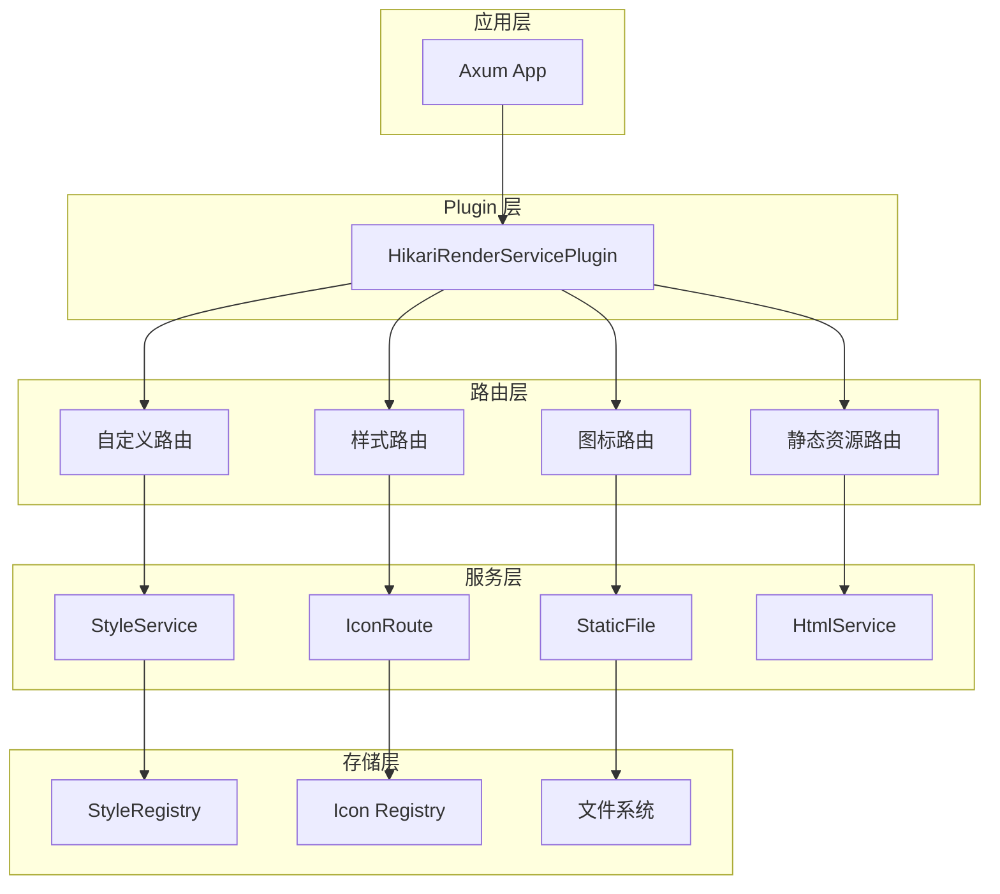
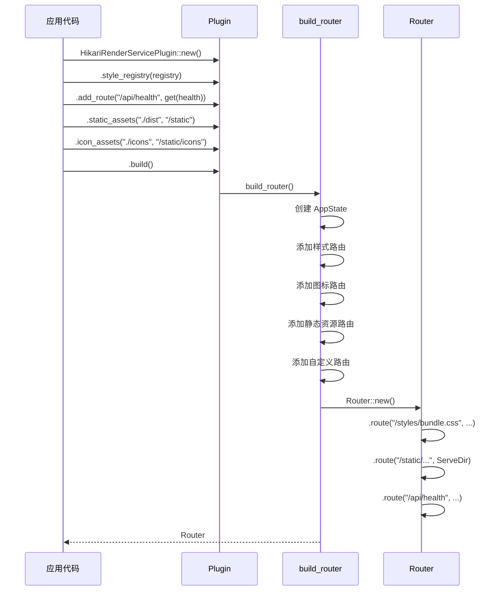

# 06-SSR 渲染路由中间件：服务端渲染与静态资源服务

## 目录

- [概述](#概述)
- [设计理念](#设计理念)
- [核心架构](#核心架构)
- [路由系统](#路由系统)
- [静态资源服务](#静态资源服务)
- [HTML 渲染](#html-渲染)
- [使用示例](#使用示例)

## 概述

SSR 渲染路由中间件基于 Axum 框架，提供了服务端渲染、静态资源服务、样式注入和路由管理的完整解决方案。通过 `HikariRenderServicePlugin` 提供了流畅的构建器 API。

## 设计理念

### 核心原则

1. **声明式配置** - Builder 模式简化配置
2. **模块化路由** - 灵活的路由添加
3. **静态资源优化** - 可配置的缓存策略
4. **样式注入** - 自动注入组件样式

### 架构层次



## 核心架构

### 1. HikariRenderServicePlugin

**定义位置**：`packages/render-service/src/plugin.rs`

```rust
pub struct HikariRenderServicePlugin {
    routes: Vec<RouterRoute>,
    static_mounts: Vec<StaticMountConfig>,
    state: HashMap<String, serde_json::Value>,
    style_registry: Option<StyleRegistry>,
    tailwind_css: Option<&'static str>,
}
```

**核心方法**：

| 方法 | 职责 |
|------|------|
| `new()` | 创建新的 plugin builder |
| `style_registry(registry)` | 设置样式注册表 |
| `component_style_registry(registry)` | 从 components 设置样式注册表 |
| `add_route(path, method_router)` | 添加自定义路由 |
| `static_assets(local_path, url_path)` | 添加静态资源目录 |
| `mount_static(config)` | 使用完整配置挂载静态资源 |
| `icon_assets(local_path, url_path)` | 添加图标资源目录 |
| `state(key, value)` | 添加应用状态 |
| `build()` | 构建并返回 Axum Router |

### 2. StaticMountConfig

**定义位置**：`packages/render-service/src/plugin.rs`

```rust
pub struct StaticMountConfig {
    pub local_path: PathBuf,      // 本地文件系统路径
    pub url_path: String,         // URL 路径
    pub config: StaticFileConfig,  // 文件服务配置
}
```

**配置选项**：

```rust
pub struct StaticFileConfig {
    pub cache_control: Option<String>,  // Cache-Control 头
    pub etag: Option<bool>,             // ETag 支持
    pub last_modified: Option<bool>,     // Last-Modified 支持
    pub precompressed: Option<bool>,    // 预压缩支持
}
```

### 3. AppState

**定义位置**：`packages/render-service/src/router.rs`

```rust
#[derive(Clone)]
pub struct AppState {
    pub style_registry: Option<Arc<StyleRegistry>>,
    pub icon_registry: Option<Arc<IconRegistry>>,
    pub static_configs: Vec<StaticMountConfig>,
    pub app_state: Arc<HashMap<String, serde_json::Value>>,
}
```

## 路由系统

### 路由构建流程



### 路由优先级

```rust
fn build_router(&self) -> Result<Router, RenderServiceError> {
    let app_state = AppState {
        style_registry: self.style_registry.map(Arc::new),
        // ...
    };

    // 1. 样式路由（优先级最高）
    let mut router = Router::new()
        .route("/styles/bundle.css", get(StyleService::css_bundle))
        .route("/styles/components/:name.css", get(StyleService::component_css))
        .route("/styles/info", get(StyleService::style_info))
        .with_state(StyleService::new(...));

    // 2. 图标路由
    router = router.merge(
        build_icon_routes(&app_state)?
    );

    // 3. 静态资源路由（按添加顺序）
    for mount_config in &self.static_mounts {
        router = router.merge(
            build_static_routes(&mount_config)?
        );
    }

    // 4. 自定义路由（优先级最低，最后匹配）
    for route in &self.routes {
        router = router.route(&route.path, route.method_router.clone());
    }

    Ok(router)
}
```

## 静态资源服务

### 基础配置

```rust
// 1. 创建插件
let plugin = HikariRenderServicePlugin::new()
    // 单个目录
    .static_assets("./dist", "/static")
    // 图标目录
    .icon_assets("./packages/icons/dist/lucide/icons", "/static/icons")
    .build()?;
```

**生成的路由**：

| URL 路径 | 本地路径 | 说明 |
|----------|---------|------|
| `/static/app.js` | `./dist/app.js` | JavaScript 文件 |
| `/static/styles.css` | `./dist/styles.css` | CSS 文件 |
| `/static/icons/search.svg` | `./icons/search.svg` | 图标文件 |

### 自定义配置

```rust
use hikari_render_service::{StaticMountConfig, StaticFileConfig};

let mount_config = StaticMountConfig::new("./dist", "/static")
    .config(StaticFileConfig::default()
        .no_cache()  // 禁用缓存
    );

let plugin = HikariRenderServicePlugin::new()
    .mount_static(mount_config)
    .build()?;
```

**配置选项**：

| 方法 | 效果 |
|------|------|
| `no_cache()` | 设置 `Cache-Control: no-store` |
| `cache(max_age)` | 设置 `Cache-Control: public, max-age={max_age}` |
| `enable_etag()` | 启用 ETag 支持 |
| `enable_last_modified()` | 启用 Last-Modified 支持 |
| `enable_precompressed()` | 启用预压缩支持 |

### 缓存策略

```rust
impl StaticFileConfig {
    /// 禁用缓存
    pub fn no_cache(mut self) -> Self {
        self.cache_control = Some("no-store, no-cache, must-revalidate".to_string());
        self
    }

    /// 设置缓存时间（秒）
    pub fn cache(mut self, max_age: u64) -> Self {
        self.cache_control = Some(format!("public, max-age={}", max_age));
        self
    }
}
```

**缓存策略对比**：

| 策略 | Cache-Control | 适用场景 |
|------|---------------|---------|
| `no_cache()` | `no-store, no-cache, must-revalidate` | 开发环境 |
| `cache(3600)` | `public, max-age=3600` | 生产环境（1 小时） |
| `cache(86400)` | `public, max-age=86400` | 静态资源（1 天） |

## HTML 渲染

### HtmlService

**定义位置**：`packages/render-service/src/html.rs`

```rust
pub struct HtmlService {
    template: Option<String>,
    inject_styles: bool,
    inject_scripts: bool,
}
```

**核心方法**：

```rust
impl HtmlService {
    /// 渲染 HTML 模板
    pub fn render(
        &self,
        app_state: &AppState,
        context: &HashMap<String, String>,
    ) -> String {
        let mut html = self.template.clone().unwrap_or_else(|| {
            DEFAULT_TEMPLATE.to_string()
        });

        // 注入样式
        if self.inject_styles {
            if let Some(ref registry) = app_state.style_registry {
                let styles = registry.css_bundle();
                html = html.replace(
                    "{{styles}}",
                    &format!("<style>{}</style>", styles)
                );
            }
        }

        // 注入脚本
        if self.inject_scripts {
            // ...
        }

        // 替换变量
        for (key, value) in context {
            html = html.replace(&format!("{{{{{}}}}}", key), value);
        }

        html
    }
}
```

**默认模板**：

```html
<!DOCTYPE html>
<html lang="en">
<head>
    <meta charset="UTF-8">
    <meta name="viewport" content="width=device-width, initial-scale=1.0">
    <title>{{title}}</title>
    {{styles}}
</head>
<body>
    <div id="app"></div>
    {{scripts}}
</body>
</html>
```

### 使用 HtmlService

```rust
use hikari_render_service::html::HtmlService;

let html_service = HtmlService::new()
    .template(DEFAULT_TEMPLATE)
    .inject_styles(true)
    .inject_scripts(true);

let context = HashMap::from([
    ("title".to_string(), "Hikari App".to_string()),
    ("scripts".to_string(), "<script src='/static/app.js'></script>".to_string()),
]);

let html = html_service.render(&app_state, &context);
```

## 使用示例

### 示例 1：基础配置

```rust
use hikari_render_service::HikariRenderServicePlugin;
use axum::routing::get;

async fn health() -> &'static str {
    "OK"
}

let plugin = HikariRenderServicePlugin::new()
    .build()?;

let app = plugin.create_router();
```

### 示例 2：添加样式服务

```rust
use hikari_render_service::HikariRenderServicePlugin;
use hikari_components::StyleRegistry;

let mut registry = StyleRegistry::default();
registry.register_all();  // 注册所有组件

let plugin = HikariRenderServicePlugin::new()
    .component_style_registry(registry)
    .build()?;
```

**生成的路由**：

- `GET /styles/bundle.css` - 所有样式
- `GET /styles/components/:name.css` - 单个组件样式
- `GET /styles/info` - 注册表信息

### 示例 3：添加静态资源

```rust
let plugin = HikariRenderServicePlugin::new()
    .static_assets("./dist", "/static")
    .icon_assets("./packages/icons/dist/lucide/icons", "/static/icons")
    .build()?;
```

**生成的路由**：

- `/static/*` → `./dist/*`
- `/static/icons/*` → `./icons/*`

### 示例 4：自定义路由

```rust
use axum::routing::{get, post};

async fn health() -> &'static str {
    "OK"
}

async fn create_user(Json(payload): Json<User>) -> Json<User> {
    // ...
}

let plugin = HikariRenderServicePlugin::new()
    .add_route("/api/health", get(health))
    .add_route("/api/users", post(create_user))
    .build()?;
```

### 示例 5：添加应用状态

```rust
let plugin = HikariRenderServicePlugin::new()
    .state("api_key", "secret-key-123")
    .state("db_url", "postgresql://localhost/hikari")
    .build()?;

// 在 handler 中访问状态
async fn handler(
    State(state): State<AppState>
) -> Result<String, AppError> {
    let api_key = state.app_state.get("api_key")
        .ok_or(AppError::MissingState)?;

    Ok(format!("API Key: {}", api_key))
}
```

### 示例 6：完整配置

```rust
use hikari_render_service::HikariRenderServicePlugin;
use hikari_components::StyleRegistry;
use axum::routing::get;

async fn index() -> &'static str {
    "Hello Hikari!"
}

// 1. 创建样式注册表
let mut registry = StyleRegistry::default();
registry.register_all();

// 2. 创建插件
let plugin = HikariRenderServicePlugin::new()
    // 样式服务
    .component_style_registry(registry)

    // 静态资源
    .static_assets("./dist", "/static")
    .icon_assets("./packages/icons/dist/lucide/icons", "/static/icons")

    // 自定义路由
    .add_route("/", get(index))

    // 应用状态
    .state("app_name", "Hikari App")

    // 构建
    .build()?;

// 3. 创建 Axum 应用
let app = plugin.create_router();

// 4. 启动服务器
let listener = tokio::net::TcpListener::bind("0.0.0.0:3000").await?;
axum::serve(listener, app).await?;
```

### 示例 7：自定义静态资源配置

```rust
use hikari_render_service::{StaticMountConfig, StaticFileConfig};

// 配置 1: 开发环境（无缓存）
let dev_config = StaticMountConfig::new("./dist", "/static")
    .config(StaticFileConfig::default().no_cache());

// 配置 2: 生产环境（长缓存）
let prod_config = StaticMountConfig::new("./dist", "/static")
    .config(StaticFileConfig::default()
        .cache(86400)  // 1 天
        .enable_etag()
        .enable_last_modified()
    );

let plugin = HikariRenderServicePlugin::new()
    .mount_static(dev_config)  // 开发环境
    .build()?;
```

## 总结

SSR 渲染路由中间件通过 Axum 集成，提供了：

1. **声明式配置** - Builder 模式简化配置
2. **模块化路由** - 灵活的路由添加
3. **静态资源优化** - 可配置的缓存策略
4. **样式注入** - 自动注入组件样式
5. **HTML 渲染** - 灵活的模板系统

这套系统是 Hikari 服务端渲染的核心，提供了生产级的 SSR 能力。
