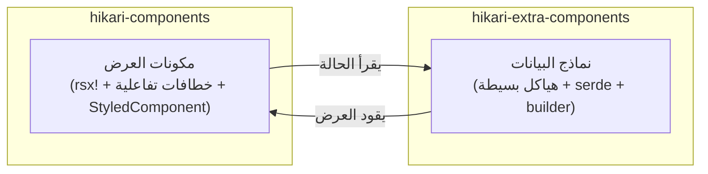

# بنية الحزم ثنائية الطبقات: components و extra-components

يقسم Hikari نظام المكونات إلى حزمتين متكاملتين، تتحمل كل منهما مسؤولية مستوى مختلف:



### مقارنة المسؤوليات

| البُعد | `hikari-components` | `hikari-extra-components` |
|--------|----------------------|---------------------------|
| **العرض** | ماكرو `rsx!`، خطافات تفاعلية | لا شيء (مستقل عن إطار العمل) |
| **إدارة الحالة** | `use_signal()`، `use_effect()` | حقول هيكل قابلة للتغيير فقط |
| **معالجة الأحداث** | عمليات إغلاق `EventHandler<T>` | سمات `data-action` + ربط خارجي |
| **تضمين CSS** | سمة `StyledComponent` | تصدير `pub const *_STYLES` |
| **التسلسل** | غير مطلوب | جميع أنواع الحالة تكتسب `serde` |
| **اعتمادية DOM** | يتطلب إطار عمل Tairitsu | لا شيء |
| **حالات الاستخدام** | عرض واجهة المستخدم في الوقت الفعلي داخل تطبيقات Tairitsu | SSR، الاختبار، استمرارية الحالة، أطر عمل غير Tairitsu |

### نطاقات المكونات المتداخلة

المكونات التالية موجودة في كلتا الحزمتين. هذا **تصميم مقصود** وليس تكرارًا:

- `Timeline` / `TimelineState`
- `DragLayer` / `DragLayerState`
- `UserGuide` / `UserGuideState`
- `ZoomControls` / `ZoomControlsState`
- `VideoPlayer` / `VideoPlayerState`
- `RichTextEditor` / `RichTextEditorState`
- `CodeHighlight` / `CodeHighlighterState`

توفر نسخة `components` **مكونات عرض جاهزة للاستخدام** (مع الرسوم المتحركة، ومعالجة لوحة المفاتيح، وتكامل الأيقونات، و CSS عبر StyledComponent) ؛
توفر نسخة `extra-components` **نماذج بيانات نقية** (مع نمط الباني، وتسلسل serde، وطرق التغيير، واختبارات الوحدة).

### متى تستخدم أي حزمة

- **تطبيقات Tairitsu**: استخدم `hikari-components` لعرض واجهة المستخدم؛ واختياريًا استخدم `hikari-extra-components` لاستمرارية الحالة أو التراجع/الإعادة
- **تطبيقات غير Tairitsu**: استخدم نماذج البيانات من `hikari-extra-components` ونفّذ العرض بنفسك
- **الاختبار**: استخدم `hikari-extra-components` لاختبار وحدة منطق الحالة بدون بيئة DOM
- **SSR**: استخدم كليهما — نماذج البيانات لحالة الخادم، ومكونات العرض للترطيب من جانب العميل

### إزالة الغموض عن الأنواع

بعض الأنواع تحمل نفس الاسم في كلتا الحزمتين (مثل `TimelinePosition`، `GuideStep`). استخدم مسارات الوحدات الصريحة عند الاستيراد:

```rust,ignore
use hikari_extra_components::extra::TimelineState;     // نموذج بيانات نقي
use hikari_components::display::Timeline;              // مكون عرض

use hikari_extra_components::extra::ZoomControlsState; // حالة نقية
use hikari_components::display::ZoomControls;          // مكون عرض
```

### أسماء فئات CSS

كلتا الحزمتين تستخدمان أسماء فئات CSS مختلفة لنفس العنصر المفاهيمي. هذا مقصود — تستخدم `components` تعدادات فئات مُكتوبة من `hikari-palette` (مثل `ZoomControlsClass::Button`)، بينما تستخدم `extra-components` سلاسل مشفرة ثابتة أو طرقًا محسوبة. عند استخدام كلتا الحزمتين معًا، تعرض كل واحدة بمجموعة الفئات الخاصة بها.
