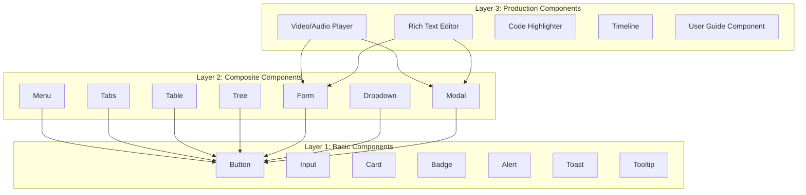
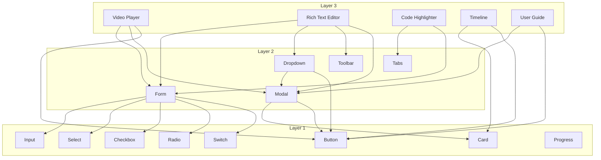

# Layer Component Plan: Three-Layer Component System

## Table of Contents

- [Overview](#overview)
- [Design Philosophy](#design-philosophy)
- [Layered Architecture](#layered-architecture)
- [Layer 1: Basic Components](#layer-1-basic-components)
- [Layer 2: Composite Components](#layer-2-composite-components)
- [Layer 3: Production Components](#layer-3-production-components)
- [Development Priority](#development-priority)
- [Technical Notes](#technical-notes)

## Overview

Hikari adopts a three-layer component system, building from basic to complex step by step. Layer 1 provides atomic-level components, Layer 2 combines Layer 1 to build composite components, and Layer 3 implements production-grade complex functionality based on Layer 2.

## Design Philosophy

### Core Principles

1. **Progressive Enhancement** - From simple to complex
2. **Reusability** - High-level components can reuse low-level components
3. **Single Responsibility** - Each component does one thing
4. **Composition Over Inheritance** - Build complex functionality through composition

### Layering Principles



### Responsibility Division

| Layer | Responsibility | Complexity | State Management |
|-------|---------------|-------------|-------------------|
| **Layer 1** | Atomic UI elements | Low | Local state |
| **Layer 2** | Composite UI patterns | Medium | Local state + Context |
| **Layer 3** | Complete business functionality | High | Global state + Complex logic |

## Layered Architecture

### Layer 1: Basic Components

**Definition**: Atomic-level UI elements that cannot be further divided

**Characteristics**:
- Single responsibility, simple functionality
- No complex state management
- Highly reusable
- Complete documentation and testing

**Examples**: Button, Input, Card, Badge, Alert, Toast, Tooltip

### Layer 2: Composite Components

**Definition**: Composite components made up of multiple Layer 1 components

**Characteristics**:
- Combines multiple basic components
- Has some state management
- Provides common UI patterns
- Supports Context state sharing

**Examples**: Menu, Tabs, Table, Tree, Form, Dropdown, Modal

### Layer 3: Production Components

**Definition**: Complete business functionality built on Layer 2

**Characteristics**:
- Complex state management
- Complete business logic
- High performance optimization
- Production environment verification

**Examples**: Video/Audio player, Rich text editor, Code highlighter, Timeline, User guide component

## Layer 1: Basic Components

### Completed Components

| Component | Path | Status |
|-----------|------|--------|
| Button | `packages/components/src/basic/button.rs` | ✅ Completed |
| Input | `packages/components/src/basic/input.rs` | ✅ Completed |
| Card | `packages/components/src/basic/card.rs` | ✅ Completed |
| Badge | `packages/components/src/basic/badge.rs` | ✅ Completed |
| Alert | `packages/components/src/feedback/alert.rs` | ✅ Completed |
| Toast | `packages/components/src/feedback/toast.rs` | ✅ Completed |
| Tooltip | `packages/components/src/feedback/tooltip.rs` | ✅ Completed |
| Select | `packages/components/src/basic/select.rs` | ✅ Completed |
| Checkbox | `packages/components/src/basic/checkbox.rs` | ✅ Completed |
| Radio | `packages/components/src/basic/radio_group.rs` | ✅ Completed |
| Switch | `packages/components/src/basic/switch.rs` | ✅ Completed |
| Avatar | `packages/components/src/basic/avatar.rs` | ✅ Completed |
| Image | `packages/components/src/basic/image.rs` | ✅ Completed |
| Slider | `packages/components/src/basic/slider.rs` | ✅ Completed |
| Progress | `packages/components/src/feedback/progress.rs` | ✅ Completed |
| Spin (Spinner) | `packages/components/src/feedback/spin.rs` | ✅ Completed |
| FormField | `packages/components/src/basic/form_field.rs` | ✅ Completed |

### Components to be Developed

| Component | Priority | Description |
|-----------|----------|-------------|
| **Divider** | Low | Divider |
| **Skeleton** | Low | Skeleton screen |

### Component Interface Specification

```rust
/// Layer 1 basic component interface specification
pub trait Layer1Component {
    /// Props structure (must derive Clone, PartialEq)
    type Props;

    /// Render component
    fn render(props: Self::Props) -> Element;

    /// Register styles
    fn register_styles(registry: &mut StyleRegistry);

    /// Default Props
    fn default_props() -> Self::Props;
}
```

## Layer 2: Composite Components

### Completed Components

| Component | Path | Layer 1 Dependencies | Status |
|-----------|------|---------------------|--------|
| Menu | `packages/components/src/navigation/menu.rs` | Button, Card | ✅ Completed |
| Tabs | `packages/components/src/navigation/tabs.rs` | Button | ✅ Completed |
| Breadcrumb | `packages/components/src/navigation/breadcrumb.rs` | Button | ✅ Completed |
| Table | `packages/components/src/data/table.rs` | Button, Card, Input | ✅ Completed |
| Tree | `packages/components/src/data/tree.rs` | Button | ✅ Completed |
| Pagination | `packages/components/src/data/pagination.rs` | Button | ✅ Completed |
| Dropdown | `packages/components/src/feedback/dropdown.rs` | Button, Menu | ✅ Completed |
| Modal | `packages/components/src/feedback/modal.rs` | Card, Button | ✅ Completed |
| Drawer | `packages/components/src/feedback/drawer.rs` | Card, Button | ✅ Completed |
| Steps | `packages/components/src/navigation/steps.rs` | Button, Badge | ✅ Completed |
| Form | `packages/components/src/utils/form.rs` | Input, Select, Checkbox, Radio | ✅ Completed |

### Composite Components to be Developed

| Component | Priority | Description | Layer 1 Dependencies |
|-----------|----------|-------------|---------------------|
| **Collapse** | Medium | Collapsible panel | Button, Card |
| **Tabs** | Medium | Tabs | Button |
| **Upload** | Medium | File upload | Button, Progress |
| **Calendar** | Medium | Calendar picker | Button, Input |
| **Carousel** | Low | Carousel | Button, Card |
| **Stepper** | Low | Stepper | Button, Badge |
| **Timeline** | Low | Timeline | Card, Badge |

### Component Interface Specification

```rust
/// Layer 2 composite component interface specification
pub trait Layer2Component {
    /// Props structure (must derive Clone, PartialEq)
    type Props;

    /// Context type (optional)
    type Context: Clone + 'static;

    /// Render component
    fn render(props: Self::Props) -> Element;

    /// Provided Context
    fn provide_context(&self) -> Option<Self::Context>;

    /// Register styles
    fn register_styles(registry: &mut StyleRegistry);

    /// Default Props
    fn default_props() -> Self::Props;
}
```

### Example: Form Component

```rust
/// Form component (Layer 2)
/// Dependencies: Input, Select, Checkbox, Radio (Layer 1)
#[component]
pub fn Form(
    children: Element,
    #[props(default = false)] disabled: bool,
    #[props(default = FormValidationMode::OnChange)]
    validation_mode: FormValidationMode,
    on_submit: EventHandler<FormSubmitEvent>,
) -> Element {
    let form_context = FormContext {
        disabled,
        validation_mode,
    };

    rsx! {
        form {
            onsubmit: move |e| {
                e.prevent_default();
                on_submit.call(FormSubmitEvent::new());
            },
            ContextProvider { value: form_context,
                {children}
            }
        }
    }
}
```

## Layer 3: Production Components

### Planned Components

| Component | Priority | Description | Layer 2 Dependencies | Complexity |
|-----------|----------|-------------|---------------------|-------------|
| **Video/Audio Player** | High | Supports playback control, subtitles, playlists | Card, Button, Form, Menu | High |
| **Rich Text Editor** | High | Supports rich text editing, Markdown, plugins | Form, Dropdown, Modal, Toolbar | High |
| **Code Highlighter** | High | Syntax highlighting, line numbers, theme switching | Card, Tabs, Form | Medium |
| **Timeline** | Medium | Event timeline, milestones, timeline | Card, Badge, Collapse | Medium |
| **User Guide Component** | Medium | Onboarding guide, feature introduction, step hints | Modal, Button, Badge | Medium |
| **Data Visualization** | Low | Charts, dashboards, reports | Card, Tabs, Form | High |
| **Code Editor** | Low | Complete code editing, smart hints, debugging | Card, Tabs, Form, Menu | High |
| **Instant Messaging** | Low | Chat interface, message list, emojis | Card, Form, Menu, Badge | High |

### Component Interface Specification

```rust
/// Layer 3 production component interface specification
pub trait Layer3Component {
    /// Props structure (must derive Clone, PartialEq)
    type Props;

    /// State structure (must derive Clone)
    type State: Clone + 'static;

    /// Initialize State
    fn init_state(props: &Self::Props) -> Self::State;

    /// Render component
    fn render(props: Self::Props, state: &Signal<Self::State>) -> Element;

    /// Lifecycle: component mount
    fn on_mount(state: &Signal<Self::State>) {
        // Default empty implementation
    }

    /// Lifecycle: component unmount
    fn on_unmount(state: &Signal<Self::State>) {
        // Default empty implementation
    }

    /// Register styles
    fn register_styles(registry: &mut StyleRegistry);

    /// Default Props
    fn default_props() -> Self::Props;
}
```

### Example: Video Player

```rust
/// Video player component (Layer 3)
/// Dependencies: Card, Button, Form, Menu (Layer 2)
#[component]
pub fn VideoPlayer(
    src: String,
    #[props(default = false)] autoplay: bool,
    #[props(default = false)] muted: bool,
    #[props(default = 0)] volume: u8,
    #[props(default = 1.0)] playback_rate: f64,
) -> Element {
    let is_playing = use_signal(|| autoplay);
    let current_time = use_signal(|| 0.0);
    let duration = use_signal(|| 0.0);
    let show_controls = use_signal(|| true);

    // Play/Pause
    let toggle_play = move |_| {
        is_playing.toggle();
    };

    // Volume control
    let set_volume = move |new_volume| {
        // Update volume
    };

    rsx! {
        Card {
            class: "hi-video-player",
            div { class: "hi-video-container",
                video {
                    src: "{src}",
                    autoplay: autoplay,
                    muted: muted,
                    // Event listeners
                }

                // Controls
                if show_controls() {
                    div { class: "hi-video-controls",
                        Button { icon: MdiIcon::Play, on_click: toggle_play }
                        Button { icon: MdiIcon::VolumeHigh }
                        // Progress bar
                        // Time display
                    }
                }
            }
        }
    }
}
```

### Example: Rich Text Editor

```rust
/// Rich text editor component (Layer 3)
/// Dependencies: Form, Dropdown, Modal, Toolbar (Layer 2)
#[component]
pub fn RichTextEditor(
    #[props(default = "")] initial_content: String,
    #[props(default = EditorMode::Wysiwyg)]
    mode: EditorMode,
    on_change: EventHandler<String>,
) -> Element {
    let content = use_signal(|| initial_content);
    let is_bold = use_signal(|| false);
    let is_italic = use_signal(|| false);

    // Format text
    let toggle_bold = move |_| {
        is_bold.toggle();
        // Apply bold format
    };

    rsx! {
        Card { class: "hi-rich-text-editor",
            // Toolbar
            div { class: "hi-editor-toolbar",
                Button { icon: MdiIcon::FormatBold, on_click: toggle_bold }
                Button { icon: MdiIcon::FormatItalic }
                Button { icon: MdiIcon::FormatUnderline }
                Dropdown {
                    trigger: rsx! { Button { icon: MdiIcon::FormatHeader1 } },
                    // Header options
                }
            }

            // Editor area
            div { class: "hi-editor-content",
                contenteditable: "true",
                dangerous_inner_html: "{content}",
                // Input events
            }

            // Markdown mode switch
            if mode == EditorMode::Markdown {
                div { class: "hi-editor-mode-switch",
                    Button { "WYSIWYG" }
                    Button { "Markdown" }
                }
            }
        }
    }
}
```

## Development Priority

### Phase 1: Complete Layer 1

**Goal**: Complete all basic components

**Priority order**:
1. Divider (Low)
2. Skeleton (Low)

**Estimated time**: 1 week

### Phase 2: Complete Layer 2

**Goal**: Complete all composite components

**Priority order**:
1. Collapse (Medium)
2. Tabs (Medium)
3. Upload (Medium)
4. Calendar (Medium)
5. Carousel (Low)
6. Stepper (Low)
7. Timeline (Low)

**Estimated time**: 2-3 weeks

### Phase 3: Implement Layer 3

**Goal**: Implement production-grade components

**Priority order**:
1. Code highlighter (High)
2. User guide component (Medium)
3. Timeline (Medium)
4. Video/Audio player (High)
5. Rich text editor (High)

**Estimated time**: 4-6 weeks

### Phase 4: Optimization and Refinement

**Goal**: Performance optimization, documentation improvement, test coverage

**Tasks**:
1. Performance optimization (virtual scrolling, lazy loading)
2. Documentation improvement (Storybook, example code)
3. Test coverage (unit tests, integration tests)
4. Accessibility (ARIA labels, keyboard navigation)

**Estimated time**: 2-3 weeks

## Component Dependency Diagram



## Technical Notes

### Icon System Update

Hikari uses Material Design Icons (MDI) instead of Lucide Icons.

**Reasons**:
- MDI provides a richer icon set (7000+ icons)
- Consistent with Material Design specifications
- Better suited for Arknights + FUI design style

**Usage**:
```rust
use _icons::{Icon, MdiIcon};

rsx! {
    Icon {
        icon: MdiIcon::Search,
        size: 24,
    }
}
```

### Routing System

Website uses Dioxus 0.7's Routable derive macro.

**App component structure**:
```rust
#[component]
pub fn App() -> Element {
    rsx! {
        ThemeProvider { palette: "hikari".to_string(),
            PortalProvider {
                Router::<Route> {}
            }
        }
    }
}
```

**Route example**:
```rust
#[derive(Clone, Debug, PartialEq, Routable)]
pub enum Route {
    #[route("/")]
    Home {},

    #[route("/components/layer1/basic")]
    Layer1Basic {},

    #[route("/demos/layer1/form")]
    FormDemo {},
}
```

### Build System

Use `just build` to build the entire project.

**Build commands**:
```bash
# Build all packages (Release mode)
just build

# Build all packages (Debug mode)
just build-debug

# Run development server
just dev

# Build Website
cd examples/website && cargo build --release
```

## Summary

Hikari's three-layer component system provides a clear development path:

1. **Layer 1** - Atomic components, high reusability
2. **Layer 2** - Composite components, common UI patterns
3. **Layer 3** - Production components, complete business functionality

Through progressive enhancement, from simple to complex, ensuring that each layer has comprehensive testing and documentation, providing a reliable component system for production environments.
