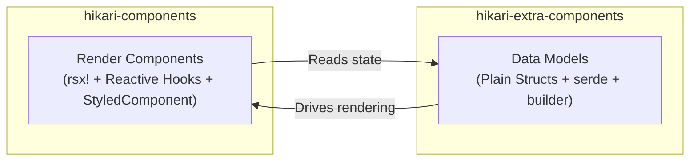

# Dual-Layer Package Architecture: components and extra-components

Hikari splits its component system into two complementary packages, each responsible for a different level of concern:



### Responsibility Comparison

| Dimension | `hikari-components` | `hikari-extra-components` |
|-----------|----------------------|---------------------------|
| **Rendering** | `rsx!` macro, reactive hooks | None (framework-agnostic) |
| **State Management** | `use_signal()`, `use_effect()` | Plain mutable struct fields |
| **Event Handling** | `EventHandler<T>` closures | `data-action` attributes + external binding |
| **CSS Embedding** | `StyledComponent` trait | Exports `pub const *_STYLES` |
| **Serialization** | Not required | All state types derive `serde` |
| **DOM Dependency** | Requires Tairitsu framework | None |
| **Use Cases** | Real-time UI rendering within Tairitsu apps | SSR, testing, state persistence, non-Tairitsu frameworks |

### Overlapping Component Domains

The following components exist in both packages. This is **intentional design**, not redundancy:

- `Timeline` / `TimelineState`
- `DragLayer` / `DragLayerState`
- `UserGuide` / `UserGuideState`
- `ZoomControls` / `ZoomControlsState`
- `VideoPlayer` / `VideoPlayerState`
- `RichTextEditor` / `RichTextEditorState`
- `CodeHighlight` / `CodeHighlighterState`

The `components` version provides **ready-to-use render components** (with animations, keyboard handling, icon integration, and StyledComponent CSS);
the `extra-components` version provides **pure data models** (with builder pattern, serde serialization, mutation methods, and unit testing).

### When to Use Which Package

- **Tairitsu applications**: Use `hikari-components` for UI rendering; optionally use `hikari-extra-components` for state persistence or undo/redo
- **Non-Tairitsu applications**: Use the data models from `hikari-extra-components` and implement rendering yourself
- **Testing**: Use `hikari-extra-components` for unit testing state logic without a DOM environment
- **SSR**: Use both — data models for server-side state, render components for client-side hydration

### Type Disambiguation

Some types share the same name across both packages (e.g., `TimelinePosition`, `GuideStep`). Use explicit module paths when importing:

```rust,ignore
use hikari_extra_components::extra::TimelineState;     // Pure data model
use hikari_components::display::Timeline;              // Render component

use hikari_extra_components::extra::ZoomControlsState; // Pure state
use hikari_components::display::ZoomControls;          // Render component
```

### CSS Class Names

Both packages use different CSS class names for the same conceptual element. This is intentional — `components` uses typed class enums from `hikari-palette` (e.g., `ZoomControlsClass::Button`), while `extra-components` uses hardcoded strings or computed methods. When both packages are used together, each renders with its own class set.
