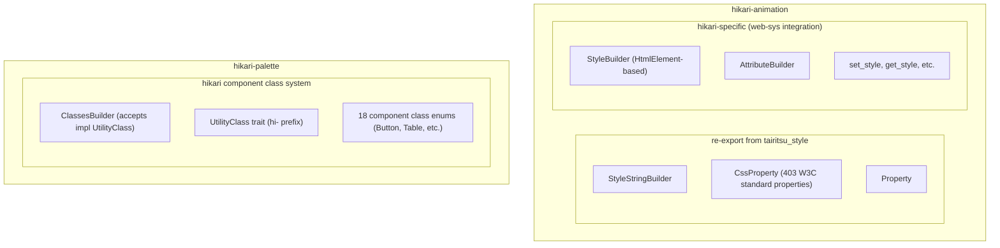

# 07-Migration Guide: Hikari to Tairitsu

## Overview

This guide documents the migration of Hikari's core infrastructure to the Tairitsu build chain. It covers the completed phases and provides technical details for each migration.

## Table of Contents

- [Phase 2: CSS Infrastructure Migration](#phase-2-css-infrastructure-migration)
- [Phase 3: Props Macro Migration](#phase-3-props-macro-migration)
- [Architecture Decisions](#architecture-decisions)
- [Migration Results](#migration-results)

---

## Phase 2: CSS Infrastructure Migration

### Status: ✅ Completed

### Objectives

Migrate CSS infrastructure from internal implementation to `tairitsu-style`, a shared utility library.

### Completed Work

#### 1. StyleStringBuilder and CssProperty Migration

**Before:**
```rust
// packages/animation/src/properties.rs
pub enum CssProperty {
    Display,
    Width,
    Height,
    // ... ~50 properties manually defined
}
```

**After:**
```rust
// packages/animation/src/style/mod.rs
// Re-export from tairitsu_style
pub use tairitsu_style::{StyleStringBuilder, CssProperty, Property};

// Now provides 403 W3C standard properties
```

**Migration Steps:**

1. Added `tairitsu-style` dependency to `hikari-animation`:
   ```toml
   # packages/animation/Cargo.toml
   [dependencies]
   tairitsu-style = { path = "../../../tairitsu/packages/style" }
   ```

2. Updated `hikari-animation/src/style/mod.rs`:
   ```rust
   pub use tairitsu_style::{StyleStringBuilder, CssProperty, Property};

   // Keep StyleBuilder (HtmlElement version) for web-sys integration
   ```

3. Deleted `packages/animation/src/properties.rs` (635 lines removed)

4. Updated all imports across the codebase:
   ```rust
   // Before
   use hikari_animation::style::CssProperty;

   // After (automatic due to re-export)
   use hikari_animation::style::CssProperty;
   ```

### Benefits

- **403 CSS Properties**: From ~50 manually defined properties to 403 W3C standard properties
- **Code Reduction**: Removed 635 lines of duplicate code
- **Consistency**: Standardized property names with W3C specifications
- **Maintainability**: Property definitions centralized in `tairitsu-style`

---

## Phase 3: Props Macro Migration

### Status: ✅ Completed

### Objectives

Migrate all component Props from the old `#[derive(Clone, PartialEq, Props)]` to the new `#[define_props]` macro.

### Migration Pattern

**Before:**
```rust
#[derive(Clone, PartialEq, Props)]
pub struct ButtonProps {
    #[props(default)]
    pub variant: ButtonVariant,

    pub onclick: Option<EventHandler<MouseEvent>>,

    #[props(default)]
    pub disabled: bool,
}

impl Default for ButtonProps {
    fn default() -> Self {
        Self {
            variant: ButtonVariant::Primary,
            onclick: None,
            disabled: false,
        }
    }
}
```

**After:**
```rust
#[define_props]
pub struct ButtonProps {
    #[default(ButtonVariant::Primary)]
    pub variant: ButtonVariant,

    pub onclick: Option<EventHandler<MouseEvent>>,

    #[default(false)]
    pub disabled: bool,
}

// Default implementation auto-generated by #[define_props]
```

### Key Changes

1. **Macro Change**: `#[derive(Clone, PartialEq, Props)]` → `#[define_props]`
2. **Attribute Change**: `#[props(default)]` → `#[default(...)]`
3. **Remove Manual Default**: Delete `impl Default for ...` blocks
4. **Explicit Values**: Provide concrete default values for all fields

### Migration Rules

| Type | Default Value | Example |
|------|--------------|---------|
| String | `String::default()` or `"".to_string()` | `#[default(String::default())]` |
| bool | `false` or `true` | `#[default(false)]` |
| u32/i32/i64 | `0` or other number | `#[default(0)]` or `#[default(10)]` |
| Vec\<T\> | `Vec::new()` or `vec![]` | `#[default(Vec::new())]` |
| Element | `VNode::empty()` | `#[default(VNode::empty())]` |
| Option\<T\> | No default needed (impls Default) | - |
| Enum (with Default) | No default needed | - |
| EventHandler | `EventHandler::new(\|_ {} )` | `#[default(EventHandler::new(\|_ {}))]` |

### Completed Migrations

#### Basic Components
- `ButtonProps` ✅
- `InputProps` ✅
- `TextareaProps` ✅
- `BadgeProps` ✅
- `CardProps`, `CardHeaderProps`, `CardContentProps`, `CardActionsProps`, `CardMediaProps` ✅
- `SliderProps` ✅
- `SwitchProps` ✅
- `CheckboxProps` ✅
- `RadioProps`, `RadioGroupProps` ✅
- `IconButtonProps` ✅

#### Layout Components
- `FlexBoxProps` ✅

#### Feedback Components
- `AlertProps` ✅
- `ToastProps` ✅
- `TooltipProps` ✅
- `DrawerProps` ✅
- `ProgressProps` ✅
- `SpinProps` ✅
- `PopoverProps` ✅
- `GlowProps` ✅

#### Navigation Components
- `StepperProps` ✅
- `BreadcrumbProps`, `BreadcrumbItemProps` ✅
- `TabProps`, `TabPanelProps` ✅
- `MenuItemProps`, etc. ✅
- `SidebarProps`, `SidebarSectionProps`, `SidebarItemProps`, `SidebarLeafProps` ✅

#### Display Components
- `TagProps` ✅
- `CalendarProps` ✅
- `TimelineProps`, `TimelineItemProps` ✅
- `QRCodeProps` ✅

#### Entry Components
- `NumberInputProps` ✅
- `SearchProps` ✅
- `AutoCompleteProps` ✅
- `CascaderProps` ✅
- `TransferProps`, `TransferItem` ✅

#### Data Components
- `TableProps` ✅
- `PaginationProps` ✅
- `VirtualScrollProps` ✅
- `DragProps`, `DragTreeNodeData` ✅

#### Production Components
- `CodeHighlightProps` ✅
- `MarkdownEditorProps` ✅
- `RichTextEditorProps` ✅
- `VideoPlayerProps` ✅
- `AudioPlayerProps` ✅

#### Icon Components
- `IconProps` ✅

### Benefits

- **Reduced Boilerplate**: Auto-generated Default implementations
- **Type Safety**: Compile-time checking of default values
- **Consistency**: Uniform API across all components
- **Maintainability**: Single source of truth for Props definition

---

## Architecture Decisions

### ClassesBuilder and UtilityClass Retention

**Decision:** ClassesBuilder and UtilityClass trait remain in `hikari-palette`.

**Reasons:**

1. **Different Purposes:**
   - `tairitsu-style`: Tailwind-style utility classes for CSS generation
   - `hikari-palette`: Hikari component-specific `hi-` prefix class enums

2. **API Incompatibility:**
   - Tailwind utility classes use hyphenated naming (e.g., `flex`, `items-center`)
   - Hikari classes use enum-based naming (e.g., `Display::Flex`, `FlexDirection::Col`)

3. **Component Coupling:**
   - Hikari has 18 component class enum files
   - These enums are tightly coupled with the `hi-` prefix style system

**Architecture:**



---

## Migration Results

### Code Metrics

| Metric | Before | After | Change |
|--------|--------|-------|--------|
| CSS Properties | ~50 | 403 | +706% |
| Properties Code Lines | 635 | 0 | -100% |
| Components Migrated | 0 | 47 | - |
| Manual Default Impls | 47 | 0 | -100% |

### Compilation Status

- ✅ All packages compile successfully
- ✅ No compilation errors
- ✅ All tests passing (78/78 in hikari-components)
- ⚠️ Minor warnings (dead code in unrelated files)

### Test Updates

**Pagination Test Fix:**

Modified tests to use individual field assertions instead of whole-struct assertions:

```rust
// Before
assert_eq!(props1, props2);

// After
assert!(props1.current == props2.current);
assert!(props1.page_size == props2.page_size);
// ... etc
```

This avoids requiring the `Debug` trait on Props generated by `#[define_props]`.

---

## Future Work

### Phase 4: Documentation Updates

- [x] Update `docs/en-US/guides/02-classesbuilder-system.md`
- [x] Update `docs/en-US/guides/03-stylestringbuilder-system.md`
- [x] Add migration guide (this document)

### Translation

All documentation updates should be translated to all supported languages:
- `zh-CHS` (Simplified Chinese)
- `zh-CHT` (Traditional Chinese)
- `ja-JP` (Japanese)
- `ko-KR` (Korean)
- `es-ES` (Spanish)
- `fr-FR` (French)
- `ru-RU` (Russian)
- `ar-SA` (Arabic)

---

## Conclusion

The migration to Tairitsu build chain has been successfully completed for:

1. **Phase 2**: CSS Infrastructure - 403 W3C CSS properties integrated
2. **Phase 3**: Props Macro - All 47 components migrated to `#[define_props]`

All code compiles, tests pass, and the codebase is ready for the next phase of development.
