# Hikari Architecture

This document provides an overview of the Hikari project architecture, including package relationships, design patterns, technology choices, and future roadmap.

## Table of Contents

- [Overview](#overview)
- [Architecture Principles](#architecture-principles)
- [Package Architecture](#package-architecture)
- [Technology Stack](#technology-stack)
- [Design Patterns](#design-patterns)
- [Data Flow](#data-flow)
- [Component Architecture](#component-architecture)
- [Theme System Architecture](#theme-system-architecture)
- [Build and Bundle System](#build-and-bundle-system)
- [Testing Strategy](#testing-strategy)
- [Future Roadmap](#future-roadmap)

## Overview

Hikari is a modular Rust UI framework built around Tairitsu, following a workspace-based architecture. The project is organized into several focused packages, each with a specific responsibility:

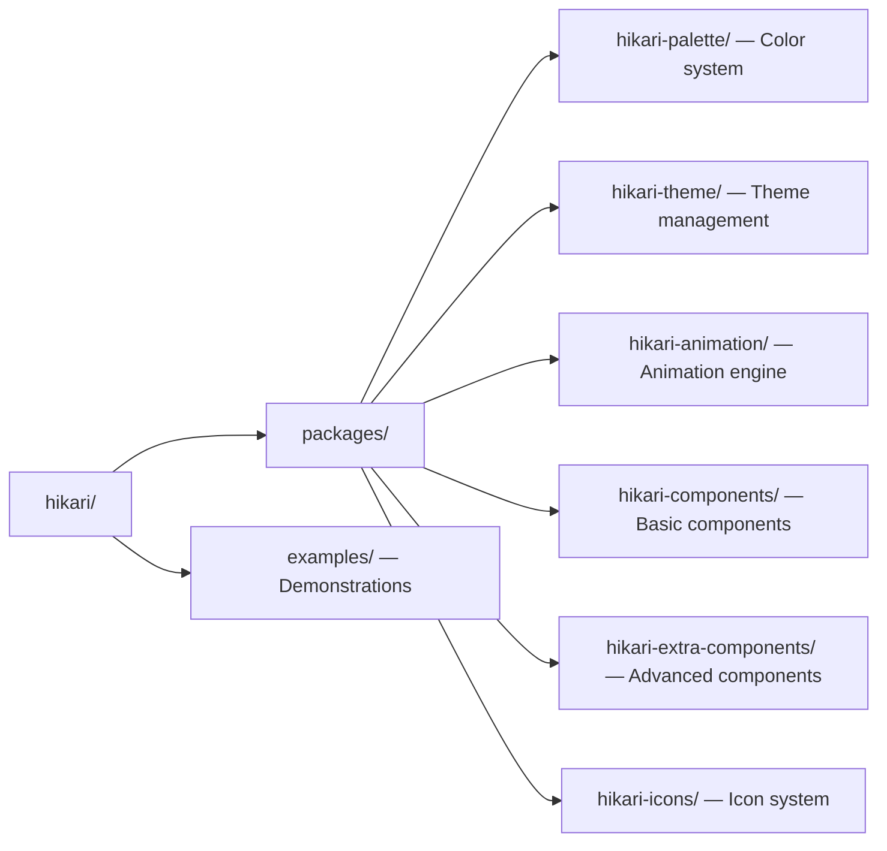

### Design Philosophy

Hikari follows three core design principles:

1. **Modularity** - Each package has a single, well-defined responsibility
2. **Composability** - Packages can be used independently or combined
3. **Type Safety** - Leverage Rust's type system for compile-time guarantees

## Architecture Principles

### 1. Separation of Concerns

Each package handles a specific aspect of the framework:

- **hikari-palette**: Color data and palette generation (no UI dependencies)
- **hikari-theme**: Theme management and CSS variables (depends on palette)
- **hikari-components**: UI components (depends on palette and theme)
- **hikari-extra-components**: Advanced components (depends on components)
- **hikari-animation**: Animation engine, easing, state machine (depends on tairitsu)
- **hikari-icons**: MDI icon integration (depends on animation)

### 2. Dependency Inversion

Packages depend on abstractions, not concrete implementations:

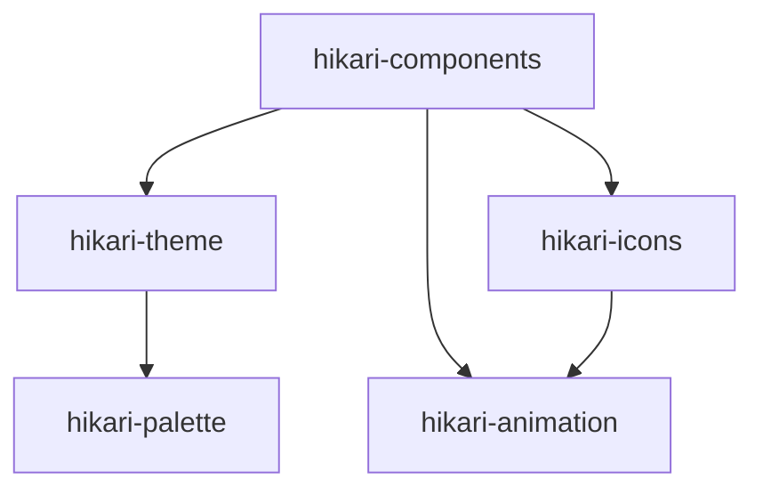

This creates a clear dependency hierarchy and prevents circular dependencies.

### 3. Library over Framework

Hikari is designed as a library, not a framework:

- No mandatory build steps
- No code generation required
- Use only what you need
- Easy to integrate incrementally

## Package Architecture

### Dependency Graph

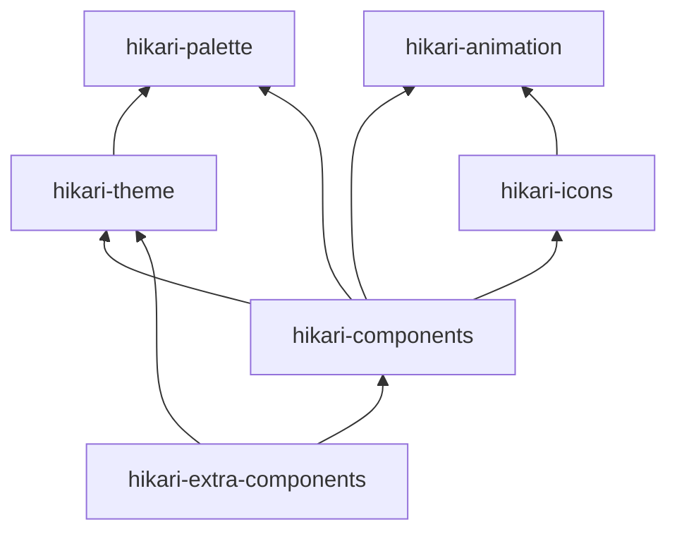

### Package Responsibilities

#### hikari-palette
**Purpose**: Color system foundation

**Responsibilities**:
- Define color data structures
- Provide 660+ traditional Chinese colors
- Generate pre-defined palettes
- Serialize/deserialize colors

**Dependencies**: None (foundation package)

**Exports**:
```rust
pub use colors::*;
pub use palettes::*;
```

#### hikari-theme
**Purpose**: Theme management and CSS generation

**Responsibilities**:
- Theme context provider
- CSS variable definitions
- SCSS mixins and utilities
- Theme switching logic

**Dependencies**:
- `hikari-palette` (for color data)

**Exports**:
```rust
pub use context::*;
pub use provider::*;
```

#### hikari-components
**Purpose**: Core UI component library (rendered components)

**Responsibilities**:
- Basic components (Button, Input, Card, Badge)
- Feedback components (Alert, Toast, Tooltip, Modal, Drawer)
- Navigation components (Menu, Tabs, Breadcrumb)
- Data components (Table, Tree, Pagination)
- Display components (Tag, Skeleton, Calendar, Timeline, UserGuide, ZoomControls)
- Layout components (Header, Aside, Grid, Flex)
- Entry components (NumberInput, Search, Cascader, Transfer)
- Production components (AudioPlayer, VideoPlayer, CodeHighlight, RichTextEditor)
- Theme provider and portal system

**Design approach**: Tairitsu `rsx!` macro-based rendered components with reactive hooks (`use_signal`, `use_effect`), `StyledComponent` trait for CSS embedding, and typed CSS class enums from `hikari-palette`.

**Dependencies**:
- `hikari-palette` (for color types and utility classes)
- `hikari-theme` (for theming)
- `hikari-icons` (for MDI icon components)
- `hikari-animation` (for animation hooks)

**Exports**:
```rust
pub use basic::*;
pub use feedback::*;
pub use navigation::*;
pub use data::*;
pub use display::*;
pub use layout::*;
pub use entry::*;
pub use production::*;
```

#### hikari-extra-components
**Purpose**: Framework-agnostic data models for advanced UI scenarios

**Responsibilities**:
- Pure state models for advanced components (DragLayerState, TimelineState, ZoomControlsState, UserGuideState, etc.)
- Node graph system (NodeGraphState, Connection, Port, minimap, history, plugins)
- Rich media state models (RichTextEditorState, VideoPlayerState, AudioWaveformState, CodeHighlighterState)
- Event types and builder patterns for all state models

**Design approach**: Pure Rust structs with `serde` support — no rendering framework dependency. These models can be used with any frontend framework (Tairitsu, Yew, Leptos) or in SSR/testing contexts without pulling in a DOM library.

**Dependencies**:
- `hikari-components` (reuses types like `sanitize_html`)
- `hikari-theme` (for theme integration)
- `hikari-palette` (for color types)
- `serde` (for serialization)

**Exports**:
```rust
pub use extra::*;
pub use node_graph::*;
```

> **Note:** Some types share names across `hikari-components` and `hikari-extra-components` (e.g., `TimelinePosition`, `GuideStep`). The `components` versions are rendered tairitsu-style components with `Element` children and event handlers; the `extra-components` versions are pure data structs with `String` fields and `serde` derives. Import with explicit module paths to disambiguate.

#### hikari-animation
**Purpose**: Animation engine and presets

**Responsibilities**:
- State machine animation engine
- Easing functions (30+)
- Tween interpolation and timelines
- Animation presets (glow, neon, tech, transitions)

**Dependencies**:
- `tairitsu-vdom` (for Platform trait)

**Exports**:
```rust
pub use presets::*;
pub use core::{AnimationEngine, Tween, TweenId};
pub use easing::EasingFunction;
```

#### hikari-icons
**Purpose**: Material Design Icons integration

**Responsibilities**:
- MDI icon fetching and caching
- SVG AST rendering
- Icon name validation

**Dependencies**:
- `hikari-animation` (for icon animations)

**Exports**:
```rust
pub use Icon;
pub use IconSize;
```

## Technology Stack

### Frontend

- **Tairitsu**: React-like UI framework for Rust
  - Virtual DOM
  - Component-based architecture
  - Hooks for state management
  - WebAssembly compilation

- **WASI (wasm32-wasip2)**: WebAssembly System Interface
  - Native WASM Component Model runtime
  - Type-safe WIT bindings instead of JS glue

### Styling

- **Grass**: SCSS compiler for Rust
  - Compile SCSS to CSS at build time
  - Full SCSS feature support
  - Fast compilation

- **SCSS**: Stylesheet language
  - Variables and mixins
  - Nesting and inheritance
  - Functions and operations

### Server (for SSR in examples)

- **Axum 0.8**: Web framework
  - Tower-based middleware
  - Async handlers
  - Type-safe routing

- **Tokio**: Async runtime
  - Futures executor
  - Networking and I/O

### Build System

- **Cargo**: Rust package manager
  - Workspace support
  - Dependency management
  - Build profiles

- **Just**: Command runner
  - Task automation
  - Build scripts
  - Development workflows

### Tooling

- **Python 3.11+**: Development tooling
  - Code formatting
  - Linting
  - Pre-commit hooks

## Design Patterns

### 1. Builder Pattern

Used extensively for configuration:

```rust
let app = HikariSsrPlugin::new()
    .static_assets("./dist")
    .add_route("/api/health", get(health))
    .state("app_name", "Hikari App")
    .build()?;
```

**Benefits**:
- Fluent API
- Optional parameters
- Clear configuration flow
- Type-safe

### 2. Component Pattern

Tairitsu components follow React-like patterns:

```rust
#[component]
fn Button(props: ButtonProps) -> Element {
    rsx! {
        button { class: "{props.class}", {props.children} }
    }
}
```

**Benefits**:
- Reusable UI elements
- Composable
- Props-based configuration
- Clear lifecycle

### 3. Context Pattern

Theme and state management:

```rust
rsx! {
    ThemeProvider { initial_palette: "hikari",
        // All children have access to theme
        Button { "Themed Button" }
    }
}
```

**Benefits**:
- Global state sharing
- Avoid prop drilling
- Dynamic updates
- Type-safe access

### 4. Module Pattern

Component organization:

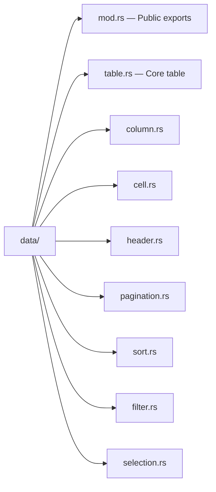

**Benefits**:
- Clear separation
- Easy to navigate
- Encapsulated functionality
- Testable modules

### 5. Provider Pattern

Theme provision to component tree:

```rust
#[component]
pub fn ThemeProvider(props: ThemeProviderProps) -> Element {
    rsx! {
        div {
            "data-theme": "{props.palette}",
            {props.children}
        }
    }
}
```

**Benefits**:
- Centralized configuration
- Automatic propagation
- Easy theme switching
- No manual prop passing

## Data Flow

### Component Data Flow

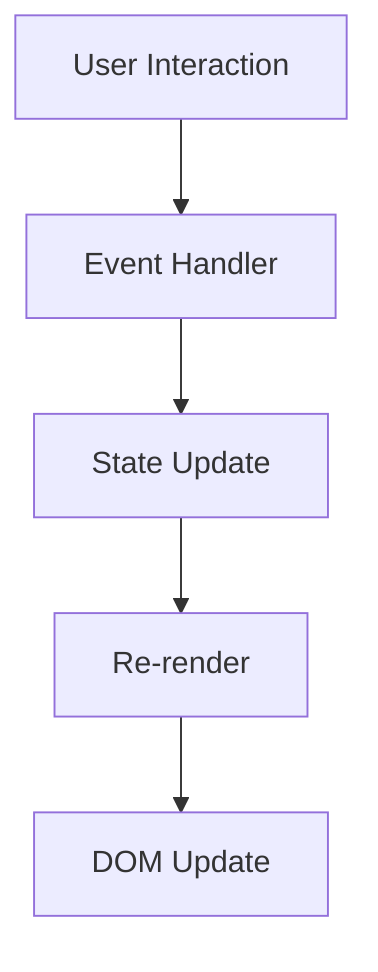

### Theme Data Flow

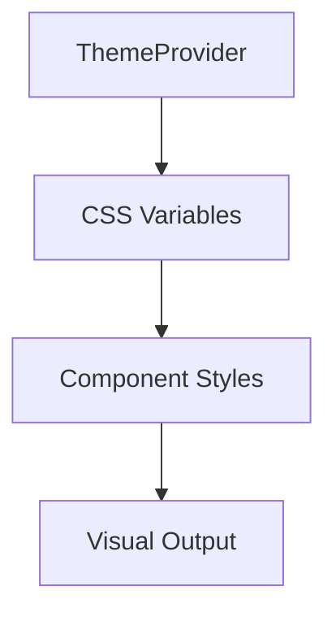

### SSR Data Flow (examples/website)

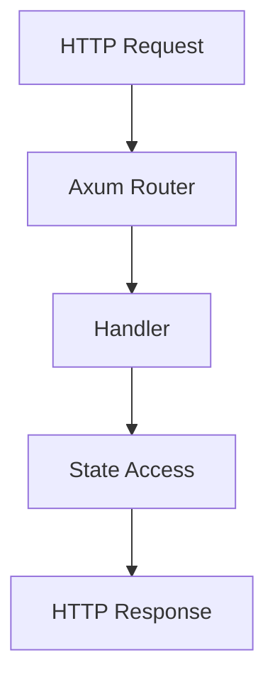

## Component Architecture

### Component Hierarchy

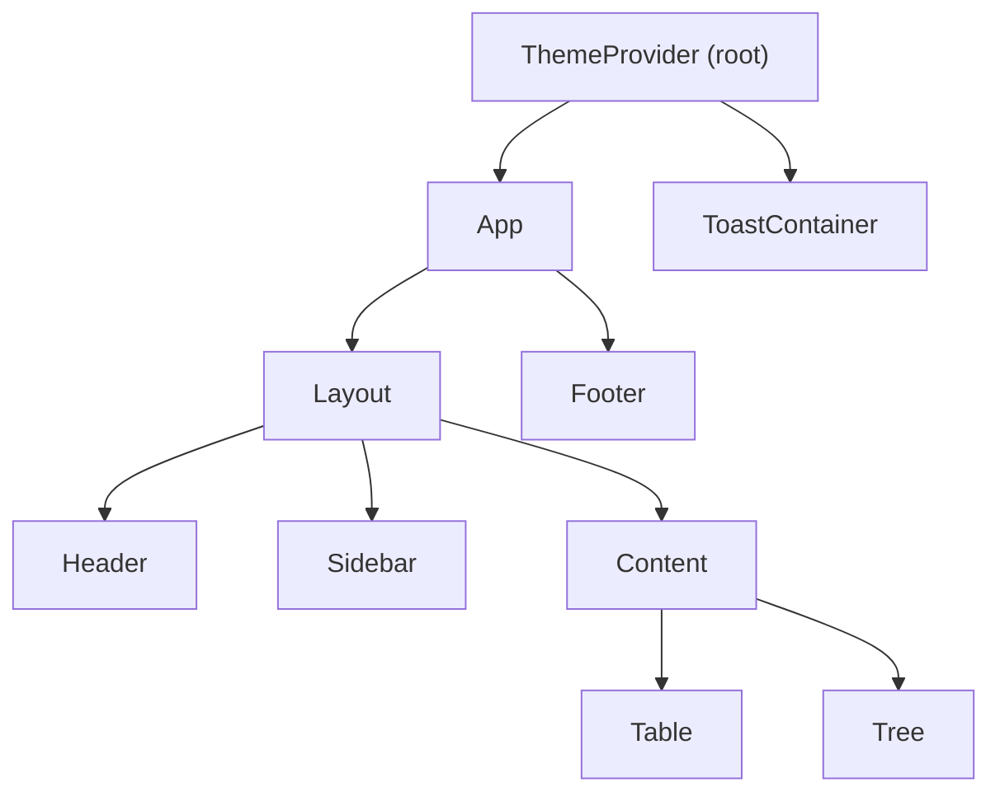

### Component Lifecycle

1. **Mount**: Component is created and added to DOM
2. **Update**: Props or state change triggers re-render
3. **UnMount**: Component is removed from DOM

### State Management

- **Local State**: `use_signal` for component-local state
- **Shared State**: Context providers for global state
- **Server State**: Axum state for SSR applications

## Theme System Architecture

### Theme Structure

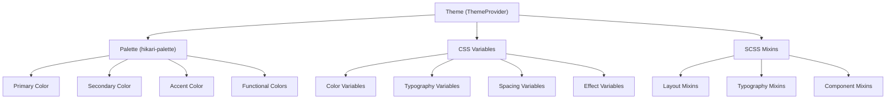

### Theme Application

1. **Rust Side**: ThemeProvider sets `data-theme` attribute
2. **CSS Side**: CSS variables scoped to `[data-theme="..."]`
3. **Component Side**: Components use CSS variables

## Build and Bundle System

### Cargo Workspace

```toml
[workspace]
members = [
    "packages/palette",
    "packages/theme",
    "packages/animation",
    "packages/components",
    "packages/extra-components",
    "packages/icons",
]
```

**Benefits**:
- Shared dependencies
- Unified compilation
- Easy inter-package development
- Consistent versioning

### Build Profiles

```toml
[profile.release]
opt-level = 3
lto = true
codegen-units = 1
strip = true
```

**Benefits**:
- Optimized WASM output
- Small bundle sizes
- Fast runtime performance

### Just Commands

```makefile
build:        # Build all packages
test:         # Run tests
fmt:          # Format code
clippy:       # Run linter
dev:          # Start dev server
```

**Benefits**:
- Consistent commands
- Easy to remember
- Cross-platform
- Documented workflows

## Testing Strategy

### Unit Tests

Package-level unit tests:

```rust
#[cfg(test)]
mod tests {
    use super::*;

    #[test]
    fn test_color_rgb() {
        assert_eq!(石青.rgb, (23, 89, 168));
    }
}
```

### Integration Tests

Cross-package integration:

```rust
#[tokio::test]
async fn test_theme_provider() {
    // Test theme provider with components
}
```

### Example Tests

Example applications serve as integration tests:

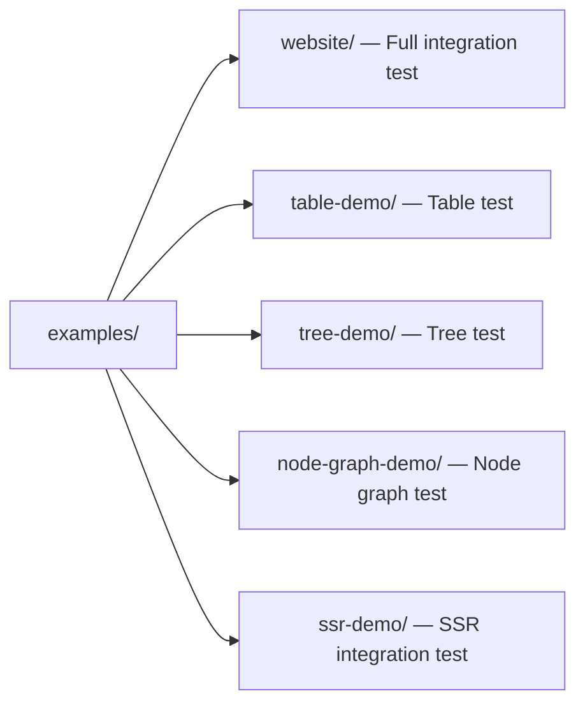

## Future Roadmap

### Phase 4: hikari-components (Current)

- [x] Basic components (Button, Input, Card, Badge)
- [x] Feedback components (Alert, Toast, Tooltip)
- [x] Navigation components (Menu, Tabs, Breadcrumb)
- [x] Data components (Table, Tree)
- [x] Comprehensive component testing (275+ tests)
- [x] Component documentation

### Phase 5: hikari-extra-components

- [x] Node graph system (with serialization, history, plugins)
- [x] Advanced utilities (DragLayer, Collapsible, ZoomControls)
- [ ] Performance optimization
- [ ] Use case examples

### Phase 6: Examples

- [ ] Complete demo-app
- [ ] Individual component demos
- [x] SSR in example website
- [ ] Performance benchmarks

### Phase 7: Documentation

- [ ] API documentation
- [ ] Migration guides
- [ ] Best practices
- [ ] Video tutorials

### Phase 8: Ecosystem

- [ ] CLI tooling
- [ ] Starter templates
- [ ] VS Code extension
- [ ] Community components

### Long-term Vision

- **Design System**: Complete design system specification
- **Component Library**: 50+ production-ready components
- **Tooling**: Developer tools and debugging
- **Community**: Plugin ecosystem and contribution guidelines
- **Performance**: Best-in-class WASM performance

## Architectural Decisions

### Dual-Layer Package Architecture: components vs extra-components

Hikari intentionally splits its component offerings into two packages with complementary responsibilities:

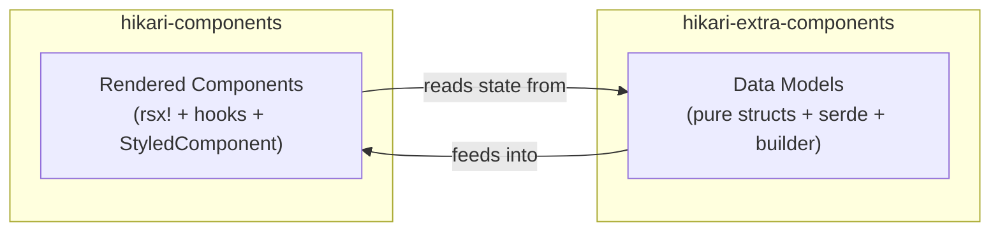

**Why two packages?**

| Concern | `hikari-components` | `hikari-extra-components` |
|---------|---------------------|---------------------------|
| **Rendering** | `rsx!` macro, reactive hooks | None (framework-agnostic) |
| **State management** | `use_signal()`, `use_effect()` | Plain mutable struct fields |
| **Event handling** | `EventHandler<T>` closures | `data-action` attributes + external wiring |
| **CSS embedding** | `StyledComponent` trait | `pub const *_STYLES: &str` |
| **Serialization** | Not required | `serde` derives on all state types |
| **DOM dependency** | Requires Tairitsu framework | None |
| **Use case** | Live UI rendering in Tairitsu apps | SSR, testing, state persistence, non-Tairitsu frameworks |

**Overlapping component domains** (e.g., Timeline, DragLayer, UserGuide, ZoomControls, VideoPlayer, RichTextEditor, CodeHighlight) exist in both packages by design:

- The `components` version provides a **ready-to-use rendered component** with animations, keyboard handling, icon integration, and `StyledComponent` CSS.
- The `extra-components` version provides a **pure state model** with builder pattern, `serde` serialization, mutation methods, and unit tests — but no rendering.

**When to use which:**
- **Tairitsu application**: Use `hikari-components` for rendered UI; optionally use `hikari-extra-components` for state persistence, undo/redo, or serialization.
- **Non-Tairitsu application**: Use `hikari-extra-components` data models and implement your own rendering.
- **Testing**: Use `hikari-extra-components` for unit testing state logic without a DOM.
- **SSR**: Use both — data models for server-side state, rendered components for client hydration.

**Type name disambiguation:**

Some types exist in both packages (e.g., `TimelinePosition`, `GuideStep`). Import with explicit paths:

```rust,ignore
use hikari_extra_components::extra::TimelineState;     // pure data model
use hikari_components::display::Timeline;              // rendered component

use hikari_extra_components::extra::ZoomControlsState; // pure state
use hikari_components::display::ZoomControls;          // rendered component
```

**CSS class naming:** The two packages use different CSS class names for the same conceptual elements. This is intentional — `components` uses typed class enums from `hikari-palette` (e.g., `ZoomControlsClass::Button`), while `extra-components` uses hardcoded strings or computed methods. When both packages are used together, each renders with its own class set.

### Why Tairitsu?

- **Rust Native**: No JavaScript required for logic
- **Type Safety**: Compile-time guarantees
- **Performance**: Efficient virtual DOM
- **WASM**: Native browser support
- **React-like**: Familiar patterns

### Why Axum?

- **Tower**: Ecosystem compatibility
- **Type Safety**: Route and state safety
- **Async**: Modern async/await
- **Performance**: Fast and efficient
- **Ergonomic**: Clean API design

### Why SCSS?

- **Features**: Variables, mixins, nesting
- **Ecosystem**: Large community and tools
- **Compilation**: Fast with Grass
- **Adoption**: Industry standard
- **Maintainability**: Organized styles

### Why Workspace?

- **Monorepo**: Unified development
- **Sharing**: Code reuse between packages
- **Versioning**: Consistent versions
- **CI/CD**: Simplified pipelines
- **Documentation**: Co-located docs

## Performance Considerations

### WASM Optimization

- **LTO**: Link-time optimization enabled
- **Codegen Units**: Single unit for better optimization
- **Strip**: Remove debug symbols
- **Opt-level**: Maximum optimization

### Runtime Performance

- **Virtual DOM**: Efficient updates
- **Signals**: Fine-grained reactivity
- **Lazy Loading**: Component code splitting
- **Caching**: Static asset caching

### Bundle Size

- **Tree Shaking**: Unused code elimination
- **Compression**: Gzip enabled
- **WASM Opt**: Size optimization
- **Minimal Dependencies**: Few external deps

## Security Considerations

### Static Files

- **Path Sanitization**: Prevent directory traversal
- **MIME Types**: Proper content types
- **Cache Headers**: Controlled caching
- **File Limits**: Size restrictions

### SSR

- **State Isolation**: Request-scoped state
- **Error Handling**: Graceful failures
- **Validation**: Input validation
- **Logging**: Audit trails

## Conclusion

Hikari's architecture is designed to be:

- **Modular**: Clear package boundaries
- **Composable**: Use what you need
- **Performant**: Optimized WASM output
- **Type-Safe**: Leverage Rust's type system
- **Maintainable**: Clean code organization
- **Extensible**: Easy to add features

The architecture supports the project's goals of providing a modern, type-safe UI framework that blends traditional Chinese aesthetics with futuristic design elements.
