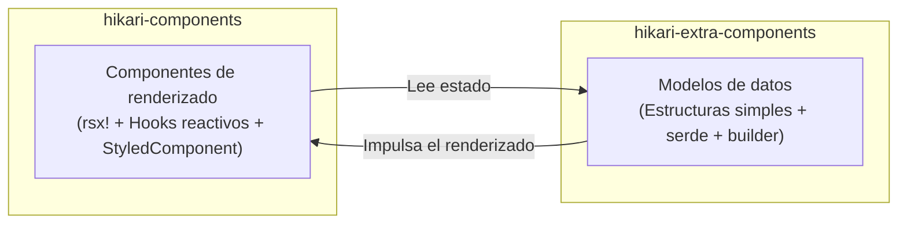

# Arquitectura de paquetes de dos capas: components y extra-components

Hikari divide su sistema de componentes en dos paquetes complementarios, cada uno responsable de un nivel de preocupación diferente:



### Comparación de responsabilidades

| Dimensión | `hikari-components` | `hikari-extra-components` |
|-----------|----------------------|---------------------------|
| **Renderizado** | Macro `rsx!`, hooks reactivos | Ninguno (independiente del framework) |
| **Gestión de estado** | `use_signal()`, `use_effect()` | Campos de estructura mutables simples |
| **Manejo de eventos** | Closures `EventHandler<T>` | Atributos `data-action` + enlace externo |
| **Integración CSS** | Trait `StyledComponent` | Exporta `pub const *_STYLES` |
| **Serialización** | No necesaria | Todos los tipos de estado derivan `serde` |
| **Dependencia del DOM** | Requiere el framework Tairitsu | Ninguna |
| **Casos de uso** | Renderizado de UI en tiempo real en aplicaciones Tairitsu | SSR, testing, persistencia de estado, frameworks no-Tairitsu |

### Dominios de componentes superpuestos

Los siguientes componentes existen en ambos paquetes. Esto es un **diseño intencional**, no redundancia:

- `Timeline` / `TimelineState`
- `DragLayer` / `DragLayerState`
- `UserGuide` / `UserGuideState`
- `ZoomControls` / `ZoomControlsState`
- `VideoPlayer` / `VideoPlayerState`
- `RichTextEditor` / `RichTextEditorState`
- `CodeHighlight` / `CodeHighlighterState`

La versión de `components` proporciona **componentes de renderizado listos para usar** (con animaciones, manejo de teclado, integración de iconos y CSS de StyledComponent) ;
la versión de `extra-components` proporciona **modelos de datos puros** (con patrón builder, serialización serde, métodos de mutación y pruebas unitarias).

### Cuándo usar cada paquete

- **Aplicaciones Tairitsu** : Use `hikari-components` para el renderizado de UI ; opcionalmente use `hikari-extra-components` para persistencia de estado o deshacer/rehacer
- **Aplicaciones no-Tairitsu** : Use los modelos de datos de `hikari-extra-components` e implemente el renderizado usted mismo
- **Testing** : Use `hikari-extra-components` para pruebas unitarias de lógica de estado sin entorno DOM
- **SSR** : Use ambos — modelos de datos para el estado del servidor, componentes de renderizado para la hidratación del cliente

### Desambiguación de tipos

Algunos tipos comparten el mismo nombre en ambos paquetes (por ej. `TimelinePosition`, `GuideStep`). Use rutas de módulo explícitas al importar:

```rust,ignore
use hikari_extra_components::extra::TimelineState;     // Modelo de datos puro
use hikari_components::display::Timeline;              // Componente de renderizado

use hikari_extra_components::extra::ZoomControlsState; // Estado puro
use hikari_components::display::ZoomControls;          // Componente de renderizado
```

### Nombres de clases CSS

Ambos paquetes usan nombres de clases CSS diferentes para el mismo elemento conceptual. Esto es intencional — `components` usa enumeraciones de clases tipadas de `hikari-palette` (por ej. `ZoomControlsClass::Button`), mientras que `extra-components` usa cadenas codificadas o métodos computados. Cuando ambos paquetes se usan juntos, cada uno renderiza con su propio conjunto de clases.
