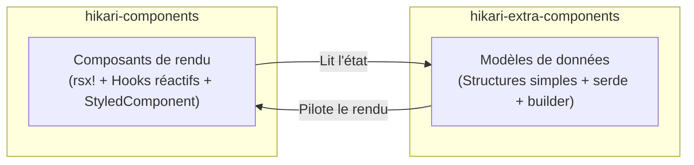

# Architecture à deux couches de paquets : components et extra-components

Hikari divise son système de composants en deux paquets complémentaires, chacun responsable d'un niveau de préoccupation différent :



### Comparaison des responsabilités

| Dimension | `hikari-components` | `hikari-extra-components` |
|-----------|----------------------|---------------------------|
| **Rendu** | Macro `rsx!`, hooks réactifs | Aucun (indépendant du framework) |
| **Gestion d'état** | `use_signal()`, `use_effect()` | Champs de structure mutables simples |
| **Gestion des événements** | Closures `EventHandler<T>` | Attributs `data-action` + liaison externe |
| **Intégration CSS** | Trait `StyledComponent` | Exporte `pub const *_STYLES` |
| **Sérialisation** | Non requise | Tous les types d'état dérivent `serde` |
| **Dépendance DOM** | Requiert le framework Tairitsu | Aucune |
| **Cas d'utilisation** | Rendu UI en temps réel dans les applications Tairitsu | SSR, tests, persistance d'état, frameworks non-Tairitsu |

### Domaines de composants chevauchants

Les composants suivants existent dans les deux paquets. Il s'agit d'une **conception intentionnelle**, et non d'une redondance :

- `Timeline` / `TimelineState`
- `DragLayer` / `DragLayerState`
- `UserGuide` / `UserGuideState`
- `ZoomControls` / `ZoomControlsState`
- `VideoPlayer` / `VideoPlayerState`
- `RichTextEditor` / `RichTextEditorState`
- `CodeHighlight` / `CodeHighlighterState`

La version `components` fournit des **composants de rendu prêts à l'emploi** (avec animations, gestion du clavier, intégration d'icônes et CSS StyledComponent) ;
la version `extra-components` fournit des **modèles de données purs** (avec pattern builder, sérialisation serde, méthodes de mutation et tests unitaires).

### Quand utiliser quel paquet

- **Applications Tairitsu** : Utilisez `hikari-components` pour le rendu UI ; utilisez optionnellement `hikari-extra-components` pour la persistance d'état ou l'annuler/rétablir
- **Applications non-Tairitsu** : Utilisez les modèles de données de `hikari-extra-components` et implémentez le rendu vous-même
- **Tests** : Utilisez `hikari-extra-components` pour les tests unitaires de logique d'état sans environnement DOM
- **SSR** : Utilisez les deux — modèles de données pour l'état côté serveur, composants de rendu pour l'hydratation côté client

### Levée d'ambiguïté de types

Certains types portent le même nom dans les deux paquets (par ex. `TimelinePosition`, `GuideStep`). Utilisez des chemins de module explicites lors de l'importation :

```rust,ignore
use hikari_extra_components::extra::TimelineState;     // Modèle de données pur
use hikari_components::display::Timeline;              // Composant de rendu

use hikari_extra_components::extra::ZoomControlsState; // État pur
use hikari_components::display::ZoomControls;          // Composant de rendu
```

### Noms de classes CSS

Les deux paquets utilisent des noms de classes CSS différents pour le même élément conceptuel. C'est intentionnel — `components` utilise des énumérations de classes typées issues de `hikari-palette` (par ex. `ZoomControlsClass::Button`), tandis qu'`extra-components` utilise des chaînes codées en dur ou des méthodes de calcul. Lorsque les deux paquets sont utilisés ensemble, chacun effectue le rendu avec son propre ensemble de classes.
