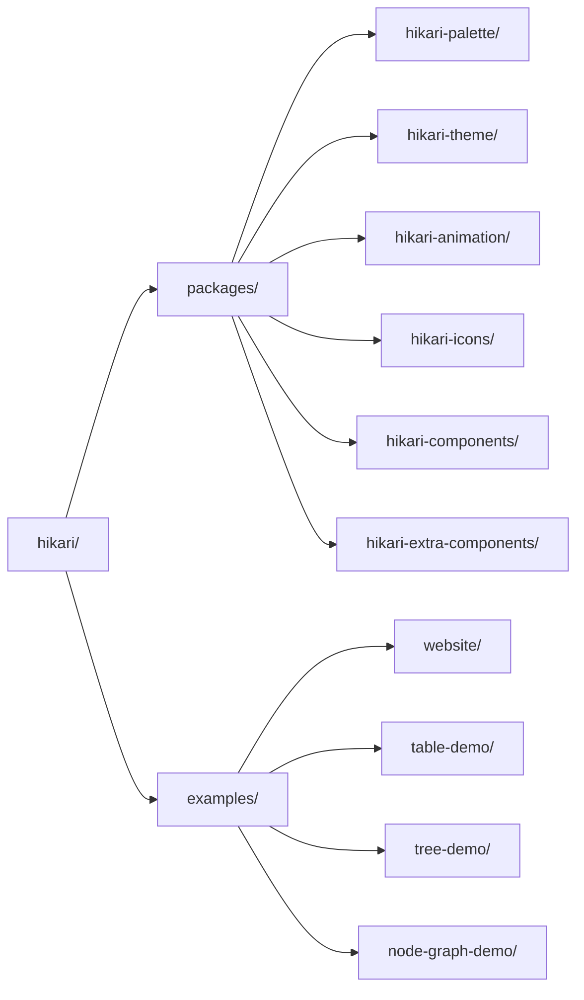

# Framework UI Hikari

> Un framework UI moderne en Rust basé sur Tairitsu + Grass + Axum
>
> **Style de Design**: Design plat  + esthétique  sci-fi + couleurs traditionnelles chinoises
>
> **Origine du Nom**: "Hikari" (Lumière) du jeu de rythme Arcaea

## Qu'est-ce que Hikari ?

Hikari est un framework UI moderne conçu pour l'écosystème Rust, combinant l'esthétique des couleurs traditionnelles chinoises avec le design d'interface sci-fi. Le framework adopte une conception modulaire, fournissant une bibliothèque de composants complète, un système de thèmes et un système d'animation.

## Fonctionnalités Principales

### 🎨 Système de Couleurs Traditionnelles Chinoises
- **Plus de 500 Couleurs Traditionnelles**: Palette complète des couleurs traditionnelles chinoises
- **Système de Thèmes**: Thèmes intégrés Hikari (clair) et Tairitsu (sombre)
- **Type-Safe**: Vérification des valeurs de couleur à la compilation

### 🧩 Riche Bibliothèque de Composants
- **Composants de Base**: Button, Input, Card, Badge
- **Composants de Feedback**: Alert, Toast, Tooltip, Spotlight
- **Composants de Navigation**: Menu, Tabs, Breadcrumb
- **Composants de Données**: Table, Tree, Pagination
- **Composants de Layout**: Layout, Header, Aside, Content, Footer
- **Composants Supplémentaires**: Collapsible, DragLayer, ZoomControls

### ✨ Puissant Système d'Animation
- **Animations Déclaratives**: API fluent de type CSS
- **Valeurs Dynamiques**: Valeurs d'animation calculées à l'exécution
- **Fonctions d'Easing**: Plus de 30 fonctions d'easing
- **Animations Prédéfinies**: Fade, slide, scale, etc.

### 🎯 Fonctionnalités Avancées
- **Rendu Côté Serveur**: Support SSR complet
- **Sécurité de Type**: Utilisation complète du système de types de Rust
- **Design Réactif**: Utilitaires de layout réactif intégrés
- **Système de Build**: Compilation SCSS automatisée et génération d'assets

## Démarrage Rapide

### Installer les Dépendances

Ajouter à `Cargo.toml`:

```toml
[dependencies]
hikari-components = "0.1"
hikari-palette = "0.1"
hikari-theme = "0.1"
tairitsu = "0.5"
```

### Utilisation de Base

```rust
use hikari_components::{ThemeProvider, Button};
use hikari_theme::ThemeProvider;

#[component]
fn App() -> Element {
    rsx! {
        ThemeProvider { palette: "hikari" } {
            div { class: "hi-flex hi-flex-col hi-gap-4" {
                Button { label: "Cliquez-moi" }
                Button { label: "Bouton Principal", variant: "primary" }
                Button { label: "Bouton Secondaire", variant: "secondary" }
            }
        }
    }
}
```

### Compiler et Exécuter

```bash
# Mode développement
cargo run

# Build
cargo build --release

# Build WASM
trunk build --release
```

## Philosophie de Design

### Design Plat 
- Lignes épurées et hiérarchie d'information claire
- Contraste élevé pour la lisibilité
- Design minimaliste mais raffiné

### Esthétique  Sci-Fi
- Effets de lueur subtils
- Indicateurs dynamiques (lumières respirantes, animations pulsées)
- Bordures fines et motifs géométriques

### Couleurs Traditionnelles Chinoises
- Primaire: 石青 (Cyan/Bleu), 朱砂 (Vermillon/Rouge), 藤黄 (Gamboge/Jaune)
- Neutre: 月白 (Blanc Clair), 墨色 (Noir Encre), 缟色 (Gris Clair)
- Fonctionnel: 葱倩 (Succès), 鹅黄 (Avertissement), 朱砂 (Danger)

## Structure du Projet



## Documentation

- [Composants](./components/) - Guide d'utilisation des composants UI
- [Système](./system/) - Architecture du système principal
- [Référence API](https://docs.rs/hikari-components) - Documentation API Rust

## Exemples

### Changement de Thème

```rust
use hikari_theme::ThemeProvider;

fn App() -> Element {
    let mut theme = use_signal(|| "hikari".to_string());

    rsx! {
        ThemeProvider { palette: "{theme}" } {
            button {
                onclick: move |_| {
                    theme.set(if *theme() == "hikari" {
                        "tairitsu".to_string()
                    } else {
                        "hikari".to_string()
                    });
                },
                "Changer de Thème"
            }
        }
    }
}
```

### Utilisation des Animations

```rust
use hikari_animation::{AnimationBuilder, AnimationContext};
use hikari_animation::style::CssProperty;

// Animation statique
AnimationBuilder::new(&elements)
    .add_style("button", CssProperty::Opacity, "0.8")
    .apply_with_transition("300ms", "ease-in-out");

// Animation dynamique (suivi de souris)
AnimationBuilder::new(&elements)
    .add_style_dynamic("button", CssProperty::Transform, |ctx| {
        let x = ctx.mouse_x();
        let y = ctx.mouse_y();
        format!("translate({}px, {}px)", x, y)
    })
    .apply_with_transition("150ms", "ease-out");
```

## Contribution

Les contributions sont les bienvenues ! Veuillez lire [CONTRIBUTING.md](../../en-US/guides/CONTRIBUTING.md) pour plus de détails.

## Licence

[Licence MIT](../../../LICENSE)

## Remerciements

- **Tairitsu** - Framework UI Rust puissant
- [Grass](https://github.com/kaj/kaj) - Compilateur SCSS pur en Rust
- [Element Plus](https://element-plus.org/) - Excellente référence de design de bibliothèque de composants
- [Material UI](https://mui.com/) - Inspiration de design UI moderne

---

**Hikari** - Minimalisme, Technologie, Confiance Culturelle
