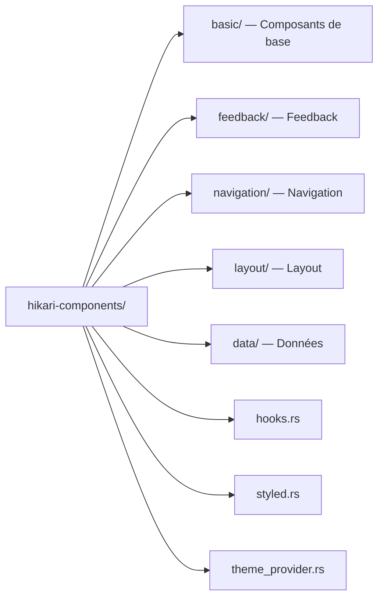
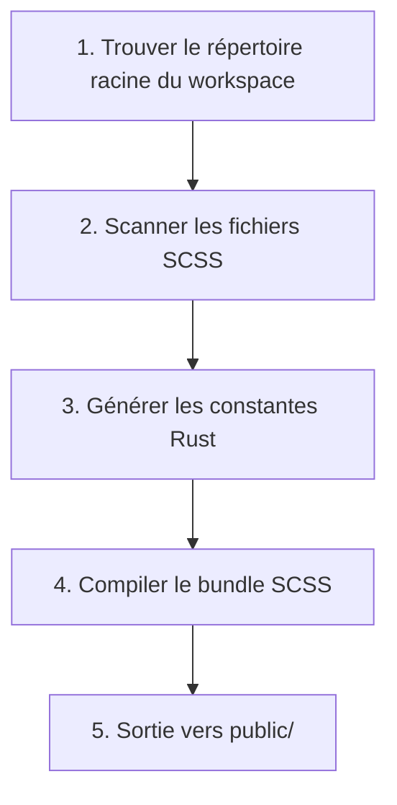
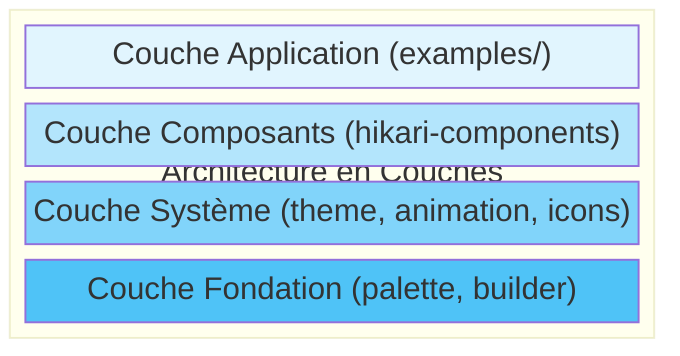
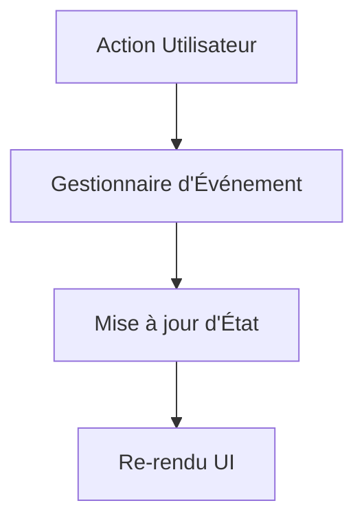
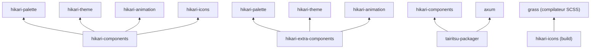

# Aperçu de l'Architecture Système

Le framework Hikari adopte une conception modulaire, composé de plusieurs packages indépendants, chacun responsable de domaines fonctionnels spécifiques.

## Systèmes Principaux

### 1. Système de Palette (hikari-palette)

Implémentation Rust du système de couleurs traditionnelles chinoises.

**Responsabilités**:
- Fournit plus de 660 définitions de couleurs traditionnelles chinoises
- Gestion des palettes de thèmes
- Générateur de classes utilitaires
- Opacité et mélange de couleurs

**Fonctionnalités Principales**:
```rust
use hikari_palette::{Color, opacity};

// Utiliser des couleurs traditionnelles
let red = Color::Cinnabar;
let blue = Color::Azurite;

// Gestion de l'opacité
let semi_red = opacity(red, 0.5);

// Système de thème
let theme = Hikari::default();
println!("Primaire: {}", theme.primary.hex());
```

**Philosophie de Design**:
- **Confiance Culturelle**: Utilisation de noms de couleurs traditionnels
- **Sécurité de Type**: Vérification des valeurs de couleur à la compilation
- **Haute Performance**: Abstractions à coût nul

### 2. Système de Thèmes (hikari-theme)

Contexte de thème et système d'injection de styles.

**Responsabilités**:
- Composant fournisseur de thème
- Gestion du contexte de thème
- Génération de variables CSS
- Changement de thème

**Fonctionnalités Principales**:
```rust
use hikari_theme::ThemeProvider;

rsx! {
    ThemeProvider { palette: "hikari" } {
        // Contenu de l'application
        App {}
    }
}
```

**Thèmes Supportés**:
- **Hikari (Clair)** - Thème clair
  - Primaire: Pink (#FFB3A7)
  - Secondaire: Vermillon (#519A73)
  - Accent: Jaune Vigne (#FFC773)

- **Tairitsu** - Thème sombre
  - Primaire: Duck Blue (#144A74)
  - Secondaire: Vermillon (#519A73)
  - Accent: Jaune Oie (#FFC773)

### 3. Système d'Animation (hikari-animation)

Système d'animation déclaratif haute performance.

**Responsabilités**:
- Constructeur d'animation
- Contexte d'animation
- Fonctions d'easing
- Animations prédéfinies

**Fonctionnalités Principales**:
```rust
use hikari_animation::{AnimationBuilder, AnimationContext};
use hikari_animation::style::CssProperty;

// Animation statique
AnimationBuilder::new(&elements)
    .add_style("button", CssProperty::Opacity, "0.8")
    .apply_with_transition("300ms", "ease-in-out");

// Animation dynamique (suivi de souris)
AnimationBuilder::new(&elements)
    .add_style_dynamic("button", CssProperty::Transform, |ctx| {
        let x = ctx.mouse_x();
        let y = ctx.mouse_y();
        format!("translate({}px, {}px)", x, y)
    })
    .apply_with_transition("150ms", "ease-out");
```

**Composants d'Architecture**:
- **builder** - API du constructeur d'animation
- **context** - Contexte d'animation à l'exécution
- **style** - Opérations CSS type-safe
- **easing** - Plus de 30 fonctions d'easing
- **tween** - Système d'interpolation
- **timeline** - Contrôle de timeline
- **presets** - Animations prédéfinies (fade, slide, scale)
- **spotlight** - Effet spotlight

**Fonctionnalités de Performance**:
- Optimisation WASM
- Mises à jour avec debounce
- Intégration requestAnimationFrame
- Minimisation des reflows et repaints

### 4. Système d'Icônes (hikari-icons)

Gestion et rendu des icônes.

**Responsabilités**:
- Définitions d'enum d'icônes
- Génération de contenu SVG
- Variantes de taille d'icônes
- Intégration Material Design Icons

**Fonctionnalités Principales**:
```rust
use hikari_icons::{Icon, MdiIcon};

rsx! {
    Icon {
        icon: MdiIcon::Search,
        size: 24,
        color: "var(--hi-primary)"
    }
}
```

**Sources d'Icônes**:
- Material Design Icons (plus de 7000 icônes)
- Icônes personnalisées extensibles
- Support de multiples tailles

### 5. Bibliothèque de Composants (hikari-components)

Bibliothèque complète de composants UI.

**Responsabilités**:
- Composants UI de base
- Composants de layout
- Registre de styles
- Hooks réactifs

**Catégories de Composants**:

1. **Composants de Base** (feature: "basic")
   - Button, Input, Card, Badge

2. **Composants de Feedback** (feature: "feedback")
   - Alert, Toast, Tooltip, Spotlight

3. **Composants de Navigation** (feature: "navigation")
   - Menu, Tabs, Breadcrumb

4. **Composants de Layout** (toujours disponibles)
   - Layout, Header, Aside, Content, Footer

5. **Composants de Données** (feature: "data")
   - Table, Tree, Pagination

**Conception Modulaire**:


**Système de Styles**:
- Source SCSS
- Classes utilitaires type-safe
- Isolation de style au niveau du composant
- Intégration des variables CSS

### 6. Système de Build (hikari-icons (build))

Génération de code à la compilation et compilation SCSS.

**Responsabilités**:
- Compilation SCSS (utilisant Grass)
- Découverte de composants
- Génération de code
- Bundling de ressources

**Processus de Build**:


**Utilisation**:
```rust
// build.rs
fn main() {
    tairitsu-icons build system::build().expect("Échec du build");
}
```

**Fichiers Générés**:
- `public/styles/bundle.css` - CSS compilé

### 7. Service de Rendu (tairitsu-packager)

Rendu côté serveur et service d'assets statiques.

**Responsabilités**:
- Rendu de template HTML
- Registre de styles
- Constructeur de routeur
- Service d'assets statiques
- Intégration Axum

**Fonctionnalités Principales**:
```rust
use hikari_render_service::HikariRenderServicePlugin;

let app = HikariRenderServicePlugin::new()
    .component_style_registry(registry)
    .static_assets("./dist", "/static")
    .add_route("/api/health", get(health_check))
    .build()?;
```

**Modules d'Architecture**:
- **html** - Service HTML
- **registry** - Registre de styles
- **router** - Constructeur de routeur
- **static_files** - Service de fichiers statiques
- **styles_service** - Injection de styles
- **plugin** - Système de plugins

### 8. Bibliothèque de Composants Supplémentaires (hikari-extra-components)

Composants UI avancés pour scénarios d'interaction complexes.

**Responsabilités**:
- Composants utilitaires avancés
- Interactions de glisser et zoomer
- Panneaux réductibles
- Intégration d'animation

**Composants Principaux**:

1. **Collapsible** - Panneau réductible
   - Animation de glissement gauche/droite
   - Largeur configurable
   - Callback d'état déployé

2. **DragLayer** - Calque de glissement
   - Contraintes de limites
   - Callbacks d'événements de glissement
   - Z-index personnalisé

3. **ZoomControls** - Contrôles de zoom
   - Support des raccourcis clavier
   - Plage de zoom configurable
   - Multiples options de positionnement

**Fonctionnalités Principales**:
```rust
use hikari_extra_components::{Collapsible, DragLayer, ZoomControls};

// Panneau réductible
Collapsible {
    title: "Paramètres".to_string(),
    expanded: true,
    position: CollapsiblePosition::Right,
    div { "Contenu" }
}

// Calque de glissement
DragLayer {
    initial_x: 100.0,
    initial_y: 100.0,
    constraints: DragConstraints {
        min_x: Some(0.0),
        max_x: Some(500.0),
        ..Default::default()
    },
    div { "Glissez-moi" }
}

// Contrôles de zoom
ZoomControls {
    zoom: 1.0,
    on_zoom_change: move |z| println!("Zoom: {}", z)
}
```

## Principes d'Architecture

### 1. Conception Modulaire

Chaque package est indépendant et peut être utilisé séparément:

```toml
# Utiliser uniquement la palette
[dependencies]
hikari-palette = "0.1"

# Utiliser les composants et le thème
[dependencies]
hikari-components = "0.1"
hikari-theme = "0.1"

# Utiliser le système d'animation
[dependencies]
hikari-animation = "0.1"
```

### 2. Architecture en Couches



### 3. Flux de Données Unidirectionnel



### 4. Sécurité de Type

Toutes les APIs sont type-safe:
- Vérification à la compilation
- Autocomplétion IDE
- Sécurité de refactoring

### 5. Performance d'Abord

- Optimisation WASM
- Défilement virtuel
- Debouncing/throttling
- Minimisation de la manipulation DOM

## Processus de Build

### Mode Développement
```bash
cargo run
```

### Build Production
```bash
# 1. Compiler le code Rust
cargo build --release

# 2. Le système de build compile automatiquement le SCSS
# 3. Générer le bundle CSS
# 4. Bundler les assets statiques
```

### Build WASM
```bash
trunk build --release
```

## Dépendances



## Extensibilité

### Ajouter des Composants Personnalisés

```rust
use hikari_components::{StyledComponent, StyleRegistry};

pub struct MyComponent;

impl StyledComponent for MyComponent {
    fn register_styles(registry: &mut StyleRegistry) {
        registry.register("my-component", include_str!("my-component.scss"));
    }
}
```

### Ajouter des Thèmes Personnalisés

```rust
use hikari_palette::ThemePalette;

struct CustomTheme;

impl CustomTheme {
    pub fn palette() -> ThemePalette {
        ThemePalette {
            primary: "#FF0000",
            secondary: "#00FF00",
            // ...
        }
    }
}
```

### Ajouter des Prédictions d'Animation Personnalisées

```rust
use hikari_animation::{AnimationBuilder, AnimationContext};

pub fn fade_in(
    builder: AnimationBuilder,
    element: &str,
    duration: u32,
) -> AnimationBuilder {
    builder
        .add_style(element, CssProperty::Opacity, "0")
        .add_style(element, CssProperty::Opacity, "1")
        .apply_with_transition(&format!("{}ms", duration), "ease-out")
}
```

## Optimisation des Performances

### 1. Optimisation CSS
- SCSS compilé en CSS optimisé
- Suppression des styles inutilisés (tree-shaking)
- Minification du CSS de production

### 2. Optimisation WASM
- Optimisation `wasm-opt`
- Chargement paresseux des modules WASM
- Optimisation de la mémoire linéaire

### 3. Optimisation à l'Exécution
- Défilement virtuel (listes de grandes données)
- Mises à jour d'animation avec debounce
- requestAnimationFrame

### 4. Optimisation du Build
- Compilation parallèle
- Compilation incrémentale
- Mise en cache binaire

## Stratégie de Test

### Tests Unitaires
Chaque module dispose de tests unitaires complets:

```rust
#[cfg(test)]
mod tests {
    #[test]
    fn test_color_conversion() {
        let color = Color::Cinnabar;
        assert_eq!(color.hex(), "#519A73");
    }
}
```

### Tests d'Intégration
Les applications d'exemple dans `examples/` servent de tests d'intégration

### Tests de Régression Visuelle
Utiliser Percy ou des outils similaires pour les tests de snapshot UI

## Prochaines Étapes

- Lire la [Documentation des Composants](../components/) pour les composants spécifiques
- Consulter la [Documentation API](https://docs.rs/hikari-components) pour les détails de l'API
- Parcourir le [Code d'Exemple](../../examples/) pour apprendre les meilleures pratiques
