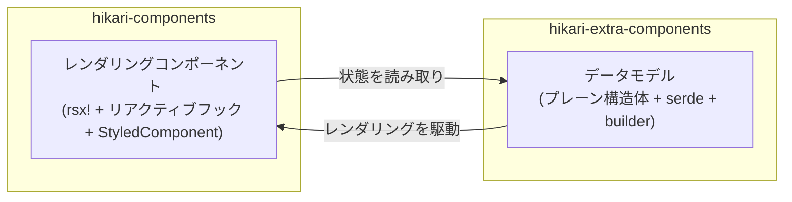

# 二層パッケージアーキテクチャ：components と extra-components

Hikari はコンポーネント体系を二つの補完的なパッケージに分割し、それぞれが異なるレベルの責務を担います：



### 責務の比較

| 項目 | `hikari-components` | `hikari-extra-components` |
|------|---------------------|---------------------------|
| **レンダリング** | `rsx!` マクロ、リアクティブフック | なし（フレームワーク非依存） |
| **状態管理** | `use_signal()`、`use_effect()` | ミュータブルな構造体フィールドのみ |
| **イベント処理** | `EventHandler<T>` クロージャ | `data-action` 属性 + 外部バインディング |
| **CSS 埋め込み** | `StyledComponent` トレイト | `pub const *_STYLES` をエクスポート |
| **シリアライズ** | 不要 | すべての状態型が `serde` を導出 |
| **DOM 依存** | Tairitsu フレームワークが必要 | なし |
| **ユースケース** | Tairitsu アプリ内でのリアルタイム UI レンダリング | SSR、テスト、状態永続化、非 Tairitsu フレームワーク |

### オーバーラップするコンポーネントドメイン

以下のコンポーネントは両方のパッケージに存在します。これは**意図的な設計**であり、冗長ではありません：

- `Timeline` / `TimelineState`
- `DragLayer` / `DragLayerState`
- `UserGuide` / `UserGuideState`
- `ZoomControls` / `ZoomControlsState`
- `VideoPlayer` / `VideoPlayerState`
- `RichTextEditor` / `RichTextEditorState`
- `CodeHighlight` / `CodeHighlighterState`

`components` 版は**すぐに使えるレンダリングコンポーネント**（アニメーション、キーボード処理、アイコン統合、StyledComponent CSS を含む）を提供し、
`extra-components` 版は**純粋なデータモデル**（ビルダーパターン、serde シリアライズ、ミューテーションメソッド、単体テストを含む）を提供します。

### どちらのパッケージを使うべきか

- **Tairitsu アプリケーション**：UI レンダリングに `hikari-components` を使用。状態の永続化やアンドゥ/リドゥのために `hikari-extra-components` をオプションで使用
- **非 Tairitsu アプリケーション**：`hikari-extra-components` のデータモデルを使用し、レンダリングは独自に実装
- **テスト**：DOM 環境なしで状態ロジックの単体テストを行うために `hikari-extra-components` を使用
- **SSR**：両方を併用 — サーバー側の状態にデータモデル、クライアント側のハイドレーションにレンダリングコンポーネント

### 型の曖昧さ回避

一部の型は両パッケージで同名です（例：`TimelinePosition`、`GuideStep`）。明示的なモジュールパスでインポートしてください：

```rust,ignore
use hikari_extra_components::extra::TimelineState;     // 純粋なデータモデル
use hikari_components::display::Timeline;              // レンダリングコンポーネント

use hikari_extra_components::extra::ZoomControlsState; // 純粋な状態
use hikari_components::display::ZoomControls;          // レンダリングコンポーネント
```

### CSS クラス名

両パッケージは同じ概念要素に対して異なる CSS クラス名を使用します。これは意図的です — `components` は `hikari-palette` 由来の型付きクラス列挙（例：`ZoomControlsClass::Button`）を使用し、`extra-components` はハードコードされた文字列または計算メソッドを使用します。両パッケージを同時に使用する場合、それぞれが自身のクラスセットでレンダリングします。
