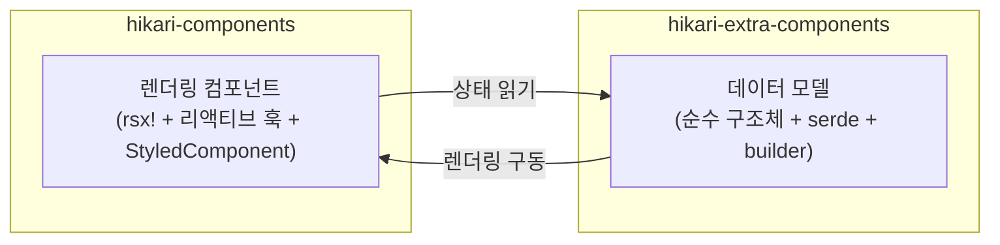

# 이중 레이어 패키지 아키텍처: components와 extra-components

Hikari는 컴포넌트 체계를 두 개의 보완적인 패키지로 분리하며, 각각 다른 수준의 책임을 담당합니다：



### 책임 비교

| 차원 | `hikari-components` | `hikari-extra-components` |
|------|---------------------|---------------------------|
| **렌더링** | `rsx!` 매크로, 리액티브 훅 | 없음 (프레임워크 독립적) |
| **상태 관리** | `use_signal()`, `use_effect()` | 가변 구조체 필드만 |
| **이벤트 처리** | `EventHandler<T>` 클로저 | `data-action` 속성 + 외부 바인딩 |
| **CSS 임베딩** | `StyledComponent` 트레이트 | `pub const *_STYLES` 내보내기 |
| **직렬화** | 불필요 | 모든 상태 타입이 `serde` 파생 |
| **DOM 의존성** | Tairitsu 프레임워크 필요 | 없음 |
| **사용 사례** | Tairitsu 앱 내 실시간 UI 렌더링 | SSR, 테스트, 상태 영속화, 비 Tairitsu 프레임워크 |

### 중복 컴포넌트 도메인

다음 컴포넌트는 두 패키지 모두에 존재합니다. 이는 **의도적인 설계**이며 중복이 아닙니다：

- `Timeline` / `TimelineState`
- `DragLayer` / `DragLayerState`
- `UserGuide` / `UserGuideState`
- `ZoomControls` / `ZoomControlsState`
- `VideoPlayer` / `VideoPlayerState`
- `RichTextEditor` / `RichTextEditorState`
- `CodeHighlight` / `CodeHighlighterState`

`components` 버전은 **즉시 사용 가능한 렌더링 컴포넌트** (애니메이션, 키보드 처리, 아이콘 통합, StyledComponent CSS 포함)를 제공하며,
`extra-components` 버전은 **순수 데이터 모델** (빌더 패턴, serde 직렬화, 변경 메서드, 단위 테스트 포함)을 제공합니다.

### 어떤 패키지를 언제 사용할 것인가

- **Tairitsu 애플리케이션**: UI 렌더링에 `hikari-components` 사용; 상태 영속화나 실행 취소/재실행을 위해 선택적으로 `hikari-extra-components` 사용
- **비 Tairitsu 애플리케이션**: `hikari-extra-components`의 데이터 모델을 사용하고 렌더링은 직접 구현
- **테스트**: DOM 환경 없이 상태 로직 단위 테스트를 위해 `hikari-extra-components` 사용
- **SSR**: 둘 다 사용 — 서버 측 상태에 데이터 모델, 클라이언트 측 하이드레이션에 렌더링 컴포넌트

### 타입 모호성 해소

일부 타입은 두 패키지에서 동일한 이름을 가집니다 (예: `TimelinePosition`, `GuideStep`). 명시적 모듈 경로로 임포트하세요：

```rust,ignore
use hikari_extra_components::extra::TimelineState;     // 순수 데이터 모델
use hikari_components::display::Timeline;              // 렌더링 컴포넌트

use hikari_extra_components::extra::ZoomControlsState; // 순수 상태
use hikari_components::display::ZoomControls;          // 렌더링 컴포넌트
```

### CSS 클래스명

두 패키지는 동일한 개념 요소에 대해 서로 다른 CSS 클래스명을 사용합니다. 이는 의도적인 것입니다 — `components`는 `hikari-palette`의 타입화된 클래스 열거형 (예: `ZoomControlsClass::Button`)을 사용하고, `extra-components`는 하드코딩된 문자열이나 계산 메서드를 사용합니다. 두 패키지를 동시에 사용할 때, 각각 자체 클래스 세트로 렌더링합니다.
