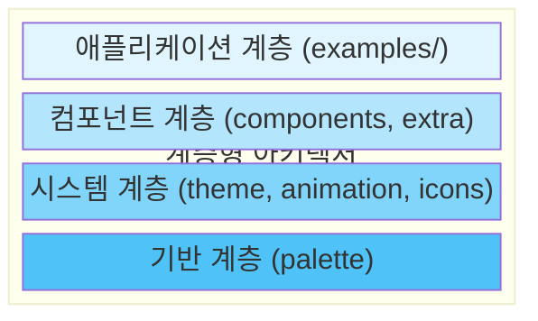
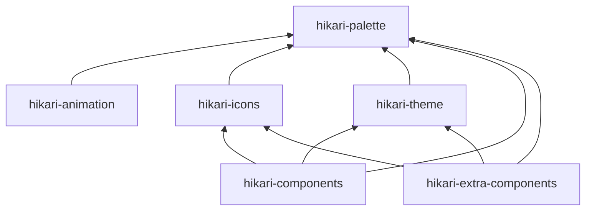
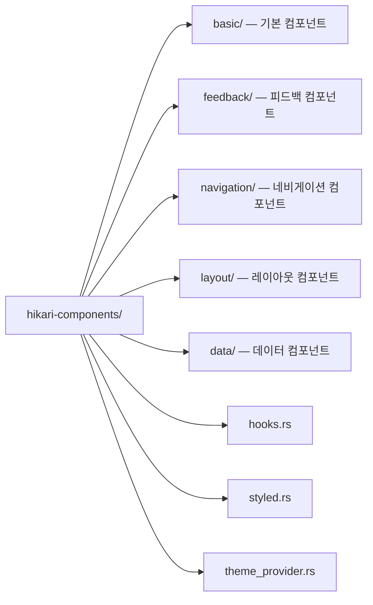
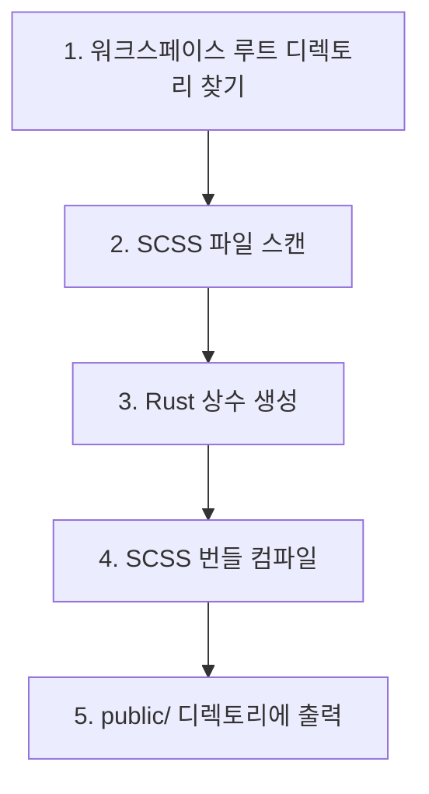
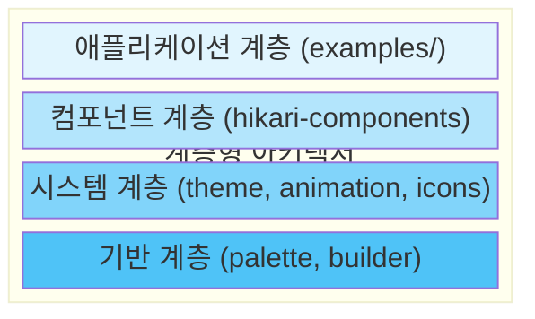
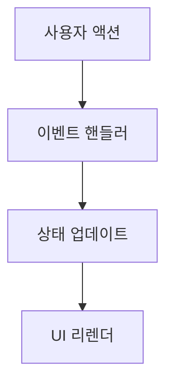
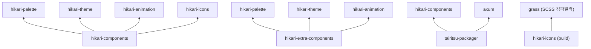

# 시스템 아키텍처 개요

Hikari 프레임워크는 모듈식 디자인을 채택하며, Tairitsu 런타임 기반으로 6개의 독립적인 패키지로 구성됩니다.

## 패키지 개요

| 패키지 | 설명 |
|---|---|
| hikari-palette | 전통 중국 색채 시스템 (660+ 색상), 테마 팔레트 관리 |
| hikari-animation | 선언적 애니메이션 시스템, 이징 함수, 보간, 타임라인 제어 |
| hikari-icons | Material Design Icons (7000+) 통합, SVG 생성 |
| hikari-theme | 테마 컨텍스트, CSS 변수 생성, 테마 전환 |
| hikari-components | 핵심 UI 컴포넌트 라이브러리 (40+ 컴포넌트) |
| hikari-extra-components | 고급 컴포넌트 (노드 편집기, 리치 텍스트 등) |

## 계층형 아키텍처



## 패키지 의존성



## 외부 의존성

모든 패키지는 **Tairitsu** 프레임워크 (tairitsu-vdom, tairitsu-hooks, tairitsu-style, tairitsu-web) 를 반응형 UI / WASM 런타임으로 사용합니다.

## 핵심 시스템

### 1. 팔레트 시스템 (hikari-palette)

전통 중국 색채 시스템의 Rust 구현입니다.

**담당 역할**:
- 660개 이상의 전통 중국 색상 정의 제공
- 테마 팔레트 관리
- 유틸리티 클래스 생성기
- 불투명도 및 색상 혼합

**핵심 기능**:
```rust
use hikari_palette::{Color, opacity};

// 전통 색상 사용
let red = Color::Cinnabar;
let blue = Color::Azurite;

// 불투명도 처리
let semi_red = opacity(red, 0.5);

// 테마 시스템
let theme = Hikari::default();
println!("Primary: {}", theme.primary.hex());
```

**설계 철학**:
- **문화적 자신감**: 전통 색상 이름 사용
- **타입 안전성**: 컴파일 타임 색상 값 검사
- **고성능**: 제로 비용 추상화

### 2. 테마 시스템 (hikari-theme)

테마 컨텍스트 및 스타일 주입 시스템입니다.

**담당 역할**:
- 테마 제공자 컴포넌트
- 테마 컨텍스트 관리
- CSS 변수 생성
- 테마 전환

**핵심 기능**:
```rust
use hikari_theme::ThemeProvider;

rsx! {
    ThemeProvider { initial_palette: "hikari" } {
        // 애플리케이션 콘텐츠
        App {}
    }
}
```

**지원 테마**:
- **Hikari (라이트)** - 라이트 테마
  - Primary: 분홍 (#FFB3A7)
  - Secondary: 창취 (#519A73)
  - Accent: 강황 (#FFC773)

- **Tairitsu** - 다크 테마
  - Primary: 안청 (#144A74)
  - Secondary: 창취 (#519A73)
  - Accent: 강황 (#FFC773)

### 3. 애니메이션 시스템 (hikari-animation)

고성능 선언적 애니메이션 시스템입니다.

**담당 역할**:
- 애니메이션 빌더
- 애니메이션 컨텍스트
- 이징 함수
- 프리셋 애니메이션

**핵심 기능**:
```rust
use hikari_animation::{AnimationBuilder, AnimationContext};
use hikari_animation::style::CssProperty;

// 정적 애니메이션
AnimationBuilder::new(&elements)
    .add_style("button", CssProperty::Opacity, "0.8")
    .apply_with_transition("300ms", "ease-in-out");

// 동적 애니메이션 (마우스 추적)
AnimationBuilder::new(&elements)
    .add_style_dynamic("button", CssProperty::Transform, |ctx| {
        let x = ctx.mouse_x();
        let y = ctx.mouse_y();
        format!("translate({}px, {}px)", x, y)
    })
    .apply_with_transition("150ms", "ease-out");
```

**아키텍처 구성요소**:
- **builder** - 애니메이션 빌더 API
- **context** - 런타임 애니메이션 컨텍스트
- **style** - 타입 안전 CSS 조작
- **easing** - 30개 이상의 이징 함수
- **tween** - 보간 시스템
- **timeline** - 타임라인 제어
- **presets** - 프리셋 애니메이션 (fade, slide, scale)
- **spotlight** - 스포트라이트 효과

**성능 특징**:
- WASM 최적화
- 디바운스 업데이트
- requestAnimationFrame 통합
- 리플로우 및 리페인트 최소화

### 4. 아이콘 시스템 (hikari-icons)

아이콘 관리 및 렌더링 시스템입니다.

**담당 역할**:
- 아이콘 열거형 정의
- SVG 콘텐츠 생성
- 아이콘 크기 변형
- Material Design Icons 통합

**핵심 기능**:
```rust
use hikari_icons::{Icon, MdiIcon};

rsx! {
    Icon {
        icon: MdiIcon::Search,
        size: 24,
        color: "var(--hi-primary)"
    }
}
```

**아이콘 소스**:
- Material Design Icons (7000개 이상)
- 확장 가능한 커스텀 아이콘
- 다양한 크기 지원

### 5. 컴포넌트 라이브러리 (hikari-components)

완전한 UI 컴포넌트 라이브러리입니다.

**담당 역할**:
- 기본 UI 컴포넌트
- 레이아웃 컴포넌트
- 스타일 레지스트리
- 반응형 훅

**컴포넌트 카테고리**:

1. **기본 컴포넌트** (feature: "basic")
   - Button, Input, Card, Badge

2. **피드백 컴포넌트** (feature: "feedback")
   - Alert, Toast, Tooltip, Spotlight

3. **네비게이션 컴포넌트** (feature: "navigation")
   - Menu, Tabs, Breadcrumb

4. **레이아웃 컴포넌트** (항상 사용 가능)
   - Layout, Header, Aside, Content, Footer

5. **데이터 컴포넌트** (feature: "data")
   - Table, Tree, Pagination

**모듈식 설계**:


**스타일 시스템**:
- SCSS 소스
- 타입 안전 유틸리티 클래스
- 컴포넌트 수준 스타일 격리
- CSS 변수 통합

### 6. 아이콘 빌드 시스템

컴파일 타임 코드 생성 및 SCSS 컴파일입니다.

**담당 역할**:
- SCSS 컴파일 (Grass 사용)
- 컴포넌트 검색
- 코드 생성
- 리소스 번들링

**빌드 과정**:


**사용법**:
```rust
// build.rs
fn main() {
    tairitsu-icons build system::build().expect("Build failed");
}
```

**생성 파일**:
- `public/styles/bundle.css` - 컴파일된 CSS

### 7. 렌더 서비스 (tairitsu-packager)

서버 사이드 렌더링 및 정적 자산 서빙입니다.

**담당 역할**:
- HTML 템플릿 렌더링
- 스타일 레지스트리
- 라우터 빌더
- 정적 자산 서비스
- Axum 통합

**핵심 기능**:
```rust
use hikari_render_service::HikariRenderServicePlugin;

let app = HikariRenderServicePlugin::new()
    .component_style_registry(registry)
    .static_assets("./dist", "/static")
    .add_route("/api/health", get(health_check))
    .build()?;
```

**아키텍처 모듈**:
- **html** - HTML 서비스
- **registry** - 스타일 레지스트리
- **router** - 라우터 빌더
- **static_files** - 정적 파일 서비스
- **styles_service** - 스타일 주입
- **plugin** - 플러그인 시스템

### 8. 확장 컴포넌트 라이브러리 (hikari-extra-components)

복잡한 상호작용 시나리오를 위한 고급 UI 컴포넌트입니다.

**담당 역할**:
- 고급 유틸리티 컴포넌트
- 드래그 및 줌 상호작용
- 접이식 패널
- 애니메이션 통합

**핵심 컴포넌트**:

1. **Collapsible** - 접이식 패널
   - 좌/우 슬라이드 인/아웃 애니메이션
   - 구성 가능한 너비
   - 확장 상태 콜백

2. **DragLayer** - 드래그 레이어
   - 경계 제약 조건
   - 드래그 이벤트 콜백
   - 커스텀 z-index

3. **ZoomControls** - 줌 컨트롤
   - 키보드 단축키 지원
   - 구성 가능한 줌 범위
   - 다양한 배치 옵션

**핵심 기능**:
```rust
use hikari_extra_components::{Collapsible, DragLayer, ZoomControls};

// 접이식 패널
Collapsible {
    title: "Settings".to_string(),
    expanded: true,
    position: CollapsiblePosition::Right,
    div { "Content" }
}

// 드래그 레이어
DragLayer {
    initial_x: 100.0,
    initial_y: 100.0,
    constraints: DragConstraints {
        min_x: Some(0.0),
        max_x: Some(500.0),
        ..Default::default()
    },
    div { "Drag me" }
}

// 줌 컨트롤
ZoomControls {
    zoom: 1.0,
    on_zoom_change: move |z| println!("Zoom: {}", z)
}
```

## 아키텍처 원칙

### 1. 모듈식 설계

각 패키지는 독립적이며 개별적으로 사용할 수 있습니다:

```toml
# 팔레트만 사용
[dependencies]
hikari-palette = "0.1"

# 컴포넌트와 테마 사용
[dependencies]
hikari-components = "0.1"
hikari-theme = "0.1"

# 애니메이션 시스템 사용
[dependencies]
hikari-animation = "0.1"
```

### 2. 계층형 아키텍처



### 3. 단방향 데이터 흐름



### 4. 타입 안전성

모든 API는 타입 안전합니다:
- 컴파일 타임 검사
- IDE 자동 완성
- 리팩토링 안전성

### 5. 성능 우선

- WASM 최적화
- 가상 스크롤링
- 디바운싱/스로틀링
- DOM 조작 최소화

## 빌드 과정

### 개발 모드
```bash
cargo run
```

### 프로덕션 빌드
```bash
# 1. Rust 코드 빌드
cargo build --release

# 2. 빌드 시스템이 자동으로 SCSS 컴파일
# 3. CSS 번들 생성
# 4. 정적 자산 번들링
```

### WASM 빌드
```bash
trunk build --release
```

## 의존성



## 확장성

### 커스텀 컴포넌트 추가

```rust
use hikari_components::{StyledComponent, StyleRegistry};

pub struct MyComponent;

impl StyledComponent for MyComponent {
    fn register_styles(registry: &mut StyleRegistry) {
        registry.register("my-component", include_str!("my-component.scss"));
    }
}
```

### 커스텀 테마 추가

```rust
use hikari_palette::ThemePalette;

struct CustomTheme;

impl CustomTheme {
    pub fn palette() -> ThemePalette {
        ThemePalette {
            primary: "#FF0000",
            secondary: "#00FF00",
            // ...
        }
    }
}
```

### 커스텀 애니메이션 프리셋 추가

```rust
use hikari_animation::{AnimationBuilder, AnimationContext};

pub fn fade_in(
    builder: AnimationBuilder,
    element: &str,
    duration: u32,
) -> AnimationBuilder {
    builder
        .add_style(element, CssProperty::Opacity, "0")
        .add_style(element, CssProperty::Opacity, "1")
        .apply_with_transition(&format!("{}ms", duration), "ease-out")
}
```

## 성능 최적화

### 1. CSS 최적화
- SCSS를 최적화된 CSS로 컴파일
- 사용하지 않는 스타일 제거 (트리 쉐이킹)
- 프로덕션 CSS 축소

### 2. WASM 최적화
- `wasm-opt` 최적화
- 지연 WASM 모듈 로딩
- 선형 메모리 최적화

### 3. 런타임 최적화
- 가상 스크롤링 (대용량 데이터 목록)
- 디바운스된 애니메이션 업데이트
- requestAnimationFrame

### 4. 빌드 최적화
- 병렬 컴파일
- 증분 컴파일
- 바이너리 캐싱

## 테스트 전략

### 단위 테스트
각 모듈은 완전한 단위 테스트를 갖추고 있습니다:

```rust
#[cfg(test)]
mod tests {
    #[test]
    fn test_color_conversion() {
        let color = Color::Cinnabar;
        assert_eq!(color.hex(), "#519A73");
    }
}
```

### 통합 테스트
`examples/` 디렉토리의 예제 애플리케이션이 통합 테스트 역할을 합니다

### 시각적 회귀 테스트
Percy 또는 유사한 도구를 사용한 UI 스냅샷 테스트

## 다음 단계

- 특정 컴포넌트에 대한 [컴포넌트 문서](../components/) 읽기
- API 세부 정보는 [API 문서](https://docs.rs/hikari-components) 참조
- 모범 사례를 배우려면 [예제 코드](../../examples/) 살펴보기
