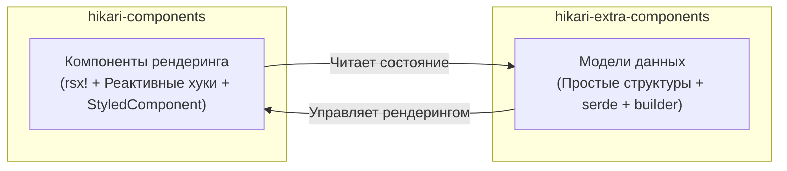

# Двухуровневая архитектура пакетов: components и extra-components

Hikari разделяет систему компонентов на два дополняющих друг друга пакета, каждый из которых отвечает за свой уровень ответственности:



### Сравнение ответственностей

| Измерение | `hikari-components` | `hikari-extra-components` |
|-----------|----------------------|---------------------------|
| **Рендеринг** | Макрос `rsx!`, реактивные хуки | Отсутствует (не зависит от фреймворка) |
| **Управление состоянием** | `use_signal()`, `use_effect()` | Изменяемые поля структур |
| **Обработка событий** | Замыкания `EventHandler<T>` | Атрибуты `data-action` + внешняя привязка |
| **Встраивание CSS** | Трейт `StyledComponent` | Экспортирует `pub const *_STYLES` |
| **Сериализация** | Не требуется | Все типы состояний наследуют `serde` |
| **Зависимость от DOM** | Требуется фреймворк Tairitsu | Отсутствует |
| **Сценарии использования** | Рендеринг UI в реальном времени в приложениях Tairitsu | SSR, тестирование, сохранение состояния, не-Tairitsu фреймворки |

### Пересекающиеся домены компонентов

Следующие компоненты существуют в обоих пакетах. Это **намеренное проектирование**, а не избыточность:

- `Timeline` / `TimelineState`
- `DragLayer` / `DragLayerState`
- `UserGuide` / `UserGuideState`
- `ZoomControls` / `ZoomControlsState`
- `VideoPlayer` / `VideoPlayerState`
- `RichTextEditor` / `RichTextEditorState`
- `CodeHighlight` / `CodeHighlighterState`

Версия `components` предоставляет **готовые к использованию компоненты рендеринга** (с анимациями, обработкой клавиатуры, интеграцией иконок и CSS StyledComponent) ;
версия `extra-components` предоставляет **чистые модели данных** (с паттерном builder, сериализацией serde, методами мутации и модульными тестами).

### Когда использовать какой пакет

- **Приложения Tairitsu** : используйте `hikari-components` для рендеринга UI ; опционально используйте `hikari-extra-components` для сохранения состояния или отмены/повтора
- **Приложения не на Tairitsu** : используйте модели данных из `hikari-extra-components` и реализуйте рендеринг самостоятельно
- **Тестирование** : используйте `hikari-extra-components` для модульного тестирования логики состояния без DOM-окружения
- **SSR** : используйте оба варианта — модели данных для серверного состояния, компоненты рендеринга для клиентской гидратации

### Разрешение неоднозначности типов

Некоторые типы имеют одинаковые имена в обоих пакетах (например, `TimelinePosition`, `GuideStep`). Используйте явные пути модулей при импорте:

```rust,ignore
use hikari_extra_components::extra::TimelineState;     // Чистая модель данных
use hikari_components::display::Timeline;              // Компонент рендеринга

use hikari_extra_components::extra::ZoomControlsState; // Чистое состояние
use hikari_components::display::ZoomControls;          // Компонент рендеринга
```

### Имена CSS-классов

Оба пакета используют разные имена CSS-классов для одних и тех же концептуальных элементов. Это сделано намеренно — `components` использует типизированные перечисления классов из `hikari-palette` (например, `ZoomControlsClass::Button`), а `extra-components` использует захардкоженные строки или вычисляемые методы. При одновременном использовании обоих пакетов каждый рендерит со своим собственным набором классов.
