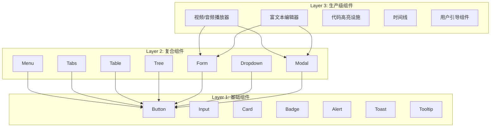
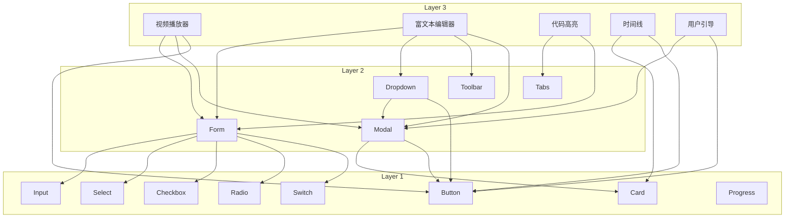

# Layer 分层组件计划：三层次组件体系

## 目录

- [概述](#概述)
- [设计理念](#设计理念)
- [分层体系](#分层体系)
- [Layer 1: 基础组件](#layer-1-基础组件)
- [Layer 2: 复合组件](#layer-2-复合组件)
- [Layer 3: 生产级组件](#layer-3-生产级组件)
- [开发优先级](#开发优先级)
- [技术说明](#技术说明)

## 概述

Hikari 采用三层次组件体系，从基础到复杂逐步构建。Layer 1 提供原子级组件，Layer 2 组合 Layer 1 构建复合组件，Layer 3 基于 Layer 2 实现生产级复杂功能。

## 设计理念

### 核心原则

1. **渐进式增强** - 从简单到复杂
2. **可复用性** - 高层组件可复用低层组件
3. **单一职责** - 每个组件只做一件事
4. **组合优于继承** - 通过组合构建复杂功能

### 分层原则



### 职责划分

| Layer | 职责 | 复杂度 | 状态管理 |
|-------|------|--------|---------|
| **Layer 1** | 原子级 UI 元素 | 低 | 局部状态 |
| **Layer 2** | 复合 UI 模式 | 中 | 局部状态 + Context |
| **Layer 3** | 完整业务功能 | 高 | 全局状态 + 复杂逻辑 |

## 分层体系

### Layer 1: 基础组件

**定义**：不可再分的原子级 UI 元素

**特点**：
- 单一职责，功能简单
- 无复杂状态管理
- 高度可复用
- 完善的文档和测试

**示例**：Button、Input、Card、Badge、Alert、Toast、Tooltip

### Layer 2: 复合组件

**定义**：由多个 Layer 1 组件组合而成的复合组件

**特点**：
- 组合多个基础组件
- 有一定的状态管理
- 提供常见 UI 模式
- 支持 Context 共享状态

**示例**：Menu、Tabs、Table、Tree、Form、Dropdown、Modal

### Layer 3: 生产级组件

**定义**：完整的业务功能，基于 Layer 2 构建

**特点**：
- 复杂的状态管理
- 完整的业务逻辑
- 高性能优化
- 生产环境验证

**示例**：视频/音频播放器、富文本编辑器、代码高亮设施、时间线、用户引导组件

## Layer 1: 基础组件

### 已完成的组件

| 组件 | 路径 | 状态 |
|------|------|------|
| Button | `packages/components/src/basic/button.rs` | ✅ 完成 |
| Input | `packages/components/src/basic/input.rs` | ✅ 完成 |
| Card | `packages/components/src/basic/card.rs` | ✅ 完成 |
| Badge | `packages/components/src/basic/badge.rs` | ✅ 完成 |
| Alert | `packages/components/src/feedback/alert.rs` | ✅ 完成 |
| Toast | `packages/components/src/feedback/toast.rs` | ✅ 完成 |
| Tooltip | `packages/components/src/feedback/tooltip.rs` | ✅ 完成 |
| Select | `packages/components/src/basic/select.rs` | ✅ 完成 |
| Checkbox | `packages/components/src/basic/checkbox.rs` | ✅ 完成 |
| Radio | `packages/components/src/basic/radio_group.rs` | ✅ 完成 |
| Switch | `packages/components/src/basic/switch.rs` | ✅ 完成 |
| Avatar | `packages/components/src/basic/avatar.rs` | ✅ 完成 |
| Image | `packages/components/src/basic/image.rs` | ✅ 完成 |
| Slider | `packages/components/src/basic/slider.rs` | ✅ 完成 |
| Progress | `packages/components/src/feedback/progress.rs` | ✅ 完成 |
| Spin (Spinner) | `packages/components/src/feedback/spin.rs` | ✅ 完成 |
| FormField | `packages/components/src/basic/form_field.rs` | ✅ 完成 |

### 待开发的基础组件

| 组件 | 优先级 | 功能描述 |
|------|--------|---------|
| **Divider** | 低 | 分割线 |
| **Skeleton** | 低 | 骨架屏 |

### 组件接口规范

```rust
/// Layer 1 基础组件接口规范
pub trait Layer1Component {
    /// Props 结构（必须 derive Clone, PartialEq）
    type Props;

    /// 渲染组件
    fn render(props: Self::Props) -> Element;

    /// 注册样式
    fn register_styles(registry: &mut StyleRegistry);

    /// 默认 Props
    fn default_props() -> Self::Props;
}
```

## Layer 2: 复合组件

### 已完成的组件

| 组件 | 路径 | 依赖的 Layer 1 | 状态 |
|------|------|---------------|------|
| Menu | `packages/components/src/navigation/menu.rs` | Button, Card | ✅ 完成 |
| Tabs | `packages/components/src/navigation/tabs.rs` | Button | ✅ 完成 |
| Breadcrumb | `packages/components/src/navigation/breadcrumb.rs` | Button | ✅ 完成 |
| Table | `packages/components/src/data/table.rs` | Button, Card, Input | ✅ 完成 |
| Tree | `packages/components/src/data/tree.rs` | Button | ✅ 完成 |
| Pagination | `packages/components/src/data/pagination.rs` | Button | ✅ 完成 |
| Dropdown | `packages/components/src/feedback/dropdown.rs` | Button, Menu | ✅ 完成 |
| Modal | `packages/components/src/feedback/modal.rs` | Card, Button | ✅ 完成 |
| Drawer | `packages/components/src/feedback/drawer.rs` | Card, Button | ✅ 完成 |
| Steps | `packages/components/src/navigation/steps.rs` | Button, Badge | ✅ 完成 |
| Form | `packages/components/src/utils/form.rs` | Input, Select, Checkbox, Radio | ✅ 完成 |

### 待开发的复合组件

| 组件 | 优先级 | 功能描述 | 依赖的 Layer 1 |
|------|--------|---------|---------------|
| **Collapse** | 中 | 可折叠面板 | Button, Card |
| **Tabs** | 中 | 标签页 | Button |
| **Upload** | 中 | 文件上传 | Button, Progress |
| **Calendar** | 中 | 日历选择器 | Button, Input |
| **Carousel** | 低 | 轮播图 | Button, Card |
| **Stepper** | 低 | 步骤条 | Button, Badge |
| **Timeline** | 低 | 时间轴 | Card, Badge |

### 组件接口规范

```rust
/// Layer 2 复合组件接口规范
pub trait Layer2Component {
    /// Props 结构（必须 derive Clone, PartialEq）
    type Props;

    /// Context 类型（可选）
    type Context: Clone + 'static;

    /// 渲染组件
    fn render(props: Self::Props) -> Element;

    /// 提供的 Context
    fn provide_context(&self) -> Option<Self::Context>;

    /// 注册样式
    fn register_styles(registry: &mut StyleRegistry);

    /// 默认 Props
    fn default_props() -> Self::Props;
}
```

### 示例：Form 组件

```rust
/// Form 组件（Layer 2）
/// 依赖: Input, Select, Checkbox, Radio (Layer 1)
#[component]
pub fn Form(
    children: Element,
    #[props(default = false)] disabled: bool,
    #[props(default = FormValidationMode::OnChange)]
    validation_mode: FormValidationMode,
    on_submit: EventHandler<FormSubmitEvent>,
) -> Element {
    let form_context = FormContext {
        disabled,
        validation_mode,
    };

    rsx! {
        form {
            onsubmit: move |e| {
                e.prevent_default();
                on_submit.call(FormSubmitEvent::new());
            },
            ContextProvider { value: form_context,
                {children}
            }
        }
    }
}
```

## Layer 3: 生产级组件

### 计划中的组件

| 组件 | 优先级 | 功能描述 | 依赖的 Layer 2 | 复杂度 |
|------|--------|---------|---------------|--------|
| **视频/音频播放器** | 高 | 支持播放控制、字幕、播放列表 | Card, Button, Form, Menu | 高 |
| **富文本编辑器** | 高 | 支持富文本编辑、Markdown、插件 | Form, Dropdown, Modal, Toolbar | 高 |
| **代码高亮设施** | 高 | 语法高亮、行号、主题切换 | Card, Tabs, Form | 中 |
| **时间线** | 中 | 事件时间线、里程碑、时间轴 | Card, Badge, Collapse | 中 |
| **用户引导组件** | 中 | 新手引导、功能介绍、步骤提示 | Modal, Button, Badge | 中 |
| **数据可视化** | 低 | 图表、仪表盘、报表 | Card, Tabs, Form | 高 |
| **代码编辑器** | 低 | 完整代码编辑、智能提示、调试 | Card, Tabs, Form, Menu | 高 |
| **即时通讯** | 低 | 聊天界面、消息列表、表情包 | Card, Form, Menu, Badge | 高 |

### 组件接口规范

```rust
/// Layer 3 生产级组件接口规范
pub trait Layer3Component {
    /// Props 结构（必须 derive Clone, PartialEq）
    type Props;

    /// State 结构（必须 derive Clone）
    type State: Clone + 'static;

    /// 初始化 State
    fn init_state(props: &Self::Props) -> Self::State;

    /// 渲染组件
    fn render(props: Self::Props, state: &Signal<Self::State>) -> Element;

    /// 生命周期：组件挂载
    fn on_mount(state: &Signal<Self::State>) {
        // 默认空实现
    }

    /// 生命周期：组件卸载
    fn on_unmount(state: &Signal<Self::State>) {
        // 默认空实现
    }

    /// 注册样式
    fn register_styles(registry: &mut StyleRegistry);

    /// 默认 Props
    fn default_props() -> Self::Props;
}
```

### 示例：视频播放器

```rust
/// 视频播放器组件（Layer 3）
/// 依赖: Card, Button, Form, Menu (Layer 2)
#[component]
pub fn VideoPlayer(
    src: String,
    #[props(default = false)] autoplay: bool,
    #[props(default = false)] muted: bool,
    #[props(default = 0)] volume: u8,
    #[props(default = 1.0)] playback_rate: f64,
) -> Element {
    let is_playing = use_signal(|| autoplay);
    let current_time = use_signal(|| 0.0);
    let duration = use_signal(|| 0.0);
    let show_controls = use_signal(|| true);

    // 播放/暂停
    let toggle_play = move |_| {
        is_playing.toggle();
    };

    // 音量控制
    let set_volume = move |new_volume| {
        // 更新音量
    };

    rsx! {
        Card {
            class: "hi-video-player",
            div { class: "hi-video-container",
                video {
                    src: "{src}",
                    autoplay: autoplay,
                    muted: muted,
                    // 事件监听
                }

                // 控制条
                if show_controls() {
                    div { class: "hi-video-controls",
                        Button { icon: MdiIcon::Play, on_click: toggle_play }
                        Button { icon: MdiIcon::VolumeHigh }
                        // 进度条
                        // 时间显示
                    }
                }
            }
        }
    }
}
```

### 示例：富文本编辑器

```rust
/// 富文本编辑器组件（Layer 3）
/// 依赖: Form, Dropdown, Modal, Toolbar (Layer 2)
#[component]
pub fn RichTextEditor(
    #[props(default = "")] initial_content: String,
    #[props(default = EditorMode::Wysiwyg)]
    mode: EditorMode,
    on_change: EventHandler<String>,
) -> Element {
    let content = use_signal(|| initial_content);
    let is_bold = use_signal(|| false);
    let is_italic = use_signal(|| false);

    // 格式化文本
    let toggle_bold = move |_| {
        is_bold.toggle();
        // 应用粗体格式
    };

    rsx! {
        Card { class: "hi-rich-text-editor",
            // 工具栏
            div { class: "hi-editor-toolbar",
                Button { icon: MdiIcon::FormatBold, on_click: toggle_bold }
                Button { icon: MdiIcon::FormatItalic }
                Button { icon: MdiIcon::FormatUnderline }
                Dropdown {
                    trigger: rsx! { Button { icon: MdiIcon::FormatHeader1 } },
                    // 标题选项
                }
            }

            // 编辑区域
            div { class: "hi-editor-content",
                contenteditable: "true",
                dangerous_inner_html: "{content}",
                // 输入事件
            }

            // Markdown 模式切换
            if mode == EditorMode::Markdown {
                div { class: "hi-editor-mode-switch",
                    Button { "WYSIWYG" }
                    Button { "Markdown" }
                }
            }
        }
    }
}
```

## 开发优先级

### 阶段 1：完善 Layer 1

**目标**：完成所有基础组件

**优先级排序**：
1. Divider（低）
2. Skeleton（低）

**预计时间**：1 周

### 阶段 2：完善 Layer 2

**目标**：完成所有复合组件

**优先级排序**：
1. Collapse（中）
2. Tabs（中）
3. Upload（中）
4. Calendar（中）
5. Carousel（低）
6. Stepper（低）
7. Timeline（低）

**预计时间**：2-3 周

### 阶段 3：实现 Layer 3

**目标**：实现生产级组件

**优先级排序**：
1. 代码高亮设施（高）
2. 用户引导组件（中）
3. 时间线（中）
4. 视频/音频播放器（高）
5. 富文本编辑器（高）

**预计时间**：4-6 周

### 阶段 4：优化和完善

**目标**：性能优化、文档完善、测试覆盖

**任务**：
1. 性能优化（虚拟滚动、懒加载）
2. 文档完善（Storybook、示例代码）
3. 测试覆盖（单元测试、集成测试）
4. 无障碍性（ARIA 标签、键盘导航）

**预计时间**：2-3 周

## 组件依赖图



## 技术说明

### 图标系统更新

Hikari 使用 Material Design Icons (MDI) 替代 Lucide Icons。

**原因**：
- MDI 提供更丰富的图标集（7000+ 图标）
- 与 Material Design 规范一致
- 更适合 Arknights + FUI 设计风格

**使用方式**：
```rust
use _icons::{Icon, MdiIcon};

rsx! {
    Icon {
        icon: MdiIcon::Search,
        size: 24,
    }
}
```

### 路由系统

Website 使用 Dioxus 0.7 的 Routable derive 宏。

**App 组件结构**：
```rust
#[component]
pub fn App() -> Element {
    rsx! {
        ThemeProvider { palette: "hikari".to_string(),
            PortalProvider {
                Router::<Route> {}
            }
        }
    }
}
```

**路由示例**：
```rust
#[derive(Clone, Debug, PartialEq, Routable)]
pub enum Route {
    #[route("/")]
    Home {},

    #[route("/components/layer1/basic")]
    Layer1Basic {},

    #[route("/demos/layer1/form")]
    FormDemo {},
}
```

### 构建系统

使用 `just build` 构建整个项目。

**构建命令**：
```bash
# 构建所有包（Release 模式）
just build

# 构建所有包（Debug 模式）
just build-debug

# 运行开发服务器
just dev

# 构建 Website
cd examples/website && cargo build --release
```

## 总结

Hikari 的三层次组件体系提供了清晰的开发路径：

1. **Layer 1** - 原子级组件，高可复用性
2. **Layer 2** - 复合组件，常见 UI 模式
3. **Layer 3** - 生产级组件，完整业务功能

通过渐进式增强的方式，从简单到复杂，确保每个层次都有完善的测试和文档，为生产环境提供可靠的组件体系。
