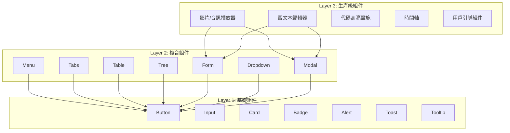
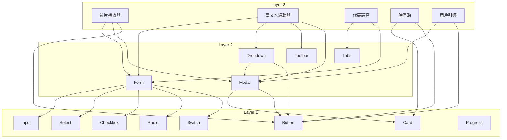

# Layer 分層組件計畫：三層次組件體系

## 目錄

- [概述](#概述)
- [設計理念](#設計理念)
- [分層體系](#分層體系)
- [Layer 1: 基礎組件](#layer-1-基礎組件)
- [Layer 2: 複合組件](#layer-2-複合組件)
- [Layer 3: 生產級組件](#layer-3-生產級組件)
- [開發優先級](#開發優先級)
- [技術說明](#技術說明)

## 概述

Hikari 採用三層次組件體系，從基礎到複雜逐步構建。Layer 1 提供原子級組件，Layer 2 組合 Layer 1 構建複合組件，Layer 3 基於 Layer 2 實現生產級複雜功能。

## 設計理念

### 核心原則

1. **漸進式增強** - 從簡單到複雜
2. **可復用性** - 高層組件可復用低層組件
3. **單一職責** - 每個組件只做一件事
4. **組合優於繼承** - 通過組合構建複雜功能

### 分層原則



### 職責劃分

| Layer | 職責 | 複雜度 | 狀態管理 |
|-------|------|--------|---------|
| **Layer 1** | 原子級 UI 元素 | 低 | 局部狀態 |
| **Layer 2** | 複合 UI 模式 | 中 | 局部狀態 + Context |
| **Layer 3** | 完整業務功能 | 高 | 全局狀態 + 複雜邏輯 |

## 分層體系

### Layer 1: 基礎組件

**定義**：不可再分的原子級 UI 元素

**特點**：
- 單一職責，功能簡單
- 無複雜狀態管理
- 高度可復用
- 完善的文檔和測試

**示例**：Button、Input、Card、Badge、Alert、Toast、Tooltip

### Layer 2: 複合組件

**定義**：由多個 Layer 1 組件組合而成的複合組件

**特點**：
- 組合多個基礎組件
- 有一定的狀態管理
- 提供常見 UI 模式
- 支持 Context 共享狀態

**示例**：Menu、Tabs、Table、Tree、Form、Dropdown、Modal

### Layer 3: 生產級組件

**定義**：完整的業務功能，基於 Layer 2 構建

**特點**：
- 複雜的狀態管理
- 完整的業務邏輯
- 高性能優化
- 生產環境驗證

**示例**：影片/音訊播放器、富文本編輯器、代碼高亮設施、時間軸、用戶引導組件

## Layer 1: 基礎組件

### 已完成的組件

| 組件 | 路徑 | 狀態 |
|------|------|------|
| Button | `packages/components/src/basic/button.rs` | ✅ 完成 |
| Input | `packages/components/src/basic/input.rs` | ✅ 完成 |
| Card | `packages/components/src/basic/card.rs` | ✅ 完成 |
| Badge | `packages/components/src/basic/badge.rs` | ✅ 完成 |
| Alert | `packages/components/src/feedback/alert.rs` | ✅ 完成 |
| Toast | `packages/components/src/feedback/toast.rs` | ✅ 完成 |
| Tooltip | `packages/components/src/feedback/tooltip.rs` | ✅ 完成 |
| Select | `packages/components/src/basic/select.rs` | ✅ 完成 |
| Checkbox | `packages/components/src/basic/checkbox.rs` | ✅ 完成 |
| Radio | `packages/components/src/basic/radio_group.rs` | ✅ 完成 |
| Switch | `packages/components/src/basic/switch.rs` | ✅ 完成 |
| Avatar | `packages/components/src/basic/avatar.rs` | ✅ 完成 |
| Image | `packages/components/src/basic/image.rs` | ✅ 完成 |
| Slider | `packages/components/src/basic/slider.rs` | ✅ 完成 |
| Progress | `packages/components/src/feedback/progress.rs` | ✅ 完成 |
| Spin (Spinner) | `packages/components/src/feedback/spin.rs` | ✅ 完成 |
| FormField | `packages/components/src/basic/form_field.rs` | ✅ 完成 |

### 待開發的基礎組件

| 組件 | 優先級 | 功能描述 |
|------|--------|---------|
| **Divider** | 低 | 分割線 |
| **Skeleton** | 低 | 骨架屏 |

### 組件接口規範

```rust
/// Layer 1 基礎組件接口規範
pub trait Layer1Component {
    /// Props 結構（必須 derive Clone, PartialEq）
    type Props;

    /// 渲染組件
    fn render(props: Self::Props) -> Element;

    /// 註冊樣式
    fn register_styles(registry: &mut StyleRegistry);

    /// 默認 Props
    fn default_props() -> Self::Props;
}
```

## Layer 2: 複合組件

### 已完成的組件

| 組件 | 路徑 | 依賴的 Layer 1 | 狀態 |
|------|------|---------------|------|
| Menu | `packages/components/src/navigation/menu.rs` | Button, Card | ✅ 完成 |
| Tabs | `packages/components/src/navigation/tabs.rs` | Button | ✅ 完成 |
| Breadcrumb | `packages/components/src/navigation/breadcrumb.rs` | Button | ✅ 完成 |
| Table | `packages/components/src/data/table.rs` | Button, Card, Input | ✅ 完成 |
| Tree | `packages/components/src/data/tree.rs` | Button | ✅ 完成 |
| Pagination | `packages/components/src/data/pagination.rs` | Button | ✅ 完成 |
| Dropdown | `packages/components/src/feedback/dropdown.rs` | Button, Menu | ✅ 完成 |
| Modal | `packages/components/src/feedback/modal.rs` | Card, Button | ✅ 完成 |
| Drawer | `packages/components/src/feedback/drawer.rs` | Card, Button | ✅ 完成 |
| Steps | `packages/components/src/navigation/steps.rs` | Button, Badge | ✅ 完成 |
| Form | `packages/components/src/utils/form.rs` | Input, Select, Checkbox, Radio | ✅ 完成 |

### 待開發的複合組件

| 組件 | 優先級 | 功能描述 | 依賴的 Layer 1 |
|------|--------|---------|---------------|
| **Collapse** | 中 | 可折疊面板 | Button, Card |
| **Tabs** | 中 | 標籤頁 | Button |
| **Upload** | 中 | 文件上傳 | Button, Progress |
| **Calendar** | 中 | 日曆選擇器 | Button, Input |
| **Carousel** | 低 | 輪播圖 | Button, Card |
| **Stepper** | 低 | 步驟條 | Button, Badge |
| **Timeline** | 低 | 時間軸 | Card, Badge |

### 組件接口規範

```rust
/// Layer 2 複合組件接口規範
pub trait Layer2Component {
    /// Props 結構（必須 derive Clone, PartialEq）
    type Props;

    /// Context 類型（可選）
    type Context: Clone + 'static;

    /// 渲染組件
    fn render(props: Self::Props) -> Element;

    /// 提供的 Context
    fn provide_context(&self) -> Option<Self::Context>;

    /// 註冊樣式
    fn register_styles(registry: &mut StyleRegistry);

    /// 默認 Props
    fn default_props() -> Self::Props;
}
```

### 示例：Form 組件

```rust
/// Form 組件（Layer 2）
/// 依賴: Input, Select, Checkbox, Radio (Layer 1)
#[component]
pub fn Form(
    children: Element,
    #[props(default = false)] disabled: bool,
    #[props(default = FormValidationMode::OnChange)]
    validation_mode: FormValidationMode,
    on_submit: EventHandler<FormSubmitEvent>,
) -> Element {
    let form_context = FormContext {
        disabled,
        validation_mode,
    };

    rsx! {
        form {
            onsubmit: move |e| {
                e.prevent_default();
                on_submit.call(FormSubmitEvent::new());
            },
            ContextProvider { value: form_context,
                {children}
            }
        }
    }
}
```

## Layer 3: 生產級組件

### 計畫中的組件

| 組件 | 優先級 | 功能描述 | 依賴的 Layer 2 | 複雜度 |
|------|--------|---------|---------------|--------|
| **影片/音訊播放器** | 高 | 支持播放控制、字幕、播放列表 | Card, Button, Form, Menu | 高 |
| **富文本編輯器** | 高 | 支持富文本編輯、Markdown、插件 | Form, Dropdown, Modal, Toolbar | 高 |
| **代碼高亮設施** | 高 | 語法高亮、行號、主題切換 | Card, Tabs, Form | 中 |
| **時間軸** | 中 | 事件時間軸、里程碑、時間軸 | Card, Badge, Collapse | 中 |
| **用戶引導組件** | 中 | 新手引導、功能介紹、步驟提示 | Modal, Button, Badge | 中 |
| **數據可視化** | 低 | 圖表、儀表盤、報表 | Card, Tabs, Form | 高 |
| **代碼編輯器** | 低 | 完整代碼編輯、智能提示、調試 | Card, Tabs, Form, Menu | 高 |
| **即時通訊** | 低 | 聊天介面、消息列表、表情包 | Card, Form, Menu, Badge | 高 |

### 組件接口規範

```rust
/// Layer 3 生產級組件接口規範
pub trait Layer3Component {
    /// Props 結構（必須 derive Clone, PartialEq）
    type Props;

    /// State 結構（必須 derive Clone）
    type State: Clone + 'static;

    /// 初始化 State
    fn init_state(props: &Self::Props) -> Self::State;

    /// 渲染組件
    fn render(props: Self::Props, state: &Signal<Self::State>) -> Element;

    /// 生命週期：組件掛載
    fn on_mount(state: &Signal<Self::State>) {
        // 默認空實現
    }

    /// 生命週期：組件卸載
    fn on_unmount(state: &Signal<Self::State>) {
        // 默認空實現
    }

    /// 註冊樣式
    fn register_styles(registry: &mut StyleRegistry);

    /// 默認 Props
    fn default_props() -> Self::Props;
}
```

### 示例：影片播放器

```rust
/// 影片播放器組件（Layer 3）
/// 依賴: Card, Button, Form, Menu (Layer 2)
#[component]
pub fn VideoPlayer(
    src: String,
    #[props(default = false)] autoplay: bool,
    #[props(default = false)] muted: bool,
    #[props(default = 0)] volume: u8,
    #[props(default = 1.0)] playback_rate: f64,
) -> Element {
    let is_playing = use_signal(|| autoplay);
    let current_time = use_signal(|| 0.0);
    let duration = use_signal(|| 0.0);
    let show_controls = use_signal(|| true);

    // 播放/暫停
    let toggle_play = move |_| {
        is_playing.toggle();
    };

    // 音量控制
    let set_volume = move |new_volume| {
        // 更新音量
    };

    rsx! {
        Card {
            class: "hi-video-player",
            div { class: "hi-video-container",
                video {
                    src: "{src}",
                    autoplay: autoplay,
                    muted: muted,
                    // 事件監聽
                }

                // 控制條
                if show_controls() {
                    div { class: "hi-video-controls",
                        Button { icon: MdiIcon::Play, on_click: toggle_play }
                        Button { icon: MdiIcon::VolumeHigh }
                        // 進度條
                        // 時間顯示
                    }
                }
            }
        }
    }
}
```

### 示例：富文本編輯器

```rust
/// 富文本編輯器組件（Layer 3）
/// 依賴: Form, Dropdown, Modal, Toolbar (Layer 2)
#[component]
pub fn RichTextEditor(
    #[props(default = "")] initial_content: String,
    #[props(default = EditorMode::Wysiwyg)]
    mode: EditorMode,
    on_change: EventHandler<String>,
) -> Element {
    let content = use_signal(|| initial_content);
    let is_bold = use_signal(|| false);
    let is_italic = use_signal(|| false);

    // 格式化文本
    let toggle_bold = move |_| {
        is_bold.toggle();
        // 應用粗體格式
    };

    rsx! {
        Card { class: "hi-rich-text-editor",
            // 工具欄
            div { class: "hi-editor-toolbar",
                Button { icon: MdiIcon::FormatBold, on_click: toggle_bold }
                Button { icon: MdiIcon::FormatItalic }
                Button { icon: MdiIcon::FormatUnderline }
                Dropdown {
                    trigger: rsx! { Button { icon: MdiIcon::FormatHeader1 } },
                    // 標題選項
                }
            }

            // 編輯區域
            div { class: "hi-editor-content",
                contenteditable: "true",
                dangerous_inner_html: "{content}",
                // 輸入事件
            }

            // Markdown 模式切換
            if mode == EditorMode::Markdown {
                div { class: "hi-editor-mode-switch",
                    Button { "WYSIWYG" }
                    Button { "Markdown" }
                }
            }
        }
    }
}
```

## 開發優先級

### 階段 1：完善 Layer 1

**目標**：完成所有基礎組件

**優先級排序**：
1. Divider（低）
2. Skeleton（低）

**預計時間**：1 週

### 階段 2：完善 Layer 2

**目標**：完成所有複合組件

**優先級排序**：
1. Collapse（中）
2. Tabs（中）
3. Upload（中）
4. Calendar（中）
5. Carousel（低）
6. Stepper（低）
7. Timeline（低）

**預計時間**：2-3 週

### 階段 3：實現 Layer 3

**目標**：實現生產級組件

**優先級排序**：
1. 代碼高亮設施（高）
2. 用戶引導組件（中）
3. 時間軸（中）
4. 影片/音訊播放器（高）
5. 富文本編輯器（高）

**預計時間**：4-6 週

### 階段 4：優化和完善

**目標**：性能優化、文檔完善、測試覆蓋

**任務**：
1. 性能優化（虛擬滾動、懶加載）
2. 文檔完善（Storybook、示例代碼）
3. 測試覆蓋（單元測試、集成測試）
4. 無障礙性（ARIA 標籤、鍵盤導航）

**預計時間**：2-3 週

## 組件依賴圖



## 技術說明

### 圖標系統更新

Hikari 使用 Material Design Icons (MDI) 替代 Lucide Icons。

**原因**：
- MDI 提供更豐富的圖標集（7000+ 圖標）
- 與 Material Design 規範一致
- 更適合 Arknights + FUI 設計風格

**使用方式**：
```rust
use _icons::{Icon, MdiIcon};

rsx! {
    Icon {
        icon: MdiIcon::Search,
        size: 24,
    }
}
```

### 路由系統

Website 使用 Dioxus 0.7 的 Routable derive 宏。

**App 組件結構**：
```rust
#[component]
pub fn App() -> Element {
    rsx! {
        ThemeProvider { palette: "hikari".to_string(),
            PortalProvider {
                Router::<Route> {}
            }
        }
    }
}
```

**路由示例**：
```rust
#[derive(Clone, Debug, PartialEq, Routable)]
pub enum Route {
    #[route("/")]
    Home {},

    #[route("/components/layer1/basic")]
    Layer1Basic {},

    #[route("/demos/layer1/form")]
    FormDemo {},
}
```

### 構建系統

使用 `just build` 構建整個項目。

**構建命令**：
```bash
# 構建所有包（Release 模式）
just build

# 構建所有包（Debug 模式）
just build-debug

# 運行開發服務器
just dev

# 構建 Website
cd examples/website && cargo build --release
```

## 總結

Hikari 的三層次組件體系提供了清晰的開發路徑：

1. **Layer 1** - 原子級組件，高可復用性
2. **Layer 2** - 複合組件，常見 UI 模式
3. **Layer 3** - 生產級組件，完整業務功能

通過漸進式增強的方式，從簡單到複雜，確保每個層次都有完善的測試和文檔，為生產環境提供可靠的組件體系。
