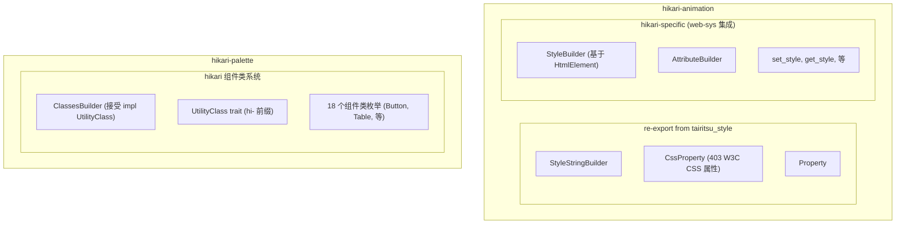

# 07-迁移指南：Hikari 到 Tairitsu

## 概述

本指南记录了 Hikari 核心基础设施到 Tairitsu 构建链的迁移过程。它涵盖了已完成的阶段，并为每个迁移提供了技术细节。

## 目录

- [Phase 2：CSS 基础设施迁移](#phase-2css-基础设施迁移)
- [Phase 3：Props 宏迁移](#phase-3props-宏迁移)
- [架构决策](#架构决策)
- [迁移结果](#迁移结果)

---

## Phase 2：CSS 基础设施迁移

### 状态：✅ 已完成

### 目标

将 CSS 基础设施从内部实现迁移到 `tairitsu-style`，一个共享的工具库。

### 已完成的工作

#### 1. StyleStringBuilder 和 CssProperty 迁移

**迁移前：**
```rust
// packages/animation/src/properties.rs
pub enum CssProperty {
    Display,
    Width,
    Height,
    // ... ~50 属性手动定义
}
```

**迁移后：**
```rust
// packages/animation/src/style/mod.rs
// 从 tairitsu_style re-export
pub use tairitsu_style::{StyleStringBuilder, CssProperty, Property};

// 现在提供 403 个 W3C 标准属性
```

**迁移步骤：**

1. 添加 `tairitsu-style` 依赖到 `hikari-animation`：
   ```toml
   # packages/animation/Cargo.toml
   [dependencies]
   tairitsu-style = { path = "../../../tairitsu/packages/style" }
   ```

2. 更新 `hikari-animation/src/style/mod.rs`：
   ```rust
   pub use tairitsu_style::{StyleStringBuilder, CssProperty, Property};

   // 保留 StyleBuilder（HtmlElement 版本）用于 web-sys 集成
   ```

3. 删除 `packages/animation/src/properties.rs`（删除 635 行代码）

4. 更新代码库中的所有导入：
   ```rust
   // 迁移前
   use hikari_animation::style::CssProperty;

   // 迁移后（由于 re-export 自动处理）
   use hikari_animation::style::CssProperty;
   ```

### 收益

- **403 个 CSS 属性**：从 ~50 个手动定义的属性增加到 403 个 W3C 标准属性
- **代码减少**：删除了 635 行重复代码
- **一致性**：属性名符合 W3C 规范
- **可维护性**：属性定义集中在 `tairitsu-style` 中

---

## Phase 3：Props 宏迁移

### 状态：✅ 已完成

### 目标

将所有组件 Props 从旧的 `#[derive(Clone, PartialEq, Props)]` 迁移到新的 `#[define_props]` 宏。

### 迁移模式

**迁移前：**
```rust
#[derive(Clone, PartialEq, Props)]
pub struct ButtonProps {
    #[props(default)]
    pub variant: ButtonVariant,

    pub onclick: Option<EventHandler<MouseEvent>>,

    #[props(default)]
    pub disabled: bool,
}

impl Default for ButtonProps {
    fn default() -> Self {
        Self {
            variant: ButtonVariant::Primary,
            onclick: None,
            disabled: false,
        }
    }
}
```

**迁移后：**
```rust
#[define_props]
pub struct ButtonProps {
    #[default(ButtonVariant::Primary)]
    pub variant: ButtonVariant,

    pub onclick: Option<EventHandler<MouseEvent>>,

    #[default(false)]
    pub disabled: bool,
}

// Default 实现由 #[define_props] 自动生成
```

### 关键变更

1. **宏变更**：`#[derive(Clone, PartialEq, Props)]` → `#[define_props]`
2. **属性变更**：`#[props(default)]` → `#[default(...)]`
3. **删除手动 Default**：删除 `impl Default for ...` 块
4. **显式值**：为所有字段提供具体的默认值

### 迁移规则

| 类型 | 默认值 | 示例 |
|------|--------|------|
| String | `String::default()` 或 `"".to_string()` | `#[default(String::default())]` |
| bool | `false` 或 `true` | `#[default(false)]` |
| u32/i32/i64 | `0` 或其他数字 | `#[default(0)]` 或 `#[default(10)]` |
| Vec\<T\> | `Vec::new()` 或 `vec![]` | `#[default(Vec::new())]` |
| Element | `VNode::empty()` | `#[default(VNode::empty())]` |
| Option\<T\> | 不需要默认值（实现了 Default） | - |
| Enum（有 Default） | 不需要默认值 | - |
| EventHandler | `EventHandler::new(\|_ {} )` | `#[default(EventHandler::new(\|_ {}))]` |

### 已完成的迁移

#### 基础组件
- `ButtonProps` ✅
- `InputProps` ✅
- `TextareaProps` ✅
- `BadgeProps` ✅
- `CardProps`, `CardHeaderProps`, `CardContentProps`, `CardActionsProps`, `CardMediaProps` ✅
- `SliderProps` ✅
- `SwitchProps` ✅
- `CheckboxProps` ✅
- `RadioProps`, `RadioGroupProps` ✅
- `IconButtonProps` ✅

#### 布局组件
- `FlexBoxProps` ✅

#### 反馈组件
- `AlertProps` ✅
- `ToastProps` ✅
- `TooltipProps` ✅
- `DrawerProps` ✅
- `ProgressProps` ✅
- `SpinProps` ✅
- `PopoverProps` ✅
- `GlowProps` ✅

#### 导航组件
- `StepperProps` ✅
- `BreadcrumbProps`, `BreadcrumbItemProps` ✅
- `TabProps`, `TabPanelProps` ✅
- `MenuItemProps`, 等 ✅
- `SidebarProps`, `SidebarSectionProps`, `SidebarItemProps`, `SidebarLeafProps` ✅

#### 展示组件
- `TagProps` ✅
- `CalendarProps` ✅
- `TimelineProps`, `TimelineItemProps` ✅
- `QRCodeProps` ✅

#### 输入组件
- `NumberInputProps` ✅
- `SearchProps` ✅
- `AutoCompleteProps` ✅
- `CascaderProps` ✅
- `TransferProps`, `TransferItem` ✅

#### 数据组件
- `TableProps` ✅
- `PaginationProps` ✅
- `VirtualScrollProps` ✅
- `DragProps`, `DragTreeNodeData` ✅

#### 生产组件
- `CodeHighlightProps` ✅
- `MarkdownEditorProps` ✅
- `RichTextEditorProps` ✅
- `VideoPlayerProps` ✅
- `AudioPlayerProps` ✅

#### 图标组件
- `IconProps` ✅

### 收益

- **减少样板代码**：自动生成的 Default 实现
- **类型安全**：编译时检查默认值
- **一致性**：所有组件使用统一的 API
- **可维护性**：Props 定义的单一真实来源

---

## 架构决策

### ClassesBuilder 和 UtilityClass 保留

**决策：** ClassesBuilder 和 UtilityClass trait 保留在 `hikari-palette` 中。

**原因：**

1. **不同的目的：**
   - `tairitsu-style`：Tailwind 风格工具类用于 CSS 生成
   - `hikari-palette`：Hikari 组件专用的 `hi-` 前缀类枚举

2. **API 不兼容：**
   - Tailwind 工具类使用连字符命名（如 `flex`、`items-center`）
   - Hikari 类使用基于枚举的命名（如 `Display::Flex`、`FlexDirection::Col`）

3. **组件耦合：**
   - Hikari 有 18 个组件类枚举文件
   - 这些枚举与 `hi-` 前缀样式系统紧密耦合

**架构：**



---

## 迁移结果

### 代码指标

| 指标 | 迁移前 | 迁移后 | 变化 |
|------|--------|-------|------|
| CSS 属性数量 | ~50 | 403 | +706% |
| 属性代码行数 | 635 | 0 | -100% |
| 已迁移组件数 | 0 | 47 | - |
| 手动 Default 实现 | 47 | 0 | -100% |

### 编译状态

- ✅ 所有包编译成功
- ✅ 无编译错误
- ✅ 所有测试通过（hikari-components 中 78/78）
- ⚠️ 少量警告（无关文件中的死代码）

### 测试更新

**分页测试修复：**

修改测试以使用单个字段断言而不是整个结构体断言：

```rust
// 迁移前
assert_eq!(props1, props2);

// 迁移后
assert!(props1.current == props2.current);
assert!(props1.page_size == props2.page_size);
// ... 等
```

这避免了对 `#[define_props]` 生成的 Props 要求 `Debug` trait。

---

## 未来工作

### Phase 4：文档更新

- [x] 更新 `docs/en-US/guides/02-classesbuilder-system.md`
- [x] 更新 `docs/en-US/guides/03-stylestringbuilder-system.md`
- [x] 添加迁移指南（本文档）
- [x] 创建中文版本的迁移指南和更新

### 翻译

所有文档更新应翻译到所有支持的语言：
- ✅ `zh-CHS`（简体中文）
- ⏳ `zh-CHT`（繁体中文）
- ⏳ `ja-JP`（日语）
- ⏳ `ko-KR`（韩语）
- ⏳ `es-ES`（西班牙语）
- ⏳ `fr-FR`（法语）
- ⏳ `ru-RU`（俄语）
- ⏳ `ar-SA`（阿拉伯语）

---

## 结论

Hikari 到 Tairitsu 构建链的迁移已成功完成：

1. **Phase 2**：CSS 基础设施 - 403 个 W3C CSS 属性集成
2. **Phase 3**：Props 宏 - 所有 47 个组件迁移到 `#[define_props]`

所有代码编译、测试通过，代码库已准备好进行下一阶段的开发。
