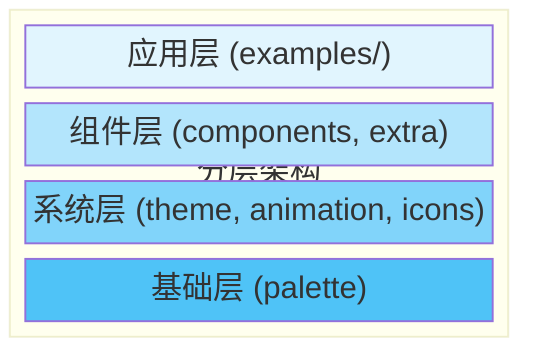
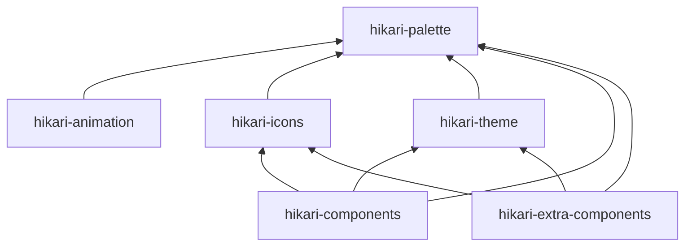
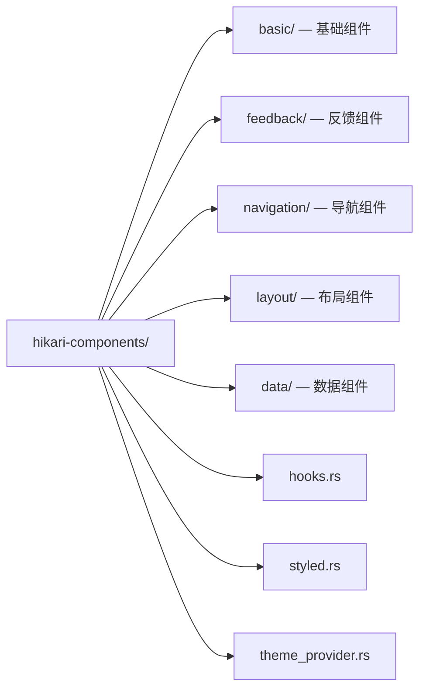
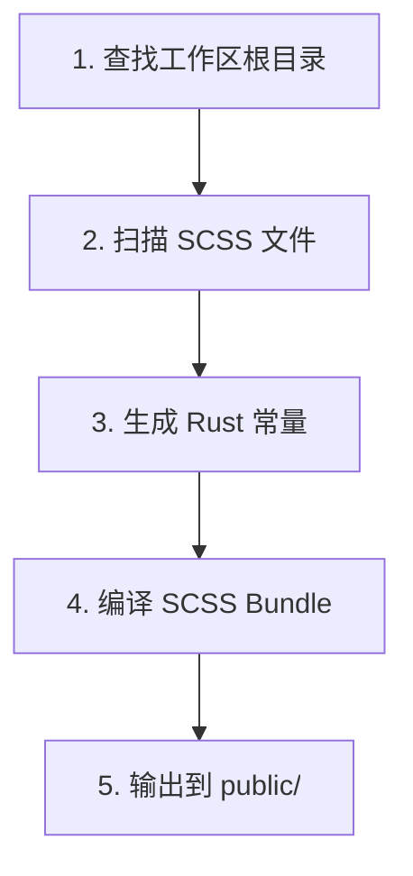
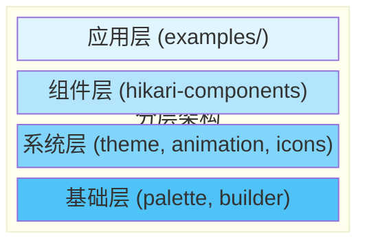
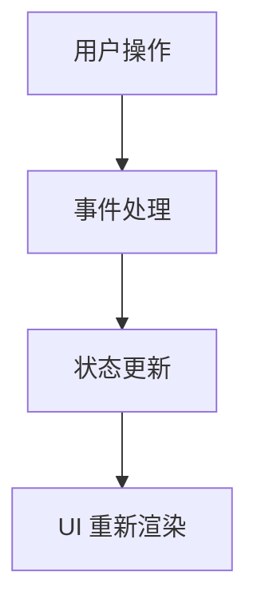
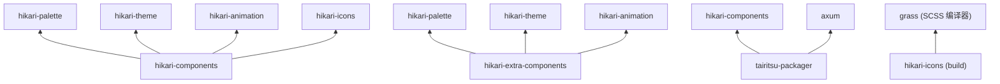

# 系统架构概览

Hikari 框架采用模块化设计，基于 Tairitsu 运行时构建，由 6 个独立包组成。

## 包概览

| 包 | 说明 |
|---|---|
| hikari-palette | 中国传统色彩系统（660+ 颜色），主题色板管理 |
| hikari-animation | 声明式动画系统，缓动函数、插值、时间线控制 |
| hikari-icons | Material Design Icons（7000+）集成，SVG 生成 |
| hikari-theme | 主题上下文、CSS 变量生成、主题切换 |
| hikari-components | 核心 UI 组件库（40+ 组件） |
| hikari-extra-components | 高级组件（节点编辑器、富文本等） |

## 分层架构



## 包依赖关系



## 外部依赖

所有包基于 **Tairitsu** 框架（tairitsu-vdom、tairitsu-hooks、tairitsu-style、tairitsu-web）作为响应式 UI / WASM 运行时。

## 核心系统

### 1. 色彩系统（hikari-palette）

中国传统色彩系统的 Rust 实现。

**职责**：
- 提供 660+ 种中国传统色彩定义
- 主题色板管理
- 工具类生成器
- 透明度与颜色混合

**核心功能**：
```rust
use hikari_palette::{Color, opacity};

// 使用传统色彩
let red = Color::Cinnabar;
let blue = Color::Azurite;

// 透明度处理
let semi_red = opacity(red, 0.5);

// 主题系统
let theme = Hikari::default();
println!("Primary: {}", theme.primary.hex());
```

**设计理念**：
- **文化自信**：使用传统色彩名称
- **类型安全**：编译期色彩值检查
- **高性能**：零成本抽象

### 2. 主题系统（hikari-theme）

主题上下文与样式注入系统。

**职责**：
- 主题提供者组件
- 主题上下文管理
- CSS 变量生成
- 主题切换

**核心功能**：
```rust
use hikari_theme::ThemeProvider;

rsx! {
    ThemeProvider { palette: "hikari" } {
        // 应用内容
        App {}
    }
}
```

**支持的主题**：
- **Hikari（亮色）** - 亮色主题
  - 主色：粉红（#FFB3A7）
  - 辅色：苍翠（#519A73）
  - 强调色：姜黄（#FFC773）

- **Tairitsu** - 暗色主题
  - 主色：鷃蓝（#144A74）
  - 辅色：苍翠（#519A73）
  - 强调色：姜黄（#FFC773）

### 3. 动画系统（hikari-animation）

高性能声明式动画系统。

**职责**：
- 动画构建器
- 动画上下文
- 缓动函数
- 预设动画

**核心功能**：
```rust
use hikari_animation::{AnimationBuilder, AnimationContext};
use hikari_animation::style::CssProperty;

// 静态动画
AnimationBuilder::new(&elements)
    .add_style("button", CssProperty::Opacity, "0.8")
    .apply_with_transition("300ms", "ease-in-out");

// 动态动画（鼠标跟随）
AnimationBuilder::new(&elements)
    .add_style_dynamic("button", CssProperty::Transform, |ctx| {
        let x = ctx.mouse_x();
        let y = ctx.mouse_y();
        format!("translate({}px, {}px)", x, y)
    })
    .apply_with_transition("150ms", "ease-out");
```

**架构组件**：
- **builder** - 动画构建器 API
- **context** - 运行时动画上下文
- **style** - 类型安全的 CSS 操作
- **easing** - 30+ 缓动函数
- **tween** - 插值系统
- **timeline** - 时间线控制
- **presets** - 预设动画（淡入淡出、滑动、缩放）
- **spotlight** - 聚光灯效果

**性能特性**：
- WASM 优化
- 防抖更新
- requestAnimationFrame 集成
- 最小化重排与重绘

### 4. 图标系统（hikari-icons）

图标管理与渲染系统。

**职责**：
- 图标枚举定义
- SVG 内容生成
- 图标尺寸变体
- Material Design Icons 集成

**核心功能**：
```rust
use hikari_icons::{Icon, MdiIcon};

rsx! {
    Icon {
        icon: MdiIcon::Search,
        size: 24,
        color: "var(--hi-primary)"
    }
}
```

**图标来源**：
- Material Design Icons（7000+ 图标）
- 可扩展的自定义图标
- 多尺寸支持

### 5. 组件库（hikari-components）

完整的 UI 组件库。

**职责**：
- 基础 UI 组件
- 布局组件
- 样式注册表
- 响应式 Hooks

**组件分类**：

1. **基础组件**（feature: "basic"）
   - Button、Input、Card、Badge

2. **反馈组件**（feature: "feedback"）
   - Alert、Toast、Tooltip、Spotlight

3. **导航组件**（feature: "navigation"）
   - Menu、Tabs、Breadcrumb

4. **布局组件**（始终可用）
   - Layout、Header、Aside、Content、Footer

5. **数据组件**（feature: "data"）
   - Table、Tree、Pagination

**模块化设计**：


**样式系统**：
- SCSS 源码
- 类型安全的工具类
- 组件级样式隔离
- CSS 变量集成

### 6. 图标构建系统

编译期代码生成与 SCSS 编译。

**职责**：
- SCSS 编译（使用 Grass）
- 组件发现
- 代码生成
- 资源打包

**构建流程**：


**使用方式**：
```rust
// build.rs
fn main() {
    tairitsu-icons build system::build().expect("Build failed");
}
```

**生成文件**：
- `public/styles/bundle.css` - 编译后的 CSS

### 7. 渲染服务（tairitsu-packager）

服务端渲染与静态资源服务。

**职责**：
- HTML 模板渲染
- 样式注册表
- 路由构建器
- 静态资源服务
- Axum 集成

**核心功能**：
```rust
use hikari_render_service::HikariRenderServicePlugin;

let app = HikariRenderServicePlugin::new()
    .component_style_registry(registry)
    .static_assets("./dist", "/static")
    .add_route("/api/health", get(health_check))
    .build()?;
```

**架构模块**：
- **html** - HTML 服务
- **registry** - 样式注册表
- **router** - 路由构建器
- **static_files** - 静态文件服务
- **styles_service** - 样式注入
- **plugin** - 插件系统

### 8. 扩展组件库（hikari-extra-components）

用于复杂交互场景的高级 UI 组件。

**职责**：
- 高级工具组件
- 拖拽与缩放交互
- 可折叠面板
- 动画集成

**核心组件**：

1. **Collapsible** - 可折叠面板
   - 左右滑入/滑出动画
   - 可配置宽度
   - 展开状态回调

2. **DragLayer** - 拖拽层
   - 边界约束
   - 拖拽事件回调
   - 自定义 z-index

3. **ZoomControls** - 缩放控件
   - 键盘快捷键支持
   - 可配置缩放范围
   - 多种定位选项

**核心功能**：
```rust
use hikari_extra_components::{Collapsible, DragLayer, ZoomControls};

// 可折叠面板
Collapsible {
    title: "Settings".to_string(),
    expanded: true,
    position: CollapsiblePosition::Right,
    div { "Content" }
}

// 拖拽层
DragLayer {
    initial_x: 100.0,
    initial_y: 100.0,
    constraints: DragConstraints {
        min_x: Some(0.0),
        max_x: Some(500.0),
        ..Default::default()
    },
    div { "Drag me" }
}

// 缩放控件
ZoomControls {
    zoom: 1.0,
    on_zoom_change: move |z| println!("Zoom: {}", z)
}
```

## 架构原则

### 1. 模块化设计

每个包相互独立，可单独使用：

```toml
# 仅使用色彩系统
[dependencies]
hikari-palette = "0.1"

# 使用组件与主题
[dependencies]
hikari-components = "0.1"
hikari-theme = "0.1"

# 使用动画系统
[dependencies]
hikari-animation = "0.1"
```

### 2. 分层架构



### 3. 单向数据流



### 4. 类型安全

所有 API 均为类型安全的：
- 编译期检查
- IDE 自动补全
- 重构安全

### 5. 性能优先

- WASM 优化
- 虚拟滚动
- 防抖/节流
- 最小化 DOM 操作

## 构建流程

### 开发模式
```bash
cargo run
```

### 生产构建
```bash
# 1. 构建 Rust 代码
cargo build --release

# 2. 构建系统自动编译 SCSS
# 3. 生成 CSS bundle
# 4. 打包静态资源
```

### WASM 构建
```bash
trunk build --release
```

## 依赖关系



## 可扩展性

### 添加自定义组件

```rust
use hikari_components::{StyledComponent, StyleRegistry};

pub struct MyComponent;

impl StyledComponent for MyComponent {
    fn register_styles(registry: &mut StyleRegistry) {
        registry.register("my-component", include_str!("my-component.scss"));
    }
}
```

### 添加自定义主题

```rust
use hikari_palette::ThemePalette;

struct CustomTheme;

impl CustomTheme {
    pub fn palette() -> ThemePalette {
        ThemePalette {
            primary: "#FF0000",
            secondary: "#00FF00",
            // ...
        }
    }
}
```

### 添加自定义动画预设

```rust
use hikari_animation::{AnimationBuilder, AnimationContext};

pub fn fade_in(
    builder: AnimationBuilder,
    element: &str,
    duration: u32,
) -> AnimationBuilder {
    builder
        .add_style(element, CssProperty::Opacity, "0")
        .add_style(element, CssProperty::Opacity, "1")
        .apply_with_transition(&format!("{}ms", duration), "ease-out")
}
```

## 性能优化

### 1. CSS 优化
- SCSS 编译为优化后的 CSS
- 移除未使用的样式（tree-shaking）
- 生产环境 CSS 压缩

### 2. WASM 优化
- `wasm-opt` 优化
- WASM 模块懒加载
- 线性内存优化

### 3. 运行时优化
- 虚拟滚动（大数据列表）
- 防抖动画更新
- requestAnimationFrame

### 4. 构建优化
- 并行编译
- 增量编译
- 二进制缓存

## 测试策略

### 单元测试
每个模块都有完整的单元测试：

```rust
#[cfg(test)]
mod tests {
    #[test]
    fn test_color_conversion() {
        let color = Color::Cinnabar;
        assert_eq!(color.hex(), "#519A73");
    }
}
```

### 集成测试
`examples/` 中的示例应用作为集成测试

### 视觉回归测试
使用 Percy 或类似工具进行 UI 快照测试

## 下一步

- 阅读[组件文档](../components/)了解具体组件
- 查看 [API 文档](https://docs.rs/hikari-components)了解 API 详情
- 浏览[示例代码](../../examples/)学习最佳实践
