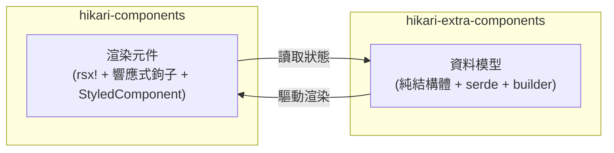

# 雙層包架構：components 與 extra-components

Hikari 將元件體系拆分為兩個互補的包，分別承擔不同層次的職責：



### 職責對比

| 維度 | `hikari-components` | `hikari-extra-components` |
|------|---------------------|---------------------------|
| **渲染方式** | `rsx!` 巨集、響應式鉤子 | 無（框架無關） |
| **狀態管理** | `use_signal()`、`use_effect()` | 純可變結構體欄位 |
| **事件處理** | `EventHandler<T>` 閉包 | `data-action` 屬性 + 外部綁定 |
| **CSS 嵌入** | `StyledComponent` trait | 匯出 `pub const *_STYLES` |
| **序列化** | 不需要 | 所有狀態型別均衍生 `serde` |
| **DOM 依賴** | 需要 Tairitsu 框架 | 無 |
| **適用場景** | Tairitsu 應用內的即時 UI 渲染 | SSR、測試、狀態持久化、非 Tairitsu 框架 |

### 重疊元件域

以下元件在兩個包中均存在，這是**有意設計**而非冗餘：

- `Timeline` / `TimelineState`
- `DragLayer` / `DragLayerState`
- `UserGuide` / `UserGuideState`
- `ZoomControls` / `ZoomControlsState`
- `VideoPlayer` / `VideoPlayerState`
- `RichTextEditor` / `RichTextEditorState`
- `CodeHighlight` / `CodeHighlighterState`

`components` 版本提供**即用型渲染元件**（含動畫、鍵盤處理、圖示整合、StyledComponent CSS）；
`extra-components` 版本提供**純資料模型**（含 builder 模式、serde 序列化、變更方法、單元測試）。

### 何時使用哪個包

- **Tairitsu 應用**：使用 `hikari-components` 進行 UI 渲染；可選使用 `hikari-extra-components` 進行狀態持久化或復原/重做
- **非 Tairitsu 應用**：使用 `hikari-extra-components` 的資料模型並自行實作渲染
- **測試**：使用 `hikari-extra-components` 在無 DOM 環境下進行狀態邏輯單元測試
- **SSR**：兩者併用——資料模型用於服務端狀態，渲染元件用於客戶端注水

### 型別消歧

部分型別在兩個包中同名（如 `TimelinePosition`、`GuideStep`）。請使用顯式模組路徑匯入：

```rust,ignore
use hikari_extra_components::extra::TimelineState;     // 純資料模型
use hikari_components::display::Timeline;              // 渲染元件

use hikari_extra_components::extra::ZoomControlsState; // 純狀態
use hikari_components::display::ZoomControls;          // 渲染元件
```

### CSS 類別名稱

兩個包對同一概念元素使用不同的 CSS 類別名稱。這是有意為之——`components` 使用來自 `hikari-palette` 的型別化類別列舉（如 `ZoomControlsClass::Button`），而 `extra-components` 使用硬編碼字串或計算方法。當兩個包同時使用時，各自以其自身的類別集渲染。
