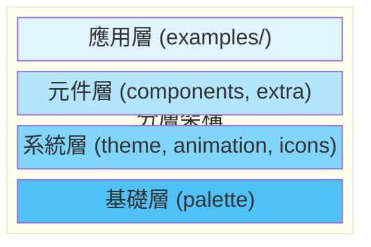
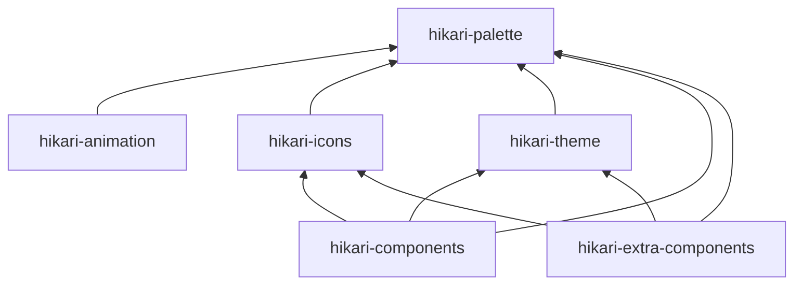
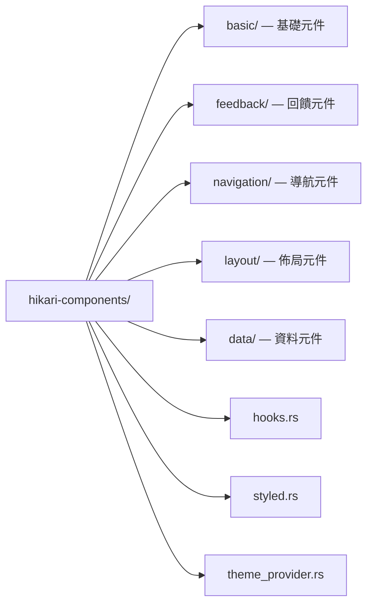
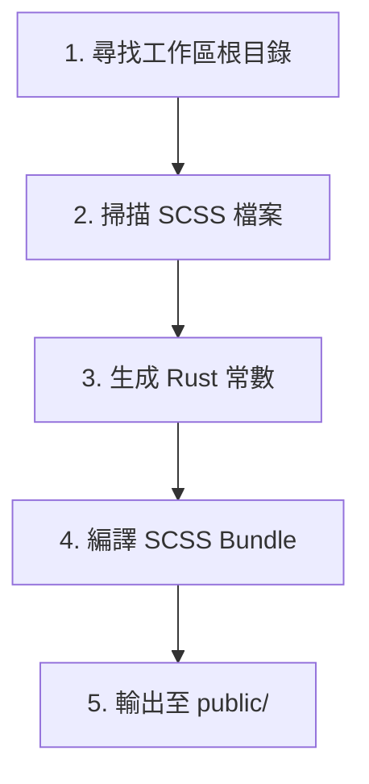
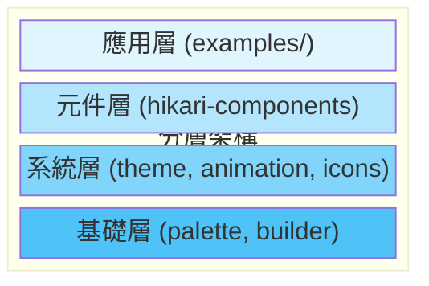
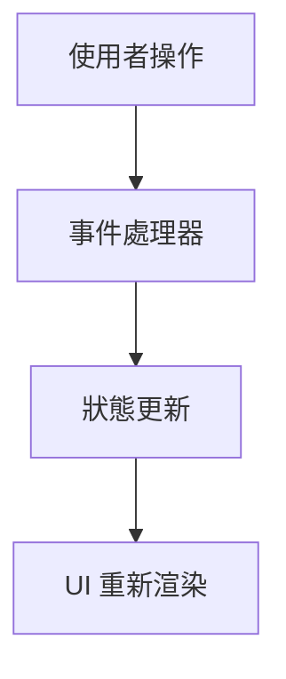
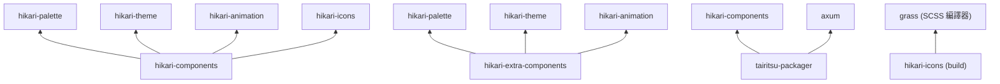

# 系統架構概覽

Hikari 框架採用模組化設計，基於 Tairitsu 執行時期構建，由 6 個獨立套件組成。

## 套件概覽

| 套件 | 說明 |
|---|---|
| hikari-palette | 中國傳統色彩系統（660+ 顏色），主題色板管理 |
| hikari-animation | 宣告式動畫系統，緩動函數、插值、時間線控制 |
| hikari-icons | Material Design Icons（7000+）整合，SVG 生成 |
| hikari-theme | 主題上下文、CSS 變數生成、主題切換 |
| hikari-components | 核心 UI 元件庫（40+ 元件） |
| hikari-extra-components | 進階元件（節點編輯器、富文本等） |

## 分層架構



## 套件依賴關係



## 外部依賴

所有套件基於 **Tairitsu** 框架（tairitsu-vdom、tairitsu-hooks、tairitsu-style、tairitsu-web）作為響應式 UI / WASM 執行時期。

## 核心系統

### 1. 色彩系統 (hikari-palette)

中國傳統色彩系統的 Rust 實作。

**職責**：
- 提供 660+ 傳統中國色彩定義
- 主題色板管理
- 工具類別生成器
- 透明度與色彩混合

**核心功能**：
```rust
use hikari_palette::{Color, opacity};

// 使用傳統色彩
let red = Color::Cinnabar;
let blue = Color::Azurite;

// 透明度處理
let semi_red = opacity(red, 0.5);

// 主題系統
let theme = Hikari::default();
println!("Primary: {}", theme.primary.hex());
```

**設計理念**：
- **文化自信**：使用傳統色彩名稱
- **型別安全**：編譯時期色彩值檢查
- **高效能**：零成本抽象

### 2. 主題系統 (hikari-theme)

主題上下文與樣式注入系統。

**職責**：
- 主題供應者元件
- 主題上下文管理
- CSS 變數生成
- 主題切換

**核心功能**：
```rust
use hikari_theme::ThemeProvider;

rsx! {
    ThemeProvider { initial_palette: "hikari" } {
        // 應用程式內容
        App {}
    }
}
```

**支援的主題**：
- **Hikari（亮色）** - 亮色主題
  - 主色：粉紅 (#FFB3A7)
  - 副色：蒼翠 (#519A73)
  - 強調色：薑黃 (#FFC773)

- **Tairitsu** - 暗色主題
  - 主色：鷃藍 (#144A74)
  - 副色：蒼翠 (#519A73)
  - 強調色：薑黃 (#FFC773)

### 3. 動畫系統 (hikari-animation)

高效能宣告式動畫系統。

**職責**：
- 動畫建構器
- 動畫上下文
- 緩動函數
- 預設動畫

**核心功能**：
```rust
use hikari_animation::{AnimationBuilder, AnimationContext};
use hikari_animation::style::CssProperty;

// 靜態動畫
AnimationBuilder::new(&elements)
    .add_style("button", CssProperty::Opacity, "0.8")
    .apply_with_transition("300ms", "ease-in-out");

// 動態動畫（滑鼠跟隨）
AnimationBuilder::new(&elements)
    .add_style_dynamic("button", CssProperty::Transform, |ctx| {
        let x = ctx.mouse_x();
        let y = ctx.mouse_y();
        format!("translate({}px, {}px)", x, y)
    })
    .apply_with_transition("150ms", "ease-out");
```

**架構元件**：
- **builder** - 動畫建構器 API
- **context** - 執行時期動畫上下文
- **style** - 型別安全的 CSS 操作
- **easing** - 30+ 緩動函數
- **tween** - 插值系統
- **timeline** - 時間線控制
- **presets** - 預設動畫（淡入淡出、滑動、縮放）
- **spotlight** - 聚光燈效果

**效能特性**：
- WASM 最佳化
- 防抖更新
- requestAnimationFrame 整合
- 最小化重排與重繪

### 4. 圖示系統 (hikari-icons)

圖示管理與渲染系統。

**職責**：
- 圖示列舉定義
- SVG 內容生成
- 圖示尺寸變體
- Material Design Icons 整合

**核心功能**：
```rust
use hikari_icons::{Icon, MdiIcon};

rsx! {
    Icon {
        icon: MdiIcon::Search,
        size: 24,
        color: "var(--hi-primary)"
    }
}
```

**圖示來源**：
- Material Design Icons（7000+ 圖示）
- 可擴充的自訂圖示
- 多種尺寸支援

### 5. 元件庫 (hikari-components)

完整的 UI 元件庫。

**職責**：
- 基礎 UI 元件
- 佈局元件
- 樣式註冊表
- 響應式鉤子

**元件分類**：

1. **基礎元件**（功能特性："basic"）
   - Button、Input、Card、Badge

2. **回饋元件**（功能特性："feedback"）
   - Alert、Toast、Tooltip、Spotlight

3. **導航元件**（功能特性："navigation"）
   - Menu、Tabs、Breadcrumb

4. **佈局元件**（始終可用）
   - Layout、Header、Aside、Content、Footer

5. **資料元件**（功能特性："data"）
   - Table、Tree、Pagination

**模組化設計**：


**樣式系統**：
- SCSS 原始碼
- 型別安全的工具類別
- 元件級別樣式隔離
- CSS 變數整合

### 6. 圖示建置系統

編譯時期程式碼生成與 SCSS 編譯。

**職責**：
- SCSS 編譯（使用 Grass）
- 元件探索
- 程式碼生成
- 資源打包

**建置流程**：


**使用方式**：
```rust
// build.rs
fn main() {
    tairitsu-icons build system::build().expect("Build failed");
}
```

**生成檔案**：
- `public/styles/bundle.css` - 編譯後的 CSS

### 7. 渲染服務 (tairitsu-packager)

伺服器端渲染與靜態資源服務。

**職責**：
- HTML 模板渲染
- 樣式註冊表
- 路由建構器
- 靜態資源服務
- Axum 整合

**核心功能**：
```rust
use hikari_render_service::HikariRenderServicePlugin;

let app = HikariRenderServicePlugin::new()
    .component_style_registry(registry)
    .static_assets("./dist", "/static")
    .add_route("/api/health", get(health_check))
    .build()?;
```

**架構模組**：
- **html** - HTML 服務
- **registry** - 樣式註冊表
- **router** - 路由建構器
- **static_files** - 靜態檔案服務
- **styles_service** - 樣式注入
- **plugin** - 外掛系統

### 8. 進階元件庫 (hikari-extra-components)

用於複雜互動場景的進階 UI 元件。

**職責**：
- 進階工具元件
- 拖曳與縮放互動
- 可摺疊面板
- 動畫整合

**核心元件**：

1. **Collapsible** - 可摺疊面板
   - 左右滑入/滑出動畫
   - 可設定寬度
   - 展開狀態回呼

2. **DragLayer** - 拖曳圖層
   - 邊界約束
   - 拖曳事件回呼
   - 自訂 z-index

3. **ZoomControls** - 縮放控制
   - 鍵盤快捷鍵支援
   - 可設定縮放範圍
   - 多種定位選項

**核心功能**：
```rust
use hikari_extra_components::{Collapsible, DragLayer, ZoomControls};

// 可摺疊面板
Collapsible {
    title: "Settings".to_string(),
    expanded: true,
    position: CollapsiblePosition::Right,
    div { "Content" }
}

// 拖曳圖層
DragLayer {
    initial_x: 100.0,
    initial_y: 100.0,
    constraints: DragConstraints {
        min_x: Some(0.0),
        max_x: Some(500.0),
        ..Default::default()
    },
    div { "Drag me" }
}

// 縮放控制
ZoomControls {
    zoom: 1.0,
    on_zoom_change: move |z| println!("Zoom: {}", z)
}
```

## 架構原則

### 1. 模組化設計

每個套件都是獨立的，可以單獨使用：

```toml
# 僅使用色彩系統
[dependencies]
hikari-palette = "0.1"

# 使用元件與主題
[dependencies]
hikari-components = "0.1"
hikari-theme = "0.1"

# 使用動畫系統
[dependencies]
hikari-animation = "0.1"
```

### 2. 分層架構



### 3. 單向資料流



### 4. 型別安全

所有 API 都是型別安全的：
- 編譯時期檢查
- IDE 自動補全
- 重構安全性

### 5. 效能優先

- WASM 最佳化
- 虛擬滾動
- 防抖/節流
- 最小化 DOM 操作

## 建置流程

### 開發模式
```bash
cargo run
```

### 生產建置
```bash
# 1. 建置 Rust 程式碼
cargo build --release

# 2. 建置系統自動編譯 SCSS
# 3. 生成 CSS bundle
# 4. 打包靜態資源
```

### WASM 建置
```bash
trunk build --release
```

## 依賴關係



## 擴充性

### 新增自訂元件

```rust
use hikari_components::{StyledComponent, StyleRegistry};

pub struct MyComponent;

impl StyledComponent for MyComponent {
    fn register_styles(registry: &mut StyleRegistry) {
        registry.register("my-component", include_str!("my-component.scss"));
    }
}
```

### 新增自訂主題

```rust
use hikari_palette::ThemePalette;

struct CustomTheme;

impl CustomTheme {
    pub fn palette() -> ThemePalette {
        ThemePalette {
            primary: "#FF0000",
            secondary: "#00FF00",
            // ...
        }
    }
}
```

### 新增自訂動畫預設

```rust
use hikari_animation::{AnimationBuilder, AnimationContext};

pub fn fade_in(
    builder: AnimationBuilder,
    element: &str,
    duration: u32,
) -> AnimationBuilder {
    builder
        .add_style(element, CssProperty::Opacity, "0")
        .add_style(element, CssProperty::Opacity, "1")
        .apply_with_transition(&format!("{}ms", duration), "ease-out")
}
```

## 效能最佳化

### 1. CSS 最佳化
- SCSS 編譯為最佳化的 CSS
- 移除未使用的樣式（tree-shaking）
- 壓縮生產環境 CSS

### 2. WASM 最佳化
- `wasm-opt` 最佳化
- 延遲載入 WASM 模組
- 線性記憶體最佳化

### 3. 執行時期最佳化
- 虛擬滾動（大數據列表）
- 防抖動畫更新
- requestAnimationFrame

### 4. 建置最佳化
- 平行編譯
- 增量編譯
- 二進位快取

## 測試策略

### 單元測試
每個模組都有完整的單元測試：

```rust
#[cfg(test)]
mod tests {
    #[test]
    fn test_color_conversion() {
        let color = Color::Cinnabar;
        assert_eq!(color.hex(), "#519A73");
    }
}
```

### 整合測試
`examples/` 中的範例應用作為整合測試

### 視覺回歸測試
使用 Percy 或類似工具進行 UI 快照測試

## 下一步

- 閱讀[元件文件](../components/)了解特定元件
- 檢視 [API 文件](https://docs.rs/hikari-components)了解 API 詳情
- 瀏覽[範例程式碼](../../examples/)學習最佳實踐
