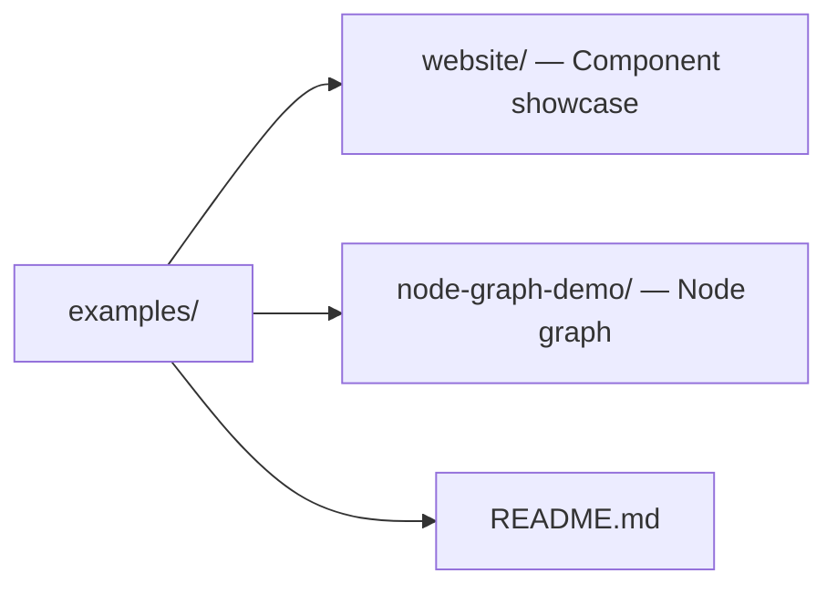

# Hikari Examples

Runnable demonstrations of the Hikari component library.

## Examples

### 1. [website](./website/) - Component Showcase

Comprehensive demo of all Hikari components with sidebar navigation.

**Features:**

- Basic Components (Button, Input, Card, Badge)
- Feedback Components (Alert, Toast, Tooltip)
- Navigation Components (Menu, Tabs, Breadcrumb)
- Data Components (Table, Tree)

**Run:**

```bash
just serve
```

### 2. [node-graph-demo](./node-graph-demo/) - Interactive Node Graph

Interactive node graph editor with connections, zoom, pan, and minimap.

**Note**: This example still depends on Dioxus and needs migration to Tairitsu.

## Development

### Running Examples

From the project root:

```bash
# Website demo (recommended)
just serve

# Or navigate to a specific example directory
cd examples/<example-name>
cargo run
```

### Building

```bash
cargo build --release --bins
```

## Project Structure



## Design System

All examples use the Hikari design system:

- **Flat design** with clean lines and high contrast
- **Glow effects** with subtle luminous touches
- **Themed color palettes** from the Hikari palette system
- **Responsive layouts** that work on all screen sizes

## License

All examples are licensed under the same terms as the Hikari project (MIT OR Apache-2.0).
