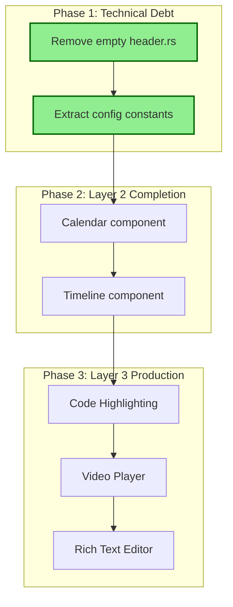

# Hikari Development & Maintenance Plan

## Overview

This plan tracks ongoing development, maintenance, and technical debt for the Hikari component library.

---

## Current Status

### Completed
- Type-safe CSS class refactoring (all components now use `UtilityClass` enums)
- Layer 1 & Layer 2 components implementation
- Chinese traditional color palette system
- Animation infrastructure (`AnimationBuilder`)
- **CodeHighlight clipboard fix** (2026-02-12) - Fixed button flickering and implemented real clipboard functionality
- **Checkbox visibility fix** (2026-02-12) - Fixed checkmark icon always visible, simplified state management
- **Checkbox styles compilation fix** (2026-02-12) - Fixed incomplete checkbox.scss in styles/components/ directory, cleaned up unused code
- **Radio component simplification** (2026-02-12) - Removed complex animation code, CSS-only transitions
- **Radio demo simplified** (2026-02-12) - Reduced to 3 options with 3rd disabled
- **Select Detail Modal** (2026-02-12) - Added modal with glow wrapper effect, focus only changes background

### Architecture
```
+------------------------------------------------------------------+
|                      Layer 3: Production Components               |
|  (Video Player, Rich Text Editor, Code Highlighting, Timeline)   |
|                            | depends on                           |
+------------------------------------------------------------------+
|                      Layer 2: Composite Components                |
|       (Menu, Tabs, Table, Tree, Form, Dropdown, Modal)           |
|                            | depends on                           |
+------------------------------------------------------------------+
|                       Layer 1: Basic Components                   |
|        (Button, Input, Card, Badge, Alert, Toast, etc.)          |
+------------------------------------------------------------------+
```

---

## Phase 1: Technical Debt & Maintenance

### 1.1 Empty/Stub Files

| File | Status | Action |
|------|--------|--------|
| `packages/components/src/data/header.rs` | Empty (1 byte) | ✅ Removed (commit a7cc059) |

### 1.2 Hardcoded Configuration Values ✅

Evaluated - All values are properly encapsulated:

| Location | Value | Status |
|----------|-------|--------|
| Responsive breakpoints | `Breakpoint` enum in `hooks.rs` with proper methods | ✅ Well-designed |
| Animation timings | User-configurable via props | ✅ Acceptable |
| Drawer sizes | Internal component constants | ✅ Acceptable |

### 1.3 Dynamic Typing Patterns (Acceptable)

The following `Box<dyn FnMut>` patterns are **intentional and correct** for WASM/JavaScript interop:

| File | Usage | Status |
|------|-------|--------|
| `scrollbar_container.rs` | JS event closures | Acceptable |
| `animation/builder.rs` | Animation callbacks | Acceptable |
| `hooks.rs` | Event listeners | Acceptable |

These are necessary for WASM bindings and don't represent technical debt.

---

## Phase 2: Layer 2 Component Completion ✅

### Missing Components (per layer-component-plan.md)

| Component | Priority | Dependencies | Status |
|-----------|----------|--------------|--------|
| Calendar | Medium | Button, Input, Card | ✅ Completed (2026-02-12) |
| Carousel | Low | Button, Card | Exists in `display/` |
| Collapse | Medium | Button, Card | Exists in `data/` |
| Stepper | Low | Button, Badge | Exists in `navigation/` |
| Timeline | Low | Card, Badge | ✅ Completed (2026-02-12) |
| Upload | Medium | Button, Progress | Exists as FileUpload in `basic/` |

---

## Phase 3: Layer 3 Production Components ✅

### High Priority

| Component | Description | Complexity | Dependencies | Status |
|-----------|-------------|------------|--------------|--------|
| **Code Highlighting** | Syntax highlighting, line numbers, themes | Medium | Card, Tabs, Form | ✅ Completed (2026-02-12), Fixed clipboard (2026-02-12) |
| **Video Player** | Playback controls, subtitles, playlist | High | Card, Button, Form, Menu | ✅ Completed (2026-02-12) |
| **Rich Text Editor** | WYSIWYG/Markdown, plugins | High | Form, Dropdown, Modal, Toolbar | ✅ Completed (2026-02-12) |

### Medium Priority

| Component | Description | Complexity | Dependencies | Status |
|-----------|-------------|------------|--------------|--------|
| **Timeline** | Event timeline, milestones | Medium | Card, Badge, Collapse | ✅ Completed (2026-02-12) |
| **User Guide** | Onboarding tours, feature hints | Medium | Modal, Button, Badge | Not started |

### Low Priority

| Component | Description | Complexity | Dependencies |
|-----------|-------------|------------|--------------|
| **Data Visualization** | Charts, dashboards | High | Card, Tabs, Form |
| **Code Editor** | Full IDE-like editing | High | Card, Tabs, Form, Menu |
| **Instant Messaging** | Chat UI, messages | High | Card, Form, Menu, Badge |

---

## Implementation Sequence



---

## Notes

### Design Principles
1. **Progressive Enhancement** - Build from simple to complex
2. **Composition over Inheritance** - Compose Layer 3 from Layer 2, Layer 2 from Layer 1
3. **Single Responsibility** - Each component does one thing well
4. **Type Safety** - All CSS classes use `UtilityClass` enums

### Conventions
- Component class enums: `{ComponentName}Class` derives `Debug, Clone, Copy, PartialEq, Eq, Serialize, Deserialize`
- Use `ClassesBuilder` pattern for composing classes
- Keep `.add_raw()` only for user-provided custom classes

---

## Historical: Type-Safe Refactoring (Completed)

The following enums were added during the refactoring to replace raw string literals:

| Phase | Enums Added |
|-------|-------------|
| 1 | `SwitchClass`, `SliderClass`, `SelectClass`, `DatePickerClass`, `FileUploadClass`, `FormFieldClass`, `DividerClass` |
| 2 | `AutoCompleteClass`, `CascaderClass`, `NumberInputClass`, `SearchClass`, `TransferClass` |
| 3 | `SpaceClass` (extended: `BadgeClass`, `ContainerClass`, `GlowClass`, `MenuClass`) |
| 4 | `TagClass`, `DescriptionListClass`, `EmptyClass`, `QRCodeClass` |
| 5 | `AppLayoutClass` |
| 6 | `DrawerClass`, `PopoverClass`, `ProgressClass`, `SkeletonClass`, `SpinClass` |
| 7 | `AnchorClass`, `StepsClass` |

---

## Phase 4: 通用 Popover 组件重构

### 背景

目前项目中存在两种不同的菜单/下拉渲染方式：

1. **Select 组件** (`basic/select.rs`)
   - 使用 Portal 系统
   - 每个选项用 `Glow` 组件包裹，有**鼠标跟随光效**
   - 样式定义在 `select.scss`

2. **Dropdown + Menu 组合** (语言切换等场景)
   - Dropdown 使用 Portal 系统
   - Menu 组件的 `MenuItem` 有 `glow` 属性，但**默认为 false**
   - 语言切换场景没有启用光效

**目标**：
- 重构 **Popover** 为通用弹出组件，支持智能定位
- 统一使用 **Popover + Menu** 组合
- **彻底删除** Dropdown 组件
- Menu 项默认启用 Glow 光效（类似 Select）

### Popover 新设计

#### 定位模式

```rust
pub enum PopoverPositioning {
    /// 相对定位模式（默认）- 自动边缘碰撞检测
    Relative {
        /// 优先尝试方向（数组，逐个尝试），但仍会碰撞检测
        /// 默认：[Bottom, Top, Left, Right]
        preferred: Vec<PopoverPlacement>,
    },
    /// 绝对定位模式 - 固定位置
    Absolute(PopoverAbsolutePosition),
}

pub enum PopoverPlacement {
    Bottom,
    Top,
    Left,
    Right,
}

pub enum PopoverAbsolutePosition {
    /// 相对于触发元素的位置
    Trigger(PopoverPlacement),
    /// 屏幕中心
    Center,
    /// 固定坐标
    Fixed { x: f64, y: f64 },
}
```

#### Props 设计

```rust
#[derive(Clone, PartialEq, Props)]
pub struct PopoverProps {
    /// 触发元素
    pub trigger: Element,
    
    /// 弹出内容
    pub children: Element,
    
    /// 是否打开
    #[props(default)]
    pub open: bool,
    
    /// 打开状态变化回调
    pub on_open_change: Option<Callback<bool>>,
    
    /// 定位模式（默认：相对定位 + 自动碰撞检测）
    #[props(default)]
    pub positioning: PopoverPositioning,
    
    /// 点击外部是否关闭
    #[props(default = true)]
    pub close_on_click_outside: bool,
    
    /// 附加样式类
    #[props(default)]
    pub class: String,
}
```

#### 智能碰撞检测逻辑

```
1. 如果是 Relative 模式：
   a. 遍历 preferred 数组中的方向
   b. 对每个方向检查是否会超出视口边缘
   c. 如果碰撞，尝试下一个方向
   d. 如果所有 preferred 方向都碰撞，按 [Bottom, Top, Left, Right] 顺序尝试
   e. 选择第一个不碰撞的方向

2. 如果是 Absolute 模式：
   a. 直接使用指定位置，不做碰撞检测
```

#### 默认行为

- 默认 `positioning = Relative { preferred: [Bottom, Top, Left, Right] }`
- 相当于：优先向下，如果下面空间不够就向上，以此类推

### 涉及的文件

| 文件 | 作用 | 变更 |
|------|------|------|
| `packages/components/src/feedback/popover.rs` | Popover 组件 | **重写**：智能定位系统 |
| `packages/components/src/navigation/menu.rs` | Menu 组件 | **修改**：Popover 内自动启用 glow |
| `packages/components/src/feedback/dropdown.rs` | Dropdown 组件 | **删除** |
| `packages/components/src/feedback/mod.rs` | 模块导出 | **修改**：移除 Dropdown |
| `packages/components/src/portal/mod.rs` | Portal 系统 | **修改**：移除 DropdownPortalEntry |
| `packages/components/src/styles/components/popover.scss` | Popover 样式 | **新增/修改** |
| `examples/website/src/components/aside_footer.rs` | 语言切换 | **修改**：Dropdown → Popover |

### 实现步骤

#### Phase 4.1: 重构 Popover 组件

1. **定义新的枚举类型**
   ```rust
   pub enum PopoverPositioning { ... }
   pub enum PopoverPlacement { ... }
   pub enum PopoverAbsolutePosition { ... }
   ```

2. **实现碰撞检测函数**
   ```rust
   fn find_best_placement(
       trigger_rect: Rect,
       popover_size: Size,
       viewport: Rect,
       preferred: &[PopoverPlacement],
   ) -> PopoverPlacement { ... }
   ```

3. **更新 Popover 组件**
   - 移除旧的 `position: PopoverPosition` 属性
   - 添加新的 `positioning: PopoverPositioning` 属性
   - 实现智能定位逻辑

4. **添加 FUI 样式**
   - 参考 Select 下拉样式
   - 背景、边框、圆角、阴影
   - `overflow: visible` 让 Glow 效果可见

#### Phase 4.2: 扩展 Menu 组件

5. **添加 `in_popover` 属性**
   ```rust
   #[props(default)]
   pub in_popover: bool,
   ```

6. **当 `in_popover: true` 时**：
   - MenuItem 默认 `glow: true`
   - 移除边框、背景
   - 调整样式适应 Popover 容器

#### Phase 4.3: 删除 Dropdown

7. **删除文件**
   - `packages/components/src/feedback/dropdown.rs`

8. **更新 mod.rs**
   - 移除 Dropdown 导出
   - 移除相关类型

9. **更新 Portal 系统**
   - 移除 `PortalEntry::Dropdown` 变体
   - 移除 `DropdownPortalEntry` 组件

#### Phase 4.4: 更新使用场景

10. **更新语言切换** (`aside_footer.rs`)
    ```rust
    // Before
    Dropdown {
        positioning: DropdownPositioning::TriggerBased,
        position: DropdownPosition::Top,
        trigger: rsx! { IconButton { ... } },
        Menu { ... }
    }
    
    // After
    Popover {
        positioning: PopoverPositioning::Relative { 
            preferred: vec![PopoverPlacement::Top, PopoverPlacement::Bottom] 
        },
        trigger: rsx! { IconButton { ... } },
        Menu {
            in_popover: true,
            MenuItem { ... }  // 自动启用 glow
            ...
        }
    }
    ```

11. **搜索并更新所有 Dropdown 使用场景**

### 文件变更预估

```
packages/components/
├── src/
│   ├── feedback/
│   │   ├── popover.rs        # 重写：智能定位系统
│   │   ├── dropdown.rs       # 删除
│   │   └── mod.rs            # 修改：移除 Dropdown
│   ├── navigation/
│   │   └── menu.rs           # 修改：添加 in_popover
│   ├── portal/
│   │   └── mod.rs            # 修改：移除 Dropdown 相关
│   └── styles/components/
│       └── popover.scss      # 新增：FUI 样式

examples/website/
└── src/components/
    └── aside_footer.rs       # 修改：Dropdown → Popover
```

### 使用示例

```rust
// 基本用法 - 自动碰撞检测
Popover {
    trigger: rsx! { Button { "点击" } },
    Menu { in_popover: true, ... }
}

// 指定优先方向
Popover {
    positioning: PopoverPositioning::Relative { 
        preferred: vec![PopoverPlacement::Top]  // 优先向上，但如果上面空间不够会自动换方向
    },
    trigger: rsx! { Button { "点击" } },
    Menu { in_popover: true, ... }
}

// 绝对定位 - 屏幕中心
Popover {
    positioning: PopoverPositioning::Absolute(PopoverAbsolutePosition::Center),
    trigger: rsx! { Button { "点击" } },
    div { "居中内容" }
}

// 绝对定位 - 固定坐标
Popover {
    positioning: PopoverPositioning::Absolute(PopoverAbsolutePosition::Fixed { x: 100.0, y: 200.0 }),
    trigger: rsx! { Button { "点击" } },
    div { "固定位置" }
}
```

### 光效配置

Menu 在 Popover 内时，MenuItem 默认使用：
- `GlowBlur::Light`
- `GlowIntensity::Seventy`
- `GlowColor::Ghost`

### Status: Ready to Implement

方案已确认，可以开始实现。
