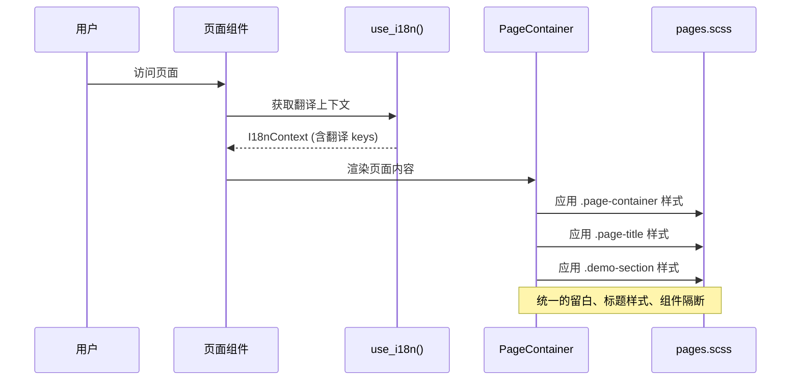

# Hikari Development & Maintenance Plan

## Overview

This plan tracks ongoing development, maintenance, and technical debt for the Hikari component library.

---

## Current Status

### Completed
- Type-safe CSS class refactoring (all components now use `UtilityClass` enums)
- Layer 1 & Layer 2 components implementation
- Chinese traditional color palette system
- Animation infrastructure (`AnimationBuilder`)
- **CodeHighlight clipboard fix** (2026-02-12) - Fixed button flickering and implemented real clipboard functionality
- **Checkbox visibility fix** (2026-02-12) - Fixed checkmark icon always visible, simplified state management
- **Checkbox styles compilation fix** (2026-02-12) - Fixed incomplete checkbox.scss in styles/components/ directory, cleaned up unused code
- **Radio component simplification** (2026-02-12) - Removed complex animation code, CSS-only transitions
- **Radio demo simplified** (2026-02-12) - Reduced to 3 options with 3rd disabled
- **Select Detail Modal** (2026-02-12) - Added modal with glow wrapper effect, focus only changes background
- **Popover 组件重构** (2026-02-15) - 智能定位、碰撞检测、统一菜单光效
- **Dropdown 组件移除** (2026-02-15) - 使用 Popover + Menu 替代
- **Website 页面布局优化** (2026-02-15) - 统一页面布局、添加 CSS 类、i18n 翻译支持

### Architecture
```
+------------------------------------------------------------------+
|                      Layer 3: Production Components               |
|  (Video Player, Rich Text Editor, Code Highlighting, Timeline)   |
|                            | depends on                           |
+------------------------------------------------------------------+
|                      Layer 2: Composite Components                |
|        (Menu, Tabs, Table, Tree, Form, Popover, Modal)           |
|                            | depends on                           |
+------------------------------------------------------------------+
|                       Layer 1: Basic Components                   |
|        (Button, Input, Card, Badge, Alert, Toast, etc.)          |
+------------------------------------------------------------------+
```

---

## Phase 1: Technical Debt & Maintenance

### 1.1 Empty/Stub Files

| File | Status | Action |
|------|--------|--------|
| `packages/components/src/data/header.rs` | Empty (1 byte) | ✅ Removed (commit a7cc059) |

### 1.2 Hardcoded Configuration Values ✅

Evaluated - All values are properly encapsulated:

| Location | Value | Status |
|----------|-------|--------|
| Responsive breakpoints | `Breakpoint` enum in `hooks.rs` with proper methods | ✅ Well-designed |
| Animation timings | User-configurable via props | ✅ Acceptable |
| Drawer sizes | Internal component constants | ✅ Acceptable |

### 1.3 Dynamic Typing Patterns (Acceptable)

The following `Box<dyn FnMut>` patterns are **intentional and correct** for WASM/JavaScript interop:

| File | Usage | Status |
|------|-------|--------|
| `scrollbar_container.rs` | JS event closures | Acceptable |
| `animation/builder.rs` | Animation callbacks | Acceptable |
| `hooks.rs` | Event listeners | Acceptable |

These are necessary for WASM bindings and don't represent technical debt.

---

## Phase 2: Layer 2 Component Completion ✅

### Missing Components (per layer-component-plan.md)

| Component | Priority | Dependencies | Status |
|-----------|----------|--------------|--------|
| Calendar | Medium | Button, Input, Card | ✅ Completed (2026-02-12) |
| Carousel | Low | Button, Card | Exists in `display/` |
| Collapse | Medium | Button, Card | Exists in `data/` |
| Stepper | Low | Button, Badge | Exists in `navigation/` |
| Timeline | Low | Card, Badge | ✅ Completed (2026-02-12) |
| Upload | Medium | Button, Progress | Exists as FileUpload in `basic/` |

---

## Phase 3: Layer 3 Production Components ✅

### High Priority

| Component | Description | Complexity | Dependencies | Status |
|-----------|-------------|------------|--------------|--------|
| **Code Highlighting** | Syntax highlighting, line numbers, themes | Medium | Card, Tabs, Form | ✅ Completed (2026-02-12), Fixed clipboard (2026-02-12) |
| **Video Player** | Playback controls, subtitles, playlist | High | Card, Button, Form, Menu | ✅ Completed (2026-02-12) |
| **Rich Text Editor** | WYSIWYG/Markdown, plugins | High | Form, Dropdown, Modal, Toolbar | ✅ Completed (2026-02-12) |

### Medium Priority

| Component | Description | Complexity | Dependencies | Status |
|-----------|-------------|------------|--------------|--------|
| **Timeline** | Event timeline, milestones | Medium | Card, Badge, Collapse | ✅ Completed (2026-02-12) |
| **User Guide** | Onboarding tours, feature hints | Medium | Modal, Button, Badge | ✅ Completed (in extra-components) |

### Low Priority

| Component | Description | Complexity | Dependencies |
|-----------|-------------|------------|--------------|
| **Data Visualization** | Charts, dashboards | High | Card, Tabs, Form |
| **Code Editor** | Full IDE-like editing | High | Card, Tabs, Form, Menu |
| **Instant Messaging** | Chat UI, messages | High | Card, Form, Menu, Badge |

---

## Implementation Sequence


---

## Notes

### Design Principles
1. **Progressive Enhancement** - Build from simple to complex
2. **Composition over Inheritance** - Compose Layer 3 from Layer 2, Layer 2 from Layer 1
3. **Single Responsibility** - Each component does one thing well
4. **Type Safety** - All CSS classes use `UtilityClass` enums

### Conventions
- Component class enums: `{ComponentName}Class` derives `Debug, Clone, Copy, PartialEq, Eq, Serialize, Deserialize`
- Use `ClassesBuilder` pattern for composing classes
- Keep `.add_raw()` only for user-provided custom classes

---

## Historical: Type-Safe Refactoring (Completed)

The following enums were added during the refactoring to replace raw string literals:

| Phase | Enums Added |
|-------|-------------|
| 1 | `SwitchClass`, `SliderClass`, `SelectClass`, `DatePickerClass`, `FileUploadClass`, `FormFieldClass`, `DividerClass` |
| 2 | `AutoCompleteClass`, `CascaderClass`, `NumberInputClass`, `SearchClass`, `TransferClass` |
| 3 | `SpaceClass` (extended: `BadgeClass`, `ContainerClass`, `GlowClass`, `MenuClass`) |
| 4 | `TagClass`, `DescriptionListClass`, `EmptyClass`, `QRCodeClass` |
| 5 | `AppLayoutClass` |
| 6 | `DrawerClass`, `PopoverClass`, `ProgressClass`, `SkeletonClass`, `SpinClass` |
| 7 | `AnchorClass`, `StepsClass` |

---

## Phase 4: 通用 Popover 组件重构 ✅ 已完成

### 实现总结

#### 完成的工作

1. **重构 Popover 组件** (`feedback/popover.rs`)
   - 新增 `PopoverPositioning` 枚举：支持 Relative（相对定位+碰撞检测）和 Absolute（绝对定位）模式
   - 新增 `PopoverPlacement` 枚举：Bottom, Top, Left, Right
   - 新增 `PopoverAbsolutePosition` 枚举：Center, Fixed
   - 实现 `find_best_placement()` 碰撞检测函数
   - 添加 FUI 风格样式（毛玻璃效果、顶部强调线）

2. **扩展 Menu 组件** (`navigation/menu.rs`)
   - 新增 `MenuContext` 上下文结构
   - 新增 `in_popover` 属性
   - 当 `in_popover: true` 时，MenuItem 自动启用 Glow 光效
   - 新增 `PopoverMenu` CSS 类

3. **删除 Dropdown 组件**
   - 删除 `feedback/dropdown.rs`
   - 删除 `styles/components/dropdown.scss`
   - 从 `feedback/mod.rs` 移除导出
   - 从 `styled.rs` 移除 `DropdownComponent`
   - 从 `styles/index.scss` 移除导入

4. **更新使用场景**
   - `aside_footer.rs`：语言切换改用 Popover + Menu
   - `pagination.rs`：分页跳转改用 Popover

5. **保留 Select 组件的 Portal Dropdown 渲染**（内部实现）

#### 架构时序图


#### 变更文件列表

| 文件 | 变更类型 |
|------|----------|
| `packages/components/src/feedback/popover.rs` | 重写 |
| `packages/components/src/feedback/dropdown.rs` | 删除 |
| `packages/components/src/feedback/mod.rs` | 修改 |
| `packages/components/src/navigation/menu.rs` | 修改 |
| `packages/components/src/data/pagination.rs` | 修改 |
| `packages/components/src/styled.rs` | 修改 |
| `packages/components/src/styles/index.scss` | 修改 |
| `packages/components/src/styles/components/dropdown.scss` | 删除 |
| `packages/palette/src/classes/components.rs` | 修改 |
| `examples/website/src/components/aside_footer.rs` | 修改 |

#### Commit

- `35b08a5` feat(components): 重构 Popover 组件，移除 Dropdown 组件

---

## Phase 5: Website 页面布局优化 ✅ 已完成

### 问题

页面存在两种不一致的排版情况：
1. **有 i18n 但排版混乱**：左右无留白、标题样式不统一、组件隔断不清晰
2. **排版规整但无翻译**：样式正确但内容未国际化

### 实现方案

#### 1. 添加通用 CSS 类 (`pages.scss`)

```scss
.page-container { max-width: 1200px; margin: 0 auto; padding: 1.5rem 2rem; }
.page-title { font-size: 2rem; font-weight: 700; ... }
.page-description { color: var(--hi-color-text-secondary); ... }
.demo-section { margin-bottom: 2rem; padding: 1.5rem; border-radius: 0.75rem; ... }
.section-title { font-size: 1.125rem; font-weight: 600; ... }
```

#### 2. 创建统一布局组件 (`page_layout.rs`)

- `PageContainer`: 页面容器，包含标题和描述
- `DemoSection`: 演示区块，包含标题和描述
- `PageHeader`: 页面头部组件

#### 3. 更新页面使用 i18n

- `home.rs`: 使用 `use_i18n()` 获取翻译
- `overview.rs`: 使用 `PageContainer` + `DemoSection` 组件

#### 时序图



#### 变更文件

| 文件 | 变更 |
|------|------|
| `examples/website/src/styles/pages.scss` | 新增页面布局 CSS 类 |
| `examples/website/src/components/page_layout.rs` | 新增布局组件 |
| `examples/website/src/components/mod.rs` | 导出新组件 |
| `examples/website/src/pages/home.rs` | 使用 i18n 翻译 |
| `examples/website/src/pages/components/overview.rs` | 使用新布局和 i18n |

#### Commit

- `f9bbd71` feat(website): 统一页面布局和添加 i18n 翻译支持
